# 2020年重庆市选调优秀大学生到基层工作考试《行测》题

> 数量关系 · 13 题 · 选调 2020

## 第 1 题　qid 4677881 · 数学运算

，，，，（    ）

- **A**. 

- **B**. 

　✅
- **C**. 

- **D**. 

**答案**：B

**官方解析**

数列均为分数，考虑分数数列。观察分子分母，增减规律不统一，考虑反约分。将原数列转化为：，，，，（    ）。分母部分均为12，则所求项分母部分也为12；分子部分为6，5，4，3，是公差为-1的等差数列，则所求项分子部分为2。故所求项为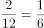。

故正确答案为B。

---

## 第 2 题　qid 4677894 · 数学运算

（4，12），（8，6），（16，3），（12，x）。x应为（    ）。

- **A**. 2
- **B**. 4　✅
- **C**. 6
- **D**. 8

**答案**：B

**官方解析**

原数列两两一组，考虑组内数字相乘：4×12=48，8×6=48，16×3=48，乘积为固定值48，所以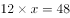，所求x=4。

故正确答案为B。

---

## 第 3 题　qid 4677908 · 数学运算

，，，，（    ）

- **A**. 

- **B**. 
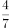

- **C**. 

　✅
- **D**. 
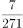

**答案**：C

**官方解析**

方法一：数列均为分数，考虑分数数列，分数分子不是递增或递减趋势，考虑反约分。将原数列转化为：，，，，（    ）。分子部分：1，2，3，4，是连续自然数列，则所求项分子为5；每一项分子分母的乘积形成新数列：2，6，24，120，有明显倍数关系，6÷2=3，24÷6=4，120÷24=5，商是公差为1的等差数列，则新数列下一项为120×6=720，则所求项分母为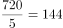，故所求项为。

方法二：数列均为分数，考虑分数数列，分数分子不是递增或递减趋势，考虑反约分。将原数列转化为：，，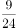，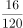，（    ）。观察发现分子为幂次数列：，，，，则所求项分子为；观察发现分母相邻两项有明显倍数关系，为作商数列，后项÷前项得到：3，4，5，则所求项分母为120×6=720，故所求项为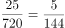。

故正确答案为C。

---

## 第 4 题　qid 4677903 · 数学运算

一条公路沿线顺次有甲、乙、丙、丁、戊5个仓库，相邻仓库间隔100千米。甲仓库有10吨货物，乙仓库有20吨货物，戊仓库有40吨货物，其余两个仓库无货物。现在准备把所有货物集中到一个仓库里，如果每吨货物运输成本是每千米1元运费，那么运费最少是多少元？

- **A**. 9000
- **B**. 10000　✅
- **C**. 11000
- **D**. 12000

**答案**：B

**官方解析**

方法一：
分情况讨论：
全部放到甲仓库：总运费为(20×100+40×400)×1=18000元；
全部放到乙仓库：总费用为(10×100+40×300)×1=13000元；
全部放到丙仓库：总费用为(10×200+20×100+40×200)×1=12000元；
全部放到丁仓库：总费用为(10×300+20×200+40×100)×1=11000元；
全部放到戊仓库：总费用为(10×400+20×300)×1=10000元。
即所有货物集中到戊仓库运费最少，为10000元。
方法二：货物集中问题，最佳方案只与各个仓库的存放量有关，与距离及运费无关。根据甲、乙两个仓库分别有10吨、20吨货物，戊仓库有40吨货物，丙、丁两个仓库无货物。单独看甲、乙两个仓库，同样运输距离下，乙仓库存放量更多，因此应运到乙仓库；合并甲、乙两个仓库之后和戊仓库比较，戊仓库的存放量比甲、乙两个仓库加起来的总和还多，因此应集中到戊仓库。所有货物集中到戊仓库运费为(10×400+20×300)×1=10000元。
故正确答案为B。

---

## 第 5 题　qid 4677907 · 数学运算

从重庆到北京的某列高铁中途要经过11个站，这列高铁要准备多少种不同的车票？

- **A**. 66
- **B**. 78　✅
- **C**. 55
- **D**. 67

**答案**：B

**官方解析**

根据“从重庆到北京的某列高铁中途要经过11个站”，则这列高铁共有13个站。任意两站之间都需要一张单独的车票，且两站之间的发车方向固定，则需要准备的车票数为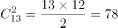种。

故正确答案为B。

---

## 第 6 题　qid 34689 · 数学运算

乒乓球比赛的规则是五局三胜制，甲、乙两球员的胜率分别为60%和40%，在一次比赛中，若甲先连胜了前面两局，则甲最后获胜的概率是：

- **A**. 
60%

- **B**. 
在之间

- **C**. 
在之间

- **D**. 
在91%以上
　✅

**答案**：D

**官方解析**

方法一：根据题意“乒乓球比赛的规则是五局三胜制，······若甲先连胜了前面两局，则甲最后获胜的概率”，有以下三种情况：（1）甲第三局胜：60%；（2）乙第三局胜甲第四局胜：；（3）乙第三局、第四局胜甲第五局胜：。因此甲最后获胜的概率为，在91%以上。

方法二：正面情况较多可以从反面考虑，甲获胜的反面是乙获胜，即前面两局甲获胜，后面三局乙获胜，概率为，则甲最后获胜的概率为，在91%以上。

故正确答案为D。 

---

## 第 7 题　qid 4677918 · 数学运算

一批零件，小王单独做需要50天加工完，小李单独做需要75天加工完。为了尽快完成任务，两人合作加工零件，中间小李休息了几天，最后共用了40天把这批零件加工完，那么小李休息了多少天？

- **A**. 25　✅
- **B**. 3
- **C**. 20
- **D**. 15

**答案**：A

**官方解析**

赋值这批零件的工作总量为150，则小王加工零件的效率为，小李加工零件的效率为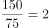。设中间小李休息了x天，则小李工作了（40-x）天，根据题意可列方程：3×40+2×（40-x）=150，解得x=25。

故正确答案为A。

---

## 第 8 题　qid 4677917 · 数学运算

甲乙两人分别以不同速度在周长为500米的环形跑道上跑步，甲的速度是180米/分钟。若两人从同一地点同时出发，反向跑步，75秒时第一次相遇；若两人保持各自的速度从同一地点同时出发同向而行，那么乙第一次追上甲时跑的圈数是多少圈？

- **A**. 5
- **B**. 5.5　✅
- **C**. 6
- **D**. 6.5

**答案**：B

**官方解析**

设乙的速度为v米/分钟，两人从同一地点同时出发反向跑步，共同跑完一圈时第一次相遇，则有：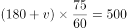，解得v=220。若两人保持各自的速度从同一地点同时出发同向而行，乙要比甲多跑一圈才能第一次追上甲，所用时间为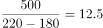分钟，此时乙跑的路程是220×12.5=2750米，即乙跑的圈数是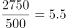圈。

故正确答案为B。

---

## 第 9 题　qid 4678570 · 数学运算

某办公室7人中有3人精通德语。如果从中任意选出3人，其中恰有1人精通德语的概率是（    ）。

- **A**. 0.514　✅
- **B**. 0.623
- **C**. 0.544
- **D**. 0.675

**答案**：A

**官方解析**

从办公室7人中任意选出3人，共有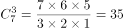种组合方式；而选出的3人中恰有1人精通德语，应从3个精通德语的人中选出1人，从剩下的4人中选出2人，则共有种组合方式。故选出的3人中，恰有1人精通德语的概率为：。

故正确答案为A。

---

## 第 10 题　qid 4678607 · 数学运算

工厂有一种测量中控工件内径的方法，就是用半径为R的钢珠放在圆柱形内孔上，只要测得钢珠顶端与工件顶端面之间的距离X，就可以求出工件内孔径（如下图所示）。已知X=5cm，R=3cm，那么该工件内径的直径是（    ）。

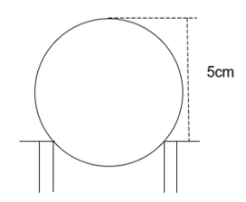

- **A**. 
cm
　✅
- **B**. 
cm

- **C**. 
cm

- **D**. 
4cm

**答案**：A

**官方解析**

如图所示，连接钢珠与圆柱内径的交点A、B，连接钢珠的圆心O与点B，连接钢珠的最高点C与圆心O，并延长交AB于点D，则三角形ODB为直角三角形。OC、OB为钢珠的半径，OC=OB= 3cm，OD=5-3=2cm。根据勾股定理得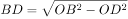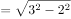cm，则AB的长度为cm，即该工件内径的直径是cm。

故正确答案为A。

---

## 第 11 题　qid 4678614 · 数学运算

某美容美发店有两位理发师，现同时来了5位有不同理发需求的顾客，他们分别需要10分钟、12分钟、15分钟、20分钟和24分钟，那么5人全部理完最少要（    ）。

- **A**. 38分钟
- **B**. 42分钟　✅
- **C**. 46分钟
- **D**. 49分钟

**答案**：B

**官方解析**

若要5人全部理完所用时间最少，则让两位理发师的理发时长尽量接近，则5人全部理完的时间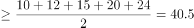分钟，排除A项。代入B项：当5人全部理完最少要42分钟时，即其中一位理发师（A）的理发时长为42分钟，其顾客的理发时长分别为10分钟、12分钟、20分钟，另外一位理发师（B）的顾客理发时长为15分钟、24分钟，15+24=39分钟&lt;42分钟，符合题意，且为最少时间，当选。

故正确答案为B。

---

## 第 12 题　qid 4678620 · 数学运算

某种细菌在培养过程中，每20分钟分裂一次（一个分裂成2个），经过2小时，这种细菌由3个分裂成（    ）个。

- **A**. 64
- **B**. 96
- **C**. 192　✅
- **D**. 381

**答案**：C

**官方解析**

2小时=60×2分钟=120分钟，则这种细菌共会分裂120÷20=6次，每个细菌分裂次数与分裂后的细菌数量关系如下表所示：

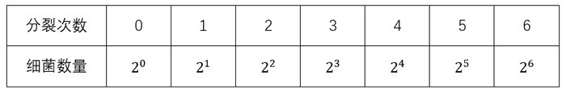

则2小时后3个细菌分裂成个。

故正确答案为C。

---

## 第 13 题　qid 4678637 · 数学运算

某大学生利用课余时间开网店销售某种服装，才开始销售时知名度不高。为了吸引顾客，就按原定售价打对折销售。一段时间后，生意红火起来，他悄悄地加价14.5元出售。一段时间后他发现顾客又少了，于是又降价2.5元以96.4元出售。已知他当初原定售价是在进货价上加40.5元，那么这种服装的进货价是（    ）。

- **A**. 128.65元
- **B**. 64.15元
- **C**. 168.8元
- **D**. 128.3元　✅

**答案**：D

**官方解析**

设这种服装的进货价为x元，原定售价为（x+40.5）元。根据题意可列式：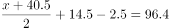，解得x=128.3，即这种服装的进货价是128.3元。

故正确答案为D。

---
