# 2020年陕西省公务员考试《行测》试题（网友回忆版）

> 数量关系 · 10 题 · 陕西 2020

## 第 1 题　qid 2578527 · 数学运算

小李一家3人进行抢红包游戏，每人发1个红包。结果每人抢得金额总额一致，均为100元，刚巧3人所发红包金额为互不相同整数且成等差数列。问3人中所发红包金额最多的可能是多少元？

- **A**. 197
- **B**. 198
- **C**. 199　✅
- **D**. 200

**答案**：C

**官方解析**

根据题意，“每人抢得金额总额一致，均为100元”，那么三人红包的总额元，“3人所发红包金额为互不相同整数且成等差数列”，则中间的金额应为三个红包的总额平均数100元，想要最大的红包金额最多，则最小的红包金额应该为最小，3人每人都发1个红包，金额不能为0元，那么最小金额为1元，则最大的红包金额为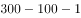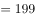元。

故正确答案为C。

备注：本题问法不够严谨，题目的本意应为金额最大的红包，金额最多是多少元。

---

## 第 2 题　qid 2577876 · 数学运算

某医疗器械公司为完成一批口罩订单生产任务，先期投产了A和B两条生产线，A和B的工作效率之比为2：3，计划8天可完成订单生产任务，两天后公司又对这批订单投产了生产线C，A和C的工作效率之比为2：1，问该批口罩订单任务将提前几天完成？

- **A**. 1　✅
- **B**. 2
- **C**. 3
- **D**. 4

**答案**：A

**官方解析**

根据题意，A、B生产线工作效率之比为2：3，A、C生产线工作效率之比为2：1，则A、B、C三条生产线工作效率之比为2：3：1。赋值A、B、C三条生产线工作效率分别为2、3、1，则生产任务总量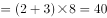。A、B两条生产线工作两天后，又投产生产线C，因此完成任务还需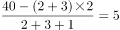天，则该批口罩订单任务将提前天完成。

故正确答案为A。

---

## 第 3 题　qid 2577879 · 数学运算

红星中学高二年级在本次期末考试中竞争激烈，年级前七名的三科（语文、数学、英语）平均成绩构成公差为1的等差数列，第七、八、九名的平均成绩既构成等差数列，又构成等比数列，张龙位列第十，与第九名相差1分，张龙的英语成绩为121分，但老师误登记为112分。那么，张龙的名次本该是：

- **A**. 第四
- **B**. 第五　✅
- **C**. 第七
- **D**. 第八

**答案**：B

**官方解析**

根据题意，第七、八、九名的平均成绩构成等差数列，设分别为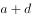、、，因三人的平均成绩又构成等比数列，则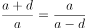，解得，即第七、八、九名的平均成绩均为。张龙平均成绩为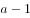，因为英语成绩实为121分，误登记为112分，则三科平均成绩应比目前平均成绩多分，实为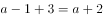。前七名平均成绩构成公差为1的等差数列，从高到低分别为、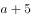、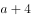、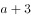、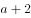、、，张龙实际成绩为，名次本该是并列第五名。

故正确答案为B。

---

## 第 4 题　qid 2577867 · 数学运算

某水果经销商到一山区水果基地采购猕猴桃和苹果。猕猴桃和苹果的采购价分别为10元/斤和4元/斤，销售价分别为25元/斤和12元/斤。已知该经销商在本次经营中获利40000元，每种水果采购都超过500斤且为整数。那么该经销商的最佳投入资金是：

- **A**. 20000元
- **B**. 21260元　✅
- **C**. 21300元
- **D**. 21280元

**答案**：B

**官方解析**

根据题意，设采购了猕猴桃、苹果分别、斤，根据获利40000元为等量关系列方程，则有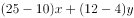，化简得：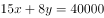，和40000都是8的倍数，则是8的倍数；“最佳投入资金”即尽可能投入较少资金，猕猴桃利润率为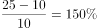，苹果利润率为。则利润率低的猕猴桃数量应该尽量少，又因为题干说明每种水果采购都超过500斤且为整数，则最少为504，解得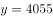，因此最佳投入资金为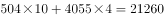元。

故正确答案为B。

---

## 第 5 题　qid 2577871 · 数学运算

甲、乙、丙三人沿着长为500米，宽为250米的长方形场地跑步，三人以2：1：3的速度之比匀速顺时针跑步，当甲开跑时乙刚跑完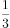圈，丙开跑时甲跑了100米。问当乙跑完2圈时，甲与丙的位置关系如何？

- **A**. 丙领先甲2350米　✅
- **B**. 丙领先甲2450米
- **C**. 丙领先甲2900米
- **D**. 丙领先甲3000米

**答案**：A

**官方解析**

长方形周长为米；乙比甲提前开跑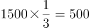米；甲比丙提前开跑100米；根据甲、乙、丙的速度之比为2：1：3，则乙比丙提前开跑米；乙跑完2圈即米，此时甲跑了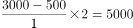米，丙跑了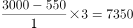米，因此，丙领先甲米。

故正确答案为A。

---

## 第 6 题　qid 2578523 · 数学运算

某药材公司以每千克8元的价格收购了5000千克药材，深加工后得到合格品和废料，合格品分为一、二、三等品，其比例为1：3：6，每千克售价分别为80元、50元、20元，废料价值为零。公司在加工中需投入其他成本20000元，最终获利108000元。问加工中药材的废品率是多少？

- **A**. 

- **B**. 

　✅
- **C**. 

- **D**. 

**答案**：B

**官方解析**

由题干“合格品分为一、二、三等品，其比例为1：3：6”，设一、二、三等合格品分别为千克，千克，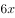千克，根据公式：总利润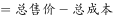，可得，解得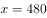，则合格品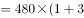千克，废料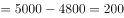千克，则废品率。

故正确答案为B。

---

## 第 7 题　qid 2577863 · 数学运算

从某物流园区开出6辆货车，这6辆货车的平均装货量为62吨。已知每辆货车载重量各不相同且均为整数，最重的装载了71吨，最轻的装载了54吨。问这6辆货车中装货第三重的卡车最少要装多少吨？

- **A**. 59
- **B**. 60　✅
- **C**. 61
- **D**. 62

**答案**：B

**官方解析**

由题意可知，6辆车载货总量为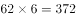吨，设装货第三重的卡车装载了吨，要使取值尽量小，则其他货车装载量应尽量多，可列表为：

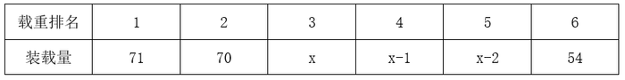

可列式为：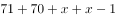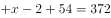，解得，即装货第三重的卡车最少要装60吨。

故正确答案为B。

---

## 第 8 题　qid 2577866 · 数学运算

春节期间，省图书馆邀请多位书法老师免费为读者书写春联。现场书写的春联中有188副不是刘老师书写的，有219副不是陈老师书写的，刘、陈两位老师今年一共书写了311副春联。问陈老师今年一共书写了多少副春联？

- **A**. 208
- **B**. 171
- **C**. 140　✅
- **D**. 126

**答案**：C

**官方解析**

设各位书法老师共写了副春联，可列式为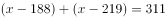，解得，则陈老师写了副。

故正确答案为C。

---

## 第 9 题　qid 2577862 · 数学运算

统计学专业学生正在学习《博弈论》，老师给每个学生发了一张卡片，要求每个学生在卡片上随机地从1到100中写下一个数，谁写下的数离他们的平均数的二分之一最接近就胜出，已知该专业共50人，问写下哪个数最可能胜出？

- **A**. 12
- **B**. 25　✅
- **C**. 50
- **D**. 60

**答案**：B

**官方解析**

每人随机写下一个数字，则所写数字越多，他们的平均数将越接近于1-100的平均数即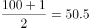，平均数的二分之一为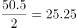，与B项最接近，可知写下25最有可能胜出。

故正确答案为B。

备注：写数具有随机性，写的越多，越接近于平均数。如果每个学生都知道此结论，那么他们所写的数字会围绕25附近，此时取胜的数字为12.5，与A项最接近；如果所有学生都考虑到这一点，则会围绕12附近来写，此时取胜的为6，以此类推，博弈结果将越来越小，趋近于1，本题没有对应选项。且题干中只强调了学生随机写数的情况，因此粉笔倾向于不考虑博弈的情况，只把它当作纯粹的数学题来给结果。

---

## 第 10 题　qid 2578533 · 数学运算

某单位开展“我身边的榜样”评选活动，现对3名候选人甲、乙、丙进行不记名投票，投票要求详见选票。这3名候选人的得票数（不考虑是否有效）分别为总票数的、、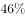，则本次投票的有效率（有效票数与总票数的比值）最高可能为：

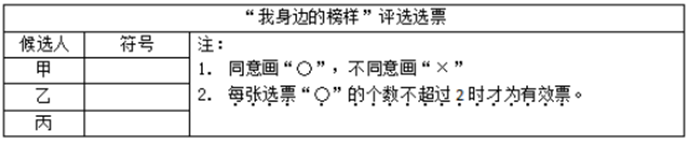

- **A**. 
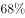

- **B**. 

- **C**. 
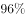
　✅
- **D**. 

**答案**：C

**官方解析**

方法一：赋值总票数为100，那么甲、乙、丙获得的票数分别为88、70、46。未投甲的票数为；未投乙的票数为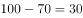；未投丙的票数为。无效投票为甲、乙、丙三者同时被选。如果有效投票率最高，那么无效票数应最低。无效票数最低，此时有效票数最高为96，因此有效率最高可能为。

方法二：设投1票的人数占比为，投2票的人数占比为，投3票的人数占比为，则：

······①，

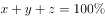······②；

联立①②可得：，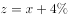，要想有效投票率最高，即无效票数占比应尽可能小，也就是尽可能小，当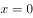时，最小为，所以有效投票率最高。

故正确答案为C。

---
