# 2021年上海市公务员录用考试《行测》题（A类）（网友回忆版）

> 数量关系 · 27 题 · 上海 2021

## 材料 1

        上海市生活垃圾分类工作实施以来，在居民分类、垃圾分类处置、全过程分类体系、配套制度规范以及社会宣传等方面都取得了显著成效。下图为上海市垃圾分类年度日均完成量及2020年目标，下表为上海市垃圾分类回收处理量。

### 第 1 题　qid 2731481 · 数学运算

表中，在日均湿垃圾分出量最高的月份，日均可回收物回收量与日均干垃圾处理量的比值约为：

- **A**. 0.26
- **B**. 0.44
- **C**. 0.41　✅
- **D**. 0.48

**答案**：C

**官方解析**

根据题干“表中，······与······比值约为”，可判定本题为比值计算问题。定位表格第二列可知，日均湿垃圾分出量最高的月份是2020年5月，分出量为9796吨/日，定位表格第三、四列可知，2020年5月日均可回收物回收量和日均干垃圾处理量分别为6266吨/日和15351吨/日。可得2020年5月，日均可回收物回收量与日均干垃圾处理量的比值约为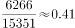，对应C项。

故正确答案为C。

---

### 第 2 题　qid 2731516 · 数学运算

2019年7—9月，日均湿垃圾分出量约为（    ）吨。

- **A**. 8803
- **B**. 8702
- **C**. 9200
- **D**. 8800　✅

**答案**：D

**官方解析**

根据题干“2019年7—9月，日均湿垃圾分出量约······”，结合材料已给出2019年7—9月数据，可判定本题为现期平均数问题。定位表格材料，2019年7—9月日均湿垃圾分出量分别为8200吨/日、9200吨/日、9008吨/日。根据公式，日均湿垃圾分出量，可得2019年7—9月，日均湿垃圾分出量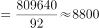吨，与D项相符。

故正确答案为D。

---

### 第 3 题　qid 2731518 · 数学运算

2019年6—9月，日均干垃圾处理量月增长率的绝对值：

- **A**. 一直减小　✅
- **B**. 一直增大
- **C**. 先增大后减小
- **D**. 先减小后增大

**答案**：A

**官方解析**

根据题干“2019年6—9月，日均干垃圾处理量月增长率的绝对值”，结合选项为增大/减小，可判定本题为增长率的比较问题。定位表格可知，2019年6—9月日均干垃圾处理量。根据公式“”，则2019年6—9月日均干垃圾处理量月增长率分别为：6月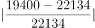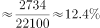；7月；8月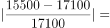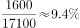；9月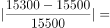。则2019年6—9月，日均干垃圾处理量月增长率的绝对值一直减小。

故正确答案为A。

注：由于表格中仅给出2019年5月~2020年6月的数据，未给出2018年6~9月的数据，故认为题干中“月增长率”为月环比增长率。

---

### 第 4 题　qid 2731530 · 数学运算

以下说法错误的是：

- **A**. 
2019年7月环比数量变化最大的类别是干垃圾

- **B**. 
2019年7—10月，可回收物回收量增长率为

- **C**. 
2020年6月表中三类垃圾占比同比变化最大的是干垃圾

- **D**. 
2020年超额完成预计目标的月份为5月份和6月份
　✅

**答案**：D

**官方解析**

A项：定位表格可知，2019年6月与7月的湿垃圾日均分出量、可回收物日均回收量、干垃圾日均处理量。代入公式“总量”、“增长量”，可得2019年7月各类垃圾的环比变化数量分别为：

湿垃圾分出量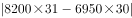吨；

可回收物回收量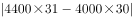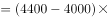吨；

干垃圾处理量吨；则2019年7月环比数量变化最大的类别是干垃圾，正确；

B项：定位表格可知，2019年7月与10月的可回收物日均回收量为4400吨与5960吨。根据公式“”、“”，则2019年7—10月可回收物回收量的增长率为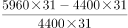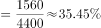，正确；

C项：定位表格可知，2020年6月与2019年6月三类垃圾的日均处理量。2020年6月三类垃圾总量为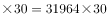吨，2019年6月三类垃圾总量为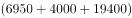吨。2020年6月三类垃圾占比同比变化分别为：

湿垃圾分出量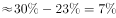；可回收物回收量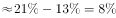；干垃圾处理量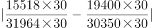，则占比同比变化最大的是干垃圾，正确；

D项：定位图形可知，2020年湿垃圾、可回收物、干垃圾的目标分别为9000吨/日、6000吨/日、16800吨/日。定位表格可知，2020年5月与6月的干垃圾处理量分别为15351吨/日与15518吨/日，未完成2020年预计目标，错误。

本题为选非题，故正确答案为D。

---

## 材料 2

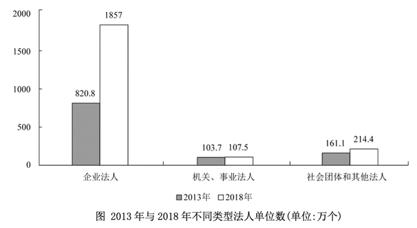

### 第 5 题　qid 2731563 · 数学运算

2018年，全国法人单位数量比2013年增长以上的行业门类有<u>         </u>个。

- **A**. 8
- **B**. 9
- **C**. 10　✅
- **D**. 11

**答案**：C

**官方解析**

根据题干“2018年，全国法人单位数量比2013年增长以上”，可判定本题为一般增长率问题。定位表格数据，根据公式：增长率，即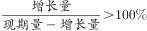，化简得：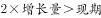。代入数据，符合要求的行业有：建筑业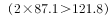，批发和零售业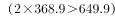，交通运输、仓储和邮政业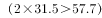，住宿和餐饮业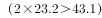，信息传输、软件和信息技术服务业，房地产业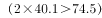，租赁和商务服务业，科学研究和技术服务业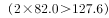，居民服务、修理和其他服务业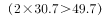，文化、体育和娱乐业，共10个。

故正确答案为C。

---

### 第 6 题　qid 2731573 · 数学运算

2013—2018年间，全国法人单位数量增量最大的2个行业，2018年法人单位数之和为                    。

- **A**. 不到900万个
- **B**. 在900—950万个之间　✅
- **C**. 在950—1000万个之间
- **D**. 超过1000万个

**答案**：B

**官方解析**

根据题干“······2018年法人单位数之和”，结合统计表中增量和2018年法人单位数量均已给出，可判定本题为简单计算问题。定位表格资料可得：2013-2018年间，全国法人单位数量增量最大的2个行业分别是批发和零售业（368.9万个）与租赁和商务服务业（163.4万个），其2018年法人单位数分别为649.9万个、255.1万个，故所求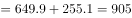万个，对应B项。

故正确答案为B。

---

### 第 7 题　qid 2731575 · 数学运算

如制造业法人单位和全国法人单位数量均保持2013—2018年的年均增量不变，则2023年制造业法人单位数量占全国法人单位比重将比2018年约                    。

- **A**. 下降2个百分点　✅
- **B**. 下降8个百分点
- **C**. 上升2个百分点
- **D**. 上升8个百分点

**答案**：A

**官方解析**

根据题干“2023年······占······比重将比2018年约”，结合选项为上升/下降百分点，可判定本题为两期比重计算问题。定位表格材料，2018年制造业法人单位数量为327.0万个，2013-2018年间增量为101.8万个；2018年全国法人单位数量为2178.9万个，2013-2018年间增量为1093.2万个。根据公式：年均增长量，其中年均增长量和年份差均不变，故现期量基期量（2013-2018年间增量）也不变，则2023年制造业法人单位数量占全国法人单位的比重，2018年该比重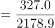，故所求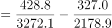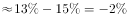，即下降2个百分点，对应A项。

故正确答案为A。

---

### 第 8 题　qid 2731579 · 数学运算

2013—2018年间，企业法人单位数量年均增量约是社会团体和其他法人数量年均增量的        倍。

- **A**. 10
- **B**. 13
- **C**. 16
- **D**. 19　✅

**答案**：D

**官方解析**

根据题干“2013-2018年间，······年均增量约是······年均增量的······倍”，可判定本题为现期倍数问题。定位统计图可得，2013年、2018年企业法人单位数分别为820.8万个、1857万个，2013年、2018年社会团体和其他法人单位数分别为161.1万个、214.4万个。根据公式：年均增长量，可得企业法人单位数年均增长量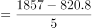万个，社会团体和其他法人单位数年均增长量万个；根据公式：现期倍数，可得所求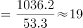。

故正确答案为D。

---

### 第 9 题　qid 2731583 · 数学运算

能够从上述资料中推出的是：

- **A**. 
2013年，采矿业法人单位占全国法人单位的比重超过

- **B**. 
2013—2018年间，机关、事业法人单位年均增加不到1万个
　✅
- **C**. 
2013年，批发和零售业法人单位数量是教育法人单位数量的7倍以上

- **D**. 
2013—2018年间，科学研究和技术服务业是法人单位数年均增速最快的行业

**答案**：B

**官方解析**

A项：定位统计表可得，2018年采矿业法人单位数量及增量分别为7.0万个、1.9万个，全国法人单位总量为2178.9万个、1093.2万个，故2013年采矿业法人单位数量为万个，全国法人单位总量为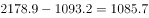万个。根据公式：比重，可得2013年采矿业法人单位占全国法人单位的比重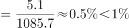，错误；

B项：定位统计图可得，2013年机关、事业法人单位数量为103.7万个，2018年机关、事业法人单位数量为107.5万个。根据公式：年均增长量，可得机关、事业法人单位年均增长量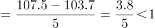万个，正确；

C项：定位统计表可得，2018年批发和零售业法人单位数量为649.9万个，2018年较2013年增量为368.9万个，2018年教育法人单位数量为66.6万个，2018年较2013年增量为25.2万个，根据公式：基期，则2013年批发和零售业法人单位数量万个；2013年教育法人单位数量万个，故所求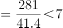，错误；

D项：根据公式：年均增长率，其中年份差相同，且表格资料中分别给出2018年各行业法人单位数量及较2013年增量，则比较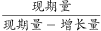即可，科学研究和技术服务业：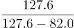，建筑业:，前者小于后者，故科学研究和技术服务业不是法人单位数年均增速最快的行业，错误。

故正确答案为B。

---

## 材料 3

        截至2019年底，广东省常住人口11521万人，比上年底增加175万人。其中，男性6022.03万人、女性5498.97万人，人口密度为641人/平方公里。2019年底，全省城镇化率（城镇常住人口占常住人口的比重）为，同比提高0.70个百分点。其中，珠三角九市的城镇化率为。

### 第 10 题　qid 2731602 · 数学运算

截至2019年底，珠三角九市城镇常住人口约        万人。

- **A**. 5436
- **B**. 5562　✅
- **C**. 6200
- **D**. 6268

**答案**：B

**官方解析**

根据题干“截至2019年底，珠三角九市城镇常住人口约······”，结合文字和图表材料可知2019年末珠三角九市的城镇化率（城镇常住人口占常住人口的比重）和常住人口（总体），已知比重和总体求部分，且时间与材料一致，可判定本题为现期比重问题。定位文字材料可得∶“（2019年底）珠三角九市的城镇化率为”和表格材料“2019年珠三角九市常住人口为6446.89万人”。代入现期比重公式∶部分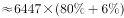万人，最接近B项。

故正确答案为B。

---

### 第 11 题　qid 2731611 · 数学运算

2019年底除珠三角九市外，广东省其他地区的城镇化率                    。

- **A**. 
小于

- **B**. 
在至之间

- **C**. 
在至之间
　✅
- **D**. 
大于

**答案**：C

**官方解析**

根据题干“广东省其他地区的城镇化率······”，结合文字材料可知2019年底广东省常住人口、全省城镇化率及珠三角九市城镇化率，结合表格材料可知珠三角九市常住人口，由于广东省人口珠三角九市人口其他地区人口，因此可判定本题为混合比重问题。混合后总体为全省（常住人口11521万人，城镇化率为），部分量1为珠三角九市（常住人口6446.89万人，城镇化率为），设部分量2其他地区的城镇化率为，根据线段法，距离与量成反比：

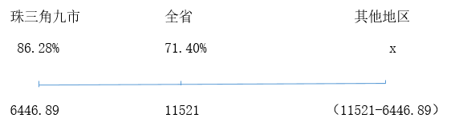

即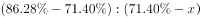，，则，在C项范围内。

故正确答案为C。

---

### 第 12 题　qid 2731621 · 数学运算

能够从上述资料中推出的是                    。

- **A**. 2019年底除珠三角九市外，广东省其余地区常住人口同比为负增长
- **B**. 表中“？”处的数字大于2.2万人/平方公里　✅
- **C**. 2019年底，广东省人口密度比上年底增加了20人/平方公里以上
- **D**. 2016-2019年间，香港和澳门常住人口呈持续增长趋势

**答案**：B

**官方解析**

A项：定位表格材料“珠三角九市2018年末与2019年末人口分别为6300.99万人和6446.89万人”则2019年珠三角九市常住人口同比增量现期量基期量万人。定位文字材料“广东省常住人口11521万人，比上年底增加175万人”，根据广东省常住人口同比增量珠三角九市常住人口同比增量其余地区常住人口同比增量，则其余地区常住人口同比增量为，同比为正增长，错误。

B项：定位表格材料，2018年澳门人口密度21669人/平方公里，2018年和2019年澳门年末人口分别为66.74万人和67.96万人，根据地区面积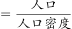，且澳门各年的面积保持不变，可列式：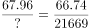，则，即大于2.2万人/平方公里，正确。

C项：定位文字材料“截至2019年底，广东省常住人口11521万人，比上年底增加175万人······人口密度为641人/平方公里”根据人口密度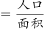，则广东省面积为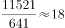万平方公里，因为面积不变，因此人口密度增长量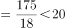人/平方公里，错误。

D项：定位表格材料，2016-2019年间，年末人口数据中，2016年澳门年末人口64.49万人2015年64.68万人，并非持续增长，错误。

故正确答案为B。

---

### 第 13 题　qid 2731323 · 数学运算

2，2，，1，，<u>        </u>

- **A**. 

　✅
- **B**. 
0

- **C**. 

- **D**. 

**答案**：A

**官方解析**

观察数列，题干和选项中均有分数，优先考虑分数数列。反约分后，原数列可转化为：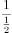，，，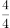，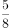，（    ）。分子部分为连续自然数列，则所求项分子为6；分母部分是公比为2的等比数列，则所求项分母为。故所求项为。

故正确答案为A。

---

### 第 14 题　qid 2731334 · 数学运算

根据下图规律，“？”处图形有<u>        </u>个白色小正方形。   

- **A**. 18
- **B**. 20
- **C**. 22
- **D**. 24　✅

**答案**：D

**官方解析**

观察趋势发现图形中白色小正方形的数量依次为6，8，10······，且n每增加1，就会增加2个白色小正方形，即白色小正方形的数量为首项为6，公差为2的等差数列，则当时，有个白色小正方形。

故正确答案为D。

---

### 第 15 题　qid 2731335 · 数学运算

数列：（3，4），（6，8），（13，15），（27，29），

- **A**. （53，55）
- **B**. （54，55）
- **C**. （55，57）　✅
- **D**. （56，58）

**答案**：C

**官方解析**

观察数列特征，数列项数较多，考虑多重数列。交叉后无规律，考虑两两分组。括号中两项数字加和，得到7，14，28，56，（    ），是公比为2的等比数列，则所求项中两项之和，只有C项满足条件。

故正确答案为C。

---

### 第 16 题　qid 2731342 · 数学运算

数列：[1，2]3，[1，2，3]0，[1，2，3，4]4，[1，2，3，4，5]-1，[1，2，3，4，5，6]5，[1，2，3，4，5，6，7]-2，[1，2，3，4，5，6，7，8]6，···，则[1，2，3，···，100]<u>        </u>

- **A**. 52　✅
- **B**. 50
- **C**. -50
- **D**. -52

**答案**：A

**官方解析**

方法一：数列项数较多，考虑多重数列。交叉来看，等号右边奇数数列为：3，4，5，6，······，是连续自然数列；等号右边偶数数列为：0，-1，-2，······，是公差为-1的等差数列。所求项是原数列的第99项，为奇数项，且为奇数数列的第50项，则所求项为52。

方法二：观察数列，计算发现：，，，，，，······，即连续自然数中、符号循环交替，则所求项为············。

故正确答案为A。

---

### 第 17 题　qid 2731346 · 数学运算

将从1到11连续自然数填入下图中的圆圈内，要使每边上的三个数的和都相等，a不可能是<u>        </u>。

- **A**. 1
- **B**. 6
- **C**. 7　✅
- **D**. 11

**答案**：C

**官方解析**

根据等差数列求和公式，1到11连续自然数的和为。每边上的三个数的和均包括一个的值且都相等，则五条边上空白部分的两个数之和均相等，因此所有空白部分对应数据之和为5的倍数，即为5的倍数，代入选项验证：

A项：，符合；

B项：，符合；

C项：不为整数，不符合；

D项：，符合。

本题为选非题，故正确答案为C。

---

### 第 18 题　qid 2731348 · 数学运算

有一架自动扶梯共25级，每秒移动2阶。A从扶梯的起点处站立乘坐，两秒后B从起点处以每秒1阶的速度向上走动。又过三秒后C来到扶梯起点处且以每秒4阶的速度向上跑。那么以下事件中最先发生的是        。

- **A**. A到达扶梯终点
- **B**. B追上A　✅
- **C**. C追上A
- **D**. C追上B

**答案**：B

**官方解析**

由题意可知本题为行程问题，事件最先发生的一定是总体用时最短的，分别计算四个事件的用时比较即可。

A项：由题意“有一架自动扶梯共25级，每秒移动2阶。A从扶梯的起点处站立乘坐”可知，阶/秒，A到达扶梯终点的时间秒；

B项：由题意“两秒后B从起点处以每秒1阶的速度向上走动”可知，阶/秒，阶，根据追及公式：，则，解得秒，故B追上A的总体用时秒；

C项：由题意“又过三秒后C来到扶梯起点处且以每秒4阶的速度向上跑”可知，阶/秒，阶，则，解得秒，故C追上A的总体用时秒；

D项：阶，则，解得秒，故C追上B的总体用时秒。

比较可知，选项中B追上A的事件总体用时最少。

故正确答案为B。

---

### 第 19 题　qid 2731350 · 数学运算

办公楼高24层，小王在底楼，他有一个文件急需交给在顶楼的小李。大楼只有一个电梯，正停在底楼待命，电梯每上升或下降一层需要10秒，小李走楼梯下楼每层需要走15秒，小王走楼梯上楼每层需要走20秒，他们约在（    ）楼碰面最节约时间。

- **A**. 12
- **B**. 13
- **C**. 14
- **D**. 15　✅

**答案**：D

**官方解析**

要满足碰面时间最短，根据题干条件可知，小王选择坐电梯上楼，小李走楼梯下楼。可知小王坐电梯上楼和小李走楼梯下楼的时间之比，则小王坐电梯上3层和小李走楼梯下2层的时间相同。要碰面共需要走层，······层，则小王先坐电梯上层（到达13楼）和小李走楼梯下层（到达16楼）的时间相同，小王再坐电梯上2层（到达15楼）需要20秒，小李走楼梯下1层（到达15楼）需要15秒，则两人在15楼碰面，此时最节约时间。

故正确答案为D。

---

### 第 20 题　qid 2731353 · 数学运算

某货运公司现有100辆货车，需招聘若干司机，条件是每工作五天后休息两天。公司希望司机休息时货车不休息，则至少要招聘        名司机。

- **A**. 128
- **B**. 136
- **C**. 140　✅
- **D**. 144

**答案**：C

**官方解析**

假设先给每辆货车分配1名司机，则5辆货车有5名司机需要休息天。这10天需要额外名司机来补充工作，即5辆货车至少需要7名司机。则100辆货车至少需要名司机。

故正确答案为C。

---

### 第 21 题　qid 2731356 · 数学运算

一个长方形长6cm，宽4cm，现分别平行于长和宽剪了若干刀，将长方形分割成若干个小长方形，这些小长方形的周长之和比原长方形周长多了56cm。那么最多剪了         刀。

- **A**. 3
- **B**. 4
- **C**. 5
- **D**. 6　✅

**答案**：D

**官方解析**

设平行于长剪了刀，平行于宽剪了刀。每当长或宽多剪一刀，这些小长方形总周长比原长方形周长多了2倍的长或宽。由此可列：，化简可得，结合奇偶特性可知，应为偶数。根据，要剪的总刀数最多，即（）最大，则尽量小，由于为偶数且不能为0，则应取2。当时，，共剪刀。

故正确答案为D。

---

### 第 22 题　qid 2731364 · 数学运算

甲到飞机场坐飞机，飞机场的十二个登机口排成一条直线，相邻两个登机口之间相距50米。甲在登机口等待时被告知登机口更改了，那么甲走到新登机口的距离不超过200米的概率是：

- **A**. 

- **B**. 

- **C**. 

- **D**. 

　✅

**答案**：D

**官方解析**

给情况求概率，考虑公式：概率。总情况为甲在任意登机口移动到另一登机口，共有种情况；满足条件的情况为甲走到新登机口的距离不超过200米，因相邻两个登机口距离为50米，则甲移动到相邻登机口要在4个及以内，分别讨论如下：

甲在1号登机口：满足条件的有2，3，4，5号登机口，共4种情况；

甲在2号登机口：满足条件的有1，3，4，5，6号登机口，共5种情况；

甲在3号登机口：满足条件的有1，2，4，5，6，7号登机口，共6种情况；

甲在4号登机口：满足条件的有1，2，3，5，6，7，8号登机口，共7种情况；

甲在5号登机口：满足条件的有1，2，3，4，6，7，8，9号登机口，共8种情况；

甲在6号登机口：满足条件的有2，3，4，5，7，8，9，10号登机口，共8种情况。

因登机口呈一条直线，故7~12号登机口与1~6号登机口情况对称，分别有8，8，7，6，5，4种情况。由此可知，满足条件的情况数共有种情况。

则甲走到新登机口的距离不超过200米的概率。

故正确答案为D。

---

### 第 23 题　qid 2731367 · 数学运算

过年要写春联，小李拿来一张长宽分别为85厘米和75厘米的红纸，打算裁开使用。已知春联每联7个字，一副春联上下两联，再加一个4字横批，每个字长宽都是10厘米，则这张红纸最多可以制作（    ）副春联。

- **A**. 2
- **B**. 3　✅
- **C**. 4
- **D**. 5

**答案**：B

**官方解析**

一张长宽分别为85厘米和75厘米的红纸，面积为；一副完整的春联的包含上下联14个字及横批4个字，面积共为。要想制作的春联尽可能多，则红纸浪费的面积应尽可能少，若完全不考虑浪费，能制作春联幅，即最多能制作3幅，结合选项，排除C、D两项。

如下图所示，蓝色代表横批，红黄两色代表上下联，可知最多能制作3幅春联。

故正确答案为B。

---

### 第 24 题　qid 2731374 · 数学运算

公司购买某设备24套，现要登记单价，但是数据上没有标注单价，且总价第一位和最后一位模糊不清，只看到是☆579△元。则☆可能是        。

- **A**. 3
- **B**. 5
- **C**. 7　✅
- **D**. 9

**答案**：C

**官方解析**

总价单价数量，设备数量为24套，故总价一定为24的倍数，即总价既是3的倍数又是8的倍数。

题干数字为☆579△，若要为8的倍数，则后三位应为8的倍数。79△800m，由于800是8的倍数，故m只能为8，则△只能为2。

此时题干数字为☆5792，若要为3的倍数，则各位数字之和应为3的倍数。☆☆，则☆可能为1、4、7，只有C项符合。

故正确答案为C。

---

### 第 25 题　qid 2731378 · 数学运算

有一座13.2万人口的城市，需要划分为11个投票区，任何一个区的人口不得超过其他区人口的，那么人口最少的地区可能有<u>        </u>人。

- **A**. 9800
- **B**. 10500
- **C**. 10700
- **D**. 11000　✅

**答案**：D

**官方解析**

设人口最少的地区人数为万人。由于题目问的是“可能”，答案存在一定范围，因此需要对该地区的人数分情况讨论。

第一种情况：若要使该地区人数最少，则其他10个地区人数要尽量多。根据题意，此时其他10个地区人数均为万人，则，解得，人口最少的地区最少有1.1万人，即11000人。

第二种情况：若要使该地区人数最多，则其他10个地区人数要尽量少。根据题意，此时其他10个地区的人数均为万人，则，解得，人口最少的地区最多有1.2万人，即12000人。

因此11000人口最少的地区人数12000，只有D项在该范围内。

故正确答案为D。

（注：本题讨论完第一种情况，即可锁定D项）

---

### 第 26 题　qid 2731380 · 数学运算

安排4名护士护理3个病房，每个病房至少一名护士，每名护士固定护理一个病房，则共有        种安排方法。

- **A**. 24
- **B**. 36　✅
- **C**. 48
- **D**. 72

**答案**：B

**官方解析**

4名护士护理3个病房，且每个病房至少一名护士，则人数分组为（2，1，1）。从4名护士中选出2名护士在一组，共同护理一个病房，有种方法；三组人员，分别护理3个病房，有种方法。则共有种安排方法。

故正确答案为B。

---

### 第 27 题　qid 2731382 · 数学运算

假设三颗小行星绕着一颗恒星运动，它们的运行轨道都是圆形，每条轨道的圆心都是该恒星。且三条轨道都在同一平面内。若这三颗小行星同向旋转，且绕轨道运行一周的时间分别是60年、84年、140年。现在三颗小行星和恒星在同一直线上且三颗小行星都在恒星的同侧，那么至少        年后他们再次在同一直线上且三颗小行星都在恒星的同侧。

- **A**. 210　✅
- **B**. 315
- **C**. 420
- **D**. 630

**答案**：A

**官方解析**

题干较为复杂，考虑代入排除；问“至少”，考虑从小到大代入选项。

代入A项：210年后，运行周期为60年的小行星共运行周，运行周期为84年的小行星共运行周，运行周期为140年的小行星共运行周。此时，每个小行星的位置都偏离原来位置半圈，满足在同一直线上且三颗小行星都在恒星的同侧。

因A项已满足题意，B、C、D三项无需验证。

故正确答案为A。

---
