# 2021年上海市公务员录用考试《行测》题（B类）（网友回忆版）

> 数量关系 · 25 题 · 上海 2021

## 材料 1

        近年来，各地方政府响应国务院《关于加快推进“互联网政务服务”工作的指导意见》，纷纷推出工作方案，共同促进全国一体化在线政务服务平台的建设。图1为2017年12月-2020年3月我国在线政务服务用户规模，图2为2016年6月-2019年12月我国政府网站数量，截至2019年12月国务院部门及其内设、垂直管理机构912个，省级及以下行政单位13562个。

### 第 1 题　qid 2732735 · 数学运算

在线政务服务用户规模达5.1亿的当月，我国政府网站数量为（    ）个。

- **A**. 19868
- **B**. 15143　✅
- **C**. 14474
- **D**. 17962

**答案**：B

**官方解析**

定位图1可知，2019年6月，在线政务服务用户规模达5.1亿。定位图2可知，2019年6月，我国政府网站数量为15143个。
故正确答案为B。

---

### 第 2 题　qid 2732736 · 数学运算

2019年上半年期间，在线政务服务用户约增长了：

- **A**. 

　✅
- **B**. 

- **C**. 

- **D**. 

**答案**：A

**官方解析**

根据题干“······约增长了”，结合选项为百分数，可判定本题为一般增长率计算问题。定位图1可知：2018年12月在线政务服务用户规模为3.9亿人，2019年6月在线政务服务用户规模为5.1亿人。根据公式：增长率，则2019年上半年期间，在线政务服务用户增长了。

故正确答案为A。

备注：题目没有明确是同比增长率还是环比增长率，如果按照同比计算无答案。

---

### 第 3 题　qid 2732738 · 数学运算

2017-2019年政府网站数量精简最多的半年是：

- **A**. 2017年上半年
- **B**. 2017年下半年　✅
- **C**. 2018年上半年
- **D**. 2018年下半年

**答案**：B

**官方解析**

根据题干“······数量精简最多的半年是”，可判定本题为增长量比较问题。定位图2可知，2016年12月、2017年6月、2017年12月、2018年6月、2018年12月的政府网站数量分别为46405个、36916个、24820个、19686个、17962个。根据公式：增长量现期量基期量，则政府网站数量精简情况如下：

2017年上半年，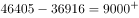个；

2017年下半年，个；

2018年上半年，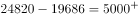个；

2018年下半年，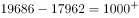个。

比较可知，2017-2019年政府网站数量精简最多的半年是2017年下半年。

故正确答案为B。

---

## 材料 2

        截至2019年底，广东省常住人口11521万人，比上年底增加175万人。其中，男性6022.03万人、女性5498.97万人，人口密度为641人/平方公里。2019年底，全省城镇化率（城镇常住人口占常住人口的比重）为，同比提高0.70个百分点。其中，珠三角九市的城镇化率为。

### 第 4 题　qid 2731602 · 数学运算

截至2019年底，珠三角九市城镇常住人口约        万人。

- **A**. 5436
- **B**. 5562　✅
- **C**. 6200
- **D**. 6268

**答案**：B

**官方解析**

根据题干“截至2019年底，珠三角九市城镇常住人口约······”，结合文字和图表材料可知2019年末珠三角九市的城镇化率（城镇常住人口占常住人口的比重）和常住人口（总体），已知比重和总体求部分，且时间与材料一致，可判定本题为现期比重问题。定位文字材料可得∶“（2019年底）珠三角九市的城镇化率为”和表格材料“2019年珠三角九市常住人口为6446.89万人”。代入现期比重公式∶部分万人，最接近B项。

故正确答案为B。

---

### 第 5 题　qid 2731611 · 数学运算

2019年底除珠三角九市外，广东省其他地区的城镇化率                    。

- **A**. 
小于

- **B**. 
在至之间

- **C**. 
在至之间
　✅
- **D**. 
大于

**答案**：C

**官方解析**

根据题干“广东省其他地区的城镇化率······”，结合文字材料可知2019年底广东省常住人口、全省城镇化率及珠三角九市城镇化率，结合表格材料可知珠三角九市常住人口，由于广东省人口珠三角九市人口其他地区人口，因此可判定本题为混合比重问题。混合后总体为全省（常住人口11521万人，城镇化率为），部分量1为珠三角九市（常住人口6446.89万人，城镇化率为），设部分量2其他地区的城镇化率为，根据线段法，距离与量成反比：

即，，则，在C项范围内。

故正确答案为C。

---

### 第 6 题　qid 2731621 · 数学运算

能够从上述资料中推出的是                    。

- **A**. 2019年底除珠三角九市外，广东省其余地区常住人口同比为负增长
- **B**. 表中“？”处的数字大于2.2万人/平方公里　✅
- **C**. 2019年底，广东省人口密度比上年底增加了20人/平方公里以上
- **D**. 2016-2019年间，香港和澳门常住人口呈持续增长趋势

**答案**：B

**官方解析**

A项：定位表格材料“珠三角九市2018年末与2019年末人口分别为6300.99万人和6446.89万人”则2019年珠三角九市常住人口同比增量现期量基期量万人。定位文字材料“广东省常住人口11521万人，比上年底增加175万人”，根据广东省常住人口同比增量珠三角九市常住人口同比增量其余地区常住人口同比增量，则其余地区常住人口同比增量为，同比为正增长，错误。

B项：定位表格材料，2018年澳门人口密度21669人/平方公里，2018年和2019年澳门年末人口分别为66.74万人和67.96万人，根据地区面积，且澳门各年的面积保持不变，可列式：，则，即大于2.2万人/平方公里，正确。

C项：定位文字材料“截至2019年底，广东省常住人口11521万人，比上年底增加175万人······人口密度为641人/平方公里”根据人口密度，则广东省面积为万平方公里，因为面积不变，因此人口密度增长量人/平方公里，错误。

D项：定位表格材料，2016-2019年间，年末人口数据中，2016年澳门年末人口64.49万人2015年64.68万人，并非持续增长，错误。

故正确答案为B。

---

## 材料 3

        上海市生活垃圾分类工作实施以来，在居民分类、垃圾分类处置、全过程分类体系、配套制度规范以及社会宣传等方面都取得了显著成效。下图为上海市垃圾分类年度日均完成量及2020年目标，下表为上海市垃圾分类回收处理量。

### 第 7 题　qid 2731481 · 数学运算

表中，在日均湿垃圾分出量最高的月份，日均可回收物回收量与日均干垃圾处理量的比值约为：

- **A**. 0.26
- **B**. 0.44
- **C**. 0.41　✅
- **D**. 0.48

**答案**：C

**官方解析**

根据题干“表中，······与······比值约为”，可判定本题为比值计算问题。定位表格第二列可知，日均湿垃圾分出量最高的月份是2020年5月，分出量为9796吨/日，定位表格第三、四列可知，2020年5月日均可回收物回收量和日均干垃圾处理量分别为6266吨/日和15351吨/日。可得2020年5月，日均可回收物回收量与日均干垃圾处理量的比值约为，对应C项。

故正确答案为C。

---

### 第 8 题　qid 2731516 · 数学运算

2019年7—9月，日均湿垃圾分出量约为（    ）吨。

- **A**. 8803
- **B**. 8702
- **C**. 9200
- **D**. 8800　✅

**答案**：D

**官方解析**

根据题干“2019年7—9月，日均湿垃圾分出量约······”，结合材料已给出2019年7—9月数据，可判定本题为现期平均数问题。定位表格材料，2019年7—9月日均湿垃圾分出量分别为8200吨/日、9200吨/日、9008吨/日。根据公式，日均湿垃圾分出量，可得2019年7—9月，日均湿垃圾分出量吨，与D项相符。

故正确答案为D。

---

### 第 9 题　qid 2731518 · 数学运算

2019年6—9月，日均干垃圾处理量月增长率的绝对值：

- **A**. 一直减小　✅
- **B**. 一直增大
- **C**. 先增大后减小
- **D**. 先减小后增大

**答案**：A

**官方解析**

根据题干“2019年6—9月，日均干垃圾处理量月增长率的绝对值”，结合选项为增大/减小，可判定本题为增长率的比较问题。定位表格可知，2019年6—9月日均干垃圾处理量。根据公式“”，则2019年6—9月日均干垃圾处理量月增长率分别为：6月；7月；8月；9月。则2019年6—9月，日均干垃圾处理量月增长率的绝对值一直减小。

故正确答案为A。

注：由于表格中仅给出2019年5月~2020年6月的数据，未给出2018年6~9月的数据，故认为题干中“月增长率”为月环比增长率。

---

### 第 10 题　qid 2731530 · 数学运算

以下说法错误的是：

- **A**. 
2019年7月环比数量变化最大的类别是干垃圾

- **B**. 
2019年7—10月，可回收物回收量增长率为

- **C**. 
2020年6月表中三类垃圾占比同比变化最大的是干垃圾

- **D**. 
2020年超额完成预计目标的月份为5月份和6月份
　✅

**答案**：D

**官方解析**

A项：定位表格可知，2019年6月与7月的湿垃圾日均分出量、可回收物日均回收量、干垃圾日均处理量。代入公式“总量”、“增长量”，可得2019年7月各类垃圾的环比变化数量分别为：

湿垃圾分出量吨；

可回收物回收量吨；

干垃圾处理量吨；则2019年7月环比数量变化最大的类别是干垃圾，正确；

B项：定位表格可知，2019年7月与10月的可回收物日均回收量为4400吨与5960吨。根据公式“”、“”，则2019年7—10月可回收物回收量的增长率为，正确；

C项：定位表格可知，2020年6月与2019年6月三类垃圾的日均处理量。2020年6月三类垃圾总量为吨，2019年6月三类垃圾总量为吨。2020年6月三类垃圾占比同比变化分别为：

湿垃圾分出量；可回收物回收量；干垃圾处理量，则占比同比变化最大的是干垃圾，正确；

D项：定位图形可知，2020年湿垃圾、可回收物、干垃圾的目标分别为9000吨/日、6000吨/日、16800吨/日。定位表格可知，2020年5月与6月的干垃圾处理量分别为15351吨/日与15518吨/日，未完成2020年预计目标，错误。

本题为选非题，故正确答案为D。

---

### 第 11 题　qid 2732722 · 数学运算

数列：3，4，5；12，5，13；8，15，17；24，7，

- **A**. 25　✅
- **B**. 26
- **C**. 28
- **D**. 31

**答案**：A

**官方解析**

数列项数较多，可按分号将数列分组分析。观察可知，，即每组中，向后验证，，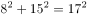，符合规律。故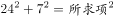，所求项为。

故正确答案为A。

---

### 第 12 题　qid 2732724 · 数学运算

有若干个相同的小正方体木块，按图（1）、（2）、（3）的叠放规律摆放，则到第七个图时，第七个图中小正方体木块总数应为<u>        </u>个。

- **A**. 25
- **B**. 66
- **C**. 91　✅
- **D**. 120

**答案**：C

**官方解析**

由图可知，第一个图中有1层共1个正方体；第二个图中有2层，第二层比第一层多4个正方体；第三个图中有3层，第三层比第二层多4个正方体，即每层的个数构成公差为4的等差数列。则第七个图中应有7层，正方体总数为个。

故正确答案为C。

---

### 第 13 题　qid 2732726 · 数学运算

数列：2，4，8，12，18，24，

- **A**. 30
- **B**. 32　✅
- **C**. 36
- **D**. 38

**答案**：B

**官方解析**

方法一：数列变化平缓且无明显规律，优先考虑作差。后项减前项得到新数列：2、4、4、6、6、？，无规律，再次作差得到2、0、2、0，周期数列下一项2，则？。因此所求项。

方法二：数列变化平缓且无明显规律，考虑作和。两两加和可得，6、12、20、30、42，？，此数列变化平缓且无明显规律，考虑作差，后项减前项可得，6、8、10、12，构成公差为2的等差数列，下一项为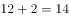，？项为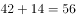，则所求项为。

故正确答案为B。

---

### 第 14 题　qid 2731342 · 数学运算

数列：[1，2]3，[1，2，3]0，[1，2，3，4]4，[1，2，3，4，5]-1，[1，2，3，4，5，6]5，[1，2，3，4，5，6，7]-2，[1，2，3，4，5，6，7，8]6，···，则[1，2，3，···，100]<u>        </u>

- **A**. 52　✅
- **B**. 50
- **C**. -50
- **D**. -52

**答案**：A

**官方解析**

方法一：数列项数较多，考虑多重数列。交叉来看，等号右边奇数数列为：3，4，5，6，······，是连续自然数列；等号右边偶数数列为：0，-1，-2，······，是公差为-1的等差数列。所求项是原数列的第99项，为奇数项，且为奇数数列的第50项，则所求项为52。

方法二：观察数列，计算发现：，，，，，，······，即连续自然数中、符号循环交替，则所求项为············。

故正确答案为A。

---

### 第 15 题　qid 2731346 · 数学运算

将从1到11连续自然数填入下图中的圆圈内，要使每边上的三个数的和都相等，a不可能是<u>        </u>。

- **A**. 1
- **B**. 6
- **C**. 7　✅
- **D**. 11

**答案**：C

**官方解析**

根据等差数列求和公式，1到11连续自然数的和为。每边上的三个数的和均包括一个的值且都相等，则五条边上空白部分的两个数之和均相等，因此所有空白部分对应数据之和为5的倍数，即为5的倍数，代入选项验证：

A项：，符合；

B项：，符合；

C项：不为整数，不符合；

D项：，符合。

本题为选非题，故正确答案为C。

---

### 第 16 题　qid 2731348 · 数学运算

有一架自动扶梯共25级，每秒移动2阶。A从扶梯的起点处站立乘坐，两秒后B从起点处以每秒1阶的速度向上走动。又过三秒后C来到扶梯起点处且以每秒4阶的速度向上跑。那么以下事件中最先发生的是        。

- **A**. A到达扶梯终点
- **B**. B追上A　✅
- **C**. C追上A
- **D**. C追上B

**答案**：B

**官方解析**

由题意可知本题为行程问题，事件最先发生的一定是总体用时最短的，分别计算四个事件的用时比较即可。

A项：由题意“有一架自动扶梯共25级，每秒移动2阶。A从扶梯的起点处站立乘坐”可知，阶/秒，A到达扶梯终点的时间秒；

B项：由题意“两秒后B从起点处以每秒1阶的速度向上走动”可知，阶/秒，阶，根据追及公式：，则，解得秒，故B追上A的总体用时秒；

C项：由题意“又过三秒后C来到扶梯起点处且以每秒4阶的速度向上跑”可知，阶/秒，阶，则，解得秒，故C追上A的总体用时秒；

D项：阶，则，解得秒，故C追上B的总体用时秒。

比较可知，选项中B追上A的事件总体用时最少。

故正确答案为B。

---

### 第 17 题　qid 2732728 · 数学运算

已知易拉罐的直径为8cm，现将7个易拉罐如图捆扎在一起，那么需要<u>        </u>cm长的绳子。（仅计算一圈的绳长）。

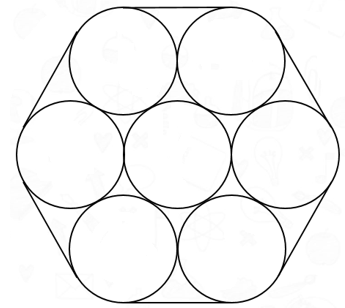

- **A**. 

- **B**. 
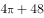

- **C**. 

- **D**. 
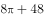
　✅

**答案**：D

**官方解析**

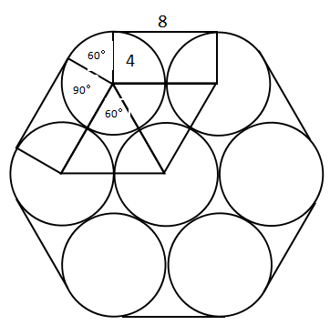

如图，绳子的长度即为6个弧长6个线段的长度。每条线段的长度即圆的直径为8cm，则6条直线的长度是cm。每条弧对应的圆心角是，6个弧长则对应的是整个圆的周长为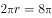cm。则绳子的长度是cm。

故正确答案为D。

---

### 第 18 题　qid 2731356 · 数学运算

一个长方形长6cm，宽4cm，现分别平行于长和宽剪了若干刀，将长方形分割成若干个小长方形，这些小长方形的周长之和比原长方形周长多了56cm。那么最多剪了         刀。

- **A**. 3
- **B**. 4
- **C**. 5
- **D**. 6　✅

**答案**：D

**官方解析**

设平行于长剪了刀，平行于宽剪了刀。每当长或宽多剪一刀，这些小长方形总周长比原长方形周长多了2倍的长或宽。由此可列：，化简可得，结合奇偶特性可知，应为偶数。根据，要剪的总刀数最多，即（）最大，则尽量小，由于为偶数且不能为0，则应取2。当时，，共剪刀。

故正确答案为D。

---

### 第 19 题　qid 2732730 · 数学运算

小李带女儿在健身步道上比赛，他让女儿先跑24步，然后他出发去追她，已知女儿跑12步的距离等于小李跑8步的距离，女儿跑4步的时间小李只能跑3步，则小李要跑        步才能追上女儿。

- **A**. 18
- **B**. 36
- **C**. 72
- **D**. 144　✅

**答案**：D

**官方解析**

由题意可知，女儿和小李的步长之比是8：122：3，设女儿的步长是2，小李的步长是3。单位时间内女儿跑4步，小李跑3步。则女儿和小李的速度之比是（）：（）8：9。女儿先跑24步，每步步长是2，则路程是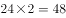。根据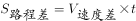，可得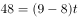，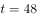，即小李追上女儿需要48个单位时间，每个单位时间是3步，则一共是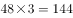步才能追上女儿。

故正确答案为D。

---

### 第 20 题　qid 2732731 · 数学运算

小李抽盲盒，这类盲盒一共有8款，小李只要其中的1款，他一次买了两个盲盒，则抽中他想要的那款的概率是        。

- **A**. 
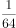

- **B**. 

- **C**. 

　✅
- **D**. 

**答案**：C

**官方解析**

正面情况较复杂，讨论反面情况。即小李买的两个盲盒都不是他想要的那款，一共8款，只有1款想要，则不是想要那款的概率是，两个盲盒都不是的概率是。则抽中想要那款的概率是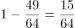。

故正确答案为C。

---

### 第 21 题　qid 2731380 · 数学运算

安排4名护士护理3个病房，每个病房至少一名护士，每名护士固定护理一个病房，则共有        种安排方法。

- **A**. 24
- **B**. 36　✅
- **C**. 48
- **D**. 72

**答案**：B

**官方解析**

4名护士护理3个病房，且每个病房至少一名护士，则人数分组为（2，1，1）。从4名护士中选出2名护士在一组，共同护理一个病房，有种方法；三组人员，分别护理3个病房，有种方法。则共有种安排方法。

故正确答案为B。

---

### 第 22 题　qid 2731374 · 数学运算

公司购买某设备24套，现要登记单价，但是数据上没有标注单价，且总价第一位和最后一位模糊不清，只看到是☆579△元。则☆可能是        。

- **A**. 3
- **B**. 5
- **C**. 7　✅
- **D**. 9

**答案**：C

**官方解析**

总价单价数量，设备数量为24套，故总价一定为24的倍数，即总价既是3的倍数又是8的倍数。

题干数字为☆579△，若要为8的倍数，则后三位应为8的倍数。79△800m，由于800是8的倍数，故m只能为8，则△只能为2。

此时题干数字为☆5792，若要为3的倍数，则各位数字之和应为3的倍数。☆☆，则☆可能为1、4、7，只有C项符合。

故正确答案为C。

---

### 第 23 题　qid 2731364 · 数学运算

甲到飞机场坐飞机，飞机场的十二个登机口排成一条直线，相邻两个登机口之间相距50米。甲在登机口等待时被告知登机口更改了，那么甲走到新登机口的距离不超过200米的概率是：

- **A**. 

- **B**. 

- **C**. 

- **D**. 

　✅

**答案**：D

**官方解析**

给情况求概率，考虑公式：概率。总情况为甲在任意登机口移动到另一登机口，共有种情况；满足条件的情况为甲走到新登机口的距离不超过200米，因相邻两个登机口距离为50米，则甲移动到相邻登机口要在4个及以内，分别讨论如下：

甲在1号登机口：满足条件的有2，3，4，5号登机口，共4种情况；

甲在2号登机口：满足条件的有1，3，4，5，6号登机口，共5种情况；

甲在3号登机口：满足条件的有1，2，4，5，6，7号登机口，共6种情况；

甲在4号登机口：满足条件的有1，2，3，5，6，7，8号登机口，共7种情况；

甲在5号登机口：满足条件的有1，2，3，4，6，7，8，9号登机口，共8种情况；

甲在6号登机口：满足条件的有2，3，4，5，7，8，9，10号登机口，共8种情况。

因登机口呈一条直线，故7~12号登机口与1~6号登机口情况对称，分别有8，8，7，6，5，4种情况。由此可知，满足条件的情况数共有种情况。

则甲走到新登机口的距离不超过200米的概率。

故正确答案为D。

---

### 第 24 题　qid 2732733 · 数学运算

老李家的草莓园开展采摘活动，每位游客进园可以免费吃，并且带走2斤草莓。每位游客在采摘过程中平均吃1斤草莓。目前老李家的草莓园估计有成熟草莓2000斤，并且每天还会有40斤草莓成熟，为保证采摘活动至少可以持续20天，那么平均每天最多接待        位游客。

- **A**. 36
- **B**. 46　✅
- **C**. 56
- **D**. 66

**答案**：B

**官方解析**

由题意可知，每位游客免费吃1斤，带走2斤，则每位游客每天消耗草莓3斤。设每天最多接待位游客。要使活动至少可以持续20天，则草莓至少需要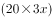斤。由题意可得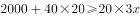，解得，则平均每天最多接待46位游客。

故正确答案为B。

---

### 第 25 题　qid 2731382 · 数学运算

假设三颗小行星绕着一颗恒星运动，它们的运行轨道都是圆形，每条轨道的圆心都是该恒星。且三条轨道都在同一平面内。若这三颗小行星同向旋转，且绕轨道运行一周的时间分别是60年、84年、140年。现在三颗小行星和恒星在同一直线上且三颗小行星都在恒星的同侧，那么至少        年后他们再次在同一直线上且三颗小行星都在恒星的同侧。

- **A**. 210　✅
- **B**. 315
- **C**. 420
- **D**. 630

**答案**：A

**官方解析**

题干较为复杂，考虑代入排除；问“至少”，考虑从小到大代入选项。

代入A项：210年后，运行周期为60年的小行星共运行周，运行周期为84年的小行星共运行周，运行周期为140年的小行星共运行周。此时，每个小行星的位置都偏离原来位置半圈，满足在同一直线上且三颗小行星都在恒星的同侧。

因A项已满足题意，B、C、D三项无需验证。

故正确答案为A。

---
