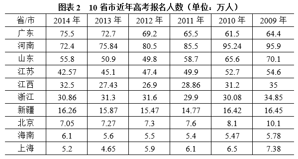
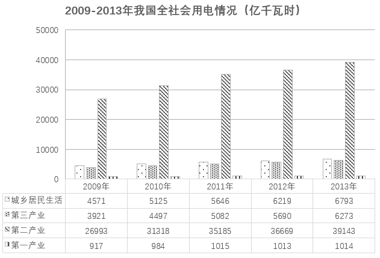

# 2021年上海市行政执法类考试《行测》试题（网友回忆版）

> 数量关系 · 17 题 · 上海 2021

## 材料 1

        教育部统计，今年全国高考报名939万人，增幅3%。其中普通高中应届生增加26万人；中职毕业学生增加11万人；复读生减少10万人。报名学生中农村户籍学生增加17万人，与近年高考政策向农村倾斜及各省农村专项生的扩大招生密不可分。此外异地高考全面实施，2014年将有28个省份开始解决随迁子女在当地参加高考问题，共有5.6万名符合条件的随迁子女将在居住地参加高考。

### 第 1 题　qid 16540247 · 数学运算

2014年高考报名人数较2013年增加了        万人。

- **A**. 26
- **B**. 27　✅
- **C**. 31
- **D**. 32

**答案**：B

**官方解析**

根据题干“2014年······较2013年增加了······万人”，可判定本题为增长量计算问题。定位图表1可得：2013年、2014年全国高考报名人数分别为912万人、939万人。根据公式：增长量=现期量-基期量，则题干所求为939-912=27万人。
故正确答案为B。

---

### 第 2 题　qid 16540248 · 数学运算

下列省市中，高考报名人数持续下跌的不包括        。

- **A**. 河南
- **B**. 浙江　✅
- **C**. 江苏
- **D**. 北京

**答案**：B

**官方解析**

定位图表2可知2009-2014年河南、浙江、江苏、北京每年的高考报名人数。观察可知，2009-2014年河南、江苏、北京的高考报名人数均持续下跌；浙江2011年高考报名人数（29.9万人）&lt;2012年高考报名人数（31.6万人），高考报名人数有所上升，并非持续下跌。
故正确答案为B。

---

### 第 3 题　qid 16540249 · 数学运算

根据材料，2014年江浙沪省市报考人数占到全国报名总人数的        。

- **A**. 7.98%
- **B**. 8.21%
- **C**. 8.37%　✅
- **D**. 8.54%

**答案**：C

**官方解析**

根据题干“······2014年······占······”，结合选项为百分数，且材料时间为2014年，可判定本题为现期比重问题。定位图表1、2可得：2014年，全国高考报名人数为939万人；江苏、浙江、上海高考报名人数分别为42.57万人、30.86万人、5.2万人。根据公式：比重，则题干所求为，对应C项。

故正确答案为C。

---

### 第 4 题　qid 16540254 · 数学运算

下表列举了8个省市2014年报考人数的分布（单位：万人），业内人士认为合理的文理科比例应为3：7，分析数据得出最接近这一比例的省市是<u>        </u>。

- **A**. 北京　✅
- **B**. 广东
- **C**. 上海
- **D**. 浙江

**答案**：A

**官方解析**

根据题干“······2014年······比例应为3：7，······最接近这一比例的省市······”，可判定本题为比值比较问题。定位题干表格可知2014年选项涉及四个省市的文理科报考人数，则文理科比例分别为：A项，；B项，；C项，；D项，。比较可知，最接近3：7（约0.43）这一比例的是A项。

故正确答案为A。

---

## 材料 2

### 第 5 题　qid 16540258 · 数学运算

2009年三大产业的平均用电量约为城乡居民生活用电量的        。

- **A**. 
2.3倍
　✅
- **B**. 

- **C**. 
3.3倍

- **D**. 

**答案**：A

**官方解析**

根据题干“2009年······约为······的”，结合选项为倍数，且材料给出2009年的相关数据，可判定本题为现期倍数问题。定位统计图可得：2009年城乡居民生活、第三产业、第二产业、第一产业用电量分别为4571亿千瓦时、3921亿千瓦时、26993亿千瓦时、917亿千瓦时。则2009年三大产业的平均用电量亿千瓦时，故所求倍数倍。

故正确答案为A。

---

### 第 6 题　qid 16540261 · 数学运算

相比上一年，2012年的第三产业用电量占全社会用电量的比重        。

- **A**. 下降了约0.3个百分点
- **B**. 下降了约0.7个百分点
- **C**. 上升了约0.3个百分点
- **D**. 上升了约0.7个百分点　✅

**答案**：D

**官方解析**

根据题干“相比上一年，2012年······占······比重”，结合选项为“上升/下降了+百分点”，可判定本题为两期比重问题。定位统计图可得2011年和2012年我国城乡居民生活、第三产业、第二产业、第一产业用电量。则2011年我国全社会用电量=5646+5082+35185+1015亿千瓦时，2012年我国全社会用电量=6219+5690+36669+1013亿千瓦时。根据公式：比重，可得2011年我国第三产业用电量占全社会用电量的比重，2012年我国第三产业用电量占全社会用电量的比重，故所求比重差=11.5%-10.8%=0.7%，即比重上升了约0.7个百分点。

故正确答案为D。

---

### 第 7 题　qid 16540264 · 数学运算

根据材料下列选项正确的是        。

- **A**. 2010-2013年，第二产业用电量同比增长最快的是2011年
- **B**. 2010-2013年，我国全社会用电量同比增加最多的是2010年　✅
- **C**. 如果同比增速与上一年保持不变，预计2014年我国全社会用电量将超过60000亿千瓦时
- **D**. 2011年第一产业用电量占全社会用电量比重比上一年有所上升

**答案**：B

**官方解析**

A项：定位统计图可得：2009-2013年我国第二产业用电量分别为26993亿千瓦时、31318亿千瓦时、35185亿千瓦时、36669亿千瓦时、39143亿千瓦时。根据公式：增长率，可得2010-2013年我国第二产业用电量的同比增速分别为：2010年，；2011年，；2012年，；2013年，。故2010-2013年，第二产业用电量同比增长最快的是2010年，错误；

B项：定位统计图可得2009-2013年我国城乡居民生活、第三产业、第二产业、第一产业用电量。则2009年我国全社会用电量=4571+3921+26993+9174600+3900+27000+900=36400亿千瓦时，2010年我国全社会用电量=5125+4497+31318+9845100+4500+31300+1000=41900亿千瓦时，2011年我国全社会用电量=5646+5082+35185+10155600+5100+35200+1000=46900亿千瓦时，2012年我国全社会用电量=6219+5690+36669+10136200+5700+36700+1000=49600亿千瓦时，2013年我国全社会用电量=6793+6273+39143+10146800+6300+39100+1000=53200亿千瓦时。根据公式：增长量=现期量-基期量，则2010-2013年我国全社会用电量的同比增长量分别为：2010年，41900-36400=5500亿千瓦时；2011年，46900-41900=5000亿千瓦时；2012年，49600-46900=2700亿千瓦时；2013年，53200-49600=3600亿千瓦时。故2010-2013年，我国全社会用电量同比增加最多的是2010年，正确；

C项：定位统计图可得2012年和2013年我国城乡居民生活、第三产业、第二产业、第一产业用电量。则2012年我国全社会用电量=6219+5690+36669+10136200+5700+36700+1000=49600亿千瓦时，2013年我国全社会用电量=6793+6273+39143+10146800+6300+39100+1000=53200亿千瓦时。根据公式：增长率，可得2013年我国全社会用电量的同比增速=。根据公式：现期量=基期量×（1+增长率），可得如果同比增速与上一年保持不变，预计2014年我国全社会用电量＜53200×（1+10%）＜60000亿千瓦时，错误；

D项：定位统计图可得2010年和2011年我国城乡居民生活、第三产业、第二产业、第一产业用电量。则2010年我国全社会用电量=5125+4497+31318+9845100+4500+31300+1000=41900亿千瓦时，2011年我国全社会用电量=5646+5082+35185+10155600+5100+35200+1000=46900亿千瓦时。根据公式：增长率，可得2011年我国第一产业用电量的同比增速（a），2011年我国全社会用电量的同比增速（b）。根据两期比重比较结论：当a＜b时，比重下降。因为2011年第一产业用电量同比增速（a）＜2011年全社会用电量同比增速（b），故2011年第一产业用电量占全社会用电量比重比上一年有所下降，错误。

故正确答案为B。

---

### 第 8 题　qid 16540203 · 数学运算

假如在高速公路上每隔51米设置一个路标，对路标进行连续计数，则超过第32号路标8.67公里的路标应是（    ）。

- **A**. 第201号路标
- **B**. 第202号路标　✅
- **C**. 第203号路标
- **D**. 第204号路标

**答案**：B

**官方解析**

因1公里=1000米，故8.67公里=8.67×1000米=8670米。根据题意可知，每相邻两个路标间隔51米，则8670米对应的间隔数为个。170个间隔对应新增170个路标，则最终的路标编号=第32号路标+新增路标数=32+170=202号。

故正确答案为B。

---

### 第 9 题　qid 16540206 · 数学运算

小明和小红两人玩石头剪刀布的游戏，两人共玩了36次，每次都只有输和赢两种结果，则小明获胜次数和小红获胜次数的比不可能是（    ）。

- **A**. 1：2
- **B**. 2：3　✅
- **C**. 1：5
- **D**. 5：7

**答案**：B

**官方解析**

根据题意可知，每次游戏只有输赢两种结果，故小明获胜次数+小红获胜次数=36。对于每个选项的比例a：b，总份数为a+b，若该比例成立，则总份数a+b必须是36的因数，即36能被a+b整除。代入选项验证如下：
A项，a+b=1+2=3，36÷3=12，整数，可能；
B项，a+b=2+3=5，36÷5=7.2，非整数，不可能；
C项，a+b=1+5=6，36÷6=6，整数，可能；
D项，a+b=5+7=12，36÷12=3，整数，可能。
本题为选非题，故正确答案为B。

---

### 第 10 题　qid 16540198 · 数学运算

某商场组织了抽奖活动，在纸箱内装了三种大小、形状、质地完全相同的球共50个，其中一种上写着“一等奖”，一种上写着“二等奖”，还有一种上写着“三等奖”，已知摸到写着“一等奖”和“二等奖”的球的概率分别是0.2和0.3，则写着“三等奖”的球有        个。

- **A**. 10
- **B**. 15
- **C**. 25　✅
- **D**. 30

**答案**：C

**官方解析**

根据题意可知，摸到写着“三等奖”球的概率为1-0.2-0.3=0.5。根据公式：概率，故满足条件的情况数=概率×总情况数，则写着“三等奖”的球有0.5×50=25个。

故正确答案为C。

---

### 第 11 题　qid 16540213 · 数学运算

一个人投掷质地均匀硬币3次，正反面出现的概率相等，则正面出现的次数大于反面出现次数的概率是        。

- **A**. 

- **B**. 

- **C**. 

　✅
- **D**. 

**答案**：C

**官方解析**

根据“正反面出现的概率相等”，可知每次投掷硬币时，出现正面或者反面的概率均为。总共投掷3次硬币，要求正面出现的次数大于反面出现次数，则分为以下2种情况：

①正面出现2次，反面出现1次：从3次投掷中任选2次为正面，剩余1次为反面，概率为；

②正面出现3次，反面出现0次：概率为。

分类用加法，正面出现的次数大于反面出现次数的概率是。

故正确答案为C。

---

### 第 12 题　qid 16540202 · 数学运算

某饭店新买的洗碗机每小时可以洗450个碗，原来的旧洗碗机每小时可以洗300个碗。如果新旧洗碗机同时开始工作则两台洗碗机洗900个碗一共需要        分钟。

- **A**. 70
- **B**. 72　✅
- **C**. 75
- **D**. 80

**答案**：B

**官方解析**

新旧洗碗机同时工作，每小时洗碗450+300=750个。根据公式：，则所求为分钟。

故正确答案为B。

---

### 第 13 题　qid 16540230 · 数学运算

在一次考试中，小红答对了16道是非题和20道选择题，而小刚答对的是非题量是小红的一半，他答对的是非题和选择题的数量之和是小红的1.5倍，则小刚答对的选择题有        题。

- **A**. 60
- **B**. 54
- **C**. 46　✅
- **D**. 36

**答案**：C

**官方解析**

小刚答对的是非题量为道，则小刚答对的选择题量为（16+20）×1.5-8=46道。

故正确答案为C。

---

### 第 14 题　qid 16540233 · 数学运算

假设10千克咖啡豆的价格是a元，每千克咖啡豆可以煮b杯咖啡，则煮一杯咖啡需要的费用是        元。

- **A**. 

- **B**. 

- **C**. 

　✅
- **D**. 

**答案**：C

**官方解析**

根据“10千克咖啡豆的价格是a元”，则每千克咖啡豆的价格是元。根据“每千克咖啡豆可以煮b杯咖啡”，则煮一杯咖啡需要千克咖啡豆。故煮一杯咖啡需要的费用是元。

故正确答案为C。

---

### 第 15 题　qid 16540216 · 数学运算

某超市近期推出了易拉罐换可乐的活动。如果10个易拉罐可以换1罐可乐，则127个易拉罐最多可以换        罐可乐。

- **A**. 12
- **B**. 13
- **C**. 14　✅
- **D**. 15

**答案**：C

**官方解析**

根据空瓶换酒公式：n个空瓶可以换1瓶酒，x个空瓶最多可以换到瓶酒。根据题意，10个易拉罐可以换1罐可乐，127个易拉罐最多可以换罐可乐，可乐罐数一定是整数，则127个易拉罐最多可以换14罐可乐。

故正确答案为C。

---

### 第 16 题　qid 16540217 · 数学运算

一瓶矿泉水的成本为0.2元，假设当价格为1元时A超市每月可售出200瓶，当价格为1.2元时每月可售出180瓶，当价格为1.5元时每月可售出100瓶。则价格为        时该超市可获得最大的利润。

- **A**. 1元
- **B**. 1.2元　✅
- **C**. 1.5元
- **D**. 三个一样多

**答案**：B

**官方解析**

根据公式：利润=售价-进价、总利润=单利×销量，则不同销售价格的总利润分别为：
当价格为1元时，总利润=（1-0.2）×200=160元；
当价格为1.2元时，总利润=（1.2-0.2）×180=180元；
当价格为1.5元时，总利润=（1.5-0.2）×100=130元。
比较可知，当价格为1.2元时该超市可获得最大的利润。
故正确答案为B。

---

### 第 17 题　qid 16540228 · 数学运算

某人从家出发先向西走6公里，再向南走4公里，再向东走4公里，再向南走1公里，再向东走2公里，再向南走1公里，则现在离家        公里。

- **A**. 3
- **B**. 4
- **C**. 5
- **D**. 6　✅

**答案**：D

**官方解析**

如图，此人家在O点，终点在F点，连接OF，延长BC与OF交于点G。所求距离（OF）=OG+GE+EF=AB+CD+EF=4+1+1=6公里。

故正确答案为D。

---
