# 2021年北京市公务员录用考试《行测》题（乡镇卷）（网友回忆版）

> 数量关系 · 10 题 · 北京 2021

## 第 1 题　qid 2742285 · 数学运算

小张早上起床的时候，发现挂钟电池没电已经停止了，他把挂钟换好电池，但未来得及调整时间就匆忙出门上班了，出门前挂钟显示时间是5点25分。小张赶到单位时，刚好是8点整。中午12点小张从单位返回家中吃饭，12点半进门。假设小张上下班路上花费时间相等，则小张进门时家里挂钟显示时间为：

- **A**. 9点25分
- **B**. 9点55分
- **C**. 10点25分　✅
- **D**. 10点55分

**答案**：C

**官方解析**

中午12点小张从单位返回家中，12点半进门，可得下班路上用时为30分钟，上下班路上花费时间相等，总计为1个小时。小张在单位时间为8点到12点，共计4个小时，所以小张总计离家小时。此时家中挂钟显示时间应为5点25分5小时10点25分。

故正确答案为C。

---

## 第 2 题　qid 2742289 · 数学运算

为响应国家“做好重点群体就业工作”的号召，某企业扩大招聘规模，计划在年内招聘高校毕业生240名，但实际招聘的高校毕业生数量多于计划招聘的数量。已知企业将招聘到的高校毕业生平均分配到7个部门培训，并在培训结束后将他们平均分配到9个分公司工作。问该企业实际招聘的高校毕业生至少比计划招聘数多多少人？

- **A**. 6
- **B**. 12　✅
- **C**. 14
- **D**. 28

**答案**：B

**官方解析**

根据条件，企业将实际招聘的毕业生平均分配到7个部门和9个公司，可得实际招聘的人数既是7的倍数，又是9的倍数，即为63的倍数。因实际招聘人数超过240名，满足条件的人数至少为人。则实际招聘的人数比计划招聘的人数至少多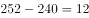人。

故正确答案为B。

---

## 第 3 题　qid 2742292 · 数学运算

一种设备打九折出售，销售12件与原价出售销售10件时获利相同。已知这种设备的进价为50元/件，其他成本为10元/件。问如打八折出售，1万元最多可以买多少件？

- **A**. 80
- **B**. 83　✅
- **C**. 86
- **D**. 90

**答案**：B

**官方解析**

根据条件，该设备每件的进价为50元，其他成本为10元，则每件设备的总成本元。设该设备的原价为元，因打九折销售12件与原价出售销售10件时获利相同，根据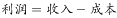可得：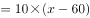，解得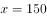。如果打八折销售，则售价变为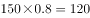元。1万元最多可以买件，则最多可以买83件。

故正确答案为B。

---

## 第 4 题　qid 2742298 · 数学运算

农场使用甲、乙两款收割机各1台收割一片麦田。已知甲的效率比乙高，如安排甲先工作3小时后乙加入，则再工作18小时就可以完成收割任务。问如果增加1台效率比甲高的丙，3台收割机同时开始工作，完成收割任务的用时在以下哪个范围内？

- **A**. 8小时以内
- **B**. 8-10小时之间
- **C**. 10-12小时之间　✅
- **D**. 12小时以上

**答案**：C

**官方解析**

甲的效率比乙高，即甲、乙效率比为5：4，赋值甲的效率为5，乙的效率为4，又因为丙的效率比甲高，丙的效率为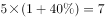。根据题干，甲先工作3小时，然后甲、乙再合作18小时即可完成，则工作总量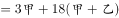。若3台收割机同时开始工作，用时为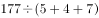小时，用时范围在10-12小时之间。

故正确答案为C。

---

## 第 5 题　qid 2742299 · 数学运算

甲、乙两家公司共同实施某个项目，甲公司的实际出资额比乙公司高60万元，投入人力是乙公司的一半，如将人力折算为出资额，则最终两家公司分得的利润相同。问两家公司投入的人力之和折算为多少万元的出资额？

- **A**. 240
- **B**. 180　✅
- **C**. 120
- **D**. 60

**答案**：B

**官方解析**

根据题意，设乙公司的实际出资额为万元，则甲公司的实际出资额为万元。因甲投入人力是乙公司的一半，设甲公司投入人力折算为出资额是万元，则乙公司投入人力折算为出资额为万元，最终两家公司分得的利润相同，即总的出资额相同（包含人力折算），则，解得，两家公司投入的人力之和折算为万元。

故正确答案为B。

---

## 第 6 题　qid 2742280 · 数学运算

小张开车经高速公路从甲地前往乙地。该高速公路限速为120千米/小时。返程时发现有的路段正在维修，且维修路段限速降为60千米/小时。已知小张全程均按最高限速行驶，且返程用时比去程用时多30分钟，则甲、乙两地距离为多少千米？

- **A**. 150
- **B**. 160
- **C**. 180　✅
- **D**. 200

**答案**：C

**官方解析**

方法一：设甲、乙两地相距千米，30分钟小时，根据公式：，可列方程为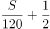，解得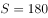。

方法二：往返路程的时间差为维修路段行驶的时间差，根据路程一定，速度与时间成反比，可得维修路段往返时间之比为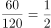，设维修路段去程时间为小时，则返程时间为小时，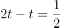，解得，因维修路段占总路段的，则总路段去程时间为小时，甲、乙两地距离为千米。

故正确答案为C。

---

## 第 7 题　qid 2742281 · 数学运算

甲、乙、丙三条生产线生产某种零件，效率比为3：4：5，甲和乙生产线共同生产A订单，完成时甲比乙少生产250个。乙和丙共同生产B订单，完成时乙生产了720个。问A订单的零件个数比B订单：

- **A**. 少不到100个
- **B**. 少100个以上
- **C**. 多不到100个
- **D**. 多100个以上　✅

**答案**：D

**官方解析**

工程问题中给具体值，方程法解题。设A订单甲、乙产量分别为个、个，B订单乙、丙产量分别为个、个，根据题意可得：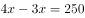，解得，则A订单共生产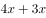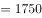个零件；，解得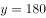，则B订单共生产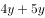个零件。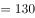个个，即A订单的零件个数比B订单多100个以上。

故正确答案为D。

---

## 第 8 题　qid 2742282 · 数学运算

某电商平台开通会员费用为99元/年，全年最多可免240元运费，且会员在购买服饰类、非服饰类商品时可分别享受9折和95折优惠。小王去年在该平台上未开通会员，全年购买服饰类、食品类、家电类和其他类商品分别花费1480元、3200元、3600元和1500元，运费花费235元。如他去年开通会员，则在该平台支付总金额可减少：

- **A**. 不到500元
- **B**. 500-750元之间　✅
- **C**. 750-1000元之间
- **D**. 1000元以上

**答案**：B

**官方解析**

根据题意可得，若小王去年开通会员，服饰类商品可节省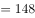元，非服饰类商品可节省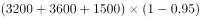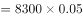元，运费在240元的限额内，故可节省235元。开通会员消费99元，则在该平台支付总金额可减少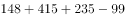元，对应B项。

故正确答案为B。

---

## 第 9 题　qid 2742284 · 数学运算

为实现精准扶贫，某县政府工作人员对辖区内所有贫困户进行走访。已知第一周走访的户数为贫困户总户数的，第二周走访的户数是两周后剩余未走访户数的1.2倍。问两周后最少还有多少户贫困户未走访?

- **A**. 45
- **B**. 90
- **C**. 135　✅
- **D**. 180

**答案**：C

**官方解析**

方法一：已知第一周走访的户数为贫困户总户数的，则剩余未走访的户数为贫困户总户数的，则第一周后未走访的户数为27的倍数。由第二周走访的户数是两周后剩余未走访户数的1.2倍可知，第二周走访的户数：两周后剩余未走访户数6：5，则第一周后未走访的户数为的倍数。综上，第一周后未走访的户数为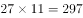的倍数。又因为第二周走访的户数：两周后剩余未走访户数6：5，则两周后剩余未走访户数为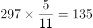的倍数，求两周后最少还有多少户未走访，结合选项只有C项符合要求。

方法二：设两周后还有户贫困户未走访，贫困户总户数为，则可列方程：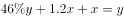，有，将两边系数化为最小整数有：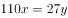，为保证为整数，则为27的倍数，结合选项，只有C项是27的倍数。

故正确答案为C。

---

## 第 10 题　qid 2742288 · 数学运算

某工厂的工号为5位数字。甲乙两个工人工号五位数字连乘之积都等于1764，但是甲的工号五位连加之和比乙的大4。问乙的工号为：

- **A**. 13677
- **B**. 22779
- **C**. 23677
- **D**. 33477　✅

**答案**：D

**官方解析**

五位数字连乘之积等于1764，可拆分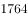，结合四个选项中均有2个数字7，可知其余三个数字之积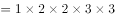，则此三个数字可以有（1，4，9）、（1，6，6）、（2，2，9）、（2，3，6）、（3，3，4）这5种情况，上述5种情况的数字之和分别为14、13、13、11、10，只有14比10大4，由于甲的工号五位连加之和比乙的大4，则乙的工号由（3，3，4，7，7）五位数字组成，只有D项符合要求。

故正确答案为D。

---
