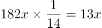
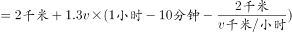
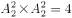
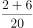
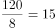
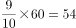
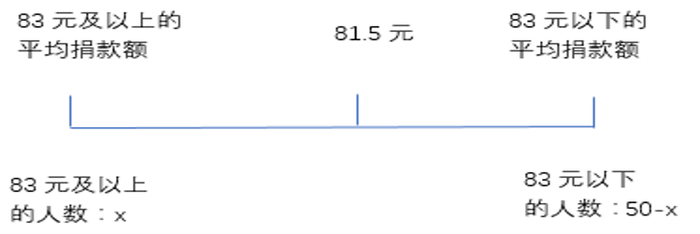
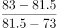
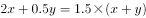

# 2021年四川下半年公务员录用考试《行测》试题（网友回忆版）

> 数量关系 · 10 题 · 四川 2021

## 第 1 题　qid 4658519 · 数学运算

为实现产业振兴，农科院对某县的所有自然村进行了调研，结果发现，适合种植A作物的自然村占。适合种植B作物的自然村有25个，同时适合种植两种作物的自然村占总数的，则在该县，不适合种植两种作物的自然村至少有多少个？

- **A**. 57
- **B**. 67
- **C**. 114　✅
- **D**. 134

**答案**：C

**官方解析**

由题意可知，自然村总数既是13的倍数，又是14的倍数，即自然村总数一定是13和14最小公倍数182的整数倍，设该县的自然村共有182x个，则适合种植A作物的自然村有个，同时适合种植两种作物的自然村有个。根据两集合容斥原理公式：A+B-AB=总数-都不，则56x+25-13x=182x-都不，整理可得：都不=139x-25。要使不适合种植两种作物的自然村（都不）数量尽可能小，则x应尽可能小，x最小取1，故不适合种植两种作物的自然村至少有139×1-25=114个。

故正确答案为C。

---

## 第 2 题　qid 4658544 · 数学运算

小王每天以v千米/小时的速度骑车到单位上班，如果速度提高20%，则可以提前10分钟到单位；如果以原速度骑行2千米后再提速30%，也可以提前10分钟到达。问小王家距离单位多少千米？

- **A**. 5.4
- **B**. 7.2　✅
- **C**. 8.5
- **D**. 9.6

**答案**：B

**官方解析**

根据路程不变时，速度与时间成反比。原速度（v）与提高20%后的速度之比为1：（1+20%），即为5：6，则全程所用时间之比为6：5，故小王以原速v千米/小时骑车到单位上班需要60分钟也就是1小时，则总路程为：v×1=v千米。根据“如果以原速度骑行2千米后再提速30%，也可以提前10分钟到达。”根据总路程不变，，解得v=7.2，故总路程为7.2千米。

故正确答案为B。

---

## 第 3 题　qid 4658698 · 数学运算

农科院派出6名科技人员支援甲、乙、丙三个县农业发展，每个县分配2人。其中精通农业、牧业和渔业技术的分别有3人、3人和2人。有2人同时精通农业和牧业技术、且精通渔业技术的人均不精通农业和牧业技术，已知丙县因无条件发展渔业只需要农业和牧业技术专家，甲县和乙县都需要掌握3类技术的专家支援，问有多少种不同的安排方式？

- **A**. 4　✅
- **B**. 8
- **C**. 15
- **D**. 20

**答案**：A

**官方解析**

6名专家中有2人同时精通农业和牧业技术，有2人只精通渔业技术，根据两集合容斥原理可知，则余下2人分别精通农业和牧业技术。根据题干要求，甲、乙县均需1名双技术专家和1名渔业技术专家，只掌握农业、牧业技术的2名专家支援丙县，则安排方式共有种。

故正确答案为A。

---

## 第 4 题　qid 4658545 · 数学运算

现派出两个工作组对甲、乙、丙、丁和戊五个县的乡村振兴工作成果进行验收，要求每个工作组至少验收2个县，且每个县由1个工作组验收。问如按要求随机分配任务，则甲、乙两个县的乡村振兴工作成果由同一个工作组验收的概率为：

- **A**. 

- **B**. 

　✅
- **C**. 

- **D**. 

**答案**：B

**官方解析**

根据题意，每个工作组至少验收2个县，则令一个工作组验收2个县，一个工作组验收3个县。则总情况数为：先从2个工作组中选1个组验收2个县，再从5个县里选2个验收，共有种情况。

满足甲、乙两个县由同一个工作组验收的情况分类讨论如下：

①验收了2个县的工作组，恰好验收甲、乙两县。由于验收2个县的工作组有2种情况，故同时验收甲、乙两县的有2种情况。

②验收了3个县的工作组，验收甲、乙两县。由于验收3个县的工作组有两种情况，还需从剩余3个县中选1个使得该工作组共验收3县，有种情况。

则所求概率。

故正确答案为B。

---

## 第 5 题　qid 4658522 · 数学运算

王、李、刘、张四人参加测试，每人得分均为正整数，张的得分高于任意一人，李的得分低于其余任意一人，王的得分高于刘，已知张和王得分之和为34，王和刘得分之和为20，刘和李得分之和为16，问张比王多得多少分？

- **A**. 8
- **B**. 10
- **C**. 12　✅
- **D**. 14

**答案**：C

**官方解析**

王、李、刘、张四人参加测试，根据“张的得分高于任意一人”，说明张的得分排名第一；根据“李的得分低于其余任意一人”，说明李的得分排名第四；根据“王的得分高于刘”，说明王的得分排名第二、刘的得分排名第三，即四人的测试成绩由高到低分别为：张、王、刘、李。由于“王和刘得分之和为20”，刘的得分应低于10分，同时由于“刘和李得分之和为16”，刘的得分应高于8分，即刘的得分为9分。由此可计算出王的得分为20-9=11分，张的得分为34-11=23分，张比王多得23-11=12分。
故正确答案为C。

---

## 第 6 题　qid 4658611 · 数学运算

某项工程，甲、乙、丙三个工程队如单独施工，分别需要12小时、10小时和8小时完成。现按“甲—乙—丙—甲······”的顺序让三个工程队轮班，每队施工1小时后换班，问该工程完成时，甲工程队的施工时间共计：

- **A**. 2小时54分
- **B**. 3小时
- **C**. 3小时54分　✅
- **D**. 4小时

**答案**：C

**官方解析**

赋值该工程的工作总量为12、10、8的公倍数120。则甲工程队每小时工作量为，乙工程队每小时工作量为，丙工程队每小时工作量为。按照甲、乙、丙三个工程队各施工1小时的顺序轮班，则甲、乙、丙三个工程队每3个小时的工作量为10+12+15=37，，即三轮后（其中甲工程队施工3小时），该工程剩余工作量为9，剩余的工作量甲需小时完成，即分钟，故该工程完成时，甲工程队的施工时间共计3小时54分钟。

故正确答案为C。

---

## 第 7 题　qid 4658606 · 数学运算

某公司开展爱心捐款活动，50名员工人均捐款81.5元。已知任意2名员工捐款金额相差不超过10元，问该公司捐款83元及以上的员工最多可能有多少人？

- **A**. 40
- **B**. 42　✅
- **C**. 44
- **D**. 46

**答案**：B

**官方解析**

题目涉及平均数混合问题，可以考虑通过线段法求解。结合题意画出如下线段：

总人数为50人，设捐款83元及以上的员工最多为x人，则83元以下人数为（50-x）人。根据线段法“距离与量成反比”，要想x尽可能多，则捐款83元及以上的员工平均捐款额与81.5的差应尽量小，捐款83元以下的员工平均捐款额与81.5的差应尽量大。故捐款83元及以上的员工平均捐款最小为83元，捐款83元以下的员工平均捐款额最小为83-10=73元。因此可列式：，解得x=42.5，所求42.5为捐款83元及以上的员工人数最多的情况，因此人数需向下取整为42人。

故正确答案为B。

---

## 第 8 题　qid 4658623 · 数学运算

某工厂原有甲工种的人数是乙工种人数的2倍，由于公司扩大产能，又招聘了甲、乙两个工种的工人，且新招聘的甲工种人数是新招聘的乙工种人数的0.5倍，招聘后工厂中甲工种的人数是乙工种人数的1.5倍，问新招聘的乙工种人数是原乙工种人数的：

- **A**. 

- **B**. 

　✅
- **C**. 

- **D**. 

**答案**：B

**官方解析**

设工厂原有乙工种的人数为，则原有甲工种的人数为；新招聘乙工种的人数为，则新招聘甲工种的人数为。根据题意，，整理得，故新招聘的乙工种人数是原乙工种人数的。

故正确答案为B。

---

## 第 9 题　qid 4658587 · 数学运算

果农陈伯将收获的水果全部卖出，出售价格为苹果5元/公斤，冬枣6元/公斤，甜橘7元/公斤，已知苹果和冬枣的产量之比为4：3，苹果和甜橘的产量之比为5：2，出售冬枣的收入比甜橘多3400元，问他销售水果的总收入为多少元？

- **A**. 22800
- **B**. 23400
- **C**. 24000
- **D**. 24600　✅

**答案**：D

**官方解析**

根据“苹果和冬枣的产量之比为4：3，苹果和甜橘的产量之比为5：2”可得，苹果、冬枣、甜橘的产量之比为20：15：8，设苹果产量为20x公斤，则冬枣产量为15x公斤，甜橘产量为8x公斤，根据“出售冬枣的收入比甜橘多3400元”可得，6×15x=7×8x+3400，解得x=100，则销售水果的总收入为2000×5+1500×6+800×7=24600元。
故正确答案为D。

---

## 第 10 题　qid 4658593 · 数学运算

已知A单位在3月x日（x≤10）举行校招会，B单位在4月y日（y≥20）举行校招会，两个单位的校招会都在星期五举行，已知x+y=32，问y的值为：

- **A**. 24
- **B**. 25　✅
- **C**. 26
- **D**. 27

**答案**：B

**官方解析**

由题意可知，从3月x日至4月y日，经过3月份剩下的（31-x）天、4月份y天，共经过31-x+y=31-(32-y)+y=2y-1天。由于这两天均为星期五，因此2y-1为7的整数倍。代入选项，仅B项满足。
故正确答案为B。

---
