# 2021年四川省公务员录用考试《行测》题（网友回忆版）

> 数量关系 · 10 题 · 四川 2021

## 第 1 题　qid 3523592 · 数学运算

李强家的钟走时正确，但显示时间被调错了，某天上班出发时，家里的钟显示时间为8：04，到达办公室恰好是北京时间8：00，下班时间李强于北京时间17：00准时离开办公室，到家时发现家里的钟显示的时间为17：30，如果李强上、下班所用时间相同，则他从家到办公室需要多少分钟？

- **A**. 13　✅
- **B**. 14
- **C**. 15
- **D**. 16

**答案**：A

**官方解析**

设李强从家到办公室的时间为分钟，根据上下班过程列表如下：

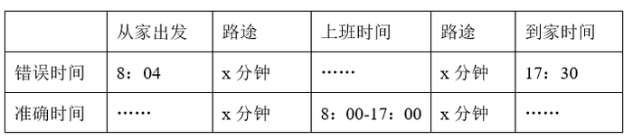

由上表可知，李强整个过程共花费时间小时分钟，他在办公室时间小时，可知他从家往返办公室的时间为26分钟，则他从家到办公室需要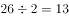分钟。  

故正确答案为A。

---

## 第 2 题　qid 3523593 · 数学运算

某公司张、王、刘、李和陈5名销售员去年共完成24个项目的销售。已知每个项目只有1人负责销售，每人都至少完成了1个项目且完成的项目数量彼此不同。张完成的项目比刘少5个，李完成的项目比陈多6个不是5人中最多的，王完成的项目最少，问张和李共完成几个项目？

- **A**. 10
- **B**. 11
- **C**. 12　✅
- **D**. 13

**答案**：C

**官方解析**

设王完成个项目，张完成个项目，陈完成个项目，则刘完成个项目，李完成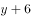个项目。由题意可列式：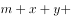，整理可得张和李共完成项目个数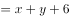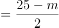，因项目个数为整数，则为奇数；根据每人都至少完成了1个项目可得，王完成的项目最少且完成项目数量彼此不同可得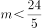，即，故或。当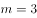时，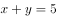，即张和陈一定有人完成项目数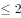，与王完成项目最少矛盾，排除；故当，此时张和李共完成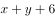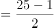个。

故正确答案为C。

---

## 第 3 题　qid 3523594 · 数学运算

在周长为300米的环形跑道的某处，甲、乙两人分别以6米/秒，3米/秒的速度同时同向出发，沿跑道奔跑，甲每次追上乙后都减速0.5米/秒，直至他们两人的速度相同，问在他们出发后的30分钟内，甲和乙以相同速度跑过的路程为多少米？

- **A**. 990　✅
- **B**. 1080
- **C**. 1530
- **D**. 1800

**答案**：A

**官方解析**

根据环形跑道上从同一点出发同向而行，每追上一次则多跑一圈。甲每次追上乙后都减速0.5米/秒，当甲从6米/秒减少到3米/秒时，根据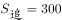，则甲每次追上所用的时间如下：

综上所述，当甲和乙速度相同时，共用了秒，此后，甲和乙以3米/秒的速度共同跑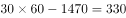秒，则共同跑过的路程为米。

故正确答案为A。

---

## 第 4 题　qid 3523595 · 数学运算

一块长方形土地ABCD中绘有3条会侧线如图所示。已知AE和CF垂直于对角线BD，AE、EF分别长8米和12米。问整块土地的面积为多少平方米？

- **A**. 96
- **B**. 156
- **C**. 160　✅
- **D**. 240

**答案**：C

**官方解析**

因四边形ABCD是长方形，，则。直角与直角全等，则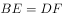。设BE、DF的长度均为米，则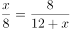，解得。则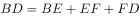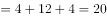米，故整块土地的面积平方米。

故正确答案为C。

---

## 第 5 题　qid 3523596 · 数学运算

一块实验田被划分为36小块，每小块上种植3种不同的植物，任意两小块上种植的植物种类均不完全相同，问至少种植了多少种不同的植物？

- **A**. 7
- **B**. 8　✅
- **C**. 9
- **D**. 10

**答案**：B

**官方解析**

由题意，设种植了种不同的植物，要满足“任意两小块上种植的植物种类均不完全相同”则。代入A项，一共有种组合，小于36，不符合要求，排除。代入B项，一共有种组合，大于36，符合要求，当选。

故正确答案为B。

---

## 第 6 题　qid 3523597 · 数学运算

甲、乙、丙、丁四个车间生产相同的产品，生产效率之比为4：3：2：1，产品不合格率分别为、、、。质检人员从这4个车间某小时内生产的所有产品中随机抽取1件，发现该产品不合格，该产品是乙车间生产的概率为：

- **A**. 

　✅
- **B**. 

- **C**. 

- **D**. 

**答案**：A

**官方解析**

根据四个车间生产效率之比为4：3：2：1，赋值甲、乙、丙、丁四个车间每小时分别生产400个、300个、200个、100个零件。则1小时内甲生产的不合格产品为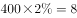个，乙生产的不合格产品为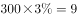个，丙生产的不合格产品为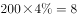个，丁生产的不合格产品为个。因此不合格产品是乙车间生产的概率。

故正确答案为A。

---

## 第 7 题　qid 3523598 · 数学运算

某工程队计划每天修路560米，恰好可按期完成任务。如每天比计划多修80米，则可以提前2天完成，且最后1天只需修320米。问如果要提前6天完成，每天要比计划多修多少米？

- **A**. 160
- **B**. 240　✅
- **C**. 320
- **D**. 400

**答案**：B

**官方解析**

设原计划完成任务需要天，根据题意可得，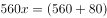，解得，则工程总量米。如果要提前6天完成，则需要天，每天需修米，则每天比计划多修米。

故正确答案为B。

---

## 第 8 题　qid 3523599 · 数学运算

商店采购了一种水果，第一天在进货成本基础上加价销售，从第二天开始，每天的销售价格都比前一天低。已知第三天这种水果的售价比第一天降低了13.3元/千克。问这种水果的进货成本为多少元/千克？

- **A**. 35
- **B**. 40
- **C**. 45
- **D**. 50　✅

**答案**：D

**官方解析**

设这种水果的进货成本为元/千克，则第一天的售价，第三天的售价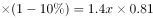。根据“第三天这种水果的售价比第一天降低了13.3元/千克”，可得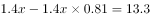，化简得，解得，即这种水果的进货成本为50元/千克。

故正确答案为D。

---

## 第 9 题　qid 3523600 · 数学运算

下图是长为厘米，宽、高均为厘米的长方体。一只蚂蚁以厘米/秒的速度沿如图所示的路径由A点爬行到B点后，又沿棱BA爬回A点。问其全程用时最短可能为多少秒？

- **A**. 

- **B**. 

　✅
- **C**. 
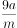

- **D**. 
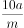

**答案**：B

**官方解析**

根据题意，把蚂蚁所爬路径展开到一个平面上，如下图所示（A’和B’为A、B展开后的对应点）

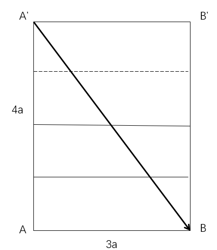

若用时最短，则需蚂蚁爬过的路径最短，即蚂蚁沿A’走直线到B，再从B到A，由题干可知，AA’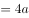，AB，根据勾股定理：A’B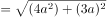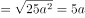。则蚂蚁爬过的全部路径SA’BBA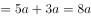，所求时间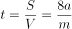秒。

故正确答案为B。

---

## 第 10 题　qid 3523601 · 数学运算

从正九边形的顶点中任选3个作为顶点绘制三角形，问其中等腰三角形占全部可画出三角形的比例在以下哪个范围内?

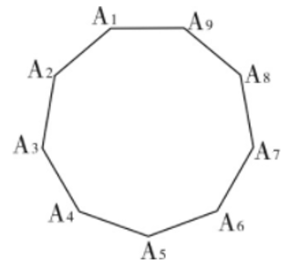

- **A**. 
低于

- **B**. 
在到之间

- **C**. 
在到之间
　✅
- **D**. 
高于

**答案**：C

**官方解析**

观察图形发现，可将任意一点作为等腰三角形的顶点，关于其对称的两个点都能和该点组成等腰三角形。如以为顶点，则有等腰三角形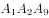、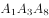、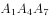、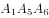共4个，同理，其他的8个顶点能组成的等腰三角形也是4个，则一共有等腰三角形个，但这其中等边三角形、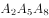、，均算了3次，则去重后的等腰三角形个数为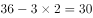。全部可画出的三角形个数为：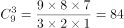。代入公式：，在到之间。

故正确答案为C。

---
