# 2021年国家公务员录用考试《行测》题（副省级网友回忆版）

> 数量关系 · 15 题 · 国考 2021

## 第 1 题　qid 2719398 · 数学运算

某商场开展“助农销售”活动，凡购买某种农产品满300元者可获得一个礼盒，其中装有6种干货中的随机3种各1小袋，以及1袋小米或红豆。问内容不完全相同的礼盒共有多少种可能？

- **A**. 50
- **B**. 45
- **C**. 40　✅
- **D**. 30

**答案**：C

**官方解析**

根据题目条件，从6种干货中随机选出3种，有种情况，外加1袋小米或红豆，有2种情况，则内容不完全相同的礼盒共有种可能。

故正确答案为C。

---

## 第 2 题　qid 2719468 · 数学运算

商业街物业管理处采购了一批消毒液发放给街内的复工商户，如果每个商户分6瓶，最后剩余12瓶。如果多采购，则在给每个商户分8瓶后还能剩余10瓶。如果多采购，复工商户数量增加10家，且每个商户分到的数量相同，问每个商户最多可以分多少瓶？

- **A**. 8　✅
- **B**. 9
- **C**. 10
- **D**. 12

**答案**：A

**官方解析**

设复工商户为家，采购的消毒液为瓶，根据题意“如果每个商户分6瓶，最后剩余12瓶。如果多采购，则在给每个商户分8瓶后还能剩余10瓶。”可列方程组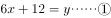，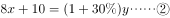，联立方程组，解得，。根据题意“如果多采购，复工商户数量增加10家，且每个商户分到的数量相同”，则有采购消毒液瓶数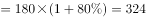瓶，复工商户数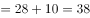家，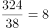瓶20瓶，要使每个商户分到的数量相同，则每个商户最多可以分8瓶。

故正确答案为A。

---

## 第 3 题　qid 2719333 · 数学运算

社区工作人员小张连续4天为独居老人采买生活必需品，已知前三天共采买65次，其中第二天采买次数比第一天多，第三天采买次数比前两天采买次数的和少15次，第四天采买次数比第一天的2倍少5次。问这4天中，小张为独居老人采买次数最多和最少的日子，单日采买次数相差多少次？

- **A**. 9
- **B**. 10
- **C**. 11　✅
- **D**. 12

**答案**：C

**官方解析**

设第一天采买的次数为，则第二天采买的次数为，第三天采买的次数为，第四天采买的次数为，已知前三天共采买65次，则有，解得，则这4天采买的次数分别为16次（）、24次（）、25次（）、27次（），所以这4天中单日采买次数最多为27次，最少为16次，相差次。

故正确答案为C。

---

## 第 4 题　qid 2719469 · 数学运算

某企业将一批防疫物资赠送给“一带一路”沿线国家的若干家医院。如果向每家医院赠送10箱口罩和7箱防护服，则剩余的口罩比防护服多20箱。如果向每家医院赠送12箱口罩和8箱防护服，则还缺8箱口罩和11箱防护服。如该企业决定额外采购物资，口罩和防护服按2：1的比例向每家医院捐赠相同数量的物资，且捐完后没有剩余，问口罩和防护服总计至少还要采购多少箱？

- **A**. 54
- **B**. 63
- **C**. 75
- **D**. 87　✅

**答案**：D

**官方解析**

设一共有家医院，根据条件“如果向每家医院赠送12箱口罩和8箱防护服，则还缺8箱口罩和11箱防护服。”可知，这批物资原有（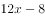）箱口罩和（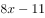）箱防护服。根据条件“如果向每家医院赠送10箱口罩和7箱防护服，则剩余的口罩比防护服多20箱。”可列式：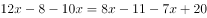，解得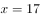，因此一共有17家医院，则这批物资原有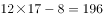箱口罩和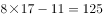箱防护服。要使得捐完后没有剩余，那么所捐的防护服应为17的整数倍，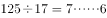，则最少还需要再购买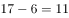箱防护服。因为口罩和防护服的比例为，所以还需要购买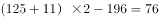箱口罩。因此口罩和防护服总计至少还要采购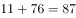箱。

故正确答案为D。

---

## 第 5 题　qid 2719470 · 数学运算

某企业参与兴办了甲、乙、丙、丁4个扶贫车间，共投资450万元，甲车间的投资额是其他三个车间投资额之和的一半，乙车间的投资额比丙车间高，丁车间的投资额比乙、丙车间投资额之和低60万元。企业后期向4个车间追加了200万元投资，每个车间的追加投资额都不超过其余任一车间追加投资额的2倍，问总投资额最高和最低的车间，总投资额最多可能相差多少万元？

- **A**. 70
- **B**. 90
- **C**. 110　✅
- **D**. 130

**答案**：C

**官方解析**

根据题干信息可以找到如下等量关系：

（1）根据“兴办了甲、乙、丙、丁4个扶贫车间，共投资450万元”，可以得到：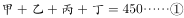；

（2）根据“甲车间的投资额是其他三个车间投资额之和的一半”，可以得到：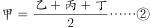；

（3）根据“乙车间的投资额比丙车间高”，可以得到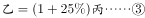；

（4）根据“丁车间的投资额比乙、丙车间投资额之和低60万元”，可以得到：。

联立上述四个方程可解得：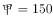万元，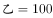万元，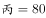万元，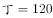万元。即甲车间初期投资最大，丙车间初期投资最小。

设追加投资最小的车间追加投资额为，因为“每个车间的追加投资额都不超过其余任一车间追加投资额的2倍”，则追加投资最多的车间投资额为。要想使追加的投资额最大，那么其余车间的追加投资尽可能小，所以其他两个车间的追加投资同样为，根据“企业后期向4个车间追加了200万元投资”可得：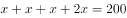，解得万元，所以追加投资最小的车间追加了40万元，追加投资最大的车间追加了80万元。要想使总投资额最高和最低车间的总投资额相差最多，则甲车间追加80万元，共投资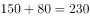万元；丙车间追加40万元，共投资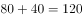万元；二者相差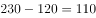万元。

故正确答案为C。

---

## 第 6 题　qid 2719341 · 数学运算

甲、乙两个单位周末分别安排和的职工下沉社区帮助困难群众，其中甲单位派出的职工比乙单位少3人，后两单位又在剩下的职工中，分别抽调和的职工，共计24人参加周末的业务培训，问甲单位职工人数比乙单位：

- **A**. 少三人
- **B**. 少十一人
- **C**. 多三人
- **D**. 多十一人　✅

**答案**：D

**官方解析**

设甲单位职工人数为人，乙单位职工人数为人，根据“甲、乙两个单位周末分别安排和的职工下沉社区帮助困难群众，其中甲单位派出的职工比乙单位少3人”，可列方程①：；根据“两单位又在剩下的职工中，分别抽调和的职工，共计24人”，可列方程②：，联立方程①和②，解得：，，因此甲单位的职工人数比乙单位多人。

故正确答案为D。

---

## 第 7 题　qid 2719319 · 数学运算

某县通过网络直播帮助本地农民销售农副产品，总共直播6次，其中第2次直播销售额比第1次高，比第3次低。直播3次后电视台报道了这一新闻，此后销量大幅提升，后3次直播总销售额是前3次总销售额的3倍。其中第5次直播销售额相当于6次直播总销售额的，且比第4次直播高，比第6次直播少16万元，问第6次直播的销售额比第3次直播高：

- **A**. 不到100万元
- **B**. 100~120万元之间
- **C**. 140万元以上
- **D**. 120~140万元之间　✅

**答案**：D

**官方解析**

设第2次直播销售额为万元，则第1次销售额为万元，第3次销售额为万元，故前三次直播总销售额为万元，可知后三次直播总销售额为万元，第5次销售额为万元，则第4次销售额为万元，第6次销售额为万元，根据题意可列关系式为：，解得，则第6次销售额比第3次销售额高万元。

故正确答案为D。

---

## 第 8 题　qid 2719400 · 数学运算

某地10户贫困农户共申请扶贫小额信贷25万元。已知每人申请金额都是1000元的整数倍，申请金额最高的农户申请金额不超过申请金额最低农户的2倍，且任意2户农户的申请金额都不相同。问申请金额最低的农户最少可能申请多少万元信贷？

- **A**. 1.5
- **B**. 1.6　✅
- **C**. 1.7
- **D**. 1.8

**答案**：B

**官方解析**

设申请金额最低的农户申请万元，已知10户贫困农户共申请25万元，要使金额最低的农户申请的金额最少，则令其他农户申请的金额尽可能多。题目中已知申请金额最高的农户申请金额不超过申请金额最低农户的2倍，即最高申请万元，且任意2户农户的申请金额都不相同，同时每人的申请金额都是1000元（0.1万元）的整数倍，则根据这些条件可构造出下表：

则，即，解得，由于每人的申请金额都是1000元（0.1万元）的整数倍，则最少为1.6万元。

故正确答案为B。

---

## 第 9 题　qid 2719297 · 数学运算

某村居民整体进行搬迁移民，现安排载客（不含司机）20人/辆的中巴车和30人/辆的大巴车运载所有村民到搬迁地实地考察。如安排12辆中巴车，则大巴车需要18辆，且除一辆大巴车载6人以外，其他车全部载满。现本着安排车辆数最少的原则派车，问最少要安排多少辆大巴车？

- **A**. 20
- **B**. 22
- **C**. 24　✅
- **D**. 26

**答案**：C

**官方解析**

根据题意可得，村民总人数为人。总人数一定，要使车辆数最少，则应让单次运载人数多的大巴车运载更多，辆······人，即大巴车满载25辆时剩余6人。还要使大巴车辆数最少，将运载方案枚举如下：

······

综上可得，本着车辆数最少的原则派车，最少要安排24辆大巴车。

故正确答案为C。

---

## 第 10 题　qid 2719320 · 数学运算

在一块下图所示的梯形土地中种植某种产量为1.2千克/平方米的作物。已知该梯形的高为100米，ABC、BCD、和CDE为正三角形，且BAF和DEG的角度都是90度，问该土地的总产量为多少吨？

- **A**. 

- **B**. 

　✅
- **C**. 

- **D**. 

**答案**：B

**官方解析**

如图，在中，过点B做垂线相交AC于点M，则BM为正三角形ABC的高同时也为梯形的高，故米，根据为直角三角形，且，则，故可得米；则米；根据题干分析可得：，则中，故可得米，同理可得米；故该梯形上底米，下底米，则平方米，该土地产量千克吨。

故正确答案为B。

---

## 第 11 题　qid 2719380 · 数学运算

某企业选拔170多名优秀人才平均分配为7组参加培训。在选拔出的人才中，党员人数比非党员多3倍。接受培训的党员中的在培训结束后被随机派往甲单位等12个基层单位进一步锻炼。已知每个基层单位至少分配1人，问甲单位分配人数多于1的概率在以下哪个范围内？

- **A**. 
不到

- **B**. 
之间
　✅
- **C**. 
之间

- **D**. 
超过

**答案**：B

**官方解析**

由“选拔170多名优秀人才平均分配为7组”，说明优秀人才人数为7的倍数，170多，只能是175人，因此平均分7组，每组25人；又根据“党员人数比非党员多3倍”，可以得到，因此党员人数人，又因为接受培训的党员中的被分配到12个基层单位，被分配的党员人数为。

由于本题涉及的是人数，相当于进行名额分配。把14个名额分到12个单位，根据插板法，情况数有种。由于每个单位至少分配1人，则甲分配名额情况可以分为“分配人数多于1人”和“分配人数为1人”两种。所求为甲单位分配人数多于1人：

方法一：正向考虑，（1）甲分配2人，剩余12人，11个单位至少分配1人，有种；（2）甲分配3人，剩余11人，11个单位至少分配1人，有种；甲单位分配人数多于1的情况共有种，因此，根据概率公式，所求概率为。

方法二：从反面考虑，计算甲只分配1人的情况，相当于剩余13个名额分配给11个单位，情况数为种，则满足甲多于1人的情况数为种，因此，根据概率公式，所求概率为。

故正确答案为B。

---

## 第 12 题　qid 2719471 · 数学运算

某单位为定点帮扶村捐建一个乡村图书馆。已知完工时基建支出为总预算的，图书购买支出比基建支出低，比信息化支出高，其他支出之和为4.5万元，最终项目的总支出比总预算结余了3000元。已知图书来源为购买和捐赠，平均每购买1本图书的支出为25元，且购买的图书比接受外来捐赠的图书多。问该乡村图书馆最终拥有的图书数量在以下哪个范围内？

- **A**. 不到1.1万本
- **B**. 1.1～1.4万本之间
- **C**. 1.4～1.7万本之间
- **D**. 超过1.7万本　✅

**答案**：D

**官方解析**

根据题干信息：基建支出为总预算的，图书购买支出比基建支出低，故图书支出为总预算的：，图书购买支出比信息化支出高，故信息化支出为总预算的：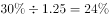；根据最终项目的总支出比总预算结余了3000元，即总支出比总预算少了0.3万元。设总预算为万元，可列方程为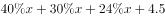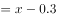，解出，故图书支出为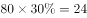万元，购买图书为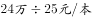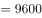本，购买的图书比接受外来捐赠的图书多，故捐赠图书为本，总计购买图书捐赠图书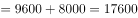本。

故正确答案为D。

备注：结余属于会计术语，表示在一定期间各项收入与支出结算之后剩余的数额，本题中指总预算与总支出结算之后的余额。

---

## 第 13 题　qid 2719306 · 数学运算

某地调派96人分赴车站、机场、超市和学校四个人流密集的区域进行卫生安全检查，其中公共卫生专业人员有62人。已知派往机场的人员是四个区域中最多的，派往车站和超市的人员中，专业人员分别占和，派往学校的人员中，非专业人员比专业人员少，问派往机场的人员中，专业人员的占比在四个区域中排名

- **A**. 第一　✅
- **B**. 第二
- **C**. 第三
- **D**. 第四

**答案**：A

**官方解析**

根据题意可知，，即派往车站的总人数是25的倍数；，即派往超市的总人数是20的倍数；派往学校的非专业人员比专业人员少，即，则派往学校的总人数是的倍数，专业人员占比。由于派往机场的人数最多，则车站只能派25人，其中专业人员16人；超市只能派20人，其中专业人员13人；学校只能派17人，其中专业人员10人。由此可得：派往机场人数人，其中专业人员数人。故派往机场的专业人数占比，排名第一。

故正确答案为A。

---

## 第 14 题　qid 2719472 · 数学运算

一个人工湖的湖面上有一个露出水面3米的圆锥体人工景观（底面朝下）。如人工湖水深减少，则该景观露出水面部分的体积将增加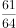。问原来的人工湖水深为多少米？

- **A**. 3.5
- **B**. 3.75　✅
- **C**. 4.25
- **D**. 4.5

**答案**：B

**官方解析**

赋值原露出水面的圆锥体人工景观体积为64，则人工湖水深减少后，露出水面的体积变为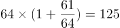。根据定理“在立体图形中，体积之比等于相似比的立方”，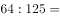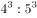，故人工景观露出水面的高度之比为4：5。原露出水面的高度为3米，水深减少后高度为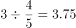米。水深减少对应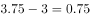米，则原人工湖的水深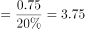米。

故正确答案为B。

---

## 第 15 题　qid 2719473 · 数学运算

某商业街复工复产之后，向消费者发放满50元减10元、满100元减30元的电子优惠券各若干张，并规定消费者在商户处完成交易并核销电子优惠券后，商户可以免除等同于核销优惠券减免金额的店面租金。促销期内，商户共核销优惠券15.6万张，通过核销优惠券方式减免租金219万元。问该次促销中，消费者实际支付金额可能的最低值在以下哪个范围内？

- **A**. 不到750万元
- **B**. 750～800万元之间
- **C**. 800～850万元之间　✅
- **D**. 超过850万元

**答案**：C

**官方解析**

设满50元减10元、满100元减30元的电子优惠券分别为、万张，根据 “共核销优惠券15.6万张”和“通过核销优惠券方式减免租金219万元”可列等式：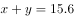万①；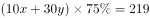万②；联立方程组，解得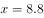，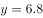；要求实际支付金额最低，当消费金额恰好达到可用优惠券金额时，实际支付最少，即满50元减10元，实际最少支付元，满100元减30元，最少支付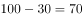元，故总实际支付最少金额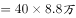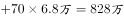，在800～850万元之间。

故正确答案为C。

---
