# 2021年国家公务员录用考试《行测》题（地市级网友回忆版）

> 数量关系 · 10 题 · 国考 2021

## 第 1 题　qid 2719398 · 数学运算

某商场开展“助农销售”活动，凡购买某种农产品满300元者可获得一个礼盒，其中装有6种干货中的随机3种各1小袋，以及1袋小米或红豆。问内容不完全相同的礼盒共有多少种可能？

- **A**. 50
- **B**. 45
- **C**. 40　✅
- **D**. 30

**答案**：C

**官方解析**

根据题目条件，从6种干货中随机选出3种，有种情况，外加1袋小米或红豆，有2种情况，则内容不完全相同的礼盒共有种可能。

故正确答案为C。

---

## 第 2 题　qid 2719400 · 数学运算

某地10户贫困农户共申请扶贫小额信贷25万元。已知每人申请金额都是1000元的整数倍，申请金额最高的农户申请金额不超过申请金额最低农户的2倍，且任意2户农户的申请金额都不相同。问申请金额最低的农户最少可能申请多少万元信贷？

- **A**. 1.5
- **B**. 1.6　✅
- **C**. 1.7
- **D**. 1.8

**答案**：B

**官方解析**

设申请金额最低的农户申请万元，已知10户贫困农户共申请25万元，要使金额最低的农户申请的金额最少，则令其他农户申请的金额尽可能多。题目中已知申请金额最高的农户申请金额不超过申请金额最低农户的2倍，即最高申请万元，且任意2户农户的申请金额都不相同，同时每人的申请金额都是1000元（0.1万元）的整数倍，则根据这些条件可构造出下表：

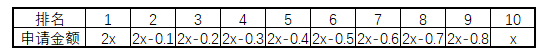

则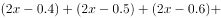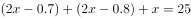，即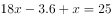，解得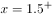，由于每人的申请金额都是1000元（0.1万元）的整数倍，则最少为1.6万元。

故正确答案为B。

---

## 第 3 题　qid 2719333 · 数学运算

社区工作人员小张连续4天为独居老人采买生活必需品，已知前三天共采买65次，其中第二天采买次数比第一天多，第三天采买次数比前两天采买次数的和少15次，第四天采买次数比第一天的2倍少5次。问这4天中，小张为独居老人采买次数最多和最少的日子，单日采买次数相差多少次？

- **A**. 9
- **B**. 10
- **C**. 11　✅
- **D**. 12

**答案**：C

**官方解析**

设第一天采买的次数为，则第二天采买的次数为，第三天采买的次数为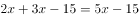，第四天采买的次数为，已知前三天共采买65次，则有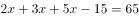，解得，则这4天采买的次数分别为16次（）、24次（）、25次（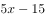）、27次（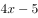），所以这4天中单日采买次数最多为27次，最少为16次，相差次。

故正确答案为C。

---

## 第 4 题　qid 2719341 · 数学运算

甲、乙两个单位周末分别安排和的职工下沉社区帮助困难群众，其中甲单位派出的职工比乙单位少3人，后两单位又在剩下的职工中，分别抽调和的职工，共计24人参加周末的业务培训，问甲单位职工人数比乙单位：

- **A**. 少三人
- **B**. 少十一人
- **C**. 多三人
- **D**. 多十一人　✅

**答案**：D

**官方解析**

设甲单位职工人数为人，乙单位职工人数为人，根据“甲、乙两个单位周末分别安排和的职工下沉社区帮助困难群众，其中甲单位派出的职工比乙单位少3人”，可列方程①：；根据“两单位又在剩下的职工中，分别抽调和的职工，共计24人”，可列方程②：，联立方程①和②，解得：，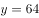，因此甲单位的职工人数比乙单位多人。

故正确答案为D。

---

## 第 5 题　qid 2719380 · 数学运算

某企业选拔170多名优秀人才平均分配为7组参加培训。在选拔出的人才中，党员人数比非党员多3倍。接受培训的党员中的在培训结束后被随机派往甲单位等12个基层单位进一步锻炼。已知每个基层单位至少分配1人，问甲单位分配人数多于1的概率在以下哪个范围内？

- **A**. 
不到

- **B**. 
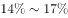之间
　✅
- **C**. 
之间

- **D**. 
超过

**答案**：B

**官方解析**

由“选拔170多名优秀人才平均分配为7组”，说明优秀人才人数为7的倍数，170多，只能是175人，因此平均分7组，每组25人；又根据“党员人数比非党员多3倍”，可以得到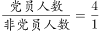，因此党员人数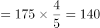人，又因为接受培训的党员中的被分配到12个基层单位，被分配的党员人数为。

由于本题涉及的是人数，相当于进行名额分配。把14个名额分到12个单位，根据插板法，情况数有种。由于每个单位至少分配1人，则甲分配名额情况可以分为“分配人数多于1人”和“分配人数为1人”两种。所求为甲单位分配人数多于1人：

方法一：正向考虑，（1）甲分配2人，剩余12人，11个单位至少分配1人，有种；（2）甲分配3人，剩余11人，11个单位至少分配1人，有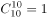种；甲单位分配人数多于1的情况共有种，因此，根据概率公式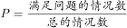，所求概率为。

方法二：从反面考虑，计算甲只分配1人的情况，相当于剩余13个名额分配给11个单位，情况数为种，则满足甲多于1人的情况数为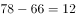种，因此，根据概率公式，所求概率为。

故正确答案为B。

---

## 第 6 题　qid 2719306 · 数学运算

某地调派96人分赴车站、机场、超市和学校四个人流密集的区域进行卫生安全检查，其中公共卫生专业人员有62人。已知派往机场的人员是四个区域中最多的，派往车站和超市的人员中，专业人员分别占和，派往学校的人员中，非专业人员比专业人员少，问派往机场的人员中，专业人员的占比在四个区域中排名

- **A**. 第一　✅
- **B**. 第二
- **C**. 第三
- **D**. 第四

**答案**：A

**官方解析**

根据题意可知，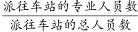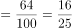，即派往车站的总人数是25的倍数；，即派往超市的总人数是20的倍数；派往学校的非专业人员比专业人员少，即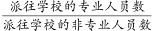，则派往学校的总人数是的倍数，专业人员占比。由于派往机场的人数最多，则车站只能派25人，其中专业人员16人；超市只能派20人，其中专业人员13人；学校只能派17人，其中专业人员10人。由此可得：派往机场人数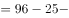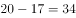人，其中专业人员数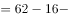人。故派往机场的专业人数占比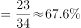，排名第一。

故正确答案为A。

---

## 第 7 题　qid 2719319 · 数学运算

某县通过网络直播帮助本地农民销售农副产品，总共直播6次，其中第2次直播销售额比第1次高，比第3次低。直播3次后电视台报道了这一新闻，此后销量大幅提升，后3次直播总销售额是前3次总销售额的3倍。其中第5次直播销售额相当于6次直播总销售额的，且比第4次直播高，比第6次直播少16万元，问第6次直播的销售额比第3次直播高：

- **A**. 不到100万元
- **B**. 100~120万元之间
- **C**. 140万元以上
- **D**. 120~140万元之间　✅

**答案**：D

**官方解析**

设第2次直播销售额为万元，则第1次销售额为万元，第3次销售额为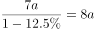万元，故前三次直播总销售额为万元，可知后三次直播总销售额为万元，第5次销售额为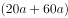万元，则第4次销售额为万元，第6次销售额为万元，根据题意可列关系式为：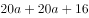，解得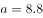，则第6次销售额比第3次销售额高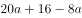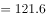万元。

故正确答案为D。

---

## 第 8 题　qid 2719297 · 数学运算

某村居民整体进行搬迁移民，现安排载客（不含司机）20人/辆的中巴车和30人/辆的大巴车运载所有村民到搬迁地实地考察。如安排12辆中巴车，则大巴车需要18辆，且除一辆大巴车载6人以外，其他车全部载满。现本着安排车辆数最少的原则派车，问最少要安排多少辆大巴车？

- **A**. 20
- **B**. 22
- **C**. 24　✅
- **D**. 26

**答案**：C

**官方解析**

根据题意可得，村民总人数为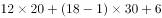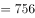人。总人数一定，要使车辆数最少，则应让单次运载人数多的大巴车运载更多，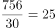辆······人，即大巴车满载25辆时剩余6人。还要使大巴车辆数最少，将运载方案枚举如下：

······

综上可得，本着车辆数最少的原则派车，最少要安排24辆大巴车。

故正确答案为C。

---

## 第 9 题　qid 2719320 · 数学运算

在一块下图所示的梯形土地中种植某种产量为1.2千克/平方米的作物。已知该梯形的高为100米，ABC、BCD、和CDE为正三角形，且BAF和DEG的角度都是90度，问该土地的总产量为多少吨？

- **A**. 

- **B**. 
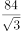
　✅
- **C**. 
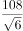

- **D**. 
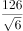

**答案**：B

**官方解析**

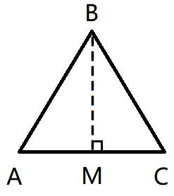

如图，在中，过点B做垂线相交AC于点M，则BM为正三角形ABC的高同时也为梯形的高，故米，根据为直角三角形，且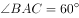，则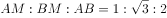，故可得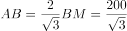米；则米；根据题干分析可得：，则中，故可得米，同理可得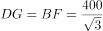米；故该梯形上底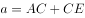米，下底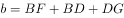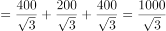米，则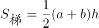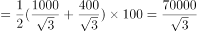平方米，该土地产量千克吨。

故正确答案为B。

---

## 第 10 题　qid 2719325 · 数学运算

某工厂在做好防疫工作的前提下全面复工复产，复工后第1天的产能即恢复到停工前日产能的，复工后每生产4天，日产能都会比前4天的水平提高1000件/日。已知复工80天后，总产量相当于停工前88天的产量，问复工后的总产量达到100万件是在复工后的第几天？

- **A**. 56　✅
- **B**. 54
- **C**. 60
- **D**. 58

**答案**：A

**官方解析**

假设停工前日产能为，则复工第1天的产能为，因为复工后每生产4日，日产能比前4天水平提高1000件/日，如果以4天为一周期，则第一个周期生产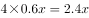，第二个周期生产，由此构成等差数列，第个周期为，公差为4000。则复工80天为周期，第20项为，由此列出等式：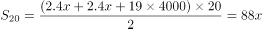，解得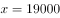。则第一个周期产能为。由于无法确定总产量达到100万件是在复工后的第几个周期，可利用代入法：

A项：56天是在第14个周期结束当日，则万，第56天当天产量件，万，即生产55天，不能生产到100万件，因此为满足达到100万件，需工作56天。

故正确答案为A。

---
