# 2021年天津市公务员考试《行测》题（网友回忆版）

> 数量关系 · 10 题 · 天津 2021

## 第 1 题　qid 3522371 · 数学运算

不超过100名的小朋友站成一列。如果从第一人开始依次按1，2，3，···，9的顺序循环报数，最后一名小朋友报的是7；如果按1，2，3，···，11的顺序循环报数，最后一名小朋友报的是9，那么一共有多少名小朋友？

- **A**. 98
- **B**. 97　✅
- **C**. 96
- **D**. 95

**答案**：B

**官方解析**

根据题意，总人数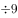余7、总人数余9，代入排除：

A项，余8，不满足题意，排除；B项，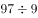余7，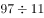余9，满足题意，当选；C项，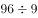余6，不满足题意，排除；D项，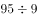余5，不满足题意，排除。所以只有B项满足，则共有97名小朋友。

故正确答案为B。

---

## 第 2 题　qid 3522354 · 数学运算

小明去某楼盘售楼部咨询售房情况。置业顾问告诉他，如果再卖出50套，则已卖出的数量与未卖出的数量相等；如果再卖出150套，则已卖出的数量比未卖出的数量多一半，问该楼盘目前还剩下多少套房子未卖出？

- **A**. 350套
- **B**. 450套
- **C**. 550套　✅
- **D**. 650套

**答案**：C

**官方解析**

设目前已卖、未卖分别为、套，根据题意列方程组：

······①

······②

联立①②求解可得，，即目前还剩下550套房子未卖出。

故正确答案为C。

---

## 第 3 题　qid 3522770 · 数学运算

某公园鸟语林共饲养180只鸟类动物，为养护方便，园方将鸟语林分为A、B、C三个区。某日，A区的一部分鸟飞至B、C两区，清点时，B、C两区鸟的数量都增加一倍。次日，一些鸟又从B区飞至A、C两区，清点时，A、C两区鸟的数量也都增加一倍。第三日，一部分鸟又从C区飞至A、B两区，清点时，A、B两区鸟的数量同样增加一倍，而此时C区剩余鸟的数量恰好是A区的，那么，最初A区有多少只鸟？

- **A**. 103　✅
- **B**. 104
- **C**. 105
- **D**. 106

**答案**：A

**官方解析**

将三次鸟的变化情况列表如下：

根据第三次后，C区剩余鸟的数量恰好是A区的，说明A区现在鸟的数量必然为26的整数倍。代入A项：最初A区有103只，则只，第一次后只，则A区剩余只，第三次后也是26的倍数，符合题意，当选。其余选项均不满足。

故正确答案为A。

---

## 第 4 题　qid 3522397 · 数学运算

某果品公司急需将一批不易存放的水果从A市运到B市销售。现有四家运输公司可供选择，这四家运输公司提供的信息如下：

如果A、B两市的距离为S千米（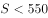千米），且这批水果在包装与装卸以及运输过程中的损耗为300元/小时，那么要使果品公司支付的总费用（包装与装卸费用、运输费用及损耗三项之和）最小，应选择哪家运输公司？

- **A**. 甲
- **B**. 乙
- **C**. 丙　✅
- **D**. 丁

**答案**：C

**官方解析**

根据运输时间，各公司运输费用情况如下：

甲公司与丁公司总运费相同，因此二者均不可能为最小，排除A、D两项，丙公司总费用小于乙公司，可知丙公司总费用最小。

故正确答案为C。

---

## 第 5 题　qid 3522382 · 数学运算

某公司职员小王要乘坐公司班车上班，班车到站点的时间为上午7点到8点之间，班车接人后立刻开走；小王到站点的时间为上午6点半至7点半之间。假设班车和小王到站的概率是相等（均匀分布）的，那么小王能够坐上班车的概率为：

- **A**. 

- **B**. 

- **C**. 

- **D**. 

　✅

**答案**：D

**官方解析**

设小王到的时间为，班车到的时间为，则只有当，小王能够坐上班车。即直线、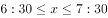、围成的区域；如下图所示，只有在阴影部分区域小王能够坐上班车，本题所求概率即求阴影部分面积占整个图形ABCD面积的比例。由图可得，假设边长为1，则面积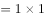，空白部分为一个等腰直角三角形，面积为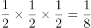，则阴影部分面积，占总面积的。

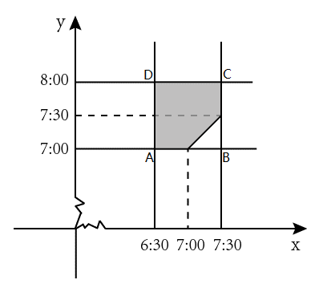

故正确答案为D。

---

## 第 6 题　qid 3522392 · 数学运算

某商场为了促销，进行掷飞镖游戏。每位参与人员投掷一次，假设掷出的飞镖均扎在飞镖板上且位置完全随机，扎中阴影部分区域（含边线）即为中奖。该商场预设中奖概率约为，仅考虑中奖概率的前提下，以下四幅图形（图中的正三角形和正方形均与圆外切或内接）最适合作为飞镖板的是：

- **A**. 
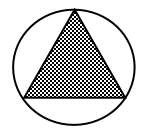

- **B**. 

　✅
- **C**. 
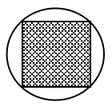

- **D**. 

**答案**：B

**官方解析**

最适合作为飞镖板即阴影部分所占面积比例约为，故需分别求出四个选项阴影所占面积比例。

A项，赋值圆半径为1，则，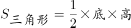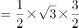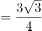，阴影面积所占比例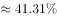（，）；

B项，赋值圆半径为1，则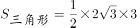，，阴影面积所占比例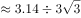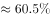；

C项，赋值圆半径为1，则，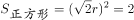，阴影面积所占比例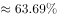；

D项，赋值圆半径为1，，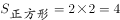，阴影面积所占比例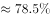。

B选项最接近。

故正确答案为B。

---

## 第 7 题　qid 3522375 · 数学运算

某装修公司订购了一条长为2.5m的长方体条形不锈钢管，要剪裁成60cm和43cm长的两种规格长度不锈钢管若干根，所裁钢管的横截面与原来一样，不考虑剪裁时材料的损耗，要使剩下的钢管尽量少，此时材料的利用率为：

- **A**. 0.998
- **B**. 0.996　✅
- **C**. 0.928
- **D**. 0.824

**答案**：B

**官方解析**

设剪裁成60cm的不锈钢管根，剪裁成43cm的不锈钢管根，根据题意，长方体条形不锈钢管长为2.5m，单位统一为250cm，即：；

当时，解得，cm，剩cm；

当时，解得，cm，剩cm；

当时，解得，cm，剩cm。

由此可知剩下的钢管最少为1cm，利用率。

故正确答案为B。

---

## 第 8 题　qid 3522412 · 数学运算

大江两岸有两个正面相对的码头，可供客轮往返。如下图所示，根据河流水文情况，“幸福号”客轮星期一沿着河岸60度夹角方向前行，刚好达到对岸码头；星期二“幸福号”准备返回时，发现河流水文情况发生变化，船长调整航向，沿河岸30度夹角方向返回，顺利到达码头。假设客轮往返速度均是千米/小时，且行驶过程中河水流速是恒定的，问返程时河水流速是去程时的多少倍？

- **A**. 

　✅
- **B**. 
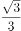

- **C**. 

- **D**. 
2

**答案**：A

**官方解析**

由题干可知船最终都是到达正对岸，说明船速与水速的合成速度的方向均在虚线上。假设去程的水速为千米/小时，去程时间为小时；返程的水速为 千米/小时，返程时间为小时。如图所示，由题干可推出，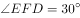，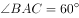。根据直角三角形EFD的三边关系则有：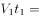，化简得，；同理在直角三角形ABC中，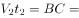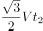，化简得，。则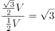倍。

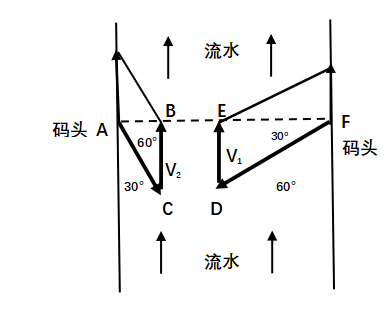

故正确答案为A。

---

## 第 9 题　qid 3522777 · 数学运算

一辆垃圾转运车和一辆小汽车在一段狭窄的道路上相遇，必须其中一车倒车让道才能通过，已知小汽车倒车的距离是转运车的9倍，小汽车的正常行驶速度是转运车的3倍，如果小汽车倒车速度是其正常速度的六分之一，垃圾转运车倒车速度是正常速度的五分之一，问应该由哪辆车倒车才能够使两车尽快都通过？

- **A**. 小汽车
- **B**. 垃圾转运车　✅
- **C**. 两车均可
- **D**. 无法计算

**答案**：B

**官方解析**

赋值情况如下：

如果垃圾转运车先倒车，垃圾转运车的倒车时间为；此时垃圾转运车通过窄道，用时，合计时间。如果小汽车先倒车，小汽车的倒车时间为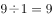；此时小汽车通过窄道，用时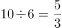，合计时间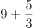。

两种方案比较，垃圾转运车倒车才能够使两车尽快都通过。

故正确答案为B。

---

## 第 10 题　qid 3522421 · 数学运算

一个不计厚度的圆柱型无盖透明塑料桶，桶高2.5分米，底面周长为24分米，AB为底面直径。在塑料桶内壁桶底的B处有一只蚊子，此时，一只壁虎正好在塑料桶外壁的A处，则壁虎从外壁A处爬到内壁B处吃到蚊子所爬过的最短路径长约为：

- **A**. 10分米
- **B**. 12.25分米
- **C**. 12.64分米　✅
- **D**. 13分米

**答案**：C

**官方解析**

本题要求表面的最短路径，可考虑两种方式。第一种可在A点沿着外壁直上直下爬入桶内部，由于不考虑桶厚度，所以壁虎依然在A点位置，此时走了分米，接下来壁虎只需沿直径从A爬到B即可，即又走了分米，此时从A到B共爬了分米。

第二种可将图形进行展开，如图所示。原图中AB为直径，则在展开图中AB的距离底面周长分米，分米。所求为最小值，延长AD，使，则，在直角三角形A&#39;AB中，分米，分米，根据勾股定理分米。

综上，第一种的距离更短，为12.64分米。

故正确答案为C。

---
