# 2021年宁夏公务员录用考试《行测》题（网友回忆版）

> 数量关系 · 10 题 · 宁夏 2021

## 第 1 题　qid 3522679 · 数学运算

某省在新冠疫情期间派出包括传染科医生、重症科医生和护士在内的三批援鄂医疗队。三批医疗队中三者人数之比分别为4：2：4、5：2：3和4：3：3。已知第二批医疗队中医生比护士多40人，且传染科医生数逐批增加并成等差数列，三批共派出护士113人，则三批医疗队共有多少人？

- **A**. 339
- **B**. 350　✅
- **C**. 360
- **D**. 390

**答案**：B

**官方解析**

根据第二批医疗队中三者人数之比为5：2：3且医生比护士多40人，可得第二批医疗队传染科医生、重症科医生和护士人数分别为人、人、人。根据“传染科医生数逐批增加并成等差数列”，设第一批传染科医生比第二批少人，则第一批和第三批传染科医生分别为（）人、（）人，传染科医生共有人。则根据三批次人数的比例关系可得： 

根据“三批共派出护士113人”列方程：，解得：。则重症科医生共有人。故三批医疗队共有人。

故正确答案为B。

---

## 第 2 题　qid 3522684 · 数学运算

工匠师傅甲擅长制作工艺品A，师傅乙擅长制作工艺品B，当有制作A任务时甲只制作A，有制作B任务时，乙只制作B。两人8周可以制作一车工艺品A，如由乙单独完成则需40周。两人60天可制作一车工艺品B，如由甲单独完成则需30周，现需要制作A、B各占一半的一车工艺品，问两位师傅共同完成需要多少天？

- **A**. 40　✅
- **B**. 45
- **C**. 50
- **D**. 55

**答案**：A

**官方解析**

设甲、乙制作A、B两种工艺品的效率分别为、、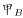、。

对工艺品A：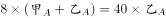，整理可得。乙单独完成一车工艺品A需要40周，半车需要20周，则甲单独完成半车工艺品A需要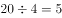周天。

对工艺品B：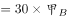，整理可得。设甲、乙每天完成工艺品B的效率分别为2、5，则半车工艺品B为，乙单独完成半车工艺品B需天天。因此，甲用35天完成半车工艺品A后再去帮助乙完成剩余的工艺品B，此时还需要天。因此总共需要天。

故正确答案为A。

---

## 第 3 题　qid 3522691 · 数学运算

某果蔬专业博士生一行8人，深入某贫困山区，为当地3个村的村民传授果树的种植技术，当年3个村的水果产量之比为3：2：5，第2年3个村的水果产量都有不低于的增加，且3村水果总产量增加，问3个村水果产量的最大增幅可能是多少？

- **A**. 

- **B**. 

- **C**. 

- **D**. 

　✅

**答案**：D

**官方解析**

结合条件中比例关系，赋值当年3个村的水果产量分别为30、20、50，当年水果总产量为，第2年水果总产量增长了。根据增幅，若想增幅最大，则该村基期值尽可能小，对应的增长量尽可能大。结合条件，第2个村的基期值最小，则让第2个村的增幅最大。此时，其他村的增长量应尽可能小，由于“第2年3个村的水果产量都有不低于的增加”，第1个村的增长量最小，第3个村的增长量最小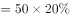，则第2个村的增长量最大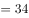，故第2个村的增幅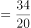。

故正确答案为D。

---

## 第 4 题　qid 3523450 · 数学运算

2020年老张的年龄是小王年龄的4倍，2021年老李的年龄是小王年龄的3倍，已知老张比老李大12岁，问哪一年三人的年龄之和第一次超过140岁？

- **A**. 2020
- **B**. 2023
- **C**. 2026
- **D**. 2029　✅

**答案**：D

**官方解析**

设2020年小王的年龄是，根据题中的年龄关系列表：

根据老张比老李大12岁可得方程，解得：。因此2020年老张，小王，老李的年龄分别为56岁，14岁，44岁。设再过年三人的年龄和超过140岁，则，解得，即9年，年。

故正确答案为D。

---

## 第 5 题　qid 3522703 · 数学运算

一个底面半径为10厘米，体积为的实心正圆锥体模具水平放置在台面上，并用一个钻孔半径为2厘米的钻头在模具上钻出一个垂直于底面的洞直达底部。那么模具剩余部分的体积至少为：

- **A**. 
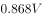

- **B**. 
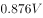

- **C**. 
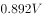

- **D**. 
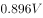
　✅

**答案**：D

**官方解析**

由题意可知，大圆锥体积剩余体积钻掉体积，要使模具剩余部分体积最少，钻头钻掉体积要最大，最大的情况为钻掉部分的高和圆锥的高相同。如切面图所示：

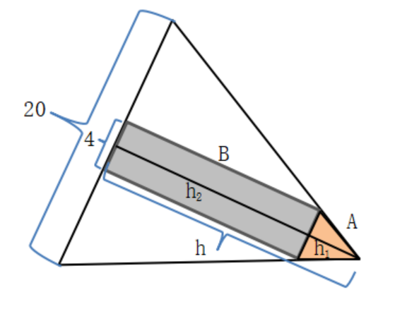

钻掉部分分为两部分：一部分是高为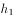厘米、底面半径为2厘米的小圆锥A，另一部分是高为厘米、半径为2厘米的圆柱B。大圆锥体积为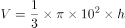，可知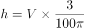。

切面图中，钻掉的小圆锥A的三角形与大圆锥的三角形相似，根据相似三角形对应边成比例的性质，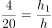，即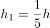，因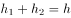，可知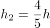；钻掉小圆锥A的体积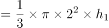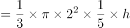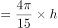；钻掉部分圆柱B的体积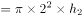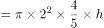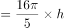。

因此，剩余部分体积大圆锥体积小圆锥体积圆柱体积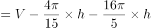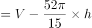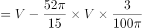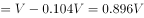。

故正确答案为D。

---

## 第 6 题　qid 3522657 · 数学运算

饲养兔子需要场地，小林准备用一段长为28米的篱笆围成一个三角形形状的场地，已知第一条边长为米，由于条件限制第二条边长只能是第一条边长度的多4米，若第一条边是唯一最短边，则的取值可以为:

- **A**. 6
- **B**. 7　✅
- **C**. 8
- **D**. 9

**答案**：B

**官方解析**

由题意可知，三角形第一条边长为米，第二条边长为（）米，第三条边长为米。根据“第一条边是唯一最短边”可知：，即，排除C、D两项；根据三角形基本性质“两边之和大于第三边”可知：，即，排除A项。

故正确答案为B。

---

## 第 7 题　qid 3523436 · 数学运算

边长为整数且成等差数列的三个正方形，面积之和不大于5000，其中有两个正方形的面积之和等于第3个正方形的面积，这样的正方形存在多少组？

- **A**. 6
- **B**. 7
- **C**. 9
- **D**. 10　✅

**答案**：D

**官方解析**

方法一：设三个正方形的边长分别为、、，则面积分别为、、；根据题干条件，，，联立方程组可得，即，；根据，可得；代入，可得，，由于为整数且不为0，故共有10组。

方法二：根据平方和等于最大数的平方，联想到满足勾股定理的整数组，勾股数。常见的勾股数只有（3，4，5）及其倍数是满足等差关系的，即，，，，解得，故共有10组。

故正确答案为D。

---

## 第 8 题　qid 3523442 · 数学运算

某直播平台为3种特色农产品直播带货3小时，第1小时B产品销售额比A产品多50万元，C产品只有B产品的；第2小时与第1小时相比：A翻倍，B增加幅度比A少，而C增加两倍；最后1小时共带货3090万元，且A产品带货额比第1小时大幅增加，B、C均比第2小时增加，问第2小时直播带货额是多少万元？

- **A**. 1580
- **B**. 1600
- **C**. 1860　✅
- **D**. 2000

**答案**：C

**官方解析**

题干给出A、B、C3种农产品在带货第1、2、3小时内销售额的关系，可设第1小时B产品销售额为万元，可得三类产品3小时内得销售额如下：

根据最后1小时共带货3090万元可得：；化简得，解得。

代入，第2小时带货额为万元。

故正确答案为C。

---

## 第 9 题　qid 3523545 · 数学运算

一个工程的实施有甲、乙、丙和丁四个工程队供选择。已知甲、乙、丙的效率比为5：4：3，如果由丁单独实施，比由甲单独实施用时长4天，比由乙单独实施用时短5天。问四个队共同实施，多少天可以完成（不足1天的部分算1天）？

- **A**. 10
- **B**. 11　✅
- **C**. 12
- **D**. 13

**答案**：B

**官方解析**

根据题意，赋值甲、乙、丙的效率分别为5、4、3；设工程总量为，根据“时间工程总量效率”，则甲、乙单独实施该工程的天数分别为、。单独实施该工程，丁比甲多4天，比乙少5天，则乙用时比甲多天，即，解得，则工程总量为，丁单独实施该工程的时间为天，则丁的效率为。四个队共同实施，需要天，不足1天的部分算1天，即共需11天。

故正确答案为B。

---

## 第 10 题　qid 3522371 · 数学运算

不超过100名的小朋友站成一列。如果从第一人开始依次按1，2，3，···，9的顺序循环报数，最后一名小朋友报的是7；如果按1，2，3，···，11的顺序循环报数，最后一名小朋友报的是9，那么一共有多少名小朋友？

- **A**. 98
- **B**. 97　✅
- **C**. 96
- **D**. 95

**答案**：B

**官方解析**

根据题意，总人数余7、总人数余9，代入排除：

A项，余8，不满足题意，排除；B项，余7，余9，满足题意，当选；C项，余6，不满足题意，排除；D项，余5，不满足题意，排除。所以只有B项满足，则共有97名小朋友。

故正确答案为B。

---
