# 2021年山东省公务员录用考试《行测》试题（网友回忆版）

> 数量关系 · 10 题 · 山东 2021

## 第 1 题　qid 2741634 · 数学运算

甲地在乙地的正东方，在丙地的正南方。甲乙之间距离为2.1千米。小张从甲地骑车直线前往丙地，回程时以相同速度直线前往乙地再直线返回甲地，回程时的路程比去程长。问甲丙之间的距离在以下哪个范围内？

- **A**. 不到5千米
- **B**. 在5~6千米之间
- **C**. 在6~7千米之间
- **D**. 超过7千米　✅

**答案**：D

**官方解析**

设去程路程甲、丙之间距离为3x千米，回程路程为丙乙甲，比去程多为4x千米，则乙、丙之间距离为4x-2.1千米，甲、乙、丙之间位置如图所示：

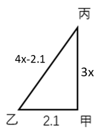

根据直角三角形勾股定理可列方程为：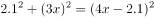，解得x=2.4，3x=7.2。

故正确答案为D。

---

## 第 2 题　qid 2741641 · 数学运算

甲、乙、丙三人投资成立一家公司，初期共投入700万元。公司估值上涨时三人进行了二期投资，甲投入了与其初期投资相同的金额，乙投入了其初期投资金额的2倍，丙投入了其初期投资金额的，二期总投入刚好也是700万元，此时甲、乙、丙三人的持股比例为5：14：16，那么初期投资乙比甲投入：

- **A**. 多100万元　✅
- **B**. 多50万元
- **C**. 少100万元
- **D**. 少50万元

**答案**：A

**官方解析**

设甲、乙、丙初期投资额分别为、、万元。根据题意可得，公司估值上涨，则甲持股金额为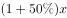，二期投资万元，此时甲持股金额为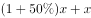，其他两人同理，可得投资金额与持股比例如下表所示：

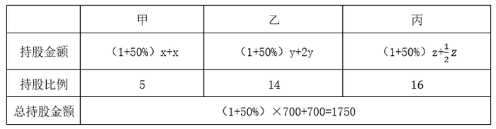

根据题意可列式：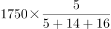，解得；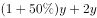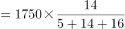，解得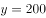，则初期乙投资额初期甲投资额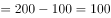万元，即多100万元。

故正确答案为A。

---

## 第 3 题　qid 2741654 · 数学运算

进入某比赛四强的选手通过抽签方式随机分成2组进行半决赛，已知小王在面对任何对手时获胜的概率都是，小张在面对任何对手时获胜的概率都是。问小王和小张均在半决赛中获胜的概率为：

- **A**. 

- **B**. 

- **C**. 
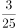

- **D**. 

　✅

**答案**：D

**官方解析**

根据题意设四个要比赛的为小王、小张、甲、乙。小王、小张半决赛均获胜，则小王，小张在半决赛不能相遇。小王在三个对手中不能与小张相遇，概率为。

接下来只需要让小王和小张分别战胜对手即可。小王战胜任何对手的概率为60%，即；小张战胜任何对手的概率为40%，即。

综上，两人半决赛均获胜的概率为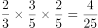。

故正确答案为D。

---

## 第 4 题　qid 2741659 · 数学运算

一个正方形跑道如下图所示。甲从A出发沿顺时针方向匀速跑步，其到达AB中点时，之前一直在A保持静止状态的乙也出发，沿顺时针方向以与甲相同的速度跑步。问以下哪个坐标图最能准确地描述跑步时间（横轴T值）和甲、乙之间直线距离（纵轴L值）之间的关系？

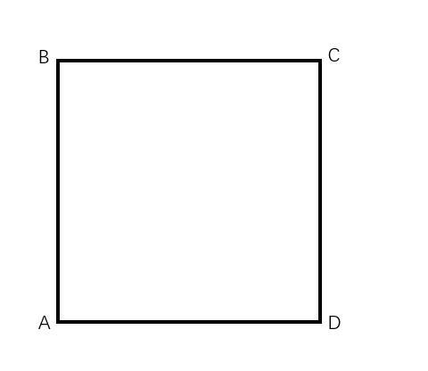

- **A**. 
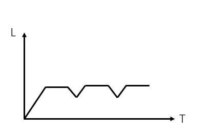

- **B**. 
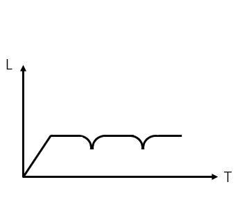

- **C**. 
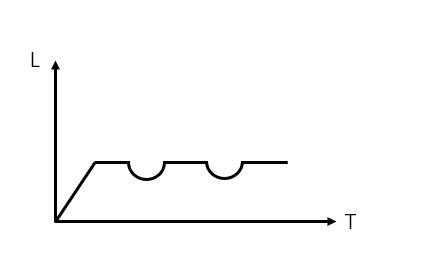
　✅
- **D**. 
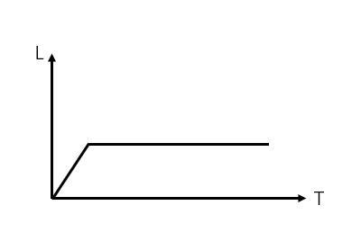

**答案**：C

**官方解析**

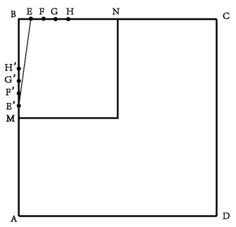

如图所示，令AB中点为M。

赋值正方形的边长为16，甲、乙的速度均为1。分情况讨论如下：

①当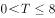时，即甲从A向中点M运动，甲乙之间的距离即甲走的距离，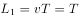，此段距离为匀速变化的直线；

②当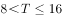时，即甲从M到B的过程中，甲乙之间的距离为：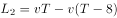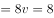，此段距离不变；

③当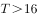时，即甲从B点继续运动，用描点法枚举可得：

当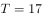时，甲到达E点，乙到达E’点，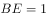，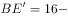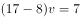，根据勾股定理：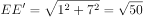；

同理，当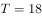时，甲到达F点，乙到达F’点，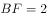，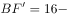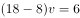，根据勾股定理：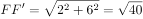；

当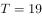时，甲到达G点，乙到达G’点，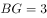，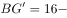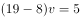，根据勾股定理：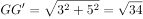；

当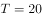时，甲到达H点，乙到达H’点，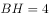，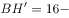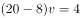，根据勾股定理：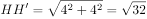；

观察可得，当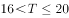时，随着越来越大，甲乙之间的距离越来越小，且下降速度逐渐变缓，排除A、B、D三项。

故正确答案为C。

---

## 第 5 题　qid 2741664 · 数学运算

千克甲盐水和千克乙盐水中的含盐量相同。将千克乙盐水与千克甲盐水混合，并蒸发掉千克水之后，得到的溶液浓度是乙盐水的倍。问乙盐水的浓度是甲盐水的多少倍？

- **A**. 
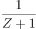

- **B**. 
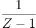
　✅
- **C**. 
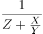

- **D**. 
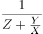

**答案**：B

**官方解析**

由题意可知本题为浓度问题，设甲盐水的浓度为，乙盐水的浓度为。将千克乙盐水与千克甲盐水混合，并蒸发掉千克水之后，根据公式“浓度”得到混合后溶液浓度为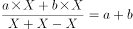，根据“得到的溶液浓度是乙盐水的倍”，可得，，解得，即乙盐水的浓度是甲盐水的倍。

故正确答案为B。

---

## 第 6 题　qid 2741662 · 数学运算

某围场的形状为边长100米的等边三角形，在场地正中修建一座信号塔，塔顶安装有效覆盖半径为米的信号发射器。如要信号覆盖整个围场的地面，则信号塔的高度最高为多少米？

- **A**. 

- **B**. 

　✅
- **C**. 

- **D**. 

**答案**：B

**官方解析**

如图所示，为边长为100米的等边三角形围场，中心O点为信号塔位置，连接OA、OB、OC，O为正三角形的中心，所以O点到顶点的距离为三角形高的，的高米，则有OAOBOC米。OT为信号塔高，连接AT、BT、CT，因为为等边三角形，因此ATBTCT。因为信号发射器的覆盖半径为米，因此若想使信号覆盖整个围场的地面，则T点到三角形顶点的最远距离为米，即ATBTCT米。在直角三角形中，CT米，OC米，根据勾股定理，OT米。

故正确答案为B。

---

## 第 7 题　qid 2741663 · 数学运算

某种商品有小箱和大箱两种包装，一大箱这种商品有400件，张和王同时开始制造这种商品，制造一小箱和一大箱这种商品后，张比王多做50件。如果王此时的效率提高，并与张再共同制造一大箱这种商品，则王制造的总件数比张多50件。问一小箱这种商品有多少件？

- **A**. 50
- **B**. 100
- **C**. 150　✅
- **D**. 200

**答案**：C

**官方解析**

设一小箱商品有件，制造一个小箱和一个大箱这种商品后，张做了件，王做了件，根据题意可列方程组：······①；······②，解得，，根据时间一定，工作总量和工作效率成正比，可得。之后王的效率提高，为，通过王两次制造的总件数比张多50件，可知王和张共同完成一大箱这种商品时，王比张多制造件，设王和张共同完成一大箱这种商品所需的时间为，则根据题意可列方程组：······③；······④，解得，故一小箱这种商品有150件。

故正确答案为C。

---

## 第 8 题　qid 2741665 · 数学运算

某种商品第一天原价销售，第二天开始每天的销售价格比上一天下降原价的。在最后一天前，每天的销量比上一天提高。最后一天的销量与第三天相同。总共6天全部卖完。如果这种商品的成本为原价的，问销售这种商品的总利润是总成本的：

- **A**. 
不到

- **B**. 
之间
　✅
- **C**. 
之间

- **D**. 
以上

**答案**：B

**官方解析**

赋值该商品的原价为10元，第一天的销量为1件。根据题意，每天单价下降元；每天销量变为前一天的2倍；“成本为原价的”，则每件的成本为元。根据题意可得表格如下：

综上，这6天的总利润为元，总成本为单件成本总销量元。则销售这种商品的总利润是总成本的，在之间。

故正确答案为B。

---

## 第 9 题　qid 2741666 · 数学运算

将15名实习生名额随机分配给12个部门，每个部门至少分配1人。问有部门获取的名额是3的概率是有部门获取的名额是4的概率的多少倍？

- **A**. 5.5
- **B**. 6
- **C**. 11　✅
- **D**. 1

**答案**：C

**官方解析**

只考虑每个部门分到的人的数额，当有部门获取的名额是3人时，即先给12个部门各分配一人，再从12个部门中挑选2个，分别再分配2人和1人，即满足有部门获取的名额是3，情况数为种；当有部门获取的名额是4人时，即先给12个部门各分配一人，再将剩下3人分配到同一部门，即可满足有部门获取的名额是4，情况数为种；则所求倍数（有部门获取的名额是3的概率）（有部门获取的名额是4的概率）倍。

故正确答案为C。

---

## 第 10 题　qid 2741667 · 数学运算

将5个相同的圆锥体零件表面涂上红、黄、蓝三种颜色。要求同一个零件的底面只能用一种颜色，同一个零件的斜面也只能用一种颜色，且5个零件的颜色彼此不完全相同，问总共有多少种不同的涂色方式？

- **A**. 84
- **B**. 126　✅
- **C**. 172
- **D**. 180

**答案**：B

**官方解析**

同一个零件的底面只能用同一种颜色，则底面有3种涂色方式；同一个零件的斜面也只能用一种颜色，则斜面有3种涂色方式，则每一个圆锥体的涂色方式有种。5个零件的颜色彼此不完全相同，则需要在9种涂色方式中选出5种，故有种涂色方式。

故正确答案为B。

备注：本题“彼此不完全相同”中“彼此”指的是任意两个圆锥体，即任意两个圆锥体颜色不完全相同，也就是说5个圆锥体颜色各不相同，否则本题无正确答案。

---
