# 2021年广东省公务员录用考试《行测》题（乡镇卷）（网友回忆版）

> 数量关系 · 11 题 · 广东 2021

## 第 1 题　qid 3018896 · 数学运算

，，，，（    ）

- **A**. 

　✅
- **B**. 

- **C**. 

- **D**. 

**答案**：A

**官方解析**

观察数列与选项均为分数，考虑分数数列。分数分母不是递增或递减趋势，考虑反约分，转化为：，，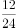，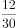，（    ），观察发现，分子均为12，分母是公差为6的等差数列，则下一项分母为，故所求项为。

故正确答案为A。

---

## 第 2 题　qid 3019121 · 数学运算

在某大型医院的建设过程中，施工单位调配了吊机、挖掘机和推土机共120台工程设备进场施工。其中，推土机数量是吊机的3倍，挖掘机数量是吊机的4倍，则吊机有（    ）台。

- **A**. 18
- **B**. 15　✅
- **C**. 12
- **D**. 10

**答案**：B

**官方解析**

设吊机有台，则推土机有台，挖掘机有台，根据题意可知：，解得：。

故正确答案为B。

---

## 第 3 题　qid 3019113 · 数学运算

某茶园需要在一定时间内完成采摘。前4天安排了20名采茶工，完成了五分之一的工作量。如果再用10天完成全部采摘，至少还需要增加（    ）名采茶工。

- **A**. 12　✅
- **B**. 11
- **C**. 10
- **D**. 9

**答案**：A

**官方解析**

设每名采茶工的效率均为1，则前4天完成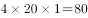，工作总量为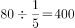，还剩。再用10天完成全部采摘，还需要名采茶工，则至少还需要增加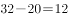名采茶工。

故正确答案为A。

---

## 第 4 题　qid 3018898 · 数学运算

某帮扶项目以每公斤9元的价格从农民手中收购了一批苹果，并以每公斤12元（包邮）的价格在网上销售。售出总量的后，价格下调为每公斤10元（包邮）。运费成本为每公斤0.1元。全部售完后，扣除收购成本和运费的总收益为2.5万元，则这批苹果为（    ）吨。

- **A**. 5
- **B**. 10　✅
- **C**. 15
- **D**. 20

**答案**：B

**官方解析**

设这批苹果共有公斤，根据公式：总利润总售价总成本，可列方程：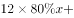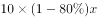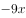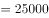，解得，根据1000公斤1吨可知，这批苹果为10吨。

故正确答案为B。

---

## 第 5 题　qid 3019125 · 数学运算

上午7点，A、B市干部同时乘车前往省城参观学习，汽车时速均为每小时80公里。但由于突发状况，B市干部在路上停留了2个小时。最终，A市干部于当天上午9点到达省城；B市干部于当天下午3点到达。则如果从A市出发，途经省城到达B市，总路程为（    ）公里。

- **A**. 720
- **B**. 640　✅
- **C**. 320
- **D**. 280

**答案**：B

**官方解析**

由题意可知：A市干部上午7点出发，于当天上午9点到达省城，故A市距离省城公里；B市干部上午7点出发，于当天下午3点（15点）到达省城，中间停留了2小时，故实际行驶时间为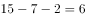小时，故B市距离省城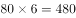公里。则如果从A市出发，途经省城到达B市，总路程为公里。

故正确答案为B。

---

## 第 6 题　qid 3019131 · 数学运算

一条长20厘米的纸带，先从左端开始涂上4厘米红色，之后每间隔4厘米再涂4厘米红色；再从右端开始涂上5厘米绿色，之后每间隔5厘米再涂5厘米绿色，则红绿色重叠的部分共有（    ）段。

- **A**. 4
- **B**. 3
- **C**. 2　✅
- **D**. 1

**答案**：C

**官方解析**

根据题意可知，20厘米的纸带从左端开始4厘米一段分成5段，从右端开始5厘米一段分成4段，涂色情况如下图所示，则红绿色重叠的部分即为蓝色斜线部分，共有2段。

故正确答案为C。

---

## 第 7 题　qid 3018799 · 数学运算

某货运公司承运一批工艺品，每件运费20元。如果运输途中出现破损，那么每件破损的工艺品不仅收不到运费，还要赔偿30元。运输完成后发现，工艺品的破损率为，最终货运公司收到了16800元运费，则运输途中破损的工艺品有（    ）件。

- **A**. 64　✅
- **B**. 96
- **C**. 128
- **D**. 156

**答案**：A

**官方解析**

设这批工艺品共有件，根据题意可得：运输完成后可获得运费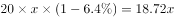元，因破损需赔偿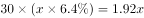元，则最终收到运费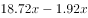元，解得，故运输途中破损的工艺品有件。

故正确答案为A。

---

## 第 8 题　qid 3019118 · 数学运算

某学校组织学生外出学农。如果每间宿舍住6名学生，就会缺7张床位，如果每间宿舍住8名学生，就会空出3张床位，则这批学生一共有（    ）人。

- **A**. 50
- **B**. 45
- **C**. 43
- **D**. 37　✅

**答案**：D

**官方解析**

方法一：设共有间宿舍，根据题意可知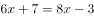，解得。所以这批学生一共有人。

方法二：本题为余数问题，优先用代入排除法。

代入A项：当这批学生有50人时，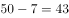，并非6的倍数，不满足“如果每间宿舍住6名学生，就会缺7张床位”，排除；

代入B项：当这批学生有45人时，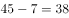，并非6的倍数，不满足“如果每间宿舍住6名学生，就会缺7张床位”，排除；

代入C项：当这批学生有43人时，，可以被6整除；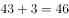，并非8的倍数，不满足“如果每间宿舍住8名学生，就会空出3张床位”，排除。

故正确答案为D。

---

## 第 9 题　qid 3018772 · 数学运算

县公安局计划举办篮球比赛，6支报名参赛的队伍将平均分为上午组和下午组进行小组赛。其中甲队与乙队来自同部门，不能分在同一组，则分组情况共有（    ）种可能。

- **A**. 6
- **B**. 8
- **C**. 10
- **D**. 12　✅

**答案**：D

**官方解析**

方法一：除了甲、乙两队外，共剩余支队伍。从中选出2支队伍与甲队组成一组，其余2支队伍与乙队组成一组，共种情况。而有可能甲队在上午组、乙队在下午组，也有可能甲队在下午组、乙队在上午组，因此总情况数共有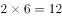种。

方法二：本题也可以考虑逆向思维求解。总情况数即6支报名参赛的队伍将平均分为上午组和下午组进行小组赛，即：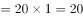种，反面情况即甲队与乙队先分在同一组，再从其余支队伍中选出一队与甲、乙两队组成一组，即种情况，又有上午组和下午组2种情况，则反面情况数共有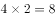种。所求结果总情况数反面情况数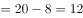种。

故正确答案为D。

---

## 第 10 题　qid 3019123 · 数学运算

某县政府组织干部职工开展党建知识竞赛，其中甲、乙两镇参赛人数之比为4：3，甲镇有8人、乙镇有24人没有参加竞赛。已知甲、乙两镇干部职工人数之比为5：6，则乙镇的干部职工比甲镇多（    ）人。

- **A**. 8　✅
- **B**. 7
- **C**. 6
- **D**. 5

**答案**：A

**官方解析**

设甲、乙两镇参赛人数分别为人、人。根据题意可得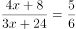，解得。则甲、乙两镇干部职工人数分别为人、人，故乙镇的干部职工比甲镇多人。

故正确答案为A。

---

## 第 11 题　qid 3018813 · 数学运算

如图所示，周长为24米的平行四边形绿化地被划分为三块区域，两边为三角形的花坛，中间为矩形的草地。已知a、b、c长度之比为4∶2∶，则矩形草地的面积为（    ）平方米。

- **A**. 
6

- **B**. 

- **C**. 
12

- **D**. 
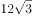
　✅

**答案**：D

**官方解析**

平行四边形的周长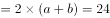米，则米，且根据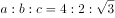可得，米，米，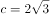米。如下图所示，因为中间部分为矩形，所以由b、d、e构成的三角形为直角三角形，其中米，则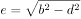米，故矩形草地的面积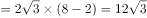平方米。

故正确答案为D。

---
