# 2021年广东省公务员录用考试《行测》题（县级卷）（网友回忆版）

> 数量关系 · 11 题 · 广东 2021

## 第 1 题　qid 3018896 · 数学运算

，，，，（    ）

- **A**. 

　✅
- **B**. 

- **C**. 

- **D**. 

**答案**：A

**官方解析**

观察数列与选项均为分数，考虑分数数列。分数分母不是递增或递减趋势，考虑反约分，转化为：，，，，（    ），观察发现，分子均为12，分母是公差为6的等差数列，则下一项分母为，故所求项为。

故正确答案为A。

---

## 第 2 题　qid 3018898 · 数学运算

某帮扶项目以每公斤9元的价格从农民手中收购了一批苹果，并以每公斤12元（包邮）的价格在网上销售。售出总量的后，价格下调为每公斤10元（包邮）。运费成本为每公斤0.1元。全部售完后，扣除收购成本和运费的总收益为2.5万元，则这批苹果为（    ）吨。

- **A**. 5
- **B**. 10　✅
- **C**. 15
- **D**. 20

**答案**：B

**官方解析**

设这批苹果共有公斤，根据公式：总利润总售价总成本，可列方程：，解得，根据1000公斤1吨可知，这批苹果为10吨。

故正确答案为B。

---

## 第 3 题　qid 3018899 · 数学运算

为支持“一带一路”建设，某公司派出甲、乙两队工程人员出国参与一个高铁建设项目。如果由甲队单独施工，200天可完成该项目；如果由乙队单独施工，则需要300天。甲、乙两队共同施工60天后，甲队被临时调离，由乙队单独完成剩余任务，则完成该项目共需（    ）天。

- **A**. 120
- **B**. 150
- **C**. 180
- **D**. 210　✅

**答案**：D

**官方解析**

根据题意，赋值高铁建设项目工作总量为200和300的最小公倍数600，则甲队的效率，乙队的效率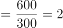。甲、乙两队共同施工60天完成的工作量，则剩余任务的工作量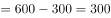，则乙队单独完成剩余任务还需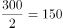天，故完成该项目共需天。

故正确答案为D。

---

## 第 4 题　qid 3018901 · 数学运算

某街道服务中心的80名职工通过相互投票选出6名年度优秀职工，每人都只投一票，最终A、B、C、D、E、F这6人当选。已知A票数最多，共获得20张选票；B、C两人的票数相同，并列第2；D、E两人票数也相同，并列第3；F获得10张选票，排在第4。那么B、C获得的选票最多为（    ）张。

- **A**. 11
- **B**. 12
- **C**. 13
- **D**. 14　✅

**答案**：D

**官方解析**

要想使B、C获得的选票最多，则A、D、E、F获得的选票应该尽量的少。根据题意，80名职工每人只投一票，则共投出80张选票。A获得20张选票，F获得10张选票，D、E两人票数相同且并列第3，则D、E两人获得的票数应该尽量的少，每人应比排名第4的F多1张选票，即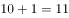张。则B、C两人共获得的选票最多为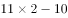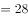张，根据“B、C两人的票数相同”可得，B、C每人获得的选票最多为张。

故正确答案为D。

---

## 第 5 题　qid 3018767 · 数学运算

小王和小李沿着绿道往返运动，绿道总长度为3公里。小王每小时走2公里；小李每小时跑4公里。如果两人同时从绿道的一端出发，则当两人第7次相遇时，距离出发点（    ）公里。

- **A**. 0
- **B**. 1
- **C**. 1.5
- **D**. 2　✅

**答案**：D

**官方解析**

根据题意，两人同时从绿道的一端出发，则第次相遇时所走路程和为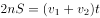。假设第7次相遇时运动时间为，代入题干数据可得：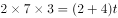，解得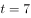小时。相遇时小王所走路程为公里，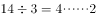，因为商为4，是偶数，即小王在绿道上往返走了次，“······2”即往返2次回到出发点后，又走了2公里，则相遇点距离出发点2公里。

故正确答案为D。

---

## 第 6 题　qid 3018772 · 数学运算

县公安局计划举办篮球比赛，6支报名参赛的队伍将平均分为上午组和下午组进行小组赛。其中甲队与乙队来自同部门，不能分在同一组，则分组情况共有（    ）种可能。

- **A**. 6
- **B**. 8
- **C**. 10
- **D**. 12　✅

**答案**：D

**官方解析**

方法一：除了甲、乙两队外，共剩余支队伍。从中选出2支队伍与甲队组成一组，其余2支队伍与乙队组成一组，共种情况。而有可能甲队在上午组、乙队在下午组，也有可能甲队在下午组、乙队在上午组，因此总情况数共有种。

方法二：本题也可以考虑逆向思维求解。总情况数即6支报名参赛的队伍将平均分为上午组和下午组进行小组赛，即：种，反面情况即甲队与乙队先分在同一组，再从其余支队伍中选出一队与甲、乙两队组成一组，即种情况，又有上午组和下午组2种情况，则反面情况数共有种。所求结果总情况数反面情况数种。

故正确答案为D。

---

## 第 7 题　qid 3018779 · 数学运算

某单位本科、研究生学历的职工人数之比为7：5。上半年公开招聘本科毕业生若干人后，本科与研究生之比为3：1；下半年通过引才计划引入研究生若干人后，本科与研究生之比为15：8。已知该年度引进的本科生比研究生多10人，则该单位原有本科与研究生学历的职工共（    ）人。

- **A**. 12
- **B**. 24　✅
- **C**. 36
- **D**. 48

**答案**：B

**官方解析**

设该单位原有本科、研究生学历的职工人数分别为、。由题意可知，上半年公开招聘后研究生学历的职工人数不变，则此时本科与研究生比例为，此时本科学历的职工人数为，增加了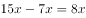。下半年公开招聘后，本科学历的职工人数不变，则本科与研究生比例为，此时研究生学历的职工人数为，增加了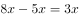。根据题意，新增本科人数新增研究生人数，解得，则该单位原有本科与研究生学历的职工人数为人。

故正确答案为B。

---

## 第 8 题　qid 3018791 · 数学运算

7月的某一天，小张制定了一个读书计划：从今天开始，在每周的周一至周五晚上读党史系列丛书。如果小张每晚读20页，到7月28日刚好能读完第一卷，如果每天读30页，则到7月20日刚好能读完第一卷。如果7月1日是星期三，则小张是在7月（    ）日制定的读书计划。

- **A**. 2
- **B**. 3　✅
- **C**. 5
- **D**. 7

**答案**：B

**官方解析**

设小张每晚读20页书需用天读完。根据题意，每晚读30页书比每晚读20页提前了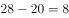天；已知7月1日是星期三，每周7天，可推出7月22日为星期三，则7月20日为星期一、7月28日为是星期二。可知提前的8天中包括周末两天（7月25、26日）没有读书，则实际节省了6天读书时间，由此可列方程为：，解得。故到7月28日读完第一卷书，共需18天。由于每周周末都不读书，实际读书为每周5天，则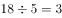（周）······3天。从7月28日往前推三周为：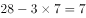，即7月7日星期二，此时共计读书16天，还需读书2天，而星期一只有1天，还需1天为上一周的星期五（7月3日），则小张是在7月3日制定的读书计划。

故正确答案为B。

---

## 第 9 题　qid 3018799 · 数学运算

某货运公司承运一批工艺品，每件运费20元。如果运输途中出现破损，那么每件破损的工艺品不仅收不到运费，还要赔偿30元。运输完成后发现，工艺品的破损率为，最终货运公司收到了16800元运费，则运输途中破损的工艺品有（    ）件。

- **A**. 64　✅
- **B**. 96
- **C**. 128
- **D**. 156

**答案**：A

**官方解析**

设这批工艺品共有件，根据题意可得：运输完成后可获得运费元，因破损需赔偿元，则最终收到运费元，解得，故运输途中破损的工艺品有件。

故正确答案为A。

---

## 第 10 题　qid 3018813 · 数学运算

如图所示，周长为24米的平行四边形绿化地被划分为三块区域，两边为三角形的花坛，中间为矩形的草地。已知a、b、c长度之比为4∶2∶，则矩形草地的面积为（    ）平方米。

- **A**. 
6

- **B**. 

- **C**. 
12

- **D**. 

　✅

**答案**：D

**官方解析**

平行四边形的周长米，则米，且根据可得，米，米，米。如下图所示，因为中间部分为矩形，所以由b、d、e构成的三角形为直角三角形，其中米，则米，故矩形草地的面积平方米。

故正确答案为D。

---

## 第 11 题　qid 3018819 · 数学运算

某天，自行车运动员小吴训练了3个小时，他先匀速骑行了一段上坡路程，又以2倍的速度匀速骑行了一段下坡路程，最终共骑行60千米，则（    ）。

- **A**. 如果上坡路程大于下坡路程，他上坡的时速必然小于15千米
- **B**. 如果上坡路程大于下坡路程，他上坡的时速必然大于20千米
- **C**. 如果下坡路程大于上坡路程，他下坡的时速必然小于30千米　✅
- **D**. 如果下坡路程大于上坡路程，他下坡的时速必然大于25千米

**答案**：C

**官方解析**

设上坡速度为千米/小时，下坡速度为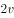千米/小时，上坡的路程为千米，下坡路程为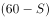千米。根据总时间为3小时，可得方程：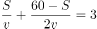，化简得：······①。

（1）当上坡路程大于下坡路程时：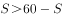，化简得：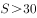，代入①中可得：，化简得：，即上坡的时速必然大于15千米，A、B两项均不符合，排除；

（2）当下坡路程大于上坡路程时：，化简得：，代入①中可得：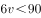，化简得：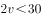，即下坡时速必然小于30千米，对应C项。

故正确答案为C。

---
