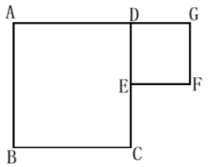
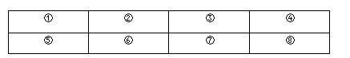
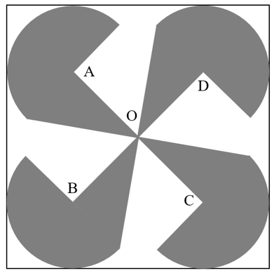
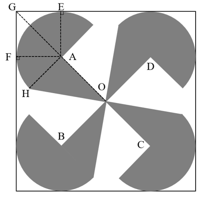

# 2021年度浙江省党政机关选调应届优秀大学毕业生《行测》题（网友回忆版）

> 数量关系 · 20 题 · 浙江 2021

## 第 1 题　qid 5832297 · 数学运算

某公园同时接待游客最大数量为6000人。从上午8点开门起，每1.5秒就有1名游客进入公园，每名游客在公园游玩的时间为4小时。公园从10点开始对游客进行限流，问进入公园的速度控制在每多少秒进一个游客，才能保证在中午12点前接待数量不超过最大值的前提下尽可能多地接待游客？

- **A**. 5
- **B**. 6　✅
- **C**. 7.5
- **D**. 9

**答案**：B

**官方解析**

公园上午8点开门，每名游客游玩4小时，即中午12点前没有游客离开公园。要想保证中午12点前接待数量不超过最大值，只需保证中午12点前进入公园的游客总数不超过最大值即可。

设限流后每x秒进一名游客。最初每1.5秒有1名游客进入公园，10点时已有名游客，之后2小时进入公园的游客数需不超过6000-4800=1200人，即，解得，即控制在每6秒进一名游客，才能保证在中午12点前接待数量不超过最大值的前提下尽可能多地接待游客。

故正确答案为B。

---

## 第 2 题　qid 5832292 · 数学运算

甲、乙、丙3人合作完成一项工作，原计划15天完成。甲工作2天后请假离开，剩下两个人又工作8天后正好完成一半工作。此时丙退出，甲再回来，又用15天正好完成工作。问如果丙单独完成工作，需要多少天？

- **A**. 30　✅
- **B**. 36
- **C**. 40
- **D**. 48

**答案**：A

**官方解析**

由题意可知，工作总量=（甲+乙+丙）×15······①；丙退出前，······②；丙退出后，······③。联立①③可得：工作总量=丙×30，则如果丙单独完成工作，需要30天。

故正确答案为A。

---

## 第 3 题　qid 5832313 · 数学运算

一个自然数列的第一项与第二项互质，且第一项的恰好是第二项的，从第三项开始，每一项是前两项之和。问这个数列的第2019项被4除所得的余数是多少？

- **A**. 0
- **B**. 1　✅
- **C**. 2
- **D**. 3

**答案**：B

**官方解析**

由题意可知，，整理为，又因为这两项互质，则第一项与第二项分别为6、7。该数列为6、7、13、20、33、53、86、139、225······，被4除所得的余数依次是2、3、1、0、1、1、2、3、1······，是周期为2、3、1、0、1、1的周期数列。，则第2019项被4除所得的余数是1。

故正确答案为B。

---

## 第 4 题　qid 5832317 · 数学运算

一条货船在静水中的速度是另一条客船的80%。如货船从上游A港口出发前往下游B港口，而客船从B前往A，两船到达目的地，均立刻返航。已知两船正好在AB中点位置第一次相遇，第二次在C点相遇。问BC与AC距离的比值是多少？

- **A**. 4：5
- **B**. 5：9
- **C**. 7：11　✅
- **D**. 12：2

**答案**：C

**官方解析**

设客船静水速度为，则货船静水速度为。货船出发时为顺水，客船为逆水，根据“两船正好在AB中点位置第一次相遇”可知，两条船出发时的速度相同，即，化简得。两船同时到达目的地后，立即返航，此时货船为逆水，行驶速度为，客船为顺水，行驶速度为。时间相同时，速度与路程成正比，则。

故正确答案为C。

---

## 第 5 题　qid 5832318 · 数学运算

如图所示，大正方形ABCD边长16厘米，小正方形DEFG边长8厘米。问以A、B、C、D、E、F、G中的3个点为顶点，构成面积是128平方厘米的三角形一共有多少个？

- **A**. 2
- **B**. 5
- **C**. 6　✅
- **D**. 7

**答案**：C

**官方解析**

若想构成面积是128平方厘米的三角形，则底×高=128×2=256，结合大正方形与小正方形边长，可知所构成的三角形底与高均为16厘米，分别为、、、、、，共6个。

故正确答案为C。

备注：结合选项，推测命题人意图指的三个顶点所构成的三角形应该只考虑了大正方形某一条边为底，连接另一个点构成三角形的情况，因此正确答案应为6个。否则，除了解析当中的6个以外，还包括和，那么答案即为8个，但本题选项并未设置。

---

## 第 6 题　qid 5832315 · 数学运算

如图所示，将一颗白子和一颗黑子放在棋盘线交叉点上，且不在同一条棋盘线上，共有多少种不同的放法？

- **A**. 40
- **B**. 72
- **C**. 90
- **D**. 180　✅

**答案**：D

**官方解析**

由图可知，棋盘上共有18个可以放置棋子的位置，先选定白子的位置，有18种情况，此时与白子不同行不同列的位置还剩下10个，即黑子有10种选择。分步用乘法，可知共有18×10=180种不同的放法。
故正确答案为D。

---

## 第 7 题　qid 5832323 · 数学运算

小张五次输入四位数的手机密码均错误：3850、6409、4965、9576、7694。已知他每次输入的密码中均有两位数字正确，但位置都不对。
问正确的手机密码是多少？

- **A**. 5047　✅
- **B**. 5346
- **C**. 5743
- **D**. 8743

**答案**：A

**官方解析**

方法一：观察这五个四位数发现，数字6和9均在四个位置上分别出现一次。若6和9是正确数字但位置不对，则没有其他位置可选，说明6和9一定不是正确的数字。观察6409、4965、9576、7694这四个数字，6、9不是正确数字，则4、0、5、7是正确密码的四个数字，结合选项，只有A项符合。
方法二：代入排除法。
A项：若正确的手机密码是5047，则五次输入的密码中两位正确数字分别为5和0、4和0、4和5、5和7、7和4，且位置都不对，符合题意，当选；
B项：若正确的手机密码是5346，则第三次输入的密码中正确数字有4、6、5这三个数字，不符合题意，排除；
C项：若正确的手机密码是5743，则第二次输入的密码中正确数字仅有4这一个数字，不符合题意，排除；
D项：若正确的手机密码是8743，则第二次输入的密码中正确数字仅有4这一个数字，不符合题意，排除。
故正确答案为A。

---

## 第 8 题　qid 5832320 · 数学运算

某社区为受灾地区捐款捐物，有80%的人员参加了此项活动，30%的人员捐了物品，70%的人员捐了款，则该社区既捐物品又捐款的人员占该社区人员的比例为多少？

- **A**. 15%
- **B**. 20%　✅
- **C**. 21%
- **D**. 25%

**答案**：B

**官方解析**

根据两集合容斥原理公式：，代入数据可得：30%+70%-既捐物品又捐款的人员占该社区人员的比例=80%，则既捐物品又捐款的人员占该社区人员的比例=20%。

故正确答案为B。

---

## 第 9 题　qid 5832339 · 数学运算

电子狗和机器猫以4：3的速度同时从走廊的A、B两端出发相向而行，相遇后，电子狗的速度降低25％，机器猫的速度增加25％。当电子狗到达走廊B端时，机器猫离走廊A端还有1.5米，那么走廊的A、B两端相距多少米？

- **A**. 21
- **B**. 27
- **C**. 35
- **D**. 42　✅

**答案**：D

**官方解析**

电子狗和机器猫以4：3的速度相向而行，从出发至相遇所用时间相等。根据“时间一定，路程与速度成正比”可得，电子狗和机器猫从出发至相遇所走路程比=速度比=4∶3。设电子狗和机器猫从出发至相遇所走路程分别为4S米、3S米。从相遇至电子狗到达走廊B端这一时间段内，电子狗所走路程为3S米，机器猫所走路程为（4S-1.5）米，电子狗与机器猫的速度比，故可列式：，解得：S=6，则走廊的A、B两端相距4S+3S=7S=7×6=42米。

故正确答案为D。

---

## 第 10 题　qid 5832344 · 数学运算

电商促销期间，某快递网点每天需要分拣的快递量比平时增加了2倍，网点除4名原有的固定分拣员外又招聘了6名临时分拣员，且每名分拣员每天工作时间从8小时增加到12小时才能完成工作。问临时分拣员和固定分拣员的工作效率之比是多少？

- **A**. 1：2
- **B**. 2：3　✅
- **C**. 3：4
- **D**. 4：5

**答案**：B

**官方解析**

赋值每名固定分拣员的工作效率为1，根据题意可知，平时该网点的4名固定分拣员每天工作8小时可完成分拣工作，则平时该网点每天需要分拣的快递量为4×1×8=32。设每名临时分拣员的工作效率为x，电商促销期间每天需要分拣的快递量为（4×1+6x）×12=48+72x。因电商促销期间该网点每天需要分拣的快递量比平时增加了2倍，即每天需要分拣的快递量是平时的3倍，48+72x=32×3，解得，则临时分拣员和固定分拣员的工作效率之比为。

故正确答案为B。

---

## 第 11 题　qid 5832343 · 数学运算

一个两层的陈列柜每层各有4个陈列格，先将3件不同的木雕和4件不同的瓷器分别放入不同的陈列格中，要求任意两件木雕上下左右均不相邻，且空的格子不能在下层。请问不同的陈列方式种数在以下哪个范围内？

- **A**. 不到1000
- **B**. 1000~2000
- **C**. 2001~4000
- **D**. 超过4000　✅

**答案**：D

**官方解析**

根据题意，两层的陈列柜如下图所示：

任意两件木雕上下左右均不相邻，则3件木雕不能放在同一层，可分为上层放有2件木雕或下层放有2件木雕两种情况讨论：

如果任意选择2件木雕放在上层，且因木雕上下左右均不能相邻，只能放在①③、①④或②④陈列格中，情况数为，另外1件木雕放在下层且上方无木雕的陈列格中，情况数为；此时下层有3个空的格子，因空的格子不能在下层，任意选择3件瓷器放在下层，情况数为，另外1件瓷器放在上层（还剩2个空的格子），情况数为。分步用乘法，即如果上层放了2件木雕的陈列方式有种。

如果任意选择2件木雕放在下层，同理，只能放在⑤⑦、⑤⑧或⑥⑧陈列格中，情况数为，另外1件木雕放在上层且下方无木雕的陈列格中，情况数为；此时下层有2个空的格子，因空的格子不能在下层，任意选择2件瓷器放在下层，情况数为，另外2件瓷器放在上层（还剩3个空的格子），情况数为。分步用乘法，即如果上层放了2件木雕的陈列方式有种。

分类用加法，则陈列方式共有1728+2592=4320种。

故正确答案为D。

---

## 第 12 题　qid 5832375 · 数学运算

某企业从年初开始第一代产品的升级换代研发，每次研发的周期为7个月。如果研发成功，立刻开展下一代产品的研发，如果失败，研发需要重新开始。已知第二代产品的研发成功率为80%，往后每代产品的研发成功率都比上一代降低10个百分点。问该企业在第三年年底前成功研发出第五代产品的概率在以下哪个范围内？

- **A**. 不到35%
- **B**. 35%~45%　✅
- **C**. 45%~55%
- **D**. 超过55%

**答案**：B

**官方解析**

根据题意，从第二代到第五代产品，需经历4次研发成功，成功率依次为80%、70%、60%、50%。从年初到第三年年底共有12×3=36个月，每次研发的周期为7个月，最多经历5个研发周期，即最多有1个周期研发失败。分情况讨论：
无研发失败情形，概率为80%×70%×60%×50%=16.8%；
第二代产品研发时失败1次，概率为（1-80%）×80%×70%×60%×50%=0.2×16.8%；
第三代产品研发时失败1次，概率为80%×（1-70%）×70%×60%×50%=0.3×16.8%；
第四代产品研发时失败1次，概率为80%×70%×（1-60%）×60%×50%=0.4×16.8%；
第五代产品研发时失败1次，概率为80%×70%×60%×（1-50%）×50%=0.5×16.8%；
分类用加法，题目所求为（1+0.2+0.3+0.4+0.5）×16.8%=40.32%。
故正确答案为B。

---

## 第 13 题　qid 5832349 · 数学运算

银行向71户农户发放小额扶贫贷款，单户贷款额有2万元、3万元和5万元三种，总计发放贷款218万元。已知贷款额3万元的农户总贷款额是贷款额5万元的农户总贷款额的2倍，请问贷款额2万元和3万元的农户合计平均每户贷款额在以下哪个范围内？

- **A**. 不到2.5万元
- **B**. 2.5~2.6万元
- **C**. 2.6~2.7万元　✅
- **D**. 超过2.7万元

**答案**：C

**官方解析**

根据题意可知，贷款额3万元与贷款额5万元的农户数量之比为，则设贷款额5万元的农户有3x户，贷款额3万元的农户有10x户，贷款额2万元的农户有71-3x-10x=（71-13x）户。根据“总计发放贷款218万元”可列式：2×（71-13x）+3×10x+5×3x=218，解得x=4。贷款额5万元的农户有3x=3×4=12户，其总贷款额为5×12=60万元，故贷款额2万元和3万元的农户合计平均每户贷款额为万元，在C项范围内。

故正确答案为C。

---

## 第 14 题　qid 5832382 · 数学运算

A、B、C三个志愿队分别下乡扶贫，A志愿队每隔5天去一次，B志愿队每隔8天去一次，C志愿队每隔6天去一次。已知三个队周四第一次同时下乡，问第二次同时下乡后A志愿队周几再去下乡？

- **A**. 周二
- **B**. 周三　✅
- **C**. 周四
- **D**. 周五

**答案**：B

**官方解析**

由题可知，A志愿队每6天去一次，B志愿队每9天去一次，C志愿队每7天去一次，三队周期的最小公倍数为126，即每126天三队相遇一次。每周有7天，周，故三队第二次同时下乡也在周四。周四往后推6天为周三，则第二次同时下乡后A志愿队周三再去下乡。

故正确答案为B。

---

## 第 15 题　qid 5832360 · 数学运算

A市某年7月降水的天数比无降水的天数少11天，且任意相邻的3天中至少有1天降水。问该市当年7月中旬（11～20日）绝不可能降水的日子有多少天？

- **A**. 0
- **B**. 3　✅
- **C**. 4
- **D**. 7

**答案**：B

**官方解析**

7月有31天，7月降水的天数比无降水的天数少11天，则无降水天数为21天，降水天数为10天。任意相邻的3天中至少有1天降水，个周期······1天，结合降水天数为10天，可得出每个周期的3天中有且仅有1天降水。

若7月1日开始降水，降水天数为10+1=11天，不符合题意；

若7月2日开始降水，满足降水天数为10天，则中旬有4天降水，即11日、14日、17日、20日这四天；

若7月3日开始降水，满足降水天数为10天，则中旬有3天降水，即12日、15日、18日这三天。

7月中旬（11～20日）共10天，绝不可能降水的日子有10-4-3=3天。

故正确答案为B。

---

## 第 16 题　qid 5832351 · 数学运算

在（1，1，3，3）（2，4，6，8）及（1，4，5，6）这三组数中，能用“+，-，×，÷”运算符号和“（    ）”算出得数是24的有多少组？

- **A**. 0
- **B**. 1
- **C**. 2　✅
- **D**. 3

**答案**：C

**官方解析**

第一组（1，1，3，3）：，不符合“+，-，×，÷”运算规则。

第二组（2，4，6，8）：①6×8÷（4-2）=24，②6×8÷（4÷2）=24，③6×（8÷4+2）=24。

第三组（1，4，5，6）：①6÷（5÷4-1）=24，②4÷（1-5÷6）=24。

因此能用“+，-，×，÷”和“（    ）”算出得数是24的为第二组、第三组，共2组。

故正确答案为C。

---

## 第 17 题　qid 5832361 · 数学运算

三个相同的玻璃杯里装满了不同浓度的酒精溶液，其中酒精和水的质量比分别为1：5，2：3和1：9。现将这三杯酒精溶液倒进一个瓶子里，这瓶酒精溶液里酒精与水的质量比是多少？

- **A**. 2：7　✅
- **B**. 7：9
- **C**. 4：17
- **D**. 4：21

**答案**：A

**官方解析**

根据题意可知，三个玻璃杯容量相同且均装满酒精溶液，则三杯酒精溶液的溶液质量相同，且为1+5=6、2+3=5、1+9=10的倍数，即30的倍数。赋每杯值酒精溶液的溶液质量为30，则三杯酒精溶液中酒精的质量分别为、、。因此三杯酒精溶液倒进一个瓶子后，这瓶酒精溶液里酒精与水的质量之比为（5+12+3）：（30×3-5-12-3）=20：70=2：7。

故正确答案为A。

---

## 第 18 题　qid 5832369 · 数学运算

小王骑自行车从A地出发去B地，1路公交车同时从B地出发往返于AB两地，55分钟后两者相遇。之后又经10分钟，小王被从A地返回的公交车追上。问小王到达B地时共被公交车追上多少次？

- **A**. 5
- **B**. 6　✅
- **C**. 10
- **D**. 12

**答案**：B

**官方解析**

下图所示，小王与公交车55分钟后在C地相遇，又经过10分钟公交车在D地追上小王，则，解得。题目求小王到达B地时被公交车追上的次数，意味着小王与公交车所用时间相同，根据时间一定，路程与速度成正比，可知，则小王到达B地时，公交车行驶了12个AB的距离。公交车每次从A地开往B地，都会追上小王一次，由于公交车起始位置为B地，则公交车BA行驶了6次，AB行驶了6次，最终到达B地，因此小王到达B地时共被公交车追上6次。

故正确答案为B。

---

## 第 19 题　qid 5832373 · 数学运算

如图所示，正方形边长为20厘米，四个半圆直径为10厘米，圆心分别为A、B、C、D，O为正方形的中心点，阴影部分的三角形与半圆形成的角为直角。问阴影部分面积是多少平方厘米？

- **A**. 

- **B**. 

- **C**. 

　✅
- **D**. 

**答案**：C

**官方解析**

下图所示，E、F为圆A与大正方形的切点，则，；由于AE、AF为圆A的半径，则AEFG为正方形，则厘米。OG为大正方形对角线的一半，则厘米，则厘米。因此阴影部分面积=4个半圆的面积+4个直角三角形的面积平方厘米。

故正确答案为C。

---

## 第 20 题　qid 5832356 · 数学运算

20人参加一场象棋大环赛，每轮比赛胜者积3分，负者扣1分，若打平则两名选手均不积分。已知第一轮比赛过后，所有选手积分合计为14分。问首轮比赛中平局的场次为多少场？

- **A**. 3　✅
- **B**. 4
- **C**. 6
- **D**. 7

**答案**：A

**官方解析**

根据题意可知，每场比赛若分出胜负，则本场比赛共积3-1=2分，若打平，则本场比赛共积0分。所有选手积分合计为14分，则分出胜负的有14÷2=7场。20人参加比赛，共有20÷2=10场比赛，因此首轮比赛中平局的场次为10-7=3场。
故正确答案为A。
备注：本题没有明确说明比赛的赛制，结合选项推测为淘汰赛，即选手两两相对，输一场则淘汰出局。

---
