# 2021年新疆公务员录用考试《行测》试题（网友回忆版）

> 数量关系 · 11 题 · 新疆 2021

## 第 1 题　qid 4630392 · 数学运算

-7，-4，-3，-10，3，（    ），-3

- **A**. 5
- **B**. 2
- **C**. -4　✅
- **D**. -6

**答案**：C

**官方解析**

观察数列，变化较为平缓，项数较多，考虑多重数列。观察发现，除第一项以外，可两两分组，即：-7，（-4，-3），（-10，3），由此发现规律，括号内两数加和等于-7，即为第一项，故所求项应为-7-（-3）=-4。
故正确答案为C。

---

## 第 2 题　qid 4630406 · 数学运算

甲、乙、丙、丁四人捐款，甲、乙、丙共捐款240元，甲、丙、丁共捐款190元，甲捐款额是丙的两倍，甲比乙少捐款40元。问丁捐款多少元？

- **A**. 70　✅
- **B**. 80
- **C**. 90
- **D**. 120

**答案**：A

**官方解析**

根据题意，设丙捐款x元，则甲捐款2x元，乙捐款（2x+40）元，丁捐款190-2x-x=190-3x元。由甲、乙、丙共捐款240元，可得：2x+（2x+40）+x=240，解得x=40。故丁捐款=190-3×40=70元。
故正确答案为A。

---

## 第 3 题　qid 4629982 · 数学运算

王和张现在是同小区的邻居，3年之后，王比张年龄的3倍少2岁，再过5年王比张年龄的两倍多五岁，再在此基础上过10年王的年龄是多少岁？

- **A**. 31
- **B**. 34
- **C**. 39
- **D**. 49　✅

**答案**：D

**官方解析**

方法一：年龄问题，考虑代入排除法。结合选项设置，A和B、B和C、C和D分别差3、5、10，猜测答案可能是D选项，代入D选项验证。王再过10年为49岁，则10年前为39岁，“比张年龄的两倍多五岁”，则张的年龄为（39-5）÷2=17岁，往前推5年，即题目开头的“3年后”王39-5=34岁，张17-5=12岁，34=3×12-2，满足条件“王比张年龄的3倍少2岁”，因此D选项满足所有条件。
故正确答案为D。
方法二：设3年之后，张的年龄为x岁，则王的年龄为（3x-2）岁；再过5年，张的年龄为（x+5）岁，王的年龄为（3x-2+5）岁。根据题意，3x-2+5=2（x+5）+5，解得x=12，即再过5年王的年龄为3x-2+5=39岁，再在此基础上过10年王的年龄为39+10=49岁。
故正确答案为D。

---

## 第 4 题　qid 4629984 · 数学运算

某果园雇人手工采摘樱桃，已知从第二天起每天比前天多3人；从第10天起，每天减少前一天一半的人，直到第14天，剩下5人。已知每人每天采摘樱桃50千克，问该果园这14天总共采摘樱桃多少吨？

- **A**. 不到40吨
- **B**. 40-60吨之间
- **C**. 60-80吨之间　✅
- **D**. 超过80吨

**答案**：C

**官方解析**

根据题意，第9-14天的采摘人数如下表：

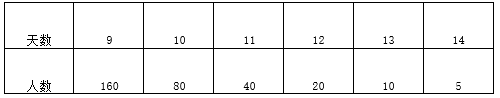

前9天的采摘人数呈等差数列，公差d=3，根据通项公式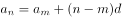，，解得。根据等差数列求和公式：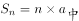，前9天采摘人数共有人。则14天共雇1332+80+40+20+10+5=1487人，共采摘樱桃1487×50=74350千克=74.35吨，在C项范围内。

故正确答案为C。

---

## 第 5 题　qid 4629989 · 数学运算

科研人员在山路测试救援机器人性能。已知救援机器人电池续航时间为60分钟，其上坡、下坡、平路速度分别为4米/秒、8米/秒、6米/秒。机器人从A点出发，沿箭头所示路线行进一定距离后折返，并在电量耗尽时正好返回A点。问机器人，在折返前最多能行进多少米？

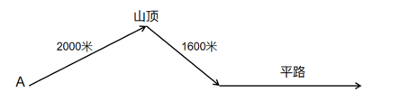

- **A**. 6750
- **B**. 10350　✅
- **C**. 13500
- **D**. 17100

**答案**：B

**官方解析**

设机器人在折返前最多行进了x米平路，根据题意可得：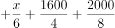，解得x=6750，故机器人在折返前最多能行进2000+1600+6750=10350米。

故正确答案为B。

---

## 第 6 题　qid 4628129 · 数学运算

甲、乙协商，在属于乙的一片荒地上由甲负责开发一块长30米宽若干米的长方形地块，开发出来后，分一块以长方形地块的宽为边长的正方形地块归乙使用，剩下部分归甲使用，若使甲可使用的地块面积最大，长方形地块的宽应为多少米？

- **A**. 25
- **B**. 20
- **C**. 15　✅
- **D**. 10

**答案**：C

**官方解析**

设长方形地块的宽为x米，则正方形地块的边长为x米。根据题意，甲可使用的地块面积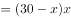。根据两点式，令面积y=0，即分别令x=0和30-x=0，解得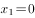，。则当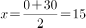时，y取得最大值。即若使甲可使用的地块面积最大，长方形地块的宽应为15米。

故正确答案为C。

---

## 第 7 题　qid 4628135 · 数学运算

某知识比赛共10题，规定答对一题得2分，不答不得分，答错扣1分。小王参加比赛后共得3分，已知小王回答题目超过5题，问小王第一题答错的概率是多少？

- **A**. 

- **B**. 

　✅
- **C**. 

- **D**. 

**答案**：B

**官方解析**

设小王答对、答错、不答的题目数分别为x、y、z，根据题意可列方程：x＋y＋z＝10······①，2x-y＝3······②，①+②可得3x＋z＝13。因为小王回答题目超过5题，即x+y&gt;5，则不答的题目数z可能取值为0到4。依次代入：当z＝0时，，非整数解，不满足题意，排除；当z＝1时，x=4，y=10-1-4=5；当z＝2时，，非整数解，不满足题意，排除；当z＝3时，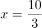，非整数解，不满足题意，排除；当z＝4时，x=3，y=10-4-3=3。则小王答题情况有两种：第一种是答对4题，答错5题，不答1题；第二种是答对3题，答错3题，不答4题。

根据公式：概率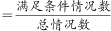，若是第一种情况，总共10道题中答错了5道，则每道题答错的概率是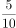；若是第二种情况，总共10道题中答错了3道，则每道题答错的概率是。由于两种情况发生的概率是相同的，即各，则小王第一题答错的概率为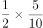。

故正确答案为B。

---

## 第 8 题　qid 4628137 · 数学运算

甲、乙两地分别为一条河流的上下游，两地相距360千米，A船往返需要35小时，其中从甲地到乙地的时间比从乙地到甲地的时间短5小时。B船在静水中的速度为12千米每小时。问其从甲地开往乙地需要多少小时？

- **A**. 12
- **B**. 20
- **C**. 24　✅
- **D**. 40

**答案**：C

**官方解析**

根据“从甲地到乙地的时间比从乙地到甲地的时间短”可知，从甲地到乙地为顺水行驶，从乙地到甲地为逆水行驶。设A船从甲地到乙地的顺水行驶时间为x小时，从乙地到甲地的逆水行驶时间为y小时。由题意可列方程：x＋y＝35······①，y-x＝5······②。联立方程①和②，解得x＝15，y＝20。结合两地相距360千米，可得A船从甲地到乙地的顺水行驶的速度千米/小时，A船从乙地到甲地的逆水行驶的速度千米/小时。根据公式：，可得甲、乙两地间水流速度千米/小时。B船从甲地开往乙地的顺水速度为12＋3＝15千米/小时，则B船从甲地开往乙地的时间为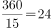小时。

故正确答案为C。

---

## 第 9 题　qid 4630412 · 数学运算

图书馆有一批总重量为1.95吨的旧书，需要用纸箱装好运走。每个纸箱能装的重量最多是35千克（纸箱本身重量可以忽略不计），且要求所使用纸箱的数量尽可能少。如果用一辆最大载重量为0.15吨的平板车将这批书拉走，则至少需要拉多少趟？

- **A**. 13
- **B**. 14　✅
- **C**. 15
- **D**. 16

**答案**：B

**官方解析**

根据题意可知，旧书总重量为1.95吨=1950千克，平板车每趟的最大载重量为0.15吨=150千克。最少使用纸箱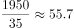个，即56个，平板车每趟至多可运纸箱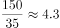个，即4个，则至少需要拉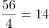趟。

故正确答案为B。

---

## 第 10 题　qid 4630419 · 数学运算

现有100升、120升和150升三种容积的油桶共16个，总容积为2030升，其中150升规格的油桶有x个。现将若干个150升规格的油桶换为同样数量的100升油桶，使得100升规格的油桶达到x个，此时所有油桶的容积为1880升，问x的值为多少？

- **A**. 2
- **B**. 4
- **C**. 5　✅
- **D**. 9

**答案**：C

**官方解析**

设原有100升的油桶y个，则120升的油桶有（16-x-y）个。

方法一：根据“将若干个150升规格的油桶换为同样数量的100升油桶”，可知交换的每桶容积相差150-100=50升，交换前后总容积相差2030-1880=150升，则共交换个油桶，即y=x-3。根据题意可列方程：100（x-3）+120[16-x-（x-3）]+150x=2030，解得x=5。

方法二：根据题意可列方程：100y+120（16-x-y）+150x=2030，化简得：3x-2y=11，根据2y是偶数，11是奇数，则3x应为奇数，即x为奇数，排除A、B两项。代入C项：当x=5时，y=2，满足题意，当选；代入D项：当x=9时，y=8，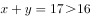，不满足题意，排除。

故正确答案为C。

---

## 第 11 题　qid 4630438 · 数学运算

甲工艺品厂x名工人平均每人生产y件某种工艺品，正好完成生产任务。如调入1名工人，则每人只需要完成y-2件这种工艺品即可。问以下哪个坐标图能准确反映x（横轴）与y（纵轴）之间的关系?

- **A**. 

- **B**. 

- **C**. 
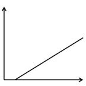

- **D**. 
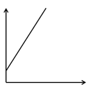
　✅

**答案**：D

**官方解析**

根据生产任务总量不变，可列方程：xy=（x+1）×（y-2），化简得：y=2x+2，当x=0时，y=2，只有D项符合。
故正确答案为D。

---
