# 2021年新疆生产建设兵团行政执法类公务员考试《行测》题（网友回忆版）

> 数量关系 · 10 题 · 新疆 2021

## 第 1 题　qid 4004708 · 数学运算

8个包装盒里面分别装有17、19、26、27、35、40、42、50包小蛋糕，小李先取走一盒，其余的被小王、小周、小孙拿走，已知小王和小周取走的蛋糕包数相同，并且是小孙拿走的两倍，则小王取走的盒子里面的蛋糕包数最可能是：

- **A**. 19、26、35
- **B**. 19、35、42
- **C**. 17、27、26
- **D**. 17、35、40　✅

**答案**：D

**官方解析**

方法一：8个包装盒里面共装有小蛋糕包。代入选项，小王、小周、小孙、小李拿走的小蛋糕包数如下表所示：

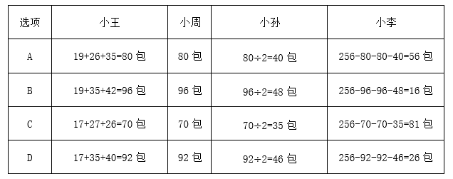

因小李拿走一盒，A、B、C三项中小李拿走的小蛋糕包数在题干中不存在，只有D项后小李拿走的26包在题干中存在。

方法二：8个包装盒里面共装有小蛋糕包，设小李拿走包，小孙拿走包，则小王和小周分别拿走包。，即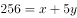，因的尾数为0或5，因此的尾数只能是6或1，结合题干数据，只能取值26。代入解得，则，即小王共拿走92包，包，只有D项符合要求。

故正确答案为D。

---

## 第 2 题　qid 4004725 · 数学运算

已知某宾馆共有30个房间，一名清洁工拿着30把钥匙，她只知道一把钥匙开一把锁，但是不知道哪把钥匙开哪把锁，现在她要打扫每一间房子，需要将钥匙和房间一一匹配，她最多要试多少次？

- **A**. 365
- **B**. 385
- **C**. 435　✅
- **D**. 465

**答案**：C

**官方解析**

30个房间有30把锁，第1把钥匙最多试开29次，因为如果29次都打不开锁，那么不必再试，剩余的这把钥匙肯定是第30把锁的钥匙；依次类推，第2把钥匙最多试开28次；第3把钥匙最多试开27次······第29把钥匙最多试开1次；最后剩下的1把钥匙和1把锁必匹配，即试开0次。故将钥匙和房间一一匹配最多试开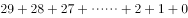次。

故正确答案为C。

---

## 第 3 题　qid 4004735 · 数学运算

某仓库有一批货物以75%的利润率出售，售出90%后，剩下的货物全部以6折出售，那么这批货物的最终利润率为：

- **A**. 68%　✅
- **B**. 62%
- **C**. 54%
- **D**. 51%

**答案**：A

**官方解析**

赋值此批货物为10件，每件成本100元，则总成本为元。出售过程列表如下：

此批货物总利润为元，最终利润率为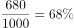。

故正确答案为A。

---

## 第 4 题　qid 4004743 · 数学运算

甲乙两人同时沿直线跑道两端匀速相向而行，两人第一次迎面相遇时距跑道中点50米，两人到达跑道尽头时立即掉头重新出发，重新出发后两人第二次相遇，第二次两人相遇也为迎面相遇，且距跑道中点150米。则此时两人中速度较快一人比速度较慢一人多行走多少米？

- **A**. 150
- **B**. 400
- **C**. 200
- **D**. 300　✅

**答案**：D

**官方解析**

假设甲比乙快，则两人第一次相遇时距离中点50米处应在靠近乙的一侧，此时米，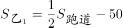米，故米。根据多次相遇问题公式：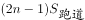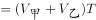，第一次相遇时，第二次相遇时，可得。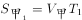，，可得，同理，故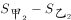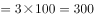米，即第二次相遇时两人中速度较快一人比速度较慢一人多行走300米。

故正确答案为D。

---

## 第 5 题　qid 4004749 · 数学运算

已知2021年7月1日星期四，那么2021年12月10日是星期几？

- **A**. 星期二
- **B**. 星期三
- **C**. 星期四
- **D**. 星期五　✅

**答案**：D

**官方解析**

由题意可知，从2021年7月1日到2021年12月10日，还需经过7月份剩下的30天、8月份31天、9月份30天、10月份31天、11月份30天、12月份10天，共计162天。一周为7天，以7天为一个周期，则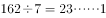，经过了23个周期余1天，故2021年12月10日是星期四的后一天，即星期五。

故正确答案为D。

---

## 第 6 题　qid 4004759 · 数学运算

某商店2020年3月每天的营业额比前一天高X元，该月10号的营业额是1号的4倍，12号的营业额为420元。问该商店2020年3月的营业额是多少元？

- **A**. 16740　✅
- **B**. 18425
- **C**. 24120
- **D**. 31620

**答案**：A

**官方解析**

由题意可知，该商店3月份每天的营业额为公差为的等差数列。根据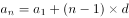，则10号的营业额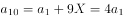，整理可得，则12号的营业额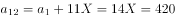元，解得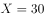，故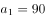。根据等差数列求和公式：，则该商店2020年3月的营业额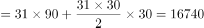元。

故正确答案为A。

---

## 第 7 题　qid 4004763 · 数学运算

甲、乙、丙三人都报名去摄影馆学习摄影技术，甲每隔4天去一次，乙每隔5天去一次，丙每隔6天去一次，三人在星期四第一次相遇，下次相遇的日期为：

- **A**. 星期一
- **B**. 星期三
- **C**. 星期四　✅
- **D**. 星期五

**答案**：C

**官方解析**

甲每隔4天去一次，即每5天去一次；乙每隔5天去一次，即每6天去一次；丙每隔6天去一次，即每7天去一次。三人周期的最小公倍数为210天，即每210天三人相遇一次。三人在星期四第一次相遇，在210天后再次相遇，每周有7天，，为30个完整周期，则下次相遇的日期为星期四。

故正确答案为C。

---

## 第 8 题　qid 4004773 · 数学运算

天气预报对未来五天的天气情况进行了预测，每天晴天的概率都是0.7，不晴天的概率是0.3。那么这5天中恰好3天晴天的概率是多少？

- **A**. 0.031
- **B**. 0.343
- **C**. 0.185
- **D**. 0.309　✅

**答案**：D

**官方解析**

5天中恰好3天是晴天，即3天晴天2天不晴天。则满足题意的概率为：，与D项最接近。

故正确答案为D。

---

## 第 9 题　qid 4004801 · 数学运算

某部门有9名员工，从中随机抽取2人参加公司代表大会，要求女员工人数不得少于1人。已知该部门女员工比男员工多1人，则共有多少种方案符合要求？

- **A**. 24
- **B**. 30　✅
- **C**. 36
- **D**. 72

**答案**：B

**官方解析**

该部门共9名员工，由于女员工比男员工多1人，故该部门女员工有5人，男员工有4人。抽取2人参加大会，女员工人数不得少于1人，可分情况如下：

①1个女员工1个男员工，有种方案；

②2个女员工，有种方案。

共有种方案。

故正确答案为B。

---

## 第 10 题　qid 4004806 · 数学运算

小王平时骑摩托车上班，如果他提速20%，那么他到公司的时间比平时要提早10分钟。假如他提速25%，则他到公司的时间比平时早多长时间？

- **A**. 16分钟
- **B**. 15分钟
- **C**. 13分钟
- **D**. 12分钟　✅

**答案**：D

**官方解析**

方法一：赋值小王平时的速度为20，则提速后速度为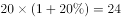。假设小王平时到公司的时间为，由于路程不变，则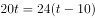，解得分钟。提速后速度为，由于路程不变，则提速后的时间为分钟，则他到公司的时间比平时早分钟。

方法二：设小王平时的速度为，提速后速度为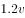，速度比为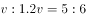。根据路程一定，速度与时间成反比，设小王平时到公司的时间为，可得平时与提速后的时间比为，解得分钟。若提速，设提速后到公司的时间为，则平时与提速后的速度比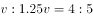，平时与提速后的时间比为，解得分钟，则他到公司的时间比平时早分钟。

故正确答案为D。

---
