# 2021年江苏省公务员录用考试《行测》题（A类）（网友回忆版）

> 数量关系 · 19 题 · 江苏 2021

## 第 1 题　qid 2741962 · 数学运算

-1.6，-4，-6，-3，1.5，（    ）

- **A**. -2.25　✅
- **B**. -1.5
- **C**. 1.5
- **D**. 3.75

**答案**：A

**官方解析**

题干数列相邻两项之间存在明显的倍数关系，优先考虑作商。后项前项，得到新数列：2.5，1.5，0.5，-0.5，（    ），是公差为-1的等差数列，故新数列中下一项。故所求项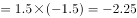。

故正确答案为A。

---

## 第 2 题　qid 2741969 · 数学运算

2，3，4，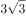，，（    ）

- **A**. 
8

- **B**. 
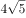

- **C**. 
9
　✅
- **D**. 

**答案**：C

**官方解析**

将数列统一转化为根号形式，则原数列转化为：、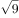、、、，（    ），根号内数字变化幅度较小且呈递增趋势，优先考虑作差。作差后可得：5、7、11、19，（    ），二次作差得：2、4、8，（    ），是公比为2的等比数列，下一项为，故所求项为。

故正确答案为C。

注：此题为旧题重考，原2016年江苏省公务员录用考试《行测》题（A类）第60题

---

## 第 3 题　qid 2741974 · 数学运算

3.2，5.5，11.9，19.21，43.37，（    ）

- **A**. 73.89
- **B**. 75.85　✅
- **C**. 85.73
- **D**. 89.75

**答案**：B

**官方解析**

题干都为小数，优先考虑机械划分，将整数部分和小数部分拆开无规律，考虑将整数部分和小数部分作和，可得新数列为：5、10、20、40、80，是公比为2的等比数列，则所求项整数与小数加和，只有B项符合。

故正确答案为B。

---

## 第 4 题　qid 2742000 · 数学运算

1，，，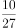，，（    ）

- **A**. 

- **B**. 

　✅
- **C**. 

- **D**. 

**答案**：B

**官方解析**

数列大多数为分数，可判断为分数数列，原数列可转化为：，，，，，（    ），观察分母为幂次数列：，，，，，则下一项分母为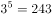；分子部分考虑作商，后一项前一项分别为：1，2.5，4，5.5，是公差为1.5的等差数列，则新数列下一项为，故原数列所求项分子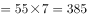。

故正确答案为B。

---

## 第 5 题　qid 2741990 · 数学运算

某农场有A、B、C三个粮仓，原先粮食储量之比为5：9：10，今年丰收后每个粮仓新增加的粮食储量相同，A、B两个粮仓的储量之比变为3：5，则今年丰收后三个粮仓的储存总量比原先增加：

- **A**. 

　✅
- **B**. 

- **C**. 

- **D**. 

**答案**：A

**官方解析**

根据题干，可将A、B、C三个粮仓原先粮食储量分别赋值为5、9、10。设今年丰收后每个粮仓新增加的粮食均为，则A、B、C三个粮仓今年粮食储量分别为、、，由今年A、B两个粮仓的储量之比变为3：5，可得，解得。则今年丰收后三个粮仓的储存总量比原先增加。

故正确答案为A。

---

## 第 6 题　qid 2741998 · 数学运算

某科技公司向银行申请甲、乙两种一年期的贷款总计5000万元，两种贷款的年利率分别为和。若该公司向银行支付的总贷款利息为295.6万元，则甲种贷款的金额是（    ）。

- **A**. 2250万元
- **B**. 2400万元　✅
- **C**. 2650万元
- **D**. 2800万元

**答案**：B

**官方解析**

设甲种贷款的金额为万元，则乙种贷款的金额为（）万元。根据题意，可得，解得：。则甲种贷款的金额是2400万元。

故正确答案为B。

---

## 第 7 题　qid 2742004 · 数学运算

某机关甲、乙、丙三个部门参加植树造林活动，各部门植树的数量相同。甲部门花10天完成任务后，支援乙、丙两个部门各2天，最终乙部门植树12天完成，丙部门15天完成。若丙部门每天植树的数量比乙部门少4棵，则甲部门每天植树的数量是：

- **A**. 30棵　✅
- **B**. 40棵
- **C**. 50棵
- **D**. 60棵

**答案**：A

**官方解析**

由题意可得，甲、乙、丙三个部门的效率关系为：······①；······②。整理①②可得：甲∶乙3∶2，乙∶丙5∶4，故甲效率：乙效率：丙效率15∶10∶8。结合丙部门每天植树的数量比乙部门少4棵，可得1份对应棵，故甲的效率棵。

故正确答案为A。

---

## 第 8 题　qid 2742011 · 数学运算

甲、乙两人从湖边某处同时出发，沿两条环湖路各自匀速行走。甲恰好用2小时回到出发点，比乙晚到20分钟，多走了2800米。若甲每分钟比乙多走10米，则甲行走的速度是：

- **A**. 4.2千米/小时
- **B**. 4.5千米/小时
- **C**. 4.8千米/小时
- **D**. 5.4千米/小时　✅

**答案**：D

**官方解析**

设甲的速度为米/分钟，则乙的速度为（）米/分钟，根据题意“甲恰好用2小时回到出发点，比乙晚到20分钟，多走了2800米”，可得甲用时120分钟，乙用时分钟，则，解得米/分钟，即5.4千米/小时。

故正确答案为D。

---

## 第 9 题　qid 2742017 · 数学运算

某产品的生产须经历A、B、C、D四道工序，由甲、乙、丙、丁每人负责其中一道工序，四人单独完成每道工序所需的时间（单位：分钟）如下表所示，则他们完成四道工序所需的总时间最少是（    ）。

- **A**. 18分钟
- **B**. 22分钟
- **C**. 24分钟　✅
- **D**. 26分钟

**答案**：C

**官方解析**

要想他们完成四道工序所需的总时间最少，每道工序可以选择用时最少的人。观察发现甲负责A和D都是用时最少的人，可分情况讨论：①若甲负责A、乙负责B、丁负责C，这时只能由丙负责D，共用时分钟；②若甲负责D、丁负责C、乙负责B，这时只能由丙负责A，共用时分钟。则他们完成四道工序所需的总时间最少是24分钟。

故正确答案为C。

---

## 第 10 题　qid 2742003 · 数学运算

某次圆桌会议共设8个座位，有4个部门参加，每个部门2人，排座位时，要求同一部门的两人相邻，若小李和小王代表不同部门参加会议，则他们座位相邻的概率是：

- **A**. 

- **B**. 

- **C**. 

- **D**. 

　✅

**答案**：D

**官方解析**

首先计算总的情况数，先捆绑：当同一部门两人相邻时，其内部顺序有种情况，共4个部门，则共有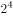种情况；再排列：当4个部门的人员坐在圆桌时，根据圆桌排列公式可得，有种情况，则总的情况数为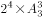。

然后计算满足条件的情况数，先捆绑：当小李和小王座位相邻时，则二人的内部顺序有种情况，与其同一部门的人自动坐在二人身边，无需考虑，4个人变成一个大组。另外两个部门的人各自捆绑，内部顺序均有种情况，则共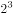种情况；再排列：此时相当于3组人员进行圆桌排列，有种情况，则总情况数为。

因此所求概率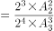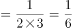。

故正确答案为D。

---

## 第 11 题　qid 2742006 · 数学运算

某企业有甲、乙两个口罩生产车间，每天工作8小时，共生产口罩3万只，若每天甲、乙两个车间分别加班两小时和三小时，则可多生产口罩一万只，若每天甲、乙两个车间分别加班三小时和两小时，则两个车间生产62万只口罩，所需的时间为：

- **A**. 14天
- **B**. 15天
- **C**. 16天　✅
- **D**. 17天

**答案**：C

**官方解析**

设甲每小时生产口罩只，乙每小时生产口罩只：根据题意列方程：······①；······②；联立①②，解得，。

若每天甲、乙两个车间分别加班三小时和两小时，则甲、乙每天的工作效率和为只。根据公式：工作时间天。

故正确答案为C。

---

## 第 12 题　qid 2742016 · 数学运算

某单位开设a、b、c、d、e、f六门培训课程，员工自愿报名参加。经统计，员工选择的课程组合共有四种，，，，，所有培训结束后，统一安排考试，为不影响工作要求，在1月4日至10日中的连续六天考完，每天只考一门，且每位员工都不会连续两天参加考试，则安排这六门课程考试日期的不同方法共有：

- **A**. 2种
- **B**. 4种　✅
- **C**. 8种
- **D**. 12种

**答案**：B

**官方解析**

根据题意可知，考试日期分为1月4日至9日和1月5日至10日两种情况；具体考试日期安排为：a可以和b、d相连，b可以和a、d、e相连，c只能和d相连，d可以和a、b、c、e相连，e可以和b、d、f相连，f只能和e相连。情况较复杂，考虑枚举法，c和f的情况固定，从其入手，则有如下两种情况：，，所以安排这六门课程考试日期的不同方法共有种。

故正确答案为B。

---

## 第 13 题　qid 2742021 · 数学运算

为促进旅游业复苏，今年8月1日起至年底，某景区门票价格在原定价的基础上，工作日执行两折票价，双休日及法定节假日执行五折票价。预计门票打折后，每天的游客人数均比原来翻一番，已知打折前该景区双休日平均每天的游客人数是工作日的5倍，则打折后，该景区一周（该周无法定节假日）的门票收入是打折前的：

- **A**. 0.5倍
- **B**. 0.6倍
- **C**. 0.7倍
- **D**. 0.8倍　✅

**答案**：D

**官方解析**

赋值打折前该景区票价为10元，工作日每天游客为1人。根据题意可得表格如下：

综上，该景区一周打折前的门票收入是元，打折后的门票收入是元，则所求倍数倍。

故正确答案为D。

---

## 第 14 题　qid 2742025 · 数学运算

师徒二人在非遗展馆现场为游客剪纸，有6名游客各自挑选了心仪的花样。已知徒弟制作这6种剪纸的时间分别为2、6、10、12、15、25 （单位：分钟）， 师傅的工作效率是徒弟的1. 5倍，则这6名游客中最后一个拿到剪纸的游客，需要等待的时间至少是：

- **A**. 25分钟
- **B**. 27分钟
- **C**. 28分钟　✅
- **D**. 30分钟

**答案**：C

**官方解析**

根据题意可知，师傅的工作时间应为徒弟工作时间的，设6种剪纸分别为A、B、C、D、E、F，具体工作时间情况如下：

要使最后拿到剪纸的游客等待的时间尽量少，那么尽量让师徒二人同时开工同时结束。观察选项均为整数，考虑从师傅的分数时间凑整入手。观察3个分数共有2种凑整方式：①分钟，此时再做其他任何种类的剪纸都无法与徒弟同时完成，且所用时间超过选项时间，不合理；②分钟，此时剩B、C、D、E四种剪纸，观察发现E种剪纸给师傅做，B、C、D三种给徒弟做，正好可以做到同时开工同时结束。即 分钟。

故正确答案为C。

---

## 第 15 题　qid 2741964 · 数学运算

某省选派若干名本科生和研究生去乡村支教，其中男生和女生的比例是7：3，研究生和本科生的比例是1：4。若男本科生的人数恰好为女研究生人数的4倍，则女本科生至少比男研究生多：

- **A**. 3人　✅
- **B**. 6人
- **C**. 9人
- **D**. 12人

**答案**：A

**官方解析**

根据“男生和女生的比例是7：3”可知，总人数是的倍数，根据“研究生和本科生的比例是1：4”可知，总人数是的倍数，故设总人数为，则男生人数为，女生人数为，研究生人数为，本科生人数为。男本科生人数为女研究生人数的4倍，由此设女研究生人数为，则男本科生人数为。具体情况如下：

由此可知：男研究生人数研究生总人数女研究生人数男生总人数男本科生人数，即，整理可得：，则至少为3，至少为5，女本科生最少为人，男研究生最少为人，前者比后者多人。

故正确答案为A。

---

## 第 16 题　qid 2741966 · 数学运算

小王去超市购买便携包和小哑铃作为知识竞赛活动的奖品。这两种商品超市正在进行促销，便携包单价18元，买2送1；小哑铃单价12元，买3送1。小王按计划购买了便携包和小哑铃合计56个，共使用活动经费606元，则他购买小哑铃的数量是：

- **A**. 24个
- **B**. 25个　✅
- **C**. 26个
- **D**. 27个

**答案**：B

**官方解析**

结合题干与选项可知，选项信息充分，故可用代入排除法解题：

代入A项：小哑铃24个，买3送1（4个一组），组，需花钱购买个；便携包个，买2送1（3个一组），组······2个，需花钱购买个。则共用经费元，不符合题意；

代入B项：小哑铃25个，买3送1（4个一组），组······1个，需花钱购买个；便携包个，买2送1（3个一组），组······1个，需花钱购买个。则共用经费元，符合题意。

B项满足题干所有条件，因此无需继续验证。

故正确答案为B。

---

## 第 17 题　qid 2741970 · 数学运算

某公司需要将A、B两地的同一产品运往甲、乙两个工厂。已知A、B两地分别有该产品500吨和700吨，甲、乙两个工厂对该产品的需求量均为600吨，若从A地出发运往甲、乙两个工厂的运价分别为150元/吨和130元/吨，从B地出发的运价分别为160元/吨和145元/吨，则完成此项运输任务的运费最少是：

- **A**. 174000元
- **B**. 174500元
- **C**. 175000元
- **D**. 175500元　✅

**答案**：D

**官方解析**

需运费最少，则优先考虑两地中运往两厂运费差较大情况。由题意可知，A地运往两工厂每吨运价差元，B地运往两工厂每吨运价差元。A地运费差较大，故A地500吨产品优先运往乙工厂最划算，乙工厂所差100吨产品由B地运送即可，则所需运费为元；B地剩余的600吨产品运往甲工厂，所需运费为元。则完成此项运输任务的运费最少为元。

故正确答案为D。

---

## 第 18 题　qid 2741972 · 数学运算

某公司举办迎新晚会，参加者每人都领取一个按入场顺序编号的号牌，晚会结束时宣布：从1号开始向后每隔6个号的号码可获得纪念品A，从最后一个号码开始向前每隔8个号的号码可获得纪念品B。最后发现没有人同时获得纪念品A和B，则参加迎新晚会的人数最多有：

- **A**. 46人
- **B**. 48人　✅
- **C**. 52人
- **D**. 54人

**答案**：B

**官方解析**

根据“从1号开始向后每隔6个号的号码可获得纪念品A”可知，从前往后，A获奖号码成公差为7的等差数列：1、8、15、22、29、36、43、50、57······；同理，从后往前，B获奖号码成公差为9的等差数列，题目求人数最多，考虑从大到小进行代入验证。
代入D项：若人数最多为54人，则可获得纪念品B的号码分别为54、45、36号······，此时36号同时获得纪念品A和B，不符合条件，排除；
代入C项：若人数最多为52人，则可获得纪念品B的号码分别为52、43号······，此时43号同时获得纪念品A和B，不符合条件，排除；
代入B项：若人数最多为48人，则可获得纪念品B的号码分别为48、39、30、21、12、3号，没有人同时获得纪念品A和B，符合条件，当选。
故正确答案为B。

---

## 第 19 题　qid 2741989 · 数学运算

如图所示，当某航天器飞过地球北极正上方S处时，恰好能够观测到北纬45度，北极圈内的区域。假定地球是半径为R的球体，则点S到地球北极点的距离是：

- **A**. 

- **B**. 
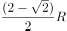

- **C**. 

　✅
- **D**. 

**答案**：C

**官方解析**

如下图所示，设北极点为N点，地心为O点，过O点做赤道线与圆相交于A点。北纬45度为赤道平面与赤道平面的中心和北纬45度小圆上任意一点连线所成的角，即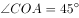，，则，且直线SC与圆相切于C点，则，因此为等腰直角三角形，根据题意可知，OC，则SC，SO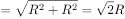，ON，那么所求距离SNSOON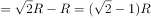。

故正确答案为C。

---
