# 2021年江苏省公务员录用考试《行测》题（B类）（网友回忆版）

> 数量关系 · 19 题 · 江苏 2021

## 第 1 题　qid 2742211 · 数学运算

-4，-6，-8，-8，-4，（    ）

- **A**. -2
- **B**. -4
- **C**. 6　✅
- **D**. 8

**答案**：C

**官方解析**

数列变化幅度较小，且无明显特征，优先考虑作差，后项前项得到数列：-2、-2、0、4，无明显特征，继续作差得到新数列：0、2、4，是公差为2的等差数列，则新数列下一项为，故原数列所求项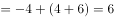。

故正确答案为C。

---

## 第 2 题　qid 2742222 · 数学运算

，，，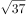，，（    ）

- **A**. 

- **B**. 
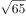
　✅
- **C**. 

- **D**. 

**答案**：B

**官方解析**

观察数列，无明显特征，将原数列转化为同一形式：，，，，，（    ）。

方法一：考虑根号下数字两两作和形成新数列①：25，41，61，85，（    ），继续作和无规律，考虑新数列两两作差得②：16，20，24，（    ），是公差为4的等差数列，下一项为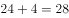，则新数列①下一项，故所求项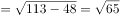。

方法二：考虑根号下数字两两作差形成新数列①：9，7，13，11，（    ），继续作差无规律，考虑新数列两两作和得②：16，20，24，（    ），是公差为4的等差数列，下一项为，则新数列①下一项，故所求项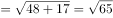。

故正确答案为B。

---

## 第 3 题　qid 2742224 · 数学运算

2.2，3.5，9.7，13.19，37.27，（    ）

- **A**. 53.75　✅
- **B**. 59.73
- **C**. 73.53
- **D**. 75.59

**答案**：A

**官方解析**

题干为小数数列，优先考虑机械划分，分开看无规律，考虑整体看。小数部分整数部分形成新数列：4，8，16，32，64，（    ），是公比为2的等比数列，则所求项小数部分整数部分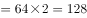，只有A项满足。

故正确答案为A。

---

## 第 4 题　qid 2742208 · 数学运算

，，，，，（    ）

- **A**. 
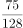

- **B**. 

- **C**. 

- **D**. 

　✅

**答案**：D

**官方解析**

方法一：题干与选项均为分数，优先考虑分数数列，反约分后得到新数列为：，，，，。分子部分后项÷前项得到数列：1，3，5，7，是公差为2的等差数列，下一项为7+2=9，则分子下一项为35×9=315；分母部分后项÷前项得到数列：1，2，4，8，是公比为2的等比数列，下一项8×2=16，则分母下一项为：64×16=1024。故原数列下一项为。

方法二：题干与选项均为分数，优先考虑分数数列，若难以发现规律，则考虑作积作商。相邻两项作商，后项÷前项，得到新数列为，，，······，新数列仍为分数数列，观察分子部分，为公差是2的等差数列，则新数列下一项分子为7+2=9；观察分母部分，为公比是2的等比数列，则新数列下一项分母是8×2=16，则新数列下一项为，故原数列所求项。

故正确答案为D。

---

## 第 5 题　qid 2741990 · 数学运算

某农场有A、B、C三个粮仓，原先粮食储量之比为5：9：10，今年丰收后每个粮仓新增加的粮食储量相同，A、B两个粮仓的储量之比变为3：5，则今年丰收后三个粮仓的储存总量比原先增加：

- **A**. 

　✅
- **B**. 

- **C**. 

- **D**. 

**答案**：A

**官方解析**

根据题干，可将A、B、C三个粮仓原先粮食储量分别赋值为5、9、10。设今年丰收后每个粮仓新增加的粮食均为，则A、B、C三个粮仓今年粮食储量分别为、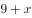、，由今年A、B两个粮仓的储量之比变为3：5，可得，解得。则今年丰收后三个粮仓的储存总量比原先增加。

故正确答案为A。

---

## 第 6 题　qid 2742209 · 数学运算

已知2017年、2018年和2019年全球共发射卫星1132颗，2019年发射的卫星数量是2017年的1.5倍还多2颗，2018年比2017年多31颗，则2019年全球共发射卫星：

- **A**. 314颗
- **B**. 345颗
- **C**. 452颗
- **D**. 473颗　✅

**答案**：D

**官方解析**

设2017年发射的卫星数量为颗，根据题意，2018年发射的卫星数量为（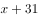）颗，2019年发射的卫星数量为（）颗。已知三年共发射卫星1132颗，即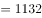，解得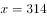。故2019年全球共发射卫星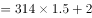颗。

故正确答案为D。

---

## 第 7 题　qid 2742219 · 数学运算

超市销售某种水果，第一天按原价售出总量的，第二天原价打8折售出剩下的一半，第三天按成本价全部售出。若销售全部该水果的利润率为，则该水果按原价销售的利润率为：

- **A**. 

- **B**. 

- **C**. 

　✅
- **D**. 

**答案**：C

**官方解析**

赋值该水果的成本为10元/千克，总量为10千克；假设该水果的原价为元/千克。根据题意可得表格如下：

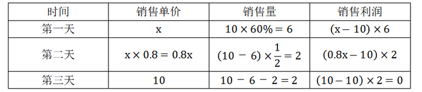

该水果全部销售的总利润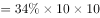元，即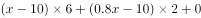，解得。根据公式：利润率，按原价销售的利润率为。

故正确答案为C。

---

## 第 8 题　qid 2742004 · 数学运算

某机关甲、乙、丙三个部门参加植树造林活动，各部门植树的数量相同。甲部门花10天完成任务后，支援乙、丙两个部门各2天，最终乙部门植树12天完成，丙部门15天完成。若丙部门每天植树的数量比乙部门少4棵，则甲部门每天植树的数量是：

- **A**. 30棵　✅
- **B**. 40棵
- **C**. 50棵
- **D**. 60棵

**答案**：A

**官方解析**

由题意可得，甲、乙、丙三个部门的效率关系为：······①；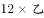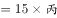······②。整理①②可得：甲∶乙3∶2，乙∶丙5∶4，故甲效率：乙效率：丙效率15∶10∶8。结合丙部门每天植树的数量比乙部门少4棵，可得1份对应棵，故甲的效率棵。

故正确答案为A。

---

## 第 9 题　qid 2742017 · 数学运算

某产品的生产须经历A、B、C、D四道工序，由甲、乙、丙、丁每人负责其中一道工序，四人单独完成每道工序所需的时间（单位：分钟）如下表所示，则他们完成四道工序所需的总时间最少是（    ）。

- **A**. 18分钟
- **B**. 22分钟
- **C**. 24分钟　✅
- **D**. 26分钟

**答案**：C

**官方解析**

要想他们完成四道工序所需的总时间最少，每道工序可以选择用时最少的人。观察发现甲负责A和D都是用时最少的人，可分情况讨论：①若甲负责A、乙负责B、丁负责C，这时只能由丙负责D，共用时分钟；②若甲负责D、丁负责C、乙负责B，这时只能由丙负责A，共用时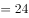分钟。则他们完成四道工序所需的总时间最少是24分钟。

故正确答案为C。

---

## 第 10 题　qid 2742220 · 数学运算

为发展乡村旅游，某地需建设一条游览线路，甲工程队施工，工期为60天，费用为144万元；若由乙工程队施工，工期为40天，费用为158万元。为在旅游旺季到来前完工，工期不能超过30天，为此需要甲、乙两工程队合作施工，则完成此项工程的费用最少是：

- **A**. 156万元
- **B**. 154万元
- **C**. 151万元　✅
- **D**. 149万元

**答案**：C

**官方解析**

赋值该工程的工作总量为120份，则甲工程队每天完成的工作量为份，每天的费用为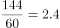万元，平均每份的费用为万元；乙工程队每天完成的工作量为份，每天的费用为万元，平均每份的费用为万元。

由于甲工程队完成每份工作量的费用比乙工程队少，因此，要想完成此项工程的费用最少，需尽量多用甲工程队，即甲工程队施工30天，乙工程队完成剩余的工作量。乙工程队完成剩余工作量的时间天，此时总费用为万元。

故正确答案为C。

---

## 第 11 题　qid 2742016 · 数学运算

某单位开设a、b、c、d、e、f六门培训课程，员工自愿报名参加。经统计，员工选择的课程组合共有四种，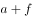，，，，所有培训结束后，统一安排考试，为不影响工作要求，在1月4日至10日中的连续六天考完，每天只考一门，且每位员工都不会连续两天参加考试，则安排这六门课程考试日期的不同方法共有：

- **A**. 2种
- **B**. 4种　✅
- **C**. 8种
- **D**. 12种

**答案**：B

**官方解析**

根据题意可知，考试日期分为1月4日至9日和1月5日至10日两种情况；具体考试日期安排为：a可以和b、d相连，b可以和a、d、e相连，c只能和d相连，d可以和a、b、c、e相连，e可以和b、d、f相连，f只能和e相连。情况较复杂，考虑枚举法，c和f的情况固定，从其入手，则有如下两种情况：，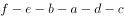，所以安排这六门课程考试日期的不同方法共有种。

故正确答案为B。

---

## 第 12 题　qid 2741970 · 数学运算

某公司需要将A、B两地的同一产品运往甲、乙两个工厂。已知A、B两地分别有该产品500吨和700吨，甲、乙两个工厂对该产品的需求量均为600吨，若从A地出发运往甲、乙两个工厂的运价分别为150元/吨和130元/吨，从B地出发的运价分别为160元/吨和145元/吨，则完成此项运输任务的运费最少是：

- **A**. 174000元
- **B**. 174500元
- **C**. 175000元
- **D**. 175500元　✅

**答案**：D

**官方解析**

需运费最少，则优先考虑两地中运往两厂运费差较大情况。由题意可知，A地运往两工厂每吨运价差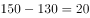元，B地运往两工厂每吨运价差元。A地运费差较大，故A地500吨产品优先运往乙工厂最划算，乙工厂所差100吨产品由B地运送即可，则所需运费为元；B地剩余的600吨产品运往甲工厂，所需运费为元。则完成此项运输任务的运费最少为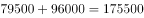元。

故正确答案为D。

---

## 第 13 题　qid 2741966 · 数学运算

小王去超市购买便携包和小哑铃作为知识竞赛活动的奖品。这两种商品超市正在进行促销，便携包单价18元，买2送1；小哑铃单价12元，买3送1。小王按计划购买了便携包和小哑铃合计56个，共使用活动经费606元，则他购买小哑铃的数量是：

- **A**. 24个
- **B**. 25个　✅
- **C**. 26个
- **D**. 27个

**答案**：B

**官方解析**

结合题干与选项可知，选项信息充分，故可用代入排除法解题：

代入A项：小哑铃24个，买3送1（4个一组），组，需花钱购买个；便携包个，买2送1（3个一组），组······2个，需花钱购买个。则共用经费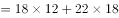元，不符合题意；

代入B项：小哑铃25个，买3送1（4个一组），组······1个，需花钱购买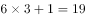个；便携包个，买2送1（3个一组），组······1个，需花钱购买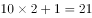个。则共用经费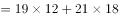元，符合题意。

B项满足题干所有条件，因此无需继续验证。

故正确答案为B。

---

## 第 14 题　qid 2742200 · 数学运算

某三甲医院派甲、乙、丙、丁四名医生到A、B、C、D四个社区义诊，每个医生只负责一个社区。已知甲不去A社区，且如果丙去C社区，那么丁去D社区，则不同的派法共有：

- **A**. 15种　✅
- **B**. 18种
- **C**. 21种
- **D**. 24种

**答案**：A

**官方解析**

方法一：由题意可知，甲不去A社区，则甲只能去B、C、D社区中的一个，分类讨论：

若甲去B社区，剩下三人随意排列为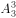种情况，但其中存在1种情况（丙去C社区、丁去A社区、乙去D社区）不满足题意，因此有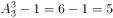种情况；

若甲去C社区，剩下三人随意排列，有种情况；

若甲去D社区，则丙不能去C社区，丙可去A、B社区，即种选择，剩下乙丁随意选，有种情况，种情况。

因此，不同的派法共有种。

方法二：甲不去A社区，则甲只能去B、C、D社区中的一个，有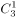种选择。若不考虑其他特殊情况，其他三人随意安排有种情况。此时，总情况数有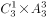种。但若丙去C社区、甲去D社区、丁去A或B社区，这两种情况不符合题意；若丙去C社区、甲去B社区、丁去A社区，这一种情况也不符合题意。因此，满足题意的派法有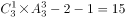种。

方法三：甲不去A社区，则甲只能去B、C、D社区中的一个，有种选择。若不考虑其他特殊情况，其他三人随意安排有种情况，那么考虑特殊情况后符合题意的派法种。结合选项，只有A项符合。

故正确答案为A。

---

## 第 15 题　qid 2742203 · 数学运算

某地举行募捐抽奖活动。每位捐赠者均有一次抽奖机会。活动设一二三等奖，获奖规则如下：抽奖时捐赠人在0到9这10个数字中一次随机抽取4个不同的数字，若与主办方开奖时随机抽取的4个不同数字完全相同，则获一等奖；若恰有3个相同，则获二等奖；若恰有2个相同则获三等奖。则捐赠者获奖的概率是：

- **A**. 
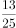

- **B**. 
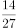

- **C**. 
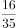

- **D**. 

　✅

**答案**：D

**官方解析**

捐赠者获奖的概率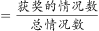。

获一等奖的情况：取出的4个数字有4个与主办方一样，共1种；

获二等奖的情况：取出的4个数字有3个与主办方一样，共种；

获三等奖的情况：取出的4个数字有2个与主办方一样，共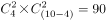种；

则获奖的概率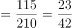。

故正确答案为D。

---

## 第 16 题　qid 2742210 · 数学运算

已知A、B两地相距9公里，甲乙两人沿同一条路从A地匀速去往B地，甲的速度为6公里/小时，每走半小时休息15分钟；乙比甲早15分钟出发，中途不休息。若他们在途中（不包括起点和终点）至少相遇2次，则甲、乙两人到达B地的时间最多相差：

- **A**. 30分钟
- **B**. 45分钟　✅
- **C**. 60分钟
- **D**. 75分钟

**答案**：B

**官方解析**

甲的速度为6公里/小时，甲半小时走的路程公里，甲45分钟行驶3公里，行驶9公里用时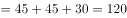分钟。要使得甲、乙两人到达B地的时间相差最多，则乙的速度应当尽可能小。从乙出发开始计时，若他们在途中（不包括起点和终点）至少相遇2次，而乙的速度又尽可能小，因此相遇的两次（如下图所示）分别为：开始到45分钟之间甲追上乙一次、45分钟到60分钟之间乙追上甲一次。

因为乙先走了15分钟，所以甲从开始到45分钟共走3公里，乙45分钟走的路程应小于等于3公里，可得乙的速度4公里/小时；甲从开始到60分钟共走3公里 ，乙60分钟走的路程应大于等于3公里，可得乙的速度3公里/小时。因此，乙的速度取最小为3公里/小时，则乙到达时间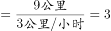小时180分钟。

故两人到达B地的时间最多相差分钟。

故正确答案为B。

---

## 第 17 题　qid 2741972 · 数学运算

某公司举办迎新晚会，参加者每人都领取一个按入场顺序编号的号牌，晚会结束时宣布：从1号开始向后每隔6个号的号码可获得纪念品A，从最后一个号码开始向前每隔8个号的号码可获得纪念品B。最后发现没有人同时获得纪念品A和B，则参加迎新晚会的人数最多有：

- **A**. 46人
- **B**. 48人　✅
- **C**. 52人
- **D**. 54人

**答案**：B

**官方解析**

根据“从1号开始向后每隔6个号的号码可获得纪念品A”可知，从前往后，A获奖号码成公差为7的等差数列：1、8、15、22、29、36、43、50、57······；同理，从后往前，B获奖号码成公差为9的等差数列，题目求人数最多，考虑从大到小进行代入验证。
代入D项：若人数最多为54人，则可获得纪念品B的号码分别为54、45、36号······，此时36号同时获得纪念品A和B，不符合条件，排除；
代入C项：若人数最多为52人，则可获得纪念品B的号码分别为52、43号······，此时43号同时获得纪念品A和B，不符合条件，排除；
代入B项：若人数最多为48人，则可获得纪念品B的号码分别为48、39、30、21、12、3号，没有人同时获得纪念品A和B，符合条件，当选。
故正确答案为B。

---

## 第 18 题　qid 2742006 · 数学运算

某企业有甲、乙两个口罩生产车间，每天工作8小时，共生产口罩3万只，若每天甲、乙两个车间分别加班两小时和三小时，则可多生产口罩一万只，若每天甲、乙两个车间分别加班三小时和两小时，则两个车间生产62万只口罩，所需的时间为：

- **A**. 14天
- **B**. 15天
- **C**. 16天　✅
- **D**. 17天

**答案**：C

**官方解析**

设甲每小时生产口罩只，乙每小时生产口罩只：根据题意列方程：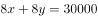······①；······②；联立①②，解得，。

若每天甲、乙两个车间分别加班三小时和两小时，则甲、乙每天的工作效率和为只。根据公式：工作时间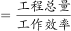天。

故正确答案为C。

---

## 第 19 题　qid 2742221 · 数学运算

如图，在中，点D是AC的中点，点E是BC的三等分点，连接AE和BD交于点F，连接DE，若面积为36，则下列说法正确的是（    ）。

- **A**. 
的面积小于3
　✅
- **B**. 
的面积大于6

- **C**. 
的面积等于的面积

- **D**. 
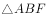的面积等于的面积

**答案**：A

**官方解析**

如图所示，在中，点D为AC中点，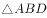与等底同高，故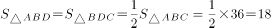。点E为BC边上三等分点，即，与同高，故，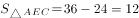。同理，与同高，故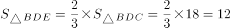，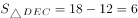 ，B选项错误，排除；

因为，故C、D选项只需验证一个，已知，，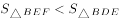，即，而，故，因此，C、D选项错误。

故正确答案为A。

---
