# 2021年江苏省公务员录用考试《行测》题（C类）（网友回忆版）

> 数量关系 · 19 题 · 江苏 2021

## 第 1 题　qid 2742245 · 数学运算

-9，7，-1，3，1，（    ）

- **A**. -2
- **B**. 0
- **C**. 1
- **D**. 2　✅

**答案**：D

**官方解析**

方法一：数列无明显特征，优先考虑作差。原数列“后项减前项”得到新数列：16、-8、4、-2，新数列是公比为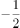的等比数列，下一项，则所求项。

方法二：观察数列发现，，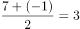，，可得到规律：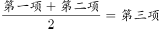，则所求项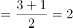。

故正确答案为D。

---

## 第 2 题　qid 2742243 · 数学运算

2，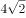，，，，（    ）

- **A**. 

- **B**. 

- **C**. 
48
　✅
- **D**. 
72

**答案**：C

**官方解析**

观察数列，有整数和根号，考虑机械划分。

原数列可化为：，，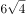，，。

整数部分为：2，4，6，8，10，为偶数列，下一项为12；

根号部分为：1，2，4，7，11，后项前项为1，2，3，4，为自然数列，下一个数为5，则根号部分下一项为；

则该数列下一项为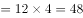。

故正确答案为C。

---

## 第 3 题　qid 2742244 · 数学运算

1，，，4，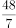，（    ）

- **A**. 
9

- **B**. 
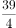

- **C**. 
12
　✅
- **D**. 
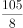

**答案**：C

**官方解析**

数列大部分为分数，判定为分数数列。分子、分母呈递增趋势，反约分，将分母转化为单调递增，则原数列可转化为：，，，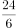，，（    ），发现分母是公差为1的等差数列，分子是公比为2的等比数列，所求项为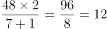。

故正确答案为C。

---

## 第 4 题　qid 2742249 · 数学运算

10.1，18.2，29.4，43.7，58.9，（    ）

- **A**. 67.3　✅
- **B**. 76.11
- **C**. 84.27
- **D**. 105.24

**答案**：A

**官方解析**

数列全部都是小数，优先考虑小数点前、点后分别找规律，无明显规律，考虑组内规律。小数点前小数点后新数列为9，16，25，36，49，发现新数列为幂次数列，转化成幂次数的形式为，，，，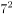，新数列指数为2，底数为自然数列，则新数列下一项指数为2，底数为8，新数列下一项为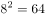。观察选项，只有A项小数点前小数点后，满足规律，当选。

故正确答案为A。

---

## 第 5 题　qid 2741990 · 数学运算

某农场有A、B、C三个粮仓，原先粮食储量之比为5：9：10，今年丰收后每个粮仓新增加的粮食储量相同，A、B两个粮仓的储量之比变为3：5，则今年丰收后三个粮仓的储存总量比原先增加：

- **A**. 

　✅
- **B**. 

- **C**. 

- **D**. 

**答案**：A

**官方解析**

根据题干，可将A、B、C三个粮仓原先粮食储量分别赋值为5、9、10。设今年丰收后每个粮仓新增加的粮食均为，则A、B、C三个粮仓今年粮食储量分别为、、，由今年A、B两个粮仓的储量之比变为3：5，可得，解得。则今年丰收后三个粮仓的储存总量比原先增加。

故正确答案为A。

---

## 第 6 题　qid 2741998 · 数学运算

某科技公司向银行申请甲、乙两种一年期的贷款总计5000万元，两种贷款的年利率分别为和。若该公司向银行支付的总贷款利息为295.6万元，则甲种贷款的金额是（    ）。

- **A**. 2250万元
- **B**. 2400万元　✅
- **C**. 2650万元
- **D**. 2800万元

**答案**：B

**官方解析**

设甲种贷款的金额为万元，则乙种贷款的金额为（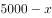）万元。根据题意，可得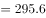，解得：。则甲种贷款的金额是2400万元。

故正确答案为B。

---

## 第 7 题　qid 2742220 · 数学运算

为发展乡村旅游，某地需建设一条游览线路，甲工程队施工，工期为60天，费用为144万元；若由乙工程队施工，工期为40天，费用为158万元。为在旅游旺季到来前完工，工期不能超过30天，为此需要甲、乙两工程队合作施工，则完成此项工程的费用最少是：

- **A**. 156万元
- **B**. 154万元
- **C**. 151万元　✅
- **D**. 149万元

**答案**：C

**官方解析**

赋值该工程的工作总量为120份，则甲工程队每天完成的工作量为份，每天的费用为万元，平均每份的费用为万元；乙工程队每天完成的工作量为份，每天的费用为万元，平均每份的费用为万元。

由于甲工程队完成每份工作量的费用比乙工程队少，因此，要想完成此项工程的费用最少，需尽量多用甲工程队，即甲工程队施工30天，乙工程队完成剩余的工作量。乙工程队完成剩余工作量的时间天，此时总费用为万元。

故正确答案为C。

---

## 第 8 题　qid 2742021 · 数学运算

为促进旅游业复苏，今年8月1日起至年底，某景区门票价格在原定价的基础上，工作日执行两折票价，双休日及法定节假日执行五折票价。预计门票打折后，每天的游客人数均比原来翻一番，已知打折前该景区双休日平均每天的游客人数是工作日的5倍，则打折后，该景区一周（该周无法定节假日）的门票收入是打折前的：

- **A**. 0.5倍
- **B**. 0.6倍
- **C**. 0.7倍
- **D**. 0.8倍　✅

**答案**：D

**官方解析**

赋值打折前该景区票价为10元，工作日每天游客为1人。根据题意可得表格如下：

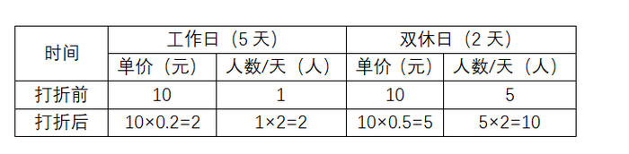

综上，该景区一周打折前的门票收入是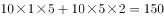元，打折后的门票收入是元，则所求倍数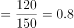倍。

故正确答案为D。

---

## 第 9 题　qid 2742219 · 数学运算

超市销售某种水果，第一天按原价售出总量的，第二天原价打8折售出剩下的一半，第三天按成本价全部售出。若销售全部该水果的利润率为，则该水果按原价销售的利润率为：

- **A**. 

- **B**. 

- **C**. 

　✅
- **D**. 

**答案**：C

**官方解析**

赋值该水果的成本为10元/千克，总量为10千克；假设该水果的原价为元/千克。根据题意可得表格如下：

该水果全部销售的总利润元，即，解得。根据公式：利润率，按原价销售的利润率为。

故正确答案为C。

---

## 第 10 题　qid 2742011 · 数学运算

甲、乙两人从湖边某处同时出发，沿两条环湖路各自匀速行走。甲恰好用2小时回到出发点，比乙晚到20分钟，多走了2800米。若甲每分钟比乙多走10米，则甲行走的速度是：

- **A**. 4.2千米/小时
- **B**. 4.5千米/小时
- **C**. 4.8千米/小时
- **D**. 5.4千米/小时　✅

**答案**：D

**官方解析**

设甲的速度为米/分钟，则乙的速度为（）米/分钟，根据题意“甲恰好用2小时回到出发点，比乙晚到20分钟，多走了2800米”，可得甲用时120分钟，乙用时分钟，则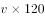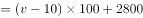，解得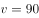米/分钟，即5.4千米/小时。

故正确答案为D。

---

## 第 11 题　qid 2741970 · 数学运算

某公司需要将A、B两地的同一产品运往甲、乙两个工厂。已知A、B两地分别有该产品500吨和700吨，甲、乙两个工厂对该产品的需求量均为600吨，若从A地出发运往甲、乙两个工厂的运价分别为150元/吨和130元/吨，从B地出发的运价分别为160元/吨和145元/吨，则完成此项运输任务的运费最少是：

- **A**. 174000元
- **B**. 174500元
- **C**. 175000元
- **D**. 175500元　✅

**答案**：D

**官方解析**

需运费最少，则优先考虑两地中运往两厂运费差较大情况。由题意可知，A地运往两工厂每吨运价差元，B地运往两工厂每吨运价差元。A地运费差较大，故A地500吨产品优先运往乙工厂最划算，乙工厂所差100吨产品由B地运送即可，则所需运费为元；B地剩余的600吨产品运往甲工厂，所需运费为元。则完成此项运输任务的运费最少为元。

故正确答案为D。

---

## 第 12 题　qid 2742004 · 数学运算

某机关甲、乙、丙三个部门参加植树造林活动，各部门植树的数量相同。甲部门花10天完成任务后，支援乙、丙两个部门各2天，最终乙部门植树12天完成，丙部门15天完成。若丙部门每天植树的数量比乙部门少4棵，则甲部门每天植树的数量是：

- **A**. 30棵　✅
- **B**. 40棵
- **C**. 50棵
- **D**. 60棵

**答案**：A

**官方解析**

由题意可得，甲、乙、丙三个部门的效率关系为：······①；······②。整理①②可得：甲∶乙3∶2，乙∶丙5∶4，故甲效率：乙效率：丙效率15∶10∶8。结合丙部门每天植树的数量比乙部门少4棵，可得1份对应棵，故甲的效率棵。

故正确答案为A。

---

## 第 13 题　qid 2742200 · 数学运算

某三甲医院派甲、乙、丙、丁四名医生到A、B、C、D四个社区义诊，每个医生只负责一个社区。已知甲不去A社区，且如果丙去C社区，那么丁去D社区，则不同的派法共有：

- **A**. 15种　✅
- **B**. 18种
- **C**. 21种
- **D**. 24种

**答案**：A

**官方解析**

方法一：由题意可知，甲不去A社区，则甲只能去B、C、D社区中的一个，分类讨论：

若甲去B社区，剩下三人随意排列为种情况，但其中存在1种情况（丙去C社区、丁去A社区、乙去D社区）不满足题意，因此有种情况；

若甲去C社区，剩下三人随意排列，有种情况；

若甲去D社区，则丙不能去C社区，丙可去A、B社区，即种选择，剩下乙丁随意选，有种情况，种情况。

因此，不同的派法共有种。

方法二：甲不去A社区，则甲只能去B、C、D社区中的一个，有种选择。若不考虑其他特殊情况，其他三人随意安排有种情况。此时，总情况数有种。但若丙去C社区、甲去D社区、丁去A或B社区，这两种情况不符合题意；若丙去C社区、甲去B社区、丁去A社区，这一种情况也不符合题意。因此，满足题意的派法有种。

方法三：甲不去A社区，则甲只能去B、C、D社区中的一个，有种选择。若不考虑其他特殊情况，其他三人随意安排有种情况，那么考虑特殊情况后符合题意的派法种。结合选项，只有A项符合。

故正确答案为A。

---

## 第 14 题　qid 2741966 · 数学运算

小王去超市购买便携包和小哑铃作为知识竞赛活动的奖品。这两种商品超市正在进行促销，便携包单价18元，买2送1；小哑铃单价12元，买3送1。小王按计划购买了便携包和小哑铃合计56个，共使用活动经费606元，则他购买小哑铃的数量是：

- **A**. 24个
- **B**. 25个　✅
- **C**. 26个
- **D**. 27个

**答案**：B

**官方解析**

结合题干与选项可知，选项信息充分，故可用代入排除法解题：

代入A项：小哑铃24个，买3送1（4个一组），组，需花钱购买个；便携包个，买2送1（3个一组），组······2个，需花钱购买个。则共用经费元，不符合题意；

代入B项：小哑铃25个，买3送1（4个一组），组······1个，需花钱购买个；便携包个，买2送1（3个一组），组······1个，需花钱购买个。则共用经费元，符合题意。

B项满足题干所有条件，因此无需继续验证。

故正确答案为B。

---

## 第 15 题　qid 2742247 · 数学运算

某市举办足球邀请赛，共有9个球队报名参加，其中包含上届比赛的前3名球队。现将这9个球队通过抽签的方式平均分成3组进行单循环比赛，则上届比赛的前3名球队被分在同一组的概率是：

- **A**. 

- **B**. 

　✅
- **C**. 
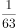

- **D**. 

**答案**：B

**官方解析**

方法一：给情况求概率，概率。总情况数为9个球队平均分成3组，共有种情况；满足条件的情况为上届比赛的前3名球队被分在同一组，其他6个球队平均分为2组，有种情况，则上届比赛的前3名球队被分在同一组的概率。

方法二：前3名球队要被分在同一组，首先第1名球队可任意选择一个位置，概率为1；第2名球队可在剩下8个位置选1个位置，要求和第1名球队同组，概率为；第三名球队可在剩下7个位置选1个位置，要求和前2名球队同组，概率为。因此所求概率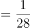。

故正确答案为B。

---

## 第 16 题　qid 2741964 · 数学运算

某省选派若干名本科生和研究生去乡村支教，其中男生和女生的比例是7：3，研究生和本科生的比例是1：4。若男本科生的人数恰好为女研究生人数的4倍，则女本科生至少比男研究生多：

- **A**. 3人　✅
- **B**. 6人
- **C**. 9人
- **D**. 12人

**答案**：A

**官方解析**

根据“男生和女生的比例是7：3”可知，总人数是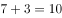的倍数，根据“研究生和本科生的比例是1：4”可知，总人数是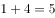的倍数，故设总人数为，则男生人数为，女生人数为，研究生人数为，本科生人数为。男本科生人数为女研究生人数的4倍，由此设女研究生人数为，则男本科生人数为。具体情况如下：

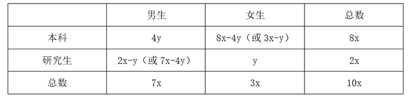

由此可知：男研究生人数研究生总人数女研究生人数男生总人数男本科生人数，即，整理可得：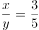，则至少为3，至少为5，女本科生最少为人，男研究生最少为人，前者比后者多人。

故正确答案为A。

---

## 第 17 题　qid 2742025 · 数学运算

师徒二人在非遗展馆现场为游客剪纸，有6名游客各自挑选了心仪的花样。已知徒弟制作这6种剪纸的时间分别为2、6、10、12、15、25 （单位：分钟）， 师傅的工作效率是徒弟的1. 5倍，则这6名游客中最后一个拿到剪纸的游客，需要等待的时间至少是：

- **A**. 25分钟
- **B**. 27分钟
- **C**. 28分钟　✅
- **D**. 30分钟

**答案**：C

**官方解析**

根据题意可知，师傅的工作时间应为徒弟工作时间的，设6种剪纸分别为A、B、C、D、E、F，具体工作时间情况如下：

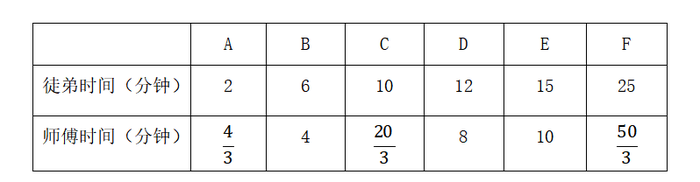

要使最后拿到剪纸的游客等待的时间尽量少，那么尽量让师徒二人同时开工同时结束。观察选项均为整数，考虑从师傅的分数时间凑整入手。观察3个分数共有2种凑整方式：①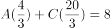分钟，此时再做其他任何种类的剪纸都无法与徒弟同时完成，且所用时间超过选项时间，不合理；②分钟，此时剩B、C、D、E四种剪纸，观察发现E种剪纸给师傅做，B、C、D三种给徒弟做，正好可以做到同时开工同时结束。即 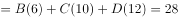分钟。

故正确答案为C。

---

## 第 18 题　qid 2741972 · 数学运算

某公司举办迎新晚会，参加者每人都领取一个按入场顺序编号的号牌，晚会结束时宣布：从1号开始向后每隔6个号的号码可获得纪念品A，从最后一个号码开始向前每隔8个号的号码可获得纪念品B。最后发现没有人同时获得纪念品A和B，则参加迎新晚会的人数最多有：

- **A**. 46人
- **B**. 48人　✅
- **C**. 52人
- **D**. 54人

**答案**：B

**官方解析**

根据“从1号开始向后每隔6个号的号码可获得纪念品A”可知，从前往后，A获奖号码成公差为7的等差数列：1、8、15、22、29、36、43、50、57······；同理，从后往前，B获奖号码成公差为9的等差数列，题目求人数最多，考虑从大到小进行代入验证。
代入D项：若人数最多为54人，则可获得纪念品B的号码分别为54、45、36号······，此时36号同时获得纪念品A和B，不符合条件，排除；
代入C项：若人数最多为52人，则可获得纪念品B的号码分别为52、43号······，此时43号同时获得纪念品A和B，不符合条件，排除；
代入B项：若人数最多为48人，则可获得纪念品B的号码分别为48、39、30、21、12、3号，没有人同时获得纪念品A和B，符合条件，当选。
故正确答案为B。

---

## 第 19 题　qid 2742248 · 数学运算

有120个棱长为30cm的正方体包装盒，按图示规律堆放在长方体库房的一角，恰好全部堆在一起，且最高的3层形状和图中一致，则该库房的高至少为：

- **A**. 2.4m　✅
- **B**. 2.7m
- **C**. 3.0m
- **D**. 3.3m

**答案**：A

**官方解析**

根据题意库房高度应包装盒总高度，即库房高度的最小值应该等于包装盒总高度。已知包装盒棱长30cm，因此每层的高度是0.3米，即总的高度一定是0.3的整数倍。根据题意正方体包装盒每层数量从上到下分别为1、3、6、10、15、21、28、36、45······ ，规律为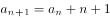。结合选项分别为8、9、10、11层，8层共需要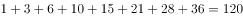，因此120个包装盒恰好可以构成8层，即高度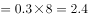米。

故正确答案为A。

---
