# 2021年河北省公务员录用考试《行测》题（网友回忆版）

> 数量关系 · 15 题 · 河北 2021

## 第 1 题　qid 3523433 · 数学运算

已知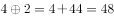，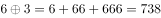，可得的值是：

- **A**. 9864
- **B**. 9872
- **C**. 98752
- **D**. 98760　✅

**答案**：D

**官方解析**

根据题干所给公式：，，推出

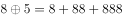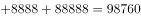，或根据尾数法，相加尾数为0，只有D项满足。

故正确答案为D。

---

## 第 2 题　qid 3522770 · 数学运算

某公园鸟语林共饲养180只鸟类动物，为养护方便，园方将鸟语林分为A、B、C三个区。某日，A区的一部分鸟飞至B、C两区，清点时，B、C两区鸟的数量都增加一倍。次日，一些鸟又从B区飞至A、C两区，清点时，A、C两区鸟的数量也都增加一倍。第三日，一部分鸟又从C区飞至A、B两区，清点时，A、B两区鸟的数量同样增加一倍，而此时C区剩余鸟的数量恰好是A区的，那么，最初A区有多少只鸟？

- **A**. 103　✅
- **B**. 104
- **C**. 105
- **D**. 106

**答案**：A

**官方解析**

将三次鸟的变化情况列表如下：

根据第三次后，C区剩余鸟的数量恰好是A区的，说明A区现在鸟的数量必然为26的整数倍。代入A项：最初A区有103只，则只，第一次后只，则A区剩余只，第三次后也是26的倍数，符合题意，当选。其余选项均不满足。

故正确答案为A。

---

## 第 3 题　qid 3522354 · 数学运算

小明去某楼盘售楼部咨询售房情况。置业顾问告诉他，如果再卖出50套，则已卖出的数量与未卖出的数量相等；如果再卖出150套，则已卖出的数量比未卖出的数量多一半，问该楼盘目前还剩下多少套房子未卖出？

- **A**. 350套
- **B**. 450套
- **C**. 550套　✅
- **D**. 650套

**答案**：C

**官方解析**

设目前已卖、未卖分别为、套，根据题意列方程组：

······①

······②

联立①②求解可得，，即目前还剩下550套房子未卖出。

故正确答案为C。

---

## 第 4 题　qid 3522371 · 数学运算

不超过100名的小朋友站成一列。如果从第一人开始依次按1，2，3，···，9的顺序循环报数，最后一名小朋友报的是7；如果按1，2，3，···，11的顺序循环报数，最后一名小朋友报的是9，那么一共有多少名小朋友？

- **A**. 98
- **B**. 97　✅
- **C**. 96
- **D**. 95

**答案**：B

**官方解析**

根据题意，总人数余7、总人数余9，代入排除：

A项，余8，不满足题意，排除；B项，余7，余9，满足题意，当选；C项，余6，不满足题意，排除；D项，余5，不满足题意，排除。所以只有B项满足，则共有97名小朋友。

故正确答案为B。

---

## 第 5 题　qid 3523431 · 数学运算

社区居委会张阿姨为表达对志愿者的感谢，买了一些毛线，准备织帽子和手套。这些毛线如果全部织帽子可织15个，全部织手套可织20只，现将一个帽子和两只手套做成一个“爱心礼包”。这些毛线最多可做成几个“爱心礼包”？

- **A**. 4
- **B**. 5
- **C**. 6　✅
- **D**. 7

**答案**：C

**官方解析**

赋值毛线的总量为15和20的公倍数60份，则每个帽子需要的毛线量为份，每只手套需要的毛线量为份。一个帽子和两只手套做成一个“爱心礼包”，则一个爱心礼包需要的毛线量为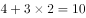份。则“爱心礼包”的个数为个。

故正确答案为C。

---

## 第 6 题　qid 3522433 · 数学运算

某市江滨有一处边长为50米的等边三角形广场。广场里设计有三个大小相等的圆环鹅卵石道路供市民散步。如下图所示，各圆相切，各圆与三角形也相切。问沿三个圆环外围石道（不含圆切点之间的弧）散步一圈约为多少米？

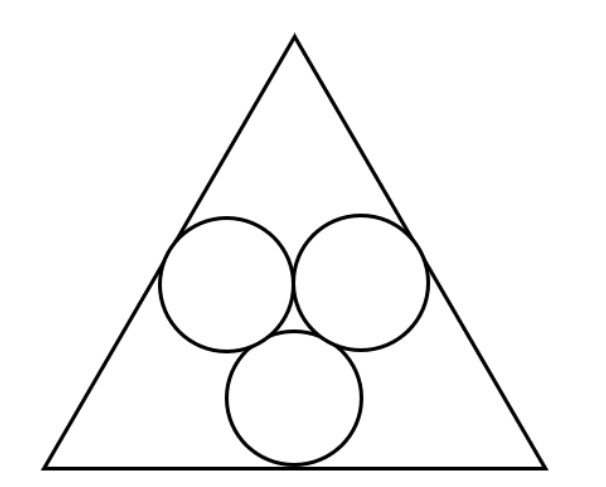

- **A**. 95
- **B**. 105　✅
- **C**. 115
- **D**. 125

**答案**：B

**官方解析**

如图所示：

假设等边三角形的三个顶点分别为A、B、C，三个圆的圆心分别为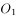、、，且圆与BC相切于D点，圆和圆相切为E点，连接AD、、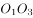、、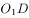、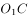以及CE。因三个圆大小相同，则，同时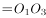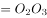，故三角形为等边三角形，令其中心为o，则三段不含圆切点之间的弧对应的圆心角均为。令三个圆的半径为r，故所求距离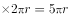。

方法一：O点即为等边三角形ABC与等边三角形共同的中心，在三角形ABC中高，则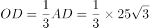（参考备注）。同理，在三角形中，其高为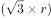，则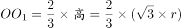。故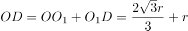，解得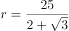，故所求距离。

备注：1.等边三角形的中心即为三角形的重心，连接重心与顶点到对边的线段被重心分成2：1的比例，而这条边恰好就是等边三角形的高，于是中心到顶点距离为，高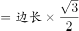，于是中心到顶点距离为。

方法二：如图所示：

连接三个顶点与中心O点，形成三个全等的等腰三角形：△BOC、△AOB、△COA，圆、、分别为它们的内切圆。在△ABC中高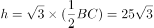，则AO=BO=CO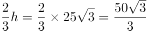（参考备注1），则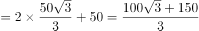，。根据三角形内切圆半径公式（参考备注2）（S为三角形面积，C为三角形周长），故所求距离。

备注2：

在任意△ABC中有内切圆O，令其半径为r，连接三角形顶点与圆心O点可将△ABC分割为三个小三角形，每个小三角形的高均为内切圆半径。则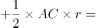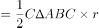，则三角形内切圆半径。

---

## 第 7 题　qid 3523429 · 数学运算

现有一杯浓度为的糖水200克，加入6克糖，再加入24克水后，此时的糖水与原来相比：

- **A**. 不如原来甜
- **B**. 比原来甜
- **C**. 一样甜　✅
- **D**. 无法确定

**答案**：C

**官方解析**

糖水甜度的比较本质是糖水浓度的比较。

方法一：原来糖水的浓度为，现在糖水的浓度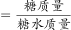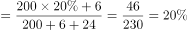，与原来糖水浓度相等，此时糖水与原来相比一样甜。

方法二：原来糖水的浓度为，新加进去的糖与水组成糖水的浓度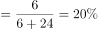，则混合后的糖水浓度也为，与原来糖水浓度相等，此时糖水与原来相比一样甜。

故正确答案为C。

---

## 第 8 题　qid 3522392 · 数学运算

某商场为了促销，进行掷飞镖游戏。每位参与人员投掷一次，假设掷出的飞镖均扎在飞镖板上且位置完全随机，扎中阴影部分区域（含边线）即为中奖。该商场预设中奖概率约为，仅考虑中奖概率的前提下，以下四幅图形（图中的正三角形和正方形均与圆外切或内接）最适合作为飞镖板的是：

- **A**. 

- **B**. 

　✅
- **C**. 

- **D**. 

**答案**：B

**官方解析**

最适合作为飞镖板即阴影部分所占面积比例约为，故需分别求出四个选项阴影所占面积比例。

A项，赋值圆半径为1，则，，阴影面积所占比例（，）；

B项，赋值圆半径为1，则，，阴影面积所占比例；

C项，赋值圆半径为1，则，，阴影面积所占比例；

D项，赋值圆半径为1，，，阴影面积所占比例。

B选项最接近。

故正确答案为B。

---

## 第 9 题　qid 3523432 · 数学运算

假设个人出版著作所得稿费纳税方法如下：（1）稿费不超过800元不纳税；（2）超过800元但不超过4000元的部分纳税；（3）超过4000元的部分纳税。已知张教授出版一部著作，纳税620元，则张教授的这笔稿费是多少元？

- **A**. 9000
- **B**. 8000
- **C**. 7000
- **D**. 6000　✅

**答案**：D

**官方解析**

结合选项可知，张教授的稿费必然超过了4000元，设超出4000元的部分为元，由题干可得方程：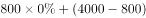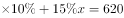，解得：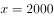。张教授这笔稿费为元。

故正确答案为D。

---

## 第 10 题　qid 3523384 · 数学运算

两个大人带四个孩子去坐只有六个位置的圆型旋转木马，那么两个大人不相邻的概率为：

- **A**. 

- **B**. 

　✅
- **C**. 

- **D**. 

**答案**：B

**官方解析**

方法一：六个人坐在圆型旋转木马的情况总数为。现先让四个孩子去坐，情况数为，四个孩子之间可形成4个空，再让两个大人各选一个空，情况数为，故两个大人不相邻的情况数为，题目所求概率为。

方法二：六个人坐在圆型旋转木马的情况总数为。考虑反面，两个大人相邻情况数为，题目所求概率为。

故正确答案为B。

备注：n个人随机围绕圆桌就坐，情况数为。

---

## 第 11 题　qid 3523374 · 数学运算

A、B、C三个社区需要建设若干个5G基站，三个社区可供选择的建设基站地点分别有2个、4个、5个，现从A、B、C三个社区分别选取1、2、3个地点随机分配给甲、乙、丙三个施工队进行建设，要求每个施工队只能承接一个社区，则承建方式有：

- **A**. 720种　✅
- **B**. 480种
- **C**. 360种
- **D**. 120种

**答案**：A

**官方解析**

根据题意，从A社区选取1个地点的情况数为；从B社区选取2个地点的情况数为；从C社区选取3个地点的情况数为，组合情况数为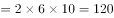。又已知每个施工队只能承接一个社区，将三个社区建设任务分配给三个施工队，承建方式有种。

故正确答案为A。

---

## 第 12 题　qid 3522397 · 数学运算

某果品公司急需将一批不易存放的水果从A市运到B市销售。现有四家运输公司可供选择，这四家运输公司提供的信息如下：

如果A、B两市的距离为S千米（千米），且这批水果在包装与装卸以及运输过程中的损耗为300元/小时，那么要使果品公司支付的总费用（包装与装卸费用、运输费用及损耗三项之和）最小，应选择哪家运输公司？

- **A**. 甲
- **B**. 乙
- **C**. 丙　✅
- **D**. 丁

**答案**：C

**官方解析**

根据运输时间，各公司运输费用情况如下：

甲公司与丁公司总运费相同，因此二者均不可能为最小，排除A、D两项，丙公司总费用小于乙公司，可知丙公司总费用最小。

故正确答案为C。

---

## 第 13 题　qid 3523435 · 数学运算

张爷爷早晨5点多外出晨练，出门时钟表上的时针和分针的夹角是110度，不到6点进门时，钟表上的时针和分针的夹角还是110度，则张爷爷外出时间是多少分钟？

- **A**. 30
- **B**. 35
- **C**. 40　✅
- **D**. 45

**答案**：C

**官方解析**

分针每分钟转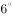，时针每分钟转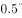，分针比时针每分钟多转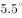。张爷爷出发时是5点多，时针和分针的夹角是110度，不到6点进门时，时针和分针的夹角仍是110度，说明出门时分针落后时针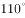，进门时分针超过时针。因此张爷爷外出期间，分针比时针总共多转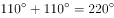，用时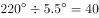分钟。

故正确答案为C。

---

## 第 14 题　qid 3522375 · 数学运算

某装修公司订购了一条长为2.5m的长方体条形不锈钢管，要剪裁成60cm和43cm长的两种规格长度不锈钢管若干根，所裁钢管的横截面与原来一样，不考虑剪裁时材料的损耗，要使剩下的钢管尽量少，此时材料的利用率为：

- **A**. 0.998
- **B**. 0.996　✅
- **C**. 0.928
- **D**. 0.824

**答案**：B

**官方解析**

设剪裁成60cm的不锈钢管根，剪裁成43cm的不锈钢管根，根据题意，长方体条形不锈钢管长为2.5m，单位统一为250cm，即：；

当时，解得，cm，剩cm；

当时，解得，cm，剩cm；

当时，解得，cm，剩cm。

由此可知剩下的钢管最少为1cm，利用率。

故正确答案为B。

---

## 第 15 题　qid 3522765 · 数学运算

某草莓经销商有201箱的草莓要分配给若干个水果店，要求无论选用怎样的分配方式，都要有水果店至少分到8箱，则水果店至多有：

- **A**. 20个
- **B**. 21个
- **C**. 28个　✅
- **D**. 29个

**答案**：C

**官方解析**

问至多有多少家，从最大的选项开始代入。分配方式为平均分配可以使水果店最多。

代入D项，如果每家先分7箱，箱，则所有水果店分得水果都不超过8箱，排除；

代入C项，如果每家先分7箱，箱，剩余箱，都会有一家至少分得8箱，当选。

故正确答案为C。

---
