# 2021年浙江省公务员录用考试《行测》题（C类）（网友回忆版）

> 数量关系 · 14 题 · 浙江 2021

## 第 1 题　qid 2776104 · 数学运算

某机构计划派45名志愿者分别前往A、B、C、D四个地区参与扶贫活动，其中A地区的志愿者人数要比B地区多4人，C地区人数为全部志愿者人数的，D地区人数不超过任何其他地区，则A地区至少有多少名志愿者？

- **A**. 12
- **B**. 13
- **C**. 15
- **D**. 16　✅

**答案**：D

**官方解析**

方法一：设A地区有名志愿者，则B地区有（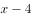）名，C地区有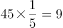名，D地区有名，根据题意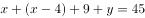，则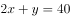，该不定方程中必为偶数。

根据问题所求，在等式中若使取值尽可能小，则取值尽可能大，且要满足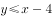、。在中，最大的偶数为8，故当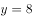时，解得，此时B地区为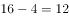名，符合“D地区人数不超过任何其他地区”的要求。

方法二：根据题意可知，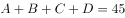名，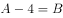，名，D不超过任何其他地区人数（即人数最少）；故考虑代入排除，问至少，从小到大依次代入：

代入A项：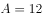，故，，排除；

代入B项：，故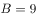，，排除；

代入C项：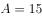，故，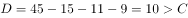，排除；

由于A、B、C三项均不满足条件，因此正确答案只有D项。

验证D项：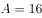，故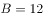，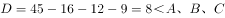，符合题意，当选。

故正确答案为D。

---

## 第 2 题　qid 2776110 · 数学运算

商场有大、小两种果篮销售，每个小号果篮由500克火龙果、300克葡萄和700克橙子组成，每个大号果篮由700克火龙果、1300克葡萄和1000克橙子组成。某日通过果篮方式销售水果超过300千克，其中是葡萄。问当日至少销售了多少千克火龙果？

- **A**. 不到85千克　✅
- **B**. 85-87千克
- **C**. 87-89千克
- **D**. 超过89千克

**答案**：A

**官方解析**

设小号果篮有个，大号果篮有个，根据题意可知：小号果篮总重量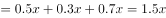千克，大号果篮总重量千克，则可列式：①，②。通过②式解得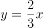，代入①式可得，因、均为整数，则，由于题干提问为“至少销售”，则取值应尽量小。代入验证：若，则为非整数，排除；若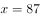，则为整数，满足，故当日至少销售了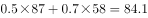千克火龙果。

故正确答案为A。

---

## 第 3 题　qid 2776054 · 数学运算

小李有一张银行卡，他忘记了密码的后3位，只记得这3个数全是奇数且有2个相同。问他尝试不超过两次就输入正确密码的概率为多少？

- **A**. 

　✅
- **B**. 

- **C**. 

- **D**. 
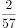

**答案**：A

**官方解析**

奇数为1、3、5、7、9，共五个，总情况为先从5个奇数中选择2个不同奇数，有种，再从中选择1个奇数为重复出现两次的，有种。考虑后3位数字的顺序：在后3位中选2位为重复数字，有种，则总情况数为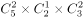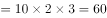种。要求尝试不超过两次就输入正确密码，则分类讨论如下：第一次尝试正确的概率为；第一次错误第二次正确的概率为，则尝试不超过两次就输入正确密码的概率为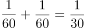。

故正确答案为A。

---

## 第 4 题　qid 2776059 · 数学运算

A、B两地医院分别有库存呼吸设备10台和6台，现需要支援C地医院9台、D地医院7台。已知从A地调运一台设备到C地和D地的运费分别为400元和600元，从B地调运一台设备到C地和D地的运费分别为300元和700元。如果总运费不能超过7800元，共有多少种调运方案？

- **A**. 3
- **B**. 4　✅
- **C**. 5
- **D**. 6

**答案**：B

**官方解析**

设A地向C地调运x台，根据题目条件可列下表：

要求总运费不能超过7800元，可得400x+600（10-x）+300（9-x）+700（x-3）7800，解得x6。又因B地向D地调运台数（x-3）0，即x3，故x取值可为3、4、5、6，即符合题意的调运方案共有4种。

故正确答案为B。

---

## 第 5 题　qid 2776066 · 数学运算

某俱乐部选拔优秀选手参加游泳比赛，选手在规定时间内游完全程，就能获得参赛资格。已知有四分之一的选手获得了参赛资格，获得参赛资格选手的平均完成时间比规定时间快6秒，未获得参赛资格选手的平均完成时间比规定时间慢10秒，所有选手的平均完成时间为140秒，则本次选拔的规定时间为多少秒？

- **A**. 116
- **B**. 125
- **C**. 134　✅
- **D**. 139

**答案**：C

**官方解析**

方法一：方程法。设本次选拔的规定时间为秒，选手总人数为人，则获得参赛资格的有人，未获得参赛资格的有人，由题意可列方程：，解得。

方法二：线段法。本题涉及平均数的混合，结合题意可画出如下线段：

根据线段法“距离与量成反比”，可得距离之比，解得。

故正确答案为C。

---

## 第 6 题　qid 2776071 · 数学运算

甲队参加四场篮球比赛，前两场场均得分为第三场得分的，第四场得72分，是第三场得分的0.9倍。问甲队所有比赛平均每场得多少分？

- **A**. 64
- **B**. 66
- **C**. 68　✅
- **D**. 72

**答案**：C

**官方解析**

根据题意可得，第四场得72分，则第三场得分为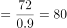分，根据“前两场场均得分为第三场得分的”可得，前两场场均得分为分，故前两场总得分分，则甲队所有比赛平均每场得分分。

故正确答案为C。

---

## 第 7 题　qid 2776080 · 数学运算

AB两地间有县道连接，BC两地间有高速公路连接，且AB间路程是BC间路程的。郭某从A地开车匀速前往B地，到B地后以AB间2倍的速度开往C地，共用时2小时30分。由C地返回A地时高速公路行驶速度不变，县道行驶速度比去程降低，则返程用时为：

- **A**. 2小时45分
- **B**. 2小时50分
- **C**. 3小时10分
- **D**. 3小时15分　✅

**答案**：D

**官方解析**

题干中只给出时间，没有具体的速度和路程，可以用赋值法。如图所示，根据题意可赋值AB间路程为3，BC间路程为4；设从A地开往C地时，AB间速度为，则BC间速度为，用时2小时30分，即150分钟，代入公式：时间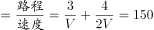min，解得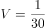。

从C地开往A地，BC间速度不变，为，AB间速度为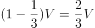，则返程用时min，即3小时15分。

故正确答案为D。

---

## 第 8 题　qid 2776083 · 数学运算

某工厂有甲、乙两个生产车间，每个工人的生产效率都相同。甲车间的总生产效率是乙车间的1.5倍；从甲车间调派30名工人到乙车间之后，甲车间的生产效率是乙车间的1.2倍。问需要从甲车间再调多少名工人到乙车间，两个车间的生产效率才能相同？

- **A**. 20
- **B**. 22
- **C**. 24
- **D**. 25　✅

**答案**：D

**官方解析**

根据题意“每个工人的生产效率都相同”，可知甲乙车间的工人数比等于效率比。设乙车间原有工人数为，则甲车间原有工人数为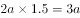。由“从甲车间调派30名工人到乙车间之后，甲车间的生产效率是乙车间的1.2倍。”可得，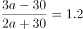，解得，则乙车间原有工人数为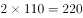名，甲车间原有工人数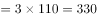名。甲车间调派30名工人到乙车间后，甲车间现有工人数为名，乙车间现有工人数为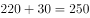名。要想两个车间的生产效率相同，则两个车间工人数应相同为名，那么需要从甲车间再调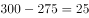名工人到乙车间。

故正确答案为D。

---

## 第 9 题　qid 2776024 · 数学运算

超市采购一批食用油，其中玉米油每桶进价比花生油低，若花生油利润定为进价的，玉米油利润定为进价的，则花生油比玉米油每桶售价高10元。问玉米油每桶比花生油进价低多少元？

- **A**. 10　✅
- **B**. 15
- **C**. 24
- **D**. 25

**答案**：A

**官方解析**

设花生油每桶进价为元，则玉米油每桶进价为元。根据题意可得表格：

根据“花生油比玉米油每桶售价高10元”可得，，解得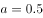，则玉米油每桶比花生油进价低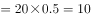元。

故正确答案为A。

---

## 第 10 题　qid 2776037 · 数学运算

某农场有180台收割机，每天可收割吨水稻。现将台收割机更换为新款收割机，生产效率比之前高；剩余的收割机进行升级，生产效率可以提高。如要求升级后的收割机每天水稻收割总量不低于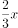吨，新款收割机每天水稻收割总量不低于吨。则的取值有多少种不同的可能性？

- **A**. 2
- **B**. 3　✅
- **C**. 4
- **D**. 5

**答案**：B

**官方解析**

假设每台收割机原来每天可收割1吨水稻，则应为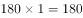。更换了台新款收割机后，生产效率变为，余下的台收割机升级后的效率变为。根据题目要求“升级后的收割机每天水稻收割总量不低于吨，新款收割机每天水稻收割总量不低于吨”可列式，化简整理得，即近似为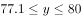，且为整数，故可取78、79、80这三个值，3种不同的可能性。

故正确答案为B。

---

## 第 11 题　qid 2776040 · 数学运算

某通信信道可以传输的信号由1、2、3、4四个数字组成，每组信号包含4个数字（可重复），且前两个数字必须为奇数。某次传输过程中共传输了250组信号，其中传输次数最多的信号传输了次。问的最小值为：

- **A**. 2
- **B**. 3
- **C**. 4　✅
- **D**. 5

**答案**：C

**官方解析**

每组信号中的数字可重复，且前两个数字必须为奇数，则只能是1或3，故有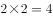种可能；后两个数字则可以是四个数字中的任意数，故有种可能。因此这组信号共有种情况。为保证值最小，则其它信号应尽可能多，因此假设每种信号传输次数都为，即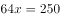，解得，最少3.9次，则向上取整为4次。

故正确答案为C。

---

## 第 12 题　qid 2776044 · 数学运算

某课题小组由8个人组成，他们各自负责撰写书稿的一部分，完成后通过电子邮件传递书稿。问要让每个人都得到完整书稿，课题小组总共至少需要发送多少封邮件？（将同一封邮件同时抄送给个人，视作发送封邮件）

- **A**. 14　✅
- **B**. 16
- **C**. 36
- **D**. 72

**答案**：A

**官方解析**

每人撰写一部分，共8个部分，若想让发送次数尽可能少，则应由其中一人汇总，此时需要其余7人将自己的部分发送给汇总人，共计7次。汇总人汇总后再发给其余7人，此时还需要7次，共计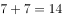次。

故正确答案为A。

---

## 第 13 题　qid 2776072 · 数学运算

研究人员在A、B、C、D、E五块试验田中种植甲、乙、丙、丁、戊五种作物，每块试验田只种一种作物，每年都在所有的安排中随机挑选一种进行种植。问在连续的3年中，A试验田至少2年种植同一种作物的概率为：

- **A**. 

- **B**. 

- **C**. 

　✅
- **D**. 

**答案**：C

**官方解析**

方法一：给情况求概率，考虑公式：概率。总情况为连续的3年中五块试验田随机种植五种作物，有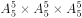种情况。满足情况为A试验田至少2年种植同一种作物，情况数相对较多，正难则反，考虑反面情况：A试验田连续3年种植的作物各不相同，有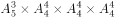种情况。则题目所求概率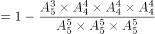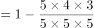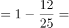。

方法二：正面情况较复杂，讨论反面情况，即A试验田连续3年种植的作物各不相同的概率。A试验田第一年可以种植任意一种作物，概率为1；第二年可以种植剩余四种作物中的任意一种作物，概率为；第三年可以种植剩余三种作物中的任意一种作物，概率为。则题目所求概率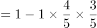。

故正确答案为C。

---

## 第 14 题　qid 2776086 · 数学运算

由于采用了新的种植技术，某种农产品的产量和品质都得到了提升。在平均每亩增产的同时，每千克售价也增加了。尽管每亩生产成本增加了，但每亩利润也增加了。问采用新种植技术后，每亩利润占每亩销售收入的比例在以下哪个范围内？

- **A**. 
不到

- **B**. 
~
　✅
- **C**. 
~

- **D**. 
超过

**答案**：B

**官方解析**

赋值该农产品在采用新的种植技术前的平均每亩产量为4，每千克售价为5，假设该农产品原来每亩的生产成本为，则根据题意并结合公式：利润售价成本，可得下表：

则可知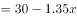，解得。采用新种植技术后，每亩利润，每亩利润占每亩销售收入的比例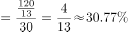，在~的范围内。

故正确答案为B。

---
