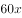
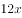
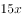
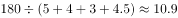
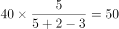
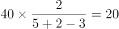
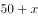
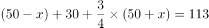
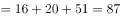

# 2021年海南省公务员录用考试《行测》题（网友回忆版）

> 数量关系 · 10 题 · 海南 2021

## 第 1 题　qid 3523446 · 数学运算

100亩实验田中种植了A、B、C三种作物，三种作物亩产量分别为300、500和600千克，总产量为45吨。已知A作物的种植面积是B作物的3倍，问C作物的种植面积是B作物的多少倍？

- **A**. 
2

- **B**. 
2.5

- **C**. 

- **D**. 

　✅

**答案**：D

**官方解析**

设B作物的种植面积是亩，则A作物的种植面积是亩。C作物的种植面积是亩。总种植面积，整理可得：······①。

总产量，整理可得：······②

根据①②联立方程组，解得，，故C作物的种植面积是B作物的倍。

故正确答案为D。

---

## 第 2 题　qid 3523545 · 数学运算

一个工程的实施有甲、乙、丙和丁四个工程队供选择。已知甲、乙、丙的效率比为5：4：3，如果由丁单独实施，比由甲单独实施用时长4天，比由乙单独实施用时短5天。问四个队共同实施，多少天可以完成（不足1天的部分算1天）？

- **A**. 10
- **B**. 11　✅
- **C**. 12
- **D**. 13

**答案**：B

**官方解析**

根据题意，赋值甲、乙、丙的效率分别为5、4、3；设工程总量为，根据“时间工程总量效率”，则甲、乙单独实施该工程的天数分别为、。单独实施该工程，丁比甲多4天，比乙少5天，则乙用时比甲多天，即，解得，则工程总量为，丁单独实施该工程的时间为天，则丁的效率为。四个队共同实施，需要天，不足1天的部分算1天，即共需11天。

故正确答案为B。

---

## 第 3 题　qid 3522714 · 数学运算

甲单位职工人数是乙单位的2倍，两个单位所有职工中正好有一半是党员。其中甲单位职工中党员占比比乙单位高15个百分点，且甲单位的职工中群众人数比乙单位多18人。问甲单位职工中，党员比群众多多少人?

- **A**. 6
- **B**. 8
- **C**. 10
- **D**. 12　✅

**答案**：D

**官方解析**

设乙单位职工人数为人，则甲单位职工人数为人。乙单位职工中群众人数为人，则甲单位职工中群众人数为（）人。由两个单位所有职工中正好有一半是党员，可得另一半一定是非党员，即群众，故······①。因甲单位职工中党员占比比乙单位高15个百分点，故甲单位职工中群众占比比乙单位低15个百分点，可列······②。联立方程①②，解得，。故甲单位职工人数为人，甲单位职工中群众人数为人，甲单位职工中党员人数为人，党员比群众多人。

故正确答案为D。

【备注】本题假设职工只有党员和群众两种政治面貌。

---

## 第 4 题　qid 3523450 · 数学运算

2020年老张的年龄是小王年龄的4倍，2021年老李的年龄是小王年龄的3倍，已知老张比老李大12岁，问哪一年三人的年龄之和第一次超过140岁？

- **A**. 2020
- **B**. 2023
- **C**. 2026
- **D**. 2029　✅

**答案**：D

**官方解析**

设2020年小王的年龄是，根据题中的年龄关系列表：

根据老张比老李大12岁可得方程，解得：。因此2020年老张，小王，老李的年龄分别为56岁，14岁，44岁。设再过年三人的年龄和超过140岁，则，解得，即9年，年。

故正确答案为D。

---

## 第 5 题　qid 3522715 · 数学运算

乙地在甲地的正东方26千米处，丙地在甲、乙两地连线的北方，且与甲、乙的距离分别为24千米和10千米。一辆车从甲、乙两地中点位置出发向正北方行驶，在经过甲丙连线时，与丙地的距离在以下哪个范围内?

- **A**. 不到8千米
- **B**. 8-9千米之间
- **C**. 9-10千米之间　✅
- **D**. 10千米以上

**答案**：C

**官方解析**

根据题意可得上图，因为甲乙两地距离千米，甲丙两地距离千米，乙丙两地距离千米，可知三角形ABC三边比例为，这三边满足勾股定理，所以三角形ABC为直角三角形，。M为甲乙两地中点，汽车从M向正北出发经过甲丙两地连线AC时交于N点，故千米。在直角三角形AMN中，。根据两直角三角形都有公共角可推出，根据相似三角形对应边成比例可列式，代入数据，解得千米，那么千米，在C项范围内，当选。

故正确答案为C。

---

## 第 6 题　qid 3523439 · 数学运算

一次2小时的在线会议，会议结束前半小时才有人开始退出且每分钟退出会议人数满足，（）。若会议开始后加入会议人数是退出人数的1.5倍，且会议结束时还有100人在线，问会议开始时可能有多少人在线？

- **A**. 40　✅
- **B**. 50
- **C**. 60
- **D**. 70

**答案**：A

**官方解析**

设会议开始时可能有人在线。由题意可知，会议结束前半小时每分钟退出会议人数分别为人、人、人、人······，则会议结束前的半小时共退出人，故会议开始后加入会议人数人。会议结束时还有100人在线，则，解得，即会议开始时可能有40人在线。

故正确答案为A。

---

## 第 7 题　qid 3523442 · 数学运算

某直播平台为3种特色农产品直播带货3小时，第1小时B产品销售额比A产品多50万元，C产品只有B产品的；第2小时与第1小时相比：A翻倍，B增加幅度比A少，而C增加两倍；最后1小时共带货3090万元，且A产品带货额比第1小时大幅增加，B、C均比第2小时增加，问第2小时直播带货额是多少万元？

- **A**. 1580
- **B**. 1600
- **C**. 1860　✅
- **D**. 2000

**答案**：C

**官方解析**

题干给出A、B、C3种农产品在带货第1、2、3小时内销售额的关系，可设第1小时B产品销售额为万元，可得三类产品3小时内得销售额如下：

根据最后1小时共带货3090万元可得：；化简得，解得。

代入，第2小时带货额为万元。

故正确答案为C。

---

## 第 8 题　qid 3522679 · 数学运算

某省在新冠疫情期间派出包括传染科医生、重症科医生和护士在内的三批援鄂医疗队。三批医疗队中三者人数之比分别为4：2：4、5：2：3和4：3：3。已知第二批医疗队中医生比护士多40人，且传染科医生数逐批增加并成等差数列，三批共派出护士113人，则三批医疗队共有多少人？

- **A**. 339
- **B**. 350　✅
- **C**. 360
- **D**. 390

**答案**：B

**官方解析**

根据第二批医疗队中三者人数之比为5：2：3且医生比护士多40人，可得第二批医疗队传染科医生、重症科医生和护士人数分别为人、人、人。根据“传染科医生数逐批增加并成等差数列”，设第一批传染科医生比第二批少人，则第一批和第三批传染科医生分别为（）人、（）人，传染科医生共有人。则根据三批次人数的比例关系可得： 

根据“三批共派出护士113人”列方程：，解得：。则重症科医生共有人。故三批医疗队共有人。

故正确答案为B。

---

## 第 9 题　qid 3522686 · 数学运算

受新冠疫情影响，某高校某专业开展在线教育，在同一上课时间开设3门选修课A、B和C，每个学生可任选其中1门，但每门课程限选30人。已知该专业共有90人，问该专业学生小李能选中课程A的概率是：

- **A**. 

- **B**. 

- **C**. 

　✅
- **D**. 

**答案**：C

**官方解析**

方法一：根据概率公式，概率，可得所求概率。课程A限选30人，小李可为30人中的任意1人，所以小李选到A课程的情况数为；同理，“3门选修课A、B和C，每门课程限选30人”,即3门课共限选90人，小李可为90人中的任意1人，所以小李选到任意一门课的情况数为。则所求概率。 

方法二：由题目条件 “3门选修课A、B和C，每个学生可任选其中1门，但每门课程限选30人”，可知每个学生选择每门课的概率是相同的。因此小李有A、B、C共3种选择，则选择A课程的概率应为。

故正确答案为C。

---

## 第 10 题　qid 3522657 · 数学运算

饲养兔子需要场地，小林准备用一段长为28米的篱笆围成一个三角形形状的场地，已知第一条边长为米，由于条件限制第二条边长只能是第一条边长度的多4米，若第一条边是唯一最短边，则的取值可以为:

- **A**. 6
- **B**. 7　✅
- **C**. 8
- **D**. 9

**答案**：B

**官方解析**

由题意可知，三角形第一条边长为米，第二条边长为（）米，第三条边长为米。根据“第一条边是唯一最短边”可知：，即，排除C、D两项；根据三角形基本性质“两边之和大于第三边”可知：，即，排除A项。

故正确答案为B。

---
