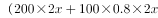
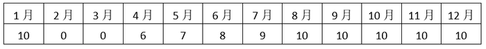

# 2021年湖北省选调生招录考试综合知识和行政职业能力测验试卷（网友回忆版）

> 数量关系 · 7 题 · 湖北 2021

## 第 1 题　qid 5518367 · 数学运算

某工程队甲、乙、丙三组承担了一公路修筑任务，甲组单独完成需要24天，乙组单独完成需要28天，丙组单独完成需要36天，且各组日工作量恒定。现按甲、乙、丙的顺序轮班工作，每组工作1天后换班。问工程最后一天是哪组工程队施工，需要完成其日工作量的多少？

- **A**. 
甲；

- **B**. 
乙；
　✅
- **C**. 
丙；

- **D**. 
甲；

**答案**：B

**官方解析**

根据题意，赋值工程总量为504，则甲组的效率为，乙组的效率为，丙组的效率为。按甲、乙、丙的顺序轮班工作一个周期的工作量为21+18+14=53，个周期······27，甲组工作一天完成21，剩余工作量为27-21=6，工程最后一天是乙组工程队施工，需要完成其日工作量的。

故正确答案为B。

---

## 第 2 题　qid 5518414 · 数学运算

某品牌店购入400件同款春装，2月以吊牌价售出200件，3月以吊牌价的8折售出100件，4月以吊牌价的6折售出70件，最后30件以吊牌价的3折清仓处理完，总共获利32750元。已知春装吊牌价是进价的2倍，则这批春装的单件进价为多少元？

- **A**. 110
- **B**. 120
- **C**. 125　✅
- **D**. 144

**答案**：C

**官方解析**

设这批春装的单件进价为x元，则单件吊牌价为2x元。根据公式：总售价-总成本=总利润，可列式为：，解得x=125，即这批春装的单件进价为125元。

故正确答案为C。

---

## 第 3 题　qid 5518397 · 数学运算

某宿舍有6名学生，建立一个聊天群最少需要3名学生，则该宿舍最多可以建多少个聊天群？（人员相同时算同一个群）

- **A**. 32
- **B**. 35
- **C**. 42　✅
- **D**. 45

**答案**：C

**官方解析**

6名学生建立不少于3人的聊天群，聊天群的人数可能为3人、4人、5人、6人：

①3人聊天群可以建个；

②4人聊天群可以建个；

③5人聊天群可以建个；

④6人聊天群可以建个。

则该宿舍最多可以建20+15+6+1=42个聊天群。

故正确答案为C。

---

## 第 4 题　qid 5518402 · 数学运算

考试的综合成绩=（能力测试成绩×0.6+专业测试成绩×0.4）×0.4+面试成绩×0.6。已知小张的能力测试成绩、专业测试成绩分别比小黄高出4分、3分，则小黄的面试成绩至少要超过小张多少分，他的综合成绩才可能超过小张？

- **A**. 2.4　✅
- **B**. 3
- **C**. 4.8
- **D**. 7

**答案**：A

**官方解析**

方法一：设小黄能力测试成绩为a分，专业测试成绩为b分，面试成绩为c分，小张的面试成绩为d分。则小黄考试的综合成绩=（a×0.6+b×0.4）×0.4+c×0.6······①，小张考试的综合成绩=[（a+4）×0.6+（b+3）×0.4]×0.4+d×0.6······②。要想小黄的综合成绩超过小张，则①＞②，化简可得：c-d＞2.4，即小黄的面试成绩至少要超过小张2.4分。

方法二：考试的综合成绩是各部分成绩加权计算的结果。考试的综合成绩=（能力测试成绩×0.6+专业测试成绩×0.4）×0.4+面试成绩×0.6=能力测试成绩×0.24+专业测试成绩×0.16+面试成绩×0.6。小张的能力测试成绩比小黄高出4分，加权后小张比小黄高4×0.24=0.96分；小张的专业测试成绩比小黄高出3分，加权后小张比小黄高3×0.16=0.48分。要想小黄的综合成绩超过小张，则面试成绩加权后，小黄至少超过小张0.96+0.48=1.44分，未加权的面试成绩至少超过分。

故正确答案为A。

---

## 第 5 题　qid 5518371 · 数学运算

某厂计划2020年每月生产同样数量的产品，年底正好完成任务。在1月正常生产结束后，受疫情影响停产了2个月，从4月开始复工，4月的产能只有原来的60%，后面每月逐渐增加计划产能的10%，达到原来的100%产能后，保持不变。则该厂2020年实际生产的产品仅完成全年任务的多少？

- **A**. 60%
- **B**. 65%
- **C**. 72%
- **D**. 75%　✅

**答案**：D

**官方解析**

赋值该厂计划每月产能为10件产品，则全年任务为10×12=120件产品。“4月的产能只有原来的60%”，则4月的产能为10×60%=6件产品；“后面每月逐渐增加计划产能的10%”，则每月增加量为10×10%=1件产品，直到产能达到原来的100%。

方法一：2020年各月产能列表如下：

2020年生产的产品数为10×6+6+7+8+9=90件，则该厂2020年实际生产的产品仅完成全年任务的。

方法二：停产2个月，少生产2×10=20件产品。4月少生产10-6=4件产品，此后在达到原来100%的产能前每个月依次少生产3、2、1件产品，2020年共少生产20+4+3+2+1=30件产品，则该厂2020年实际生产的产品仅完成全年任务的。

故正确答案为D。

---

## 第 6 题　qid 5518368 · 数学运算

某次“集五福，迎新春”活动中，有爱国福、富强福、和谐福、友善福和敬业福五种福卡。小鲁当前共有7张福卡，只缺敬业福就能集齐五种福卡，则他当前的福卡有多少种不同的组合？

- **A**. 18
- **B**. 20　✅
- **C**. 24
- **D**. 30

**答案**：B

**官方解析**

根据题意可知，小鲁当前的7张福卡中，爱国福、富强福、和谐福、友善福四种福卡每种至少有1张。根据插板法可知，他当前的福卡有种不同的组合。

故正确答案为B。

---

## 第 7 题　qid 5518388 · 数学运算

某场篮球比赛结束后，小陈的命中率（命中球数÷投球数）正好为50%，已知他上半场的命中率为40%，而下半场比上半场多投了2球、多命中3球，问小陈本场比赛一共命中多少球？

- **A**. 9
- **B**. 11　✅
- **C**. 13
- **D**. 15

**答案**：B

**官方解析**

设小陈上半场投了x球，则上半场命中了（）球，下半场投了（x+2）球、命中了（0.4x+3）球。根据题意可列式：，解得：x=10，则小陈本场比赛一共命中0.4×10+0.4×10+3=11球。 

故正确答案为B。

---
