# 2021年贵州省公务员录用考试《行测》题（网友回忆版）

> 数量关系 · 12 题 · 贵州 2021

## 第 1 题　qid 3523436 · 数学运算

边长为整数且成等差数列的三个正方形，面积之和不大于5000，其中有两个正方形的面积之和等于第3个正方形的面积，这样的正方形存在多少组？

- **A**. 6
- **B**. 7
- **C**. 9
- **D**. 10　✅

**答案**：D

**官方解析**

方法一：设三个正方形的边长分别为、、，则面积分别为、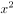、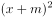；根据题干条件，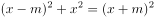，，联立方程组可得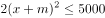，即，；根据，可得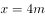；代入，可得，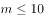，由于为整数且不为0，故共有10组。

方法二：根据平方和等于最大数的平方，联想到满足勾股定理的整数组，勾股数。常见的勾股数只有（3，4，5）及其倍数是满足等差关系的，即，，，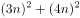，解得，故共有10组。

故正确答案为D。

---

## 第 2 题　qid 3523439 · 数学运算

一次2小时的在线会议，会议结束前半小时才有人开始退出且每分钟退出会议人数满足，（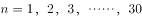）。若会议开始后加入会议人数是退出人数的1.5倍，且会议结束时还有100人在线，问会议开始时可能有多少人在线？

- **A**. 40　✅
- **B**. 50
- **C**. 60
- **D**. 70

**答案**：A

**官方解析**

设会议开始时可能有人在线。由题意可知，会议结束前半小时每分钟退出会议人数分别为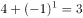人、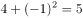人、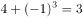人、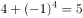人······，则会议结束前的半小时共退出人，故会议开始后加入会议人数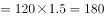人。会议结束时还有100人在线，则，解得，即会议开始时可能有40人在线。

故正确答案为A。

---

## 第 3 题　qid 3523440 · 数学运算

张三与李四骑马观光，从东方村开始，途经幸福村到胜利村。从东方村骑行1小时后，张三：“已经走了多远？”李四：“刚好是到幸福村的一半。”两人又骑行20公里后，张三：“到胜利村还有多远？”李四：“刚巧是离幸福村的一半那样远。”则东方村到胜利村的距离是多少公里？

- **A**. 30
- **B**. 35　✅
- **C**. 40
- **D**. 45

**答案**：B

**官方解析**

此题对第二个过程的理解不同，会出现不同的答案。

【解析一】将东方村、幸福村、胜利村分别看成A、B、C三地，全程分为两个过程，第一个过程：先行驶AB（东方村到幸福村）的一半，用时1小时；第二个过程：又行驶20公里后，所处位置距胜利村（C）的距离刚好是到幸福村（B）的一半，即再行驶AB的加上BC的共20公里。根据条件可得，则全长，排除C、D两项。代入A项，若全长为30公里，则可得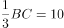，，与全长为30公里矛盾。

故正确答案为B。

【解析二】将东方村、幸福村、胜利村分别看成A、B、C三地，全程分为两个过程，第一个过程：先行驶AB的一半，用时1小时；第二个过程：如果理解成到胜利村（C）的距离刚好是胜利村（C）离幸福村（B）的一半那么远，即再行驶AB的加上BC的共20公里，那么全长公里。

故正确答案为C。

本题表述有争议，粉笔给出两种解题思路，但更倾向于选B。

---

## 第 4 题　qid 3523442 · 数学运算

某直播平台为3种特色农产品直播带货3小时，第1小时B产品销售额比A产品多50万元，C产品只有B产品的；第2小时与第1小时相比：A翻倍，B增加幅度比A少，而C增加两倍；最后1小时共带货3090万元，且A产品带货额比第1小时大幅增加，B、C均比第2小时增加，问第2小时直播带货额是多少万元？

- **A**. 1580
- **B**. 1600
- **C**. 1860　✅
- **D**. 2000

**答案**：C

**官方解析**

题干给出A、B、C3种农产品在带货第1、2、3小时内销售额的关系，可设第1小时B产品销售额为万元，可得三类产品3小时内得销售额如下：

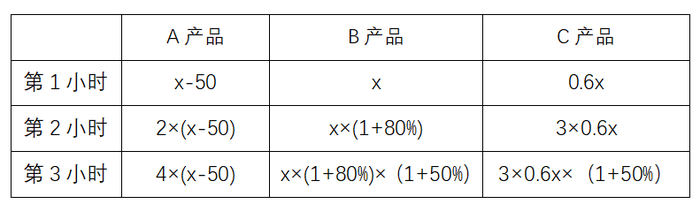

根据最后1小时共带货3090万元可得：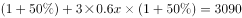；化简得，解得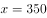。

代入，第2小时带货额为万元。

故正确答案为C。

---

## 第 5 题　qid 3522681 · 数学运算

一车救灾物资从早上8点起开始运往1900公里外的某地，白天平均车速80公里/小时，夜间60公里/小时（假定8：00到18：00为白天，其他时段为夜间），司机每驾驶2小时必须休息20分钟，且每名司机每天驾驶时间不能超过8小时（00：00后即为新的一天）。问车上至少应配备几名司机且至少要用多长时间才能抵达该地？

- **A**. 3名；27小时15分　✅
- **B**. 3名；27小时25分
- **C**. 4名；33小时30分
- **D**. 4名；33小时40分

**答案**：A

**官方解析**

根据题意，要使总时间最短，则需让车辆一直在行驶，行驶情况如下表所示：

第二天白天所需行驶时间，则总时间最短为，只有A项符合。

故正确答案为A。

备注：本题不严谨，根据题意，在总时间最短的情况下，最少需要2名司机即可完成物资运输。第一天16小时可安排为：每名司机开车2小时，休息2小时，每人共计开车8小时；第二天是新的一天，共需行驶11小时15分钟，每名司机可以继续开车2小时，休息2小时，第一名司机共开车6小时，第二名司机共开车5小时15分钟即可。在考场上，可以根据用时最短直接锁定答案，不必纠结司机的人数。

---

## 第 6 题　qid 3522686 · 数学运算

受新冠疫情影响，某高校某专业开展在线教育，在同一上课时间开设3门选修课A、B和C，每个学生可任选其中1门，但每门课程限选30人。已知该专业共有90人，问该专业学生小李能选中课程A的概率是：

- **A**. 

- **B**. 

- **C**. 

　✅
- **D**. 

**答案**：C

**官方解析**

方法一：根据概率公式，概率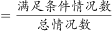，可得所求概率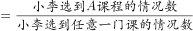。课程A限选30人，小李可为30人中的任意1人，所以小李选到A课程的情况数为；同理，“3门选修课A、B和C，每门课程限选30人”,即3门课共限选90人，小李可为90人中的任意1人，所以小李选到任意一门课的情况数为。则所求概率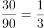。 

方法二：由题目条件 “3门选修课A、B和C，每个学生可任选其中1门，但每门课程限选30人”，可知每个学生选择每门课的概率是相同的。因此小李有A、B、C共3种选择，则选择A课程的概率应为。

故正确答案为C。

---

## 第 7 题　qid 3522713 · 数学运算

小张和小李负责生产1200个零件，小张每天均生产20个。小李第一天生产10个，往后除最后一天外，每一天的产量都比前一天多1个。问整个任务中小张生产的个数比小李：

- **A**. 多40个
- **B**. 多80个
- **C**. 少40个
- **D**. 少80个　✅

**答案**：D

**官方解析**

设完成整个任务共耗时天，则小张完成的工作总量为个，假定小李最后一天也比前一天多1个，则小李每天完成的工作量构成了一个首项为10，公差为1，项数为的等差数列，根据等差数列通项公式代入可得，小李完成的总工作量为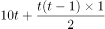。

根据两人共完成1200个零件，可列方程：，解得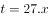，向上取整，取28天。

代入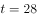，小张每天生产20个，则小张的总产量个，小李的总产量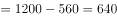个。此时，小李前27天按照等差数列共生产个，第27天生产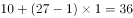个，最后一天生产个，满足题目中的条件“往后除最后一天外，每一天的产量都比前一天多1个”。因此，小张生产的个数比小李少个。

方法二：根据选项可转化为一组数，可考虑代入排除法。设小张、小李生产的零件数分别为x、y。

代入A项：x-y＝40，x＋y＝1200，则x＝620个，y＝580个。工作时间为620/20＝31天，根据等差数列通项公式，则小李除最后一天外生产的零件个数为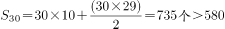个，不符合题意；

代入C项：y-x＝40，x＋y＝1200，则x＝580个，y＝620个。工作时间为天，根据等差数列通项公式，则小李除最后一天外生产的零件个数为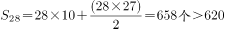个，不符合题意；

代入B项：x-y＝80，x＋y＝1200，则x＝640个，y＝560个。工作时间为天，根据等差数列通项公式，则小李除最后一天外生产的零件个数为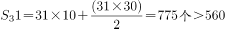个，不符合题意；

代入D项：y-x＝80，x＋y＝1200，则x＝560个，y＝640个。工作时间为560/20＝28天，根据等差数列通项公式，则小李除最后一天外生产的零件个数为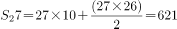个，故小李第28天生产640-621＝19个，第27天生产10＋（27-1）×1＝36个，满足题意。

故正确答案为D。

---

## 第 8 题　qid 3523446 · 数学运算

100亩实验田中种植了A、B、C三种作物，三种作物亩产量分别为300、500和600千克，总产量为45吨。已知A作物的种植面积是B作物的3倍，问C作物的种植面积是B作物的多少倍？

- **A**. 
2

- **B**. 
2.5

- **C**. 

- **D**. 

　✅

**答案**：D

**官方解析**

设B作物的种植面积是亩，则A作物的种植面积是亩。C作物的种植面积是亩。总种植面积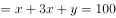，整理可得：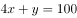······①。

总产量，整理可得：······②

根据①②联立方程组，解得，，故C作物的种植面积是B作物的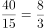倍。

故正确答案为D。

---

## 第 9 题　qid 3522714 · 数学运算

甲单位职工人数是乙单位的2倍，两个单位所有职工中正好有一半是党员。其中甲单位职工中党员占比比乙单位高15个百分点，且甲单位的职工中群众人数比乙单位多18人。问甲单位职工中，党员比群众多多少人?

- **A**. 6
- **B**. 8
- **C**. 10
- **D**. 12　✅

**答案**：D

**官方解析**

设乙单位职工人数为人，则甲单位职工人数为人。乙单位职工中群众人数为人，则甲单位职工中群众人数为（）人。由两个单位所有职工中正好有一半是党员，可得另一半一定是非党员，即群众，故······①。因甲单位职工中党员占比比乙单位高15个百分点，故甲单位职工中群众占比比乙单位低15个百分点，可列······②。联立方程①②，解得，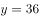。故甲单位职工人数为人，甲单位职工中群众人数为人，甲单位职工中党员人数为人，党员比群众多人。

故正确答案为D。

【备注】本题假设职工只有党员和群众两种政治面貌。

---

## 第 10 题　qid 3523450 · 数学运算

2020年老张的年龄是小王年龄的4倍，2021年老李的年龄是小王年龄的3倍，已知老张比老李大12岁，问哪一年三人的年龄之和第一次超过140岁？

- **A**. 2020
- **B**. 2023
- **C**. 2026
- **D**. 2029　✅

**答案**：D

**官方解析**

设2020年小王的年龄是，根据题中的年龄关系列表：

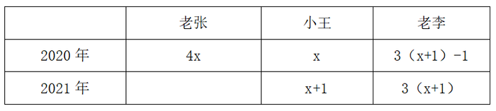

根据老张比老李大12岁可得方程，解得：。因此2020年老张，小王，老李的年龄分别为56岁，14岁，44岁。设再过年三人的年龄和超过140岁，则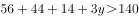，解得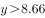，即9年，年。

故正确答案为D。

---

## 第 11 题　qid 3522715 · 数学运算

乙地在甲地的正东方26千米处，丙地在甲、乙两地连线的北方，且与甲、乙的距离分别为24千米和10千米。一辆车从甲、乙两地中点位置出发向正北方行驶，在经过甲丙连线时，与丙地的距离在以下哪个范围内?

- **A**. 不到8千米
- **B**. 8-9千米之间
- **C**. 9-10千米之间　✅
- **D**. 10千米以上

**答案**：C

**官方解析**

根据题意可得上图，因为甲乙两地距离千米，甲丙两地距离千米，乙丙两地距离千米，可知三角形ABC三边比例为，这三边满足勾股定理，所以三角形ABC为直角三角形，。M为甲乙两地中点，汽车从M向正北出发经过甲丙两地连线AC时交于N点，故千米。在直角三角形AMN中，。根据两直角三角形都有公共角可推出，根据相似三角形对应边成比例可列式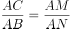，代入数据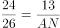，解得千米，那么千米，在C项范围内，当选。

故正确答案为C。

---

## 第 12 题　qid 3522657 · 数学运算

饲养兔子需要场地，小林准备用一段长为28米的篱笆围成一个三角形形状的场地，已知第一条边长为米，由于条件限制第二条边长只能是第一条边长度的多4米，若第一条边是唯一最短边，则的取值可以为:

- **A**. 6
- **B**. 7　✅
- **C**. 8
- **D**. 9

**答案**：B

**官方解析**

由题意可知，三角形第一条边长为米，第二条边长为（）米，第三条边长为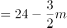米。根据“第一条边是唯一最短边”可知：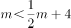，即，排除C、D两项；根据三角形基本性质“两边之和大于第三边”可知：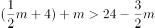，即，排除A项。

故正确答案为B。

---
