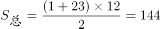
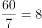
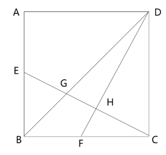
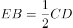
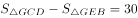
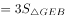

# 2021年重庆市选调优秀大学生到基层工作考试《行测》题

> 数量关系 · 13 题 · 选调 2021

## 第 1 题　qid 4674782 · 数学运算

-7，9，-5，13，3，（    ）

- **A**. 29　✅
- **B**. -29
- **C**. 17
- **D**. -17

**答案**：A

**官方解析**

观察数列，无明显特征，且作差无规律，考虑作和。相邻两项相加得到新数列：2，4，8，16，（    ），是公比为2的等比数列，新数列下一项为16×2=32。故原数列所求项=32-3=29。
故正确答案为A。

---

## 第 2 题　qid 4674791 · 数学运算

－1，2，－8，48，－384，（    ），－46080

- **A**. -3072
- **B**. 3072
- **C**. -3840
- **D**. 3840　✅

**答案**：D

**官方解析**

观察数列，发现相邻项间有明显的倍数关系，考虑作商。后项÷前项可得新数列：-2，-4，-6，-8，（    ），（    ），是公差为-2的等差数列，则新数列接下来两项为-10和-12，则原数列所求项=-384×（-10）=3840。代入验证，-46080÷3840=-12，符合规律。
故正确答案为D。

---

## 第 3 题　qid 4674794 · 数学运算

一个数列1，，1，，，，1，，，，，，1，，，，······，根据该数列的排列规律，请问第二次出现是第（    ）个数。

- **A**. 120
- **B**. 126
- **C**. 140　✅
- **D**. 146

**答案**：C

**官方解析**

将原数列反约分，根据相同分母分组可表示为：，，，，，，，，，，，，，，，，······。观察分母发现：分母为1、2、3、4的各组分数分别有1个、3个、5个、7个，即分母为n的分数有（2n-1）个，也就是分数个数是公差为2的等差数列；观察分子发现：各组的分子以1为公差，依次由1向n递增，再递减回1。

综上规律可知：根据该数列的排列规律，以12为分母的分数有2×12-1=23个。根据等差数列公式：，可得从1至12为分母的分数总个数为个。以12为分母的分数分别为：，······，，······，，······，，，，，。即第二次出现后面还有4个分数，则第二次出现是原数列中第144-4=140个数。

故正确答案为C。

---

## 第 4 题　qid 4674828 · 数学运算

一个筐里装有2160个苹果，如果不是一次全部拿出，也不是一个一个地拿，要求每次拿的个数相同，拿到最后正好取完，那么共有（    ）种不同的拿法。

- **A**. 30
- **B**. 36
- **C**. 38　✅
- **D**. 40

**答案**：C

**官方解析**

根据题意：总数=每次拿的个数×次数，每次拿出的苹果个数为2160的因子，故不同的因子对应不同的拿法。因为，那么2160的因子，包含2的情况可以分为0个2，1个2，2个2，3个2，4个2，有5种；包含3的情况可以分为0个3，1个3，2个3，3个3，有4种；包含5的情况可以分为0个5，1个5，有2种。所以2160的因子个数为5×4×2=40个，其中包含1和2160这两个因子，根据题意，去掉1与2160这两个因子，符合题意的因子共有40-2=38个，即38种不同的拿法。

故正确答案为C。

---

## 第 5 题　qid 4674830 · 数学运算

一名工人操作切割机可以一次性切割很多根钢管，并且无论一次切割多少根钢管，每次切割所需要的时间都一样。如果用最高效方式把一根很长的钢管切成16段要8分钟，那么用一次只切割一根钢管的方式把这根完整的钢管切成32段需要：

- **A**. 10分钟
- **B**. 16分钟
- **C**. 1小时4分钟
- **D**. 1小时2分钟　✅

**答案**：D

**官方解析**

根据题意，若用最高效方式，则钢管每次被切割，数量会变成原来的2倍，因为，所以切成16段需要4次，可得切割一次所需时间为8÷4=2分钟。若一次只切割一根钢管，则变成2段需要1次，再变成4段需要2次，再变成8段需要4次，再变成16段需要8次，再变成32段需要16次，故共计1+2+4+8+16=31次，所需时间为31×2=62分钟，即1小时2分钟。

故正确答案为D。

---

## 第 6 题　qid 4674827 · 数学运算

为评选扶贫工作先进项目案例，某乡镇举行优秀扶贫项目案例评选活动，共邀请71名评委参加投票评选，从甲、乙、丙、丁、戊五个案例中评选“最佳案例”，最终甲得选票35张，乙得选票为第二名，丙、丁票数一样，戊得选票8张为最少，那么乙得选票（    ）张。

- **A**. 8
- **B**. 9
- **C**. 10　✅
- **D**. 11

**答案**：C

**官方解析**

设乙得票数为x张，丙和丁得票数均为y张，根据题意可列方程：35+x+2y+8=71，整理可得x+2y=28。2y与28均为偶数，则x必为偶数，排除B、D两项，且乙为第二名，得票数应高于戊，排除A项。代入C项验证，当乙得票10张时，y=（28-10）÷2=9张，符合题意。
故正确答案为C。

---

## 第 7 题　qid 4674832 · 数学运算

在平面直角坐标系中，如果点P（4a-7，16-19a）在第三象限内，其横、纵坐标都是整数，则点P的坐标是：

- **A**. （-3，-1）
- **B**. （-3，-3）　✅
- **C**. （-1，-3）
- **D**. （-7，-3）

**答案**：B

**官方解析**

点P在直角坐标系第三象限内，即横、纵坐标均为负数，代入选项验证。
当横坐标4a-7=-3时，解得a=1，代入纵坐标16-19a=-3，排除A项，B项当选。
同理，当纵坐标16-19a=-3时，横坐标必为-3，排除C、D两项。
故正确答案为B。

---

## 第 8 题　qid 4674829 · 数学运算

一项工程，甲单独完成需要15天，乙单独完成需要30天，丙单独完成需要60天，如果按照甲乙丙的顺序交替进行每人做一天，那么需要（    ）天能完成。

- **A**. 25　✅
- **B**. 26
- **C**. 27
- **D**. 28

**答案**：A

**官方解析**

赋值工程总量为60，则甲的效率为60÷15=4，乙的效率为60÷30=2，丙的效率为60÷60=1。若按照甲乙丙的顺序交替进行每人做一天，那么3天为一周期，一周期内完成工作量=4+2+1=7，因为个周期······4个工作量，余下的工作量正好由甲做一天即可完成，所以整个工作过程共需8×3+1=25天。

故正确答案为A。

---

## 第 9 题　qid 4674799 · 数学运算

某机关下午2点整派车去党校接某教授作党史教育专题授课，往返需1小时，该教授在下午1点整就离开党校向该机关步行走来，途中遇到接他的车，便乘上车去该机关，于下午2点50分到达，不考虑上下车时间，汽车的速度是教授步行速度的（    ）。

- **A**. 12倍
- **B**. 13倍
- **C**. 15倍
- **D**. 17倍　✅

**答案**：D

**官方解析**

根据题意，某机关下午2点整派车去党校接教授，往返需1小时，可推出汽车到党校时间为下午2：30。但汽车2点从机关出发去接教授，2：50便已返回，则可推出汽车遇到教授时为2：25，少走了5分钟的路程。教授从1点出发，遇到汽车时已行走了2：25-1:00=85分钟的路程。汽车少走的路程即为教授步行的路程。当路程一定时，时间与速度成反比，，则。因此汽车的速度是教授步行速度的17倍。

故正确答案为D。

---

## 第 10 题　qid 4674801 · 数学运算

某单位在编一本年鉴，其页数需要用6893个数字，那么这本年鉴共有（    ）页。

- **A**. 1999
- **B**. 1994
- **C**. 2000　✅
- **D**. 2004

**答案**：C

**官方解析**

根据选项可确定该年鉴的页数在1000页以上，但不到10000页。根据页码所需数字个数分情况计算：

①1-9页，共有9页，每页1个数字，共需9×1=9个数字；

②10-99页，共有90页，每页2个数字，共需90×2=180个数字；

③100-999页，共有900页，每页3个数字，共需900×3=2700个数字。

此时还剩6893-9-180-2700=4004个数字，从1000页开始，每页4个数字，有页，999+1001=2000页，即这本年鉴共有2000页。

故正确答案为C。

---

## 第 11 题　qid 4674802 · 数学运算

不到30岁的哥哥今年的年龄正好是弟弟年龄的5倍，若干年后哥哥的年龄就是弟弟的4倍，又过了若干年，哥哥的年龄将是弟弟的3倍，则今年两兄弟的年龄差是（    ）岁。

- **A**. 12　✅
- **B**. 13
- **C**. 14
- **D**. 15

**答案**：A

**官方解析**

方法一：根据题意，设今年弟弟的年龄为n，则哥哥的年龄为5n，那么两人的年龄差为4n，即为4的倍数，观察选项，只有A项符合。
方法二：根据“不到30岁的哥哥今年的年龄正好是弟弟年龄的5倍”可知，今年哥哥与弟弟的年龄可能分别为5岁与1岁、10岁与2岁、15岁与3岁、20岁与4岁、25岁与5岁，则今年两兄弟的年龄差可能是4岁、8岁、12岁、16岁、20岁。只有A项符合。
故正确答案为A。

---

## 第 12 题　qid 4674804 · 数学运算

如图，一块正方形的花园ABCD的面积是120平方米，为了种植不同种类的花将其划分成一些小区域，其中，E是AB的中点，F是BC的中点，则四边形区域BGHF的面积是（    ）平方米。

- **A**. 14　✅
- **B**. 16
- **C**. 18
- **D**. 20

**答案**：A

**官方解析**

因为E是AB的中点，所以为正方形ABCD面积的，即平方米。因为，且，则。因为平方米，平方米，因此平方米，则平方米。

因为，，所以，因此。则，其中，则，故平方米。则四边形BGHF的面积平方米。

故正确答案为A。

---

## 第 13 题　qid 4674805 · 数学运算

制药厂有一条疫苗生产线、一座仓库和若干相同的货车、流水线，每天的产量不变，产品均存入仓库。仓库的疫苗可供19辆货车送货24天，或17辆货车送货30天，那么用（    ）辆货车送货6天后，坏了4辆车，剩下的货车又送了2天刚好把所有的疫苗送完。

- **A**. 30
- **B**. 40　✅
- **C**. 50
- **D**. 60

**答案**：B

**官方解析**

假设1辆货车1天可运送1支疫苗，制药厂每天生产疫苗x支。根据牛吃草公式Y=（N-x）T，可列式：Y=（19-x）×24=（17-x）×30，解得x=9，Y=240。设所求货车为N辆，则可列式：Y=（N-9）×6+[（N-4）-9]×2=240，解得N=40。
故正确答案为B。

---
