# 2021年陕西省公务员录用考试《行测》题（网友回忆版）

> 数量关系 · 10 题 · 陕西 2021

## 第 1 题　qid 3522354 · 数学运算

小明去某楼盘售楼部咨询售房情况。置业顾问告诉他，如果再卖出50套，则已卖出的数量与未卖出的数量相等；如果再卖出150套，则已卖出的数量比未卖出的数量多一半，问该楼盘目前还剩下多少套房子未卖出？

- **A**. 350套
- **B**. 450套
- **C**. 550套　✅
- **D**. 650套

**答案**：C

**官方解析**

设目前已卖、未卖分别为、套，根据题意列方程组：

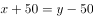······①

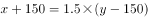······②

联立①②求解可得，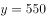，即目前还剩下550套房子未卖出。

故正确答案为C。

---

## 第 2 题　qid 3522399 · 数学运算

送奶工人给11楼住户送牛奶，由于小区停电导致电梯无法使用。如果他走楼梯从第1层到第2层需要5秒，以后每多走一层需多花2秒，其中走到5层以后每多走一层需多休息5秒，那么他走到11层需要多少秒？

- **A**. 210
- **B**. 215　✅
- **C**. 220
- **D**. 235

**答案**：B

**官方解析**

根据题意可知，走各层楼梯用时是公差为2的等差数列。从第1层走到第2层用时秒，根据，从第十层走到第十一层用时秒，再根据等差数列求和公式：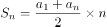，可得走楼梯用时为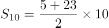秒；休息用时是公差为5的等差数列，秒，到第十层休息用时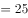秒，中途休息总用时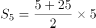秒；总用时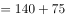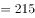秒。

故正确答案为B。

---

## 第 3 题　qid 3522770 · 数学运算

某公园鸟语林共饲养180只鸟类动物，为养护方便，园方将鸟语林分为A、B、C三个区。某日，A区的一部分鸟飞至B、C两区，清点时，B、C两区鸟的数量都增加一倍。次日，一些鸟又从B区飞至A、C两区，清点时，A、C两区鸟的数量也都增加一倍。第三日，一部分鸟又从C区飞至A、B两区，清点时，A、B两区鸟的数量同样增加一倍，而此时C区剩余鸟的数量恰好是A区的，那么，最初A区有多少只鸟？

- **A**. 103　✅
- **B**. 104
- **C**. 105
- **D**. 106

**答案**：A

**官方解析**

将三次鸟的变化情况列表如下：

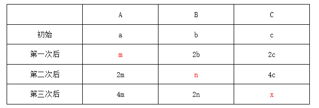

根据第三次后，C区剩余鸟的数量恰好是A区的，说明A区现在鸟的数量必然为26的整数倍。代入A项：最初A区有103只，则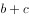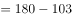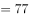只，第一次后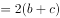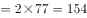只，则A区剩余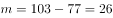只，第三次后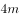也是26的倍数，符合题意，当选。其余选项均不满足。

故正确答案为A。

---

## 第 4 题　qid 3523384 · 数学运算

两个大人带四个孩子去坐只有六个位置的圆型旋转木马，那么两个大人不相邻的概率为：

- **A**. 

- **B**. 

　✅
- **C**. 

- **D**. 

**答案**：B

**官方解析**

方法一：六个人坐在圆型旋转木马的情况总数为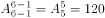。现先让四个孩子去坐，情况数为，四个孩子之间可形成4个空，再让两个大人各选一个空，情况数为，故两个大人不相邻的情况数为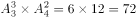，题目所求概率为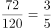。

方法二：六个人坐在圆型旋转木马的情况总数为。考虑反面，两个大人相邻情况数为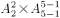，题目所求概率为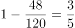。

故正确答案为B。

备注：n个人随机围绕圆桌就坐，情况数为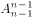。

---

## 第 5 题　qid 3522376 · 数学运算

某高校开设A类选修课四门，B类选修课三门。小刘从中共选取四门课程，若要求两类课程各至少选一门，则选法有：

- **A**. 18种
- **B**. 22种
- **C**. 26种
- **D**. 34种　✅

**答案**：D

**官方解析**

方法一：根据题意，两类课程各至少选一门，有三种情况：

（1）A类选一门，B类选三门，有种；

（2）A类选两门，B类选两门，有种；

（3）A类选三门，B类选一门，有种；

则选法共有种。

方法二：要求两类课程各至少选一门，正向情况数较多，从反面考虑。总情况为七门课程中选择四门，为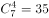种情况；不满足要求的情况为选择四门课程都为一类，只有A类四门都选、B类不选1种情况。满足情况数总情况数不满足要求情况数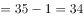种。

故正确答案为D。

---

## 第 6 题　qid 3522375 · 数学运算

某装修公司订购了一条长为2.5m的长方体条形不锈钢管，要剪裁成60cm和43cm长的两种规格长度不锈钢管若干根，所裁钢管的横截面与原来一样，不考虑剪裁时材料的损耗，要使剩下的钢管尽量少，此时材料的利用率为：

- **A**. 0.998
- **B**. 0.996　✅
- **C**. 0.928
- **D**. 0.824

**答案**：B

**官方解析**

设剪裁成60cm的不锈钢管根，剪裁成43cm的不锈钢管根，根据题意，长方体条形不锈钢管长为2.5m，单位统一为250cm，即：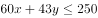；

当时，解得，cm，剩cm；

当时，解得，cm，剩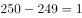cm；

当时，解得，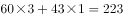cm，剩cm。

由此可知剩下的钢管最少为1cm，利用率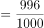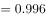。

故正确答案为B。

---

## 第 7 题　qid 3522421 · 数学运算

一个不计厚度的圆柱型无盖透明塑料桶，桶高2.5分米，底面周长为24分米，AB为底面直径。在塑料桶内壁桶底的B处有一只蚊子，此时，一只壁虎正好在塑料桶外壁的A处，则壁虎从外壁A处爬到内壁B处吃到蚊子所爬过的最短路径长约为：

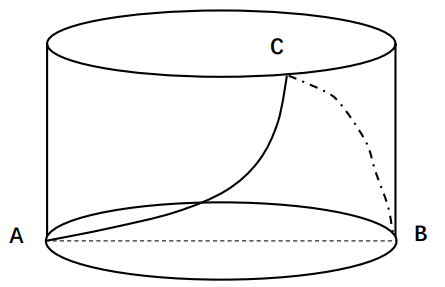

- **A**. 10分米
- **B**. 12.25分米
- **C**. 12.64分米　✅
- **D**. 13分米

**答案**：C

**官方解析**

本题要求表面的最短路径，可考虑两种方式。第一种可在A点沿着外壁直上直下爬入桶内部，由于不考虑桶厚度，所以壁虎依然在A点位置，此时走了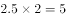分米，接下来壁虎只需沿直径从A爬到B即可，即又走了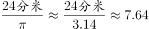分米，此时从A到B共爬了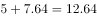分米。

第二种可将图形进行展开，如图所示。原图中AB为直径，则在展开图中AB的距离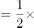底面周长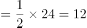分米，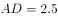分米。所求为最小值，延长AD，使，则，在直角三角形A&#39;AB中，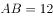分米，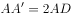分米，根据勾股定理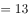分米。

综上，第一种的距离更短，为12.64分米。

故正确答案为C。

---

## 第 8 题　qid 3522411 · 数学运算

我国一支工兵部队在某国执行维和任务，负责道路抢修工作。某天，该部队负责的道路被炮弹炸出一个球面形状的大坑。经测量，弹坑直径16m，深4m。现需用车辆运送混凝土填充弹坑，铺平道路，假设每车次可运输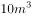的混凝土，问抢修道路至少需要出动运输车多少车次？（球缺体积计算公式为，其中为球半径，为球缺高，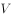为球缺体积）

- **A**. 65
- **B**. 66
- **C**. 67　✅
- **D**. 68

**答案**：C

**官方解析**

球缺是指球被平面截下的部分，题干中的大坑即为一个球缺。如图所示，球缺高即为BD线段长，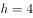m；在直角三角形OCD中，根据“弹坑直径16m”，可知截面半径CD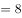m，ODm，OCm，依据勾股定理，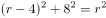，解得；将球的半径与球缺高代入球缺体积公式，可得球缺体积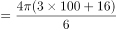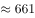，所需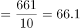车次，即66车次不够，至少需要67车次。

故正确答案为C。

【备注】本题不严谨，题干所给公式中的，理论上应为球缺底面的半径，但在考场上，按照命题人所给的公式及字母含义解题即可。

---

## 第 9 题　qid 3522765 · 数学运算

某草莓经销商有201箱的草莓要分配给若干个水果店，要求无论选用怎样的分配方式，都要有水果店至少分到8箱，则水果店至多有：

- **A**. 20个
- **B**. 21个
- **C**. 28个　✅
- **D**. 29个

**答案**：C

**官方解析**

问至多有多少家，从最大的选项开始代入。分配方式为平均分配可以使水果店最多。

代入D项，如果每家先分7箱，箱，则所有水果店分得水果都不超过8箱，排除；

代入C项，如果每家先分7箱，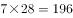箱，剩余箱，都会有一家至少分得8箱，当选。

故正确答案为C。

---

## 第 10 题　qid 3522427 · 数学运算

太平洋上有一个圆形的平坦小岛，岛上遍布森林，闪电击中处于小岛边缘的树木引发森林火灾（如下图所示）。假设火线是以圆弧状往小岛深处推进，问当大火烧到小岛中心位置时，过火面积占全岛面积的比例大约是多少？

- **A**. 

- **B**. 

　✅
- **C**. 

- **D**. 

**答案**：B

**官方解析**

由题图可知，大火烧到岛中心时，刚好圆弧状的火线最中间点在圆心位置。如图所示：

假设圆心为O点，起火点为A点，起火点到圆弧状火线与森林边缘的交点分别为B、C两点，连接OB和OC、AB和AC，OA、OB、OC恰好都为圆形小岛的半径，则。同时由题图可知，则三角形BAO和三角形CAO均为等边三角形，即，同时高均为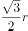。由扇形面积可知，；过火面积，，圆形小岛面积。故过火面积所占比例为。

故正确答案为B。

---
