# 2022年上海市公务员录用考试《行测》题（B类）（网友回忆版）

> 数量关系 · 27 题 · 上海 2022

## 材料 1

        上海市以“双千兆宽带城市”建设为基础，打造“一网通办”“一网统管”现代化城市治理体系。目前固定宽带光纤实现全市99%家庭覆盖，平均下载速率和千兆用户渗透率均排名全国第一，5G基站总量同样位列全国第一。5G基站建设过程中，至2020年8月底，上海市P区共布设5G室外基站7246个，较同年3月增长75.24%。

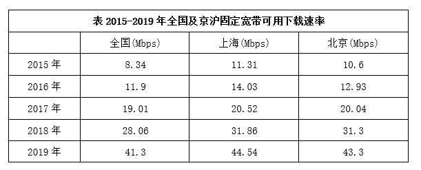

        Mbps是Megabits per second的缩写，MB/s是MegaByte per second的缩写，都是传输速率单位，指每秒传输的位（比特）数量。换算关系为1Mbps=0.125MB/s。

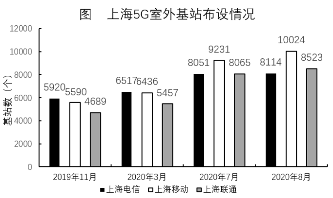

### 第 1 题　qid 4651977 · 数学运算

2016年，上海固定宽带可用下载速率约为（    ）MB/s。

- **A**. 1.41
- **B**. 1.75　✅
- **C**. 2.57
- **D**. 1.62

**答案**：B

**官方解析**

定位表格材料可得：2016年，上海固定宽带可用下载速率为14.03Mbps。定位文字材料可得：1Mbps=0.125MB/s。故2016年，上海固定宽带可用下载速率为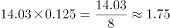MB/s。

故正确答案为B。

---

### 第 2 题　qid 4651985 · 数学运算

2020年8月底，P区5G室外基站布设总量在全市5G室外基站布设总量的占比位于（    ）区间内。

- **A**. [0，20%]
- **B**. (20%，40%]　✅
- **C**. (40%，60%]
- **D**. (60%，100%]

**答案**：B

**官方解析**

根据题干“2020年8月底······占比位于······区间内”，可判定本题为现期比重问题。定位文字材料可得：至2020年8月底，上海市P区共布设5G室外基站7246个。定位图形材料可得：2020年8月，上海电信、上海移动、上海联通分别布设5G室外基站8114个、10024个、8523个。故2020年8月底，P区5G室外基站布设总量在全市5G室外基站布设总量的占比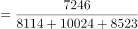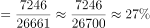，位于(20%,40%]的区间内。

故正确答案为B。

---

### 第 3 题　qid 4651993 · 数学运算

2020年3—7月，上海移动5G室外基站的月平均增长量约为（    ）个。

- **A**. 699　✅
- **B**. 1609
- **C**. 2212
- **D**. 2795

**答案**：A

**官方解析**

根据题干“······的月平均增长量”，可判定本题为年均增长量计算问题。定位图形材料可得：2020年3月上海移动5G室外基站为6436个，2020年7月上海移动5G室外基站为9231个。故2020年3—7月，上海移动5G室外基站的月平均增长量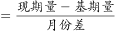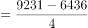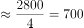个，最接近A项。

故正确答案为A。

---

### 第 4 题　qid 4651996 · 数学运算

2016—2019年，上海固定宽带可用下载速率的年增长率变化情况是：

- **A**. 先上升后下降　✅
- **B**. 先下降后上升
- **C**. 一直上升
- **D**. 一直下降

**答案**：A

**官方解析**

根据题干“2016—2019年······的年增长率变化情况”，可判定本题为一般增长率比较问题。定位表格材料，根据公式：增长率，2016年增长率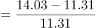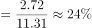；2017年增长率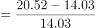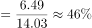；2018年增长率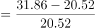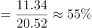；2019年增长率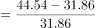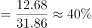。可知增长率在2016—2018年上升，2018—2019年下降，即先上升后下降。

故正确答案为A。

---

### 第 5 题　qid 4651999 · 数学运算

结合材料所给数据，下列选项正确的是：

- **A**. 2020年3月，三大运营商在上海5G室外基站总量超过20000个
- **B**. 2020年3月，P区共布设5G室外基站超过4000个　✅
- **C**. 2020年8月，上海移动的5G室外基站总量占三大运营商上海室外总基站比重低于30%
- **D**. 2015—2019年，北京固定宽带可用下载速率逐年提升，且提升量逐年下降

**答案**：B

**官方解析**

A项：定位图形材料可得：2020年3月三大运营商在上海5G室外基站总量为6517+6436+5457=18410个，小于20000个，错误；

B项：定位文字材料可得：至2020年8月底，上海市P区共布设5G室外基站7246个，较同年3月增长75.24%，则2020年3月，P区共布设5G室外基站数为：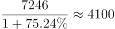个，超过4000个，正确；

C项：定位图形材料可得：2020年8月，上海移动的5G室外基站总量为10024个，三大运营商上海室外总基站总量为：8114+10024+8523=26661个，所占比重为：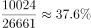，高于30%，错误；

D项：定位表格材料，直接查找数据，2015—2019年北京固定宽带可用下载速率逐年提升，每年提升量为：2016年，12.93-10.6=2.33；2017年，20.04-12.93=7.11；2018年，31.3-20.04=11.26；2019年，43.3-31.3=12。提升量逐年上升，并非逐年下降，错误。

故正确答案为B。

---

## 材料 2

### 第 6 题　qid 4651937 · 数学运算

结合表中所给数据，2016-2020年脑科学领域论文总被引频次排名第二的国家，其ESI高水平论文数量排名第：

- **A**. 一
- **B**. 二
- **C**. 三　✅
- **D**. 四

**答案**：C

**官方解析**

定位统计表，可知2016-2020年各主要国家在脑科学领域论文总被引频次及ESI高水平论文数量。总被引频次排名第二的为德国（471966篇），其对应ESI高水平论文数量（479篇）排名第三。
故正确答案为C。

---

### 第 7 题　qid 4651957 · 数学运算

结合材料，关于全球脑科学领域论文发表情况，能够推出的是：

- **A**. 2016-2020年，就论文发表量来看，表中排名第二和排名第三的国家论文发表量总和是排名第一的一半
- **B**. 2016-2020年，CNS及其子刊论文数占比最高的国家，其论文发表量在全球的占比不足5%
- **C**. 2016-2020年，论文篇均被引频次最高的国家，其总被引频次也最高
- **D**. 2016-2020年，日本论文发表量约是我国的2.4倍，但其中ESI高水平论文数只有我国的56%　✅

**答案**：D

**官方解析**

A项：定位统计表可知，2016-2020年论文发表量排名第一的国家是美国（149978篇），排名第二和第三的是德国（36010篇）、加拿大（25790篇）。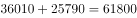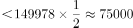。则排名第二和排名第三的国家论文发表量总和不足排名第一的一半，错误；

B项：定位统计表可知，2016-2020年CNS及其子刊论文数占比最高的国家是日本（19.37%），其论文发表量为23912篇；定位统计图可知，2016-2020年全球论文发表量为451472篇。则日本的论文发表量占全球的比重为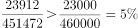，错误；

C项：定位统计表可知，2016-2020年论文篇均被引频次最高的国家是英国（14.39），其总被引频次为197768，并非最高，错误；

D项：定位统计表可知，2016-2020年日本论文发表量为23912篇，我国为9861篇，日本是我国的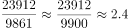倍；2016-2020年日本ESI高水平论文数126篇，我国为225篇，日本是我国的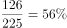，正确。

故正确答案为D。

---

## 材料 3

        《2021年第2季度中国城市交通报告》选取我国100个主要城市，通过大数据客观反映城市的交通拥堵状况。报告采用“通勤高峰拥堵指数”作为表征城市交通拥堵状况的指标，即工作日的早晚高峰时段（7∶00—9∶00，17∶00—19∶00），在各城市的主城区实际行程时间和畅通行程时间的比值。采用“周末拥堵指数”作为表征城市周末交通拥堵状况的指标，即周末8∶00—20∶00，在各城市的主城区实际行程时间和畅通行程时间的比值。

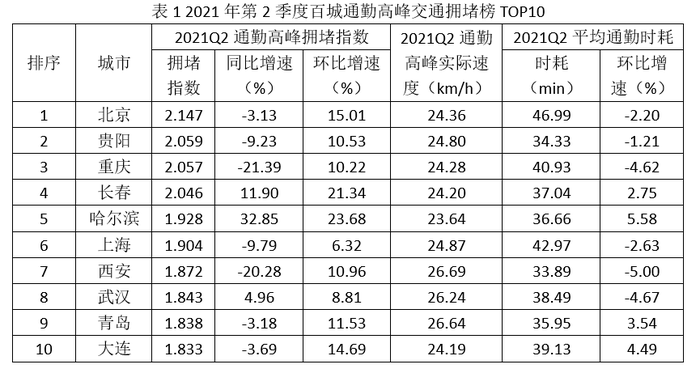

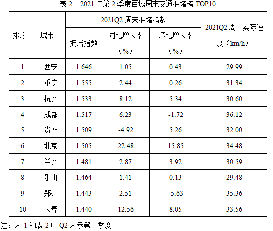

### 第 8 题　qid 4652007 · 数学运算

按照2021年第一季度通勤高峰拥堵指数从大到小排序，下列城市的排序依次为：

- **A**. 重庆、长春、哈尔滨　✅
- **B**. 重庆、哈尔滨、长春
- **C**. 长春、哈尔滨、重庆
- **D**. 哈尔滨、长春、重庆

**答案**：A

**官方解析**

根据题干“按照2021年第一季度通勤高峰拥堵指数从大到小······”，结合材料时间为2021年第2季度，可判定本题为基期比较问题。定位统计表1可得，2021年第2季度重庆、长春、哈尔滨的通勤高峰拥堵指数分别为2.057、2.046、1.928，环比增速分别为10.22%、21.34%、23.68%。根据公式：基期量可知，2021年1季度通勤高峰拥堵指数为重庆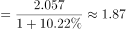、长春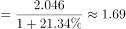、哈尔滨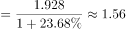，故正确排序依次为重庆、长春、哈尔滨。

故正确答案为A。

---

### 第 9 题　qid 4652010 · 数学运算

将变化率定义为增长率的绝对值。相比于2020年第二季度，2021年第二季度通勤高峰拥堵指数变化率最大和第二大的两个城市，其2021年第二季度平均通勤时耗的平均值约为：

- **A**. 24
- **B**. 27
- **C**. 35
- **D**. 39　✅

**答案**：D

**官方解析**

根据题干“2021年第二季度平均通勤时耗的平均值约为”，结合材料时间为2021年第二季度，可判定本题为现期平均数计算问题。定位表1可知，相比于2020年第二季度，2021年第二季度通勤高峰拥堵指数变化率最大和第二大的两个城市分别是哈尔滨（32.85%）、重庆（-21.39%），其2021年第二季度通勤高峰平均通勤时耗分别为36.66分钟、40.93分钟，则所求平均值为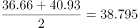分钟，与D项最接近。

故正确答案为D。

---

### 第 10 题　qid 4652011 · 数学运算

对于同时进入两份拥堵榜的几个城市，其通勤高峰实际速度与周末实际速度差异值的绝对值最大的城市是：

- **A**. 北京　✅
- **B**. 长春
- **C**. 西安
- **D**. 贵阳

**答案**：A

**官方解析**

定位表1可得，4个城市通勤高峰实际速度分别为：北京24.36km/h、长春24.20km/h、西安26.69km/h、贵阳24.80km/h；定位表2可得，4个城市周末实际速度分别为：北京34.48km/h、长春33.56km/h、西安29.99km/h、贵阳32.00km/h。通勤高峰实际速度与周末实际速度差异值的绝对值分别为：北京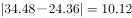km/h、长春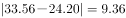km/h、西安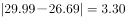km/h、贵阳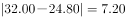km/h。比较可知，所求差异值的绝对值最大的城市是北京。

故正确答案为A。

---

### 第 11 题　qid 4652014 · 数学运算

根据材料判断下列四对指标的相关关系：①“2021Q2通勤高峰拥堵指数”和“2021Q2通勤高峰实际速度”；②“2021Q2通勤高峰拥堵指数”和“2021Q2平均通勤时耗”；③“2021Q2周末拥堵指数”和“2021Q2周末实际速度”；④“2021Q2通勤高峰拥堵指数”和“2021Q2周末拥堵指数”，表述正确的是：

- **A**. 第①对具有正相关关系
- **B**. 第②对具有正相关关系
- **C**. 第③对不具有正相关关系　✅
- **D**. 第④对具有正相关关系

**答案**：C

**官方解析**

根据表格材料，依次判定四对指标的相关关系，可得：
①定位表1可得，“2021Q2通勤高峰拥堵指数”由北京到大连逐项降低，“2021Q2通勤高峰实际速度” 由北京到大连有增有减，二者不具有正相关关系，A项错误；
②定位表1可得，“2021Q2通勤高峰拥堵指数”由北京到大连逐项降低，“2021Q2平均通勤时耗” 由北京到大连有增有减，二者不具有正相关关系，B项错误；
③定位表2可得，“2021Q2周末拥堵指数”由西安到长春逐项降低，“2021Q2周末实际速度” 由西安到长春有增有减，二者不具有正相关关系，C项正确；
④定位表1和表2可得，“2021Q2通勤高峰拥堵指数”和“2021Q2周末拥堵指数”排名前10位的城市并不完全一致，无法判定其是否具有正相关关系。且“2021Q2通勤高峰拥堵指数”北京＞西安，但“2021Q2周末拥堵指数”西安＞北京，二者不具有正相关关系，D项错误。
故正确答案为C。

---

### 第 12 题　qid 4652018 · 数学运算

若以极差（即最大值减最小值）刻画差异性，那么10个城市的指标中，拥堵变化情况的差异性最大的是：

- **A**. 通勤高峰拥堵榜中拥堵指数同比2020年第二季度增长率　✅
- **B**. 通勤高峰拥堵榜中拥堵指数环比2021年第一季度增长率
- **C**. 周末拥堵榜中周末拥堵指数同比2020年第二季度增长率
- **D**. 周末拥堵榜中周末拥堵指数环比2021年第一季度增长率

**答案**：A

**官方解析**

定位表格材料可得各类拥堵指数最大值与最小值，分别计算极差进行比较。
A项：通勤高峰拥堵榜中拥堵指数同比2020年第二季度增长率最高的为32.85%（哈尔滨），最低为-21.39%（重庆），极差为32.85%-（-21.39%）=54.24%；
B项：通勤高峰拥堵榜中拥堵指数环比2021年第一季度增长率最高的为23.68%（哈尔滨），最低为6.32%（上海），极差为23.68%-6.32%=17.36%；
Ｃ项：周末拥堵榜中周末拥堵指数同比2020年第二季度增长率最高的为22.48%（北京），最低为-4.92%（贵阳），极差为22.48%-（-4.92%）=27.4%；
Ｄ项：周末拥堵榜中周末拥堵指数环比2021年第一季度增长率最高的为15.85%（北京），最低为-5.63%（郑州），极差为15.85%-（-5.63%）=21.48%。
比较可知，拥堵变化情况的差异性最大的是A项。
故正确答案为A。

---

### 第 13 题　qid 4651976 · 数学运算

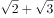，5，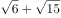，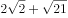，（    ）

- **A**. 
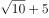

- **B**. 
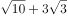
　✅
- **C**. 
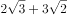

- **D**. 
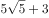

**答案**：B

**官方解析**

观察数列，有特殊符号“+”，考虑机械划分。原数列可转化，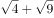，，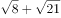，（    ），“+”之前部分：，，，，根号下是公差为2的等差数列，则所求项“+”之前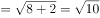；“+”之后部分：，，，，根号下是公差为6的等差数列，则所求项“+”之后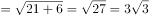。故所求项为。

故正确答案为B。

---

### 第 14 题　qid 4652012 · 数学运算

一个质点从原点O出发，按照下图所示前进，若已知（1，0），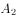（1，），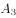（，），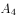（，），则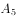的坐标是<u>        </u>。

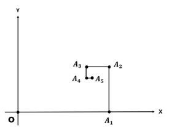

- **A**. 
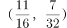

- **B**. 

- **C**. 

- **D**. 

　✅

**答案**：D

**官方解析**

观察所给坐标图可知，的纵坐标与的纵坐标相同，为。观察坐标变化规律：O到的距离为1-0=1，到的距离为，到的距离为，到的距离为，即该质点每次前进的距离为：1，，，，是公比为的等比数列，所以到的距离应为，因此，的横坐标应为，故的坐标是。

故正确答案为D。

备注：本题无需计算，仅通过观察即可确定：的纵坐标与的纵坐标相同，均为，排除A、B两项；观察横坐标发现在与之间，即的横坐标，排除C项，D项当选。

---

### 第 15 题　qid 4652017 · 数学运算

数列：（1，1，1），（2，2，4），（3，4，12），（4，8，32），······，第8个括号内最后一个数是        。

- **A**. 256
- **B**. 512
- **C**. 1024　✅
- **D**. 2048

**答案**：C

**官方解析**

结合括号内规律可知，每个括号内第一项分别为：1，2，3，4，是公差为1的等差数列；第二项分别为：1，2，4，8，是公比为2的等比数列。每个括号中，第三项=第一项×第二项；结合规律，第8个括号内第一项为8，第二项为128，第三项=第一项×第二项=8×128=1024。
故正确答案为C。

---

### 第 16 题　qid 4652019 · 数学运算

根据下列图形上的数字规律，“？”处的数字应为<u>        </u>。

- **A**. 64
- **B**. 88
- **C**. 96
- **D**. 104　✅

**答案**：D

**官方解析**

图形数列，有中心优先凑中心：
第一个图形：（2+4+6）×（1+3+5）=108；
第二个图形：（5+6+4）×（1+2+3）=90。
规律为在每个正六边形中，与中心数字相连的三个数之和×其他三个数之和=中心数字。
根据以上规律，第三个图形中，？=（1+2+5）×（3+4+6）=104。
故正确答案为D。

---

### 第 17 题　qid 4651918 · 数学运算

数列：1，2，2，3，3，3，1，1，2，2，2，3，3，3，3，1，1，1，2，2，2，2，3，······，按照其规律，第50个数和第51个数的和为（    ）。

- **A**. 3
- **B**. 4　✅
- **C**. 5
- **D**. 6

**答案**：B

**官方解析**

观察数列，可将数列做如下划分
第一组：1，2，2，3，3，3，（1个1、2个2、3个3）；
第二组：1，1，2，2，2，3，3，3，3，（2个1、3个2、4个3）；
推测第三组为：1，1，1，2，2，2，2，3，3，3，3，3，（3个1、4个2、5个3）。
即从第二组开始，每组比前一组多1个1，1个2，1个3。则前三组分别有6项、9项、12项，即项数是公差为3的等差数列，则第四组有15项、第五组有18项，前四组共有6+9+12+15=42项。所以第50个数和第51个数出现在第五组。所求为第五组的第8、9项，第五组：1，1，1，1，1，2，2，2，2，······，第8、9项为2、2，即第50个数和第51个数的和为2+2=4。
故正确答案为B。

---

### 第 18 题　qid 4651919 · 数学运算

小李进行健身运动，计划运动时间不少于1小时且不多于2小时，有以下备选项目：30分钟自行车、30分钟划船、40分钟慢跑、1小时羽毛球、1.5小时步行，每个项目限选一次且最多可以选择三项，那么小李的运动计划共有        种。

- **A**. 8
- **B**. 12　✅
- **C**. 16
- **D**. 24

**答案**：B

**官方解析**

凑时间且情况数比较少，采用枚举法。情况如下：

总共12种情况。

故正确答案为B。

---

### 第 19 题　qid 4651921 · 数学运算

某快递员一天可派件150件，每件派件费1元。安装快递柜后部分快递可放入快递柜中，派件效率提高，一天可派件180件，然而每件快递需向快递柜所属公司缴纳0.2元。为维持收入不变，这180件快递中有        件快递须派送上门。

- **A**. 25
- **B**. 30　✅
- **C**. 36
- **D**. 40

**答案**：B

**官方解析**

设有X件快递须派送上门，则有（180-X）件可放入快递柜。收入=派件数×每件派件费，根据收入不变，可列方程：，解得X=30。

故正确答案为B。

---

### 第 20 题　qid 4651926 · 数学运算

某水果店销售水果有三种方式：
（1）直接出售，每公斤价格10元，1吨水果一周时间可以全部卖完；
（2）对水果进行粗加工（例如去皮等）后出售，每公斤价格15元，每天能够售出100公斤；
（3）对水果进行精加工（例如制作水果捞等）后出售，每公斤价格30元，每天能够售出10公斤。
该水果店进了1吨水果，一周内需要卖完，否则水果就会腐烂。如果上述三种销售方式可同时组合使用，那么该水果店出售这1吨水果的销售额最大为        元。

- **A**. 10000
- **B**. 14900　✅
- **C**. 15000
- **D**. 30000

**答案**：B

**官方解析**

一周内卖完销售额最大情况：30元/公斤一周销售10×7=70公斤；15元/公斤一周销售100×7=700公斤；10元/公斤一周销售1000-700-70=230公斤。由销售额=单价×销量，则销售额最大为30×70+15×700+10×230=14900元。
故正确答案为B。

---

### 第 21 题　qid 4651936 · 数学运算

对于两个有序数组（a，b）和（c，d），将称作这两个数组的距离，那么，在下列选项中，与数组（13，26）的距离最大的是<u>        </u>。

- **A**. （20，21）
- **B**. （21，20）
- **C**. （22，19）
- **D**. （23，18）　✅

**答案**：D

**官方解析**

选项为一组数，考虑代入排除法。由两组数距离公式得：

A项：；

B项：；

C项：；

D项：。

故正确答案为D。

---

### 第 22 题　qid 4651939 · 数学运算

某单位进行了一次绩效考评打分，满分为100分。有5位员工的平均分为90分，而且他们的分数各不相同，其中分数最低的员工得分为77分，那么排第二名的员工至少得         分。（员工分数取整数）

- **A**. 90
- **B**. 92　✅
- **C**. 94
- **D**. 96

**答案**：B

**官方解析**

要使分数排第二名的员工得分最少，就要让其他员工得分尽量高。设排第二名的员工至少得x分，则排第一名的员工最多可得满分100分。由于“他们的分数各不相同”则得分排第三名和第四名的员工最高得分分别比前一名员工少1分。由题意可知，得分排第五名的员工（即分数最低的员工）为77分，如下表所示：

又因为“5位员工的平均分为90分”，故5人总分为90×5=450分，所以100+x+（x-1）+（x-2）+77=450，解得x=92。

故正确答案为B。

---

### 第 23 题　qid 4651941 · 数学运算

据测算，使用电动公交车综合减排效益为12%，就是说用电动公交车替代柴油公交车可减少12%的碳排放。某市公交车公司称通过更换电动公交车降低了8%的碳排放，则该公交车公司现在拥有的电动公交车占比约为：

- **A**. 20%
- **B**. 67%　✅
- **C**. 80%
- **D**. 96%

**答案**：B

**官方解析**

赋值该公交车公司原有公交车100辆，设更换了x辆电动公交车，每台柴油公交车的碳排放量为y千克。根据“通过更换电动公交车降低了8%的碳排放”，可得，解得，则该公交车公司现在拥有的电动公交车占比为。

故正确答案为B。

---

### 第 24 题　qid 4651969 · 数学运算

如图所示，某操场可近似看作是由两个半圆和一个矩形组成，其中AB段与CD段分别是以O与为圆心的半圆弧，半圆弧的弧长均为100米，BC段与DA段都是直线段，长度均为100米。在O处安装了一个照明灯，工作人员沿着ABCDA的路线测量不同位置的光照强度。已知某处光照强度和该处到光源距离的平方成反比，则按工作人员行走路线测量的过程中，下列坐标图正确地反映了行走路程与光照强度关系的是<u>        </u>。

- **A**. 

- **B**. 

- **C**. 

　✅
- **D**. 

**答案**：C

**官方解析**

根据题意，工作人员沿着ABCDA的路线测量，将行走路线分成几部分：

①AB段：由于AB段是以O为圆心的半圆弧，工作人员在行走过程中与O点的直线距离保持不变，因某处光照强度和该处到光源距离的平方成反比，则AB段的光照强度也保持不变，结合选项均符合。

②BC段：由于BC段是直线段，当工作人员在行走过程中与O点的直线距离逐渐变大。半圆弧的弧长为100米，设半圆弧的半径为R，则有，解得。设该工作人员某一时刻在BC段行走路程为x，工作人员在行走过程中与O点直线距离的平方。因某处光照强度和该处到光源距离的平方成反比，则BC段的光照强度是一个函数曲线，排除D项。

③CD段：CD段是以为圆心的半圆弧，如下图所示，行走在CD弧上某处E点时， O点与E点距离的平方 。因某处光照强度和该处到光源距离的平方成反比，则CD段的光照强度也是一个函数曲线，并非有平直线段部分，排除A、B两项。

故正确答案为C。

---

### 第 25 题　qid 4651914 · 数学运算

某高速公路上发生一起车祸交警前往处置并疏导交通。当前拥堵路段已积压车辆约300辆，因时值节假日高峰时段预计在30分钟内还将汇入约200辆，30分钟后每分钟汇入该路段约3辆。已知在交警疏导下每分钟能通行10辆，则大约（    ）分钟后道路基本疏通。

- **A**. 40
- **B**. 50
- **C**. 60　✅
- **D**. 70

**答案**：C

**官方解析**

设大约x分钟后道路基本疏通。结合选项x&gt;30，由题意可列方程：300+200+3×（x-30）=10x，解得，与C项最接近。

故正确答案为C。

---

### 第 26 题　qid 4651916 · 数学运算

车辆行驶过程中会造成轮胎磨损，某款汽车后轮行驶满4万公里需要更换；前轮磨损较大，行驶满3万公里就需要更换。若前后轮使用的轮胎相同，那么大约行驶（    ）万公里后将前后轮胎交换，可以实现同一时间更换前后轮胎。

- **A**. 1.5
- **B**. 1.7　✅
- **C**. 2
- **D**. 2.2

**答案**：B

**官方解析**

赋值轮胎使用寿命为12，则前轮每万公里消耗寿命，后轮每万公里消耗寿命。设大约行驶x万公里后将前后轮胎交换，可以实现同一时间更换前后轮胎，即将前后轮胎交换之后，新前后轮胎的剩余寿命之比为4：3，可得，解得，与B项最接近。

故正确答案为B。

---

### 第 27 题　qid 4651923 · 数学运算

有一个花坛的形状是一个直角扇形，由三个半径分别为1、2、3米的圆弧构成现用两条线段将此扇形圆心角平均分割成三部分。（如图）设计者在阴影部分和空白部分分别种上不同的花卉，那么阴影部分花卉的种植面积为多少平方米？

- **A**. 

- **B**. 

- **C**. 

　✅
- **D**. 

**答案**：C

**官方解析**

根据扇形面积公式：，直角扇形的圆心角为，故直角扇形的面积为。由三个半径不同的圆弧构成，对各部分分别计算：

（1）圆弧半径为1米的阴影部分面积：平方米；

（2）圆弧半径为1米和圆弧半径为2米间的阴影部分面积：平方米；

（3）圆弧半径为2米和圆弧半径为3米间的阴影部分面积：平方米；

故阴影部分总面积平方米。

故正确答案为C。

---
