# 2022年北京市公务员录用考试《行测》题（网友回忆版）

> 数量关系 · 15 题 · 北京 2022

## 第 1 题　qid 4652155 · 数学运算

一辆车每天都比前一天多开15千米，第三天开的距离正好是第一天的2倍。则前三天一共开了多少千米？

- **A**. 225
- **B**. 190
- **C**. 135　✅
- **D**. 130

**答案**：C

**官方解析**

设第一天开x千米，则第二天开x+15千米，第三天开x+30千米，根据题干“第三天开的距离正好是第一天的2倍”可列方程，解得x=30，则三天共开3x+45=3×30+45=135千米。

故正确答案为C。

---

## 第 2 题　qid 4652157 · 数学运算

某种商品如果每件降价30元，单价比打八折销售时贵10元，则这种商品的定价是多少元/件？

- **A**. 200　✅
- **B**. 250
- **C**. 300
- **D**. 350

**答案**：A

**官方解析**

设商品定价为x，根据题意，在定价x基础上降价30元为x-30，比打八折售价为0.8x时贵10元，可列式：x-30-0.8x=10，解得x=200。
故正确答案为A。

---

## 第 3 题　qid 4652161 · 数学运算

某测试共有100道题，答对一道题得3分，不答或答错一道题扣2分，小张测试成绩为285分，则他一共答对了多少道题？

- **A**. 85
- **B**. 90
- **C**. 95
- **D**. 97　✅

**答案**：D

**官方解析**

设答对题目x道，则不答或答错题目（100-x）道，根据题意得：3x-2（100-x）=285，解得x=97。
故正确答案为D。

---

## 第 4 题　qid 4652140 · 数学运算

农户张某今年年初将一块长方形农田扩建为正方形农田，使得正方形边长与长方形的长相同，今年的农作物产量是去年的1.5倍。已知今年农作物亩产量比去年高20%，则原来长方形农田的长是宽的多少倍？

- **A**. 1.2
- **B**. 1.25　✅
- **C**. 1.5
- **D**. 1.6

**答案**：B

**官方解析**

设长方形农田的长为a，宽为b，正方形边长为a，去年农作物亩产量为n，今年农作物亩产量为1.2n。根据总产量=亩产量×面积，结合题意可列方程：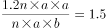，化简得：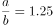。

故正确答案为B。

---

## 第 5 题　qid 4652142 · 数学运算

商店销售某种商品，先按定价卖了300件，打七五折卖了200件，后在此基础上再打八折卖完了剩下的100件，总利润为总成本的。单件成本相当于单件定价的：

- **A**. 57%
- **B**. 54%
- **C**. 51%　✅
- **D**. 48%

**答案**：C

**官方解析**

经济利润问题，求比例关系用赋值法。赋值单件定价为100，则打七五折单件售价为0.75×100=75元，则在打七五折的基础上再打八折单件售价为0.75×100×80%=60元，设单件成本为x元。根据题意，，解得x=51。则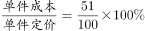，故单件成本相当于单件定价的51%。

故正确答案为C。

---

## 第 6 题　qid 4652147 · 数学运算

甲和乙同时出发，在长360米的环形道路上沿同一方向各自匀速散步。甲出发2圈后第一次追上乙，又走了4圈半第二次追上乙。则甲出发后走了多少米第一次到达乙的出发点？

- **A**. 160　✅
- **B**. 200
- **C**. 240
- **D**. 280

**答案**：A

**官方解析**

结合题干条件，只给出了距离，未给出速度和时间的具体值，考虑赋值。由第一次追上到第二次追上这个过程，是同点同时出发的环形追及问题，米，结合题干条件“甲出发2圈后第一次追上乙，又走了4圈半第二次追上乙”，所以乙的路程为360×4.5-360=360×3.5米，又因时间相同，可得速度之比=路程之比，即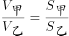，赋值甲的速度为9米/分钟，乙的速度为7米/分钟，再分析出发到第一次追上过程，追及时间为：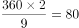分钟，甲比乙多走的距离即为甲出发点到乙出发点的距离：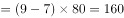米。

故正确答案为A。

---

## 第 7 题　qid 4652143 · 数学运算

商店做促销活动，购买店内商品第一件原价，第二件（价格不高于第一件）4折，第三件（价格不高于第二件）1折。小刘买了1件A和2件B商品，优惠后的总价格相当于定价的56.25%。已知A商品比B商品贵，则按原价买10件A商品的钱最多可以按原价买多少件B商品？

- **A**. 20
- **B**. 16
- **C**. 14　✅
- **D**. 12

**答案**：C

**官方解析**

根据题意，第二件商品价格不高于第一件，第三件商品价格不高于第二件，可判断小刘购买的第一件商品是A，第二件和第三件商品是B。设A和B商品原价分别为x元/件和y元/件，可列方程：x+40%y+10%y=56.25%（x+2y），解得x：y=10：7。赋值x=10，y=7，则按原价买10件A商品的钱=10×10=100元，可购买B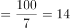件······2，故最多可以按原价买B商品14件。

故正确答案为C。

---

## 第 8 题　qid 4652151 · 数学运算

一个圆形水库的半径为1千米。一艘船从水库边的A点出发，直线行驶1千米后到达水库边的B点，又从B点出发直线行驶2千米后到达水库边的C点。则C点与A点的直线距离最短可能为多少千米？

- **A**. 不到1千米
- **B**. 1—1.3千米之间
- **C**. 1.3—1.6千米之间
- **D**. 超过1.6千米　✅

**答案**：D

**官方解析**

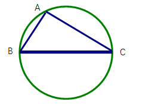

根据题意可知，A、B、C三个点都位于圆上。因为两点之间线段最短，所以C点与A点的距离最短为线段AC。如图所示，两两连接A、B、C构成三角形，BC=2km，圆形水库的半径为1km，即直径为2km，则BC为圆形水库的直径，根据几何结论：由圆上一点和圆的直径连接所构成的三角形一定是直角三角形，可知为直角三角形。根据勾股定理，直角边AC的长度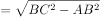km＞1.6km，在D项范围内。

故正确答案为D。

---

## 第 9 题　qid 4652162 · 数学运算

某单位组织文艺表演需要统一购买15套服装，下表为甲、乙、丙和丁四个网店同款上衣和裤子的价格，上衣和裤子可以分开购买，每个网店发货均收取40元快递费，则本次购买服装的最低成本为：

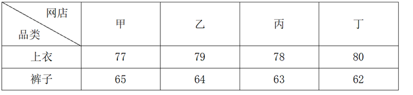

- **A**. 2125元
- **B**. 2155元　✅
- **C**. 2165元
- **D**. 2185元

**答案**：B

**官方解析**

想要让最终购买的总成本最低，可以分两种情况考虑：
情况一：在一家店同时买上衣和裤子，只需要40元快递费。根据表格可计算，甲、乙、丙、丁四家店买一套上衣裤子的价格分别为：77+65=142、79+64=143、78+63=141、80+62=142。故在丙店购买最便宜，总成本=141×15+40=2155元；
情况二：分别在两家店买最便宜的上衣和最便宜的裤子，需要两家各40元快递费。根据表格可知，甲店上衣最便宜，丁店裤子最便宜。故在甲店购买上衣，在丁店购买裤子，总成本=（77×15+40）+（62×15+40）=2165元。
比较情况一和情况二，最低成本为情况一。
故正确答案为B。

---

## 第 10 题　qid 4652149 · 数学运算

甲、乙两条生产线每小时分别可以生产15000件和9000件某种零件，产品合格率分别为99%和99.8%。现接到36万件这种零件的生产任务，要求合格率不得低于99.5%，则两条生产线合作，至少需要多少小时完成?

- **A**. 15
- **B**. 18
- **C**. 24
- **D**. 25　✅

**答案**：D

**官方解析**

方法一：由题干可知，需要生产的合格产品至少为36万×99.5%=35.82万件。设甲、乙工作量分别为x万件、（36-x）万件，则有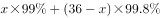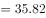，解得x=13.5，36-x=22.5。甲完成任务时间小时，乙完成任务时间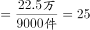小时，综上所述，至少需要25小时完成。

方法二：设要满足题目要求的合格率，甲、乙工作量分别为x万件、（36-x）万件。如下图所示，根据线段法原理：距离和量成反比，可得（99.5%-99%）：（99.8%-99.5%）=5：3=（36-x）：x，解得x=13.5，36-x=22.5。甲完成任务时间小时，乙完成任务时间小时，综上所述，至少需要25小时完成。

故正确答案为D。

注：由于甲、乙生产零件合格率分别为99%、99.8%，本题整体合格率限制99.5%，且甲合格率较低，故甲完成后，不能继续帮助乙工作。 

---

## 第 11 题　qid 4652156 · 数学运算

下方九宫格中为从1到9不重复的9个整数，虚线上角的数字为虚线所经过区域的数字之和，则灰色格子中的数字最大可能是：

- **A**. 7
- **B**. 6
- **C**. 5
- **D**. 4　✅

**答案**：D

**官方解析**

由题意可知，九宫格数字总和=1+2+3+···+9=45，则虚线区域以外3个格子中的数字和为45-11-27=7。因3个数字为1-9中的3个不同数字，故只有一种情况：1+2+4=7。因此灰色格子中的数字最大为4。
故正确答案为D。

---

## 第 12 题　qid 4652160 · 数学运算

A、B两个运动队分别有x人和y人，两队所有人员刚好组成一个不到100人的正方形实心方队。在为两个运动队分配运动服时，错给A队分了y套，给B队分了x套。发现后A队将领到的运动服拿出20%给B队，B队又拿出1套给A队，此时两队的队员刚好一人分到一套运动服。则x的值为：

- **A**. 17
- **B**. 25
- **C**. 29　✅
- **D**. 35

**答案**：C

**官方解析**

根据“两队所有人员刚好组成一个不到100人的正方形实心方队”可知，（x+y）为小于100的平方数。由题意可知，x=（1-20%）y+1，即x=0.8y+1，把选项数据代入验证：
A项，若x=17，y=20，17+20=37人，不满足两队人员组成正方形实心方队，排除；
B项，若x=25，y=30，25+30=55人，不满足两队人员组成正方形实心方队，排除；
C项，若x=29，y=35，29+35=64人，满足题目所有条件，当选；
D项，若x=35，y=42.5，不满足人数必须为正整数，排除。
故正确答案为C。

---

## 第 13 题　qid 4652145 · 数学运算

将张、王、李、陈、赵五名应届毕业生分配到甲、乙、丙3个不同的科室，要求每个科室至少分配1人，甲科室分配的人数多于乙科室，且张和王不能去丙科室。则有多少种不同的分法？

- **A**. 12
- **B**. 21　✅
- **C**. 35
- **D**. 72

**答案**：B

**官方解析**

由题意，甲科室分配的人数多于乙科室，可分为：

①甲3人、乙1人、丙1人，因张和王不能去丙科室，从李、陈、赵3人中选1人去丙科室，即有3种情况；剩下4人中选3人去甲科室，即有种情况；最后1人去乙科室。情况数为3×4×1=12种；

②甲2人、乙1人、丙2人，因张和王不能去丙科室，从李、陈、赵3人中选2人去丙科室，即有种情况；剩下3人中选2人去甲科室，即有种情况；最后1人去乙科室。情况数为3×3×1=9种。

满足题意总情况数=12+9=21种。

故正确答案为B。

---

## 第 14 题　qid 4652150 · 数学运算

早上8：00，甲、乙两车开始在A、B两地之间往返运货，两车先在A地装货后驶往B地卸货，然后返回A地再装货，如是重复。13：35甲完成了第四次卸货，又过了2小时5分，乙完成了第五次装货。已知两车均匀速行驶，每次装货或卸货需要20分钟，则甲的行驶速度是乙的多少倍？

- **A**. 1.25
- **B**. 1.4　✅
- **C**. 1.5
- **D**. 1.6

**答案**：B

**官方解析**

设AB之间路程为S，当甲完成第四次卸货时，所走路程为7S，装、卸货共计8次，总用时为13：35-8：00=5小时35分钟=335分钟，装货与卸货用时为20×8=160分钟，路上行驶用时为335-160=175分钟，可知甲走S用时为分钟。

乙完成第五次装货时，所走路程为8S，装、卸货共计9次，总用时为335+125=460分钟，装货与卸货用时为20×9=180分钟，路上行驶用时为460-180=280分钟，可知乙走S用时为分钟。

路程相同时，速度与时间成反比，则甲乙速度之比为35：25=7：5，即甲的行驶速度是乙的倍。

故正确答案为B。

---

## 第 15 题　qid 4652153 · 数学运算

单位组织职工前往甲、乙、丙三个爱国主义教育基地学习，要求每名职工至少去1个基地。已知有48人去了甲基地，有42人未去乙基地，去丙基地的人中，去1个、2个、3个基地的人数比为3：2：1。如仅去2个基地和去3个基地的职工分别有x人和y人，则x和y的关系为：

- **A**. x=4y+6　✅
- **B**. x=4y-6
- **C**. x=3y+6
- **D**. x=3y-6

**答案**：A

**官方解析**

设总人数为a。由“有42人未去乙基地”，可得去了乙基地的人数=a-42，由“去丙基地的人中，去1个、2个、3个基地的人数比为3∶2∶1”，且去了3个基地的人数为y，可知去丙基地的人数=3y+2y+y=6y。根据三集合容斥原理非标准型公式：总数-都不=A+B+C-只满足两项-2×满足三项，可得a-0=48+（a-42）+6y-x-2y，化简得x=4y+6。
故正确答案为A。

---
