# 2022年四川下半年公务员录用考试《行测》试题（网友回忆版）

> 数量关系 · 10 题 · 四川 2022

## 第 1 题　qid 5408578 · 数学运算

某年级有甲、乙、丙三个班级，三个班级的期末考试平均成绩分别为70分、88分和74分。若甲班和乙班的平均成绩为78分，乙班和丙班的平均成绩为82分。问该年级的期末考试平均成绩为多少分？

- **A**. 75
- **B**. 77　✅
- **C**. 79
- **D**. 81

**答案**：B

**官方解析**

结合题意可画出如下线段：

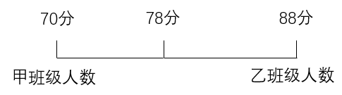

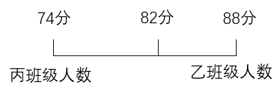

根据线段法“距离与量成反比”及“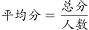”，可得：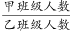，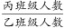，即甲、乙、丙班级人数之比为5：4：3。赋值甲、乙、丙班级人数分别为5人、4人、3人，则该年级的期末考试平均成绩分。

故正确答案为B。

---

## 第 2 题　qid 5408581 · 数学运算

某零件生产车间每天产量固定且目前有一定库存，车间用货车将库存零件运往买方仓库。如每天运24车，5天刚好运完；如每天运18车，8天刚好运完。现每天运x车，4天后车间生产效率提高了50%，又用了7天运完存货。问x可能的最小值为：

- **A**. 18　✅
- **B**. 19
- **C**. 20
- **D**. 21

**答案**：A

**官方解析**

设目前有的库存零件量为y，零件生产车间每天产量为a，每车每天运的零件量为1。可得：y=（24×1-a）×5=（18×1-a）×8，解得a=8，y=80。根据题干“现每天运x车，4天后车间生产效率提高了50%，又用了7天运完存货”，则有：，解得，问最小值，向上取整，故x可能的最小值为18。

故正确答案为A。

---

## 第 3 题　qid 5408582 · 数学运算

从甲地到乙地全程为9千米。其中前为下坡路；剩下路程中，前为平路，后为上坡路。小张从甲地到乙地，下坡路转平路、平路转上坡路时各休息5分钟，下坡路、平路和上坡路的用时之比为1：4：5（休息时间不计）。已知他走上坡路的速度为2千米/小时，则其全程用时为：

- **A**. 2小时
- **B**. 2小时30分钟
- **C**. 2小时40分钟　✅
- **D**. 3小时

**答案**：C

**官方解析**

根据题意可知，下坡路的长度为千米，平路的长度为千米，上坡路的长度为千米。小张走上坡路用时为小时，根据“下坡路、平路和上坡路的用时之比为1：4：5（休息时间不计）”，可得小张走下坡路用时为小时，走平路用时为小时，则小张全程走路用时为0.25+1+1.25=2.5小时，即2小时30分钟，中间休息5+5=10分钟，故全程用时为2小时40分钟。

故正确答案为C。

---

## 第 4 题　qid 5408585 · 数学运算

如图所示的图形是一个由小正方体组成的大正方体，图中灰色部分的小正方体被挖去且贯穿到对面，则剩下的部分有多少块小正方体？

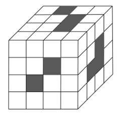

- **A**. 32
- **B**. 40　✅
- **C**. 42
- **D**. 48

**答案**：B

**官方解析**

大正方体从上至下分为4层，俯视每层去掉所需挖去的小正方体（灰色），剩余小正方体（白色）情况如下图所示：

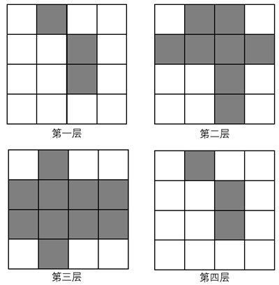

第一层剩余13块、第二层剩余8块、第三层剩余6块、第四层剩余13块，则共剩余13+8+6+13=40块。

故正确答案为B。

---

## 第 5 题　qid 5408586 · 数学运算

张某参加甲、乙、丙三门课程的网络在线培训，培训学时分别为28学时、36学时、40学时。已知每门课程每天最多学习2学时，张某每天最多学习2门课程，问他最少需要多少天完成3门课程的培训？

- **A**. 24
- **B**. 26　✅
- **C**. 28
- **D**. 30

**答案**：B

**官方解析**

根据题意可知，张某完成甲课程需天、完成乙课程需天、完成丙课程需天。因张某每天最多学习2门课程，培训学时中丙的学时最长（20天），则优先考虑丙与甲、乙搭配，且尽量使甲、乙剩余学时相等。天，14-6=8天，18-6=12天，即甲与丙搭配8天，乙与丙搭配12天，则甲、乙均剩余6天，符合题意。故最少需要6+8+12=26天完成3门课程的培训。

故正确答案为B。

---

## 第 6 题　qid 5408597 · 数学运算

一艘轮船在点A处测得灯塔M在北偏西，向北航行了20千米后到达B点，测得灯塔M在北偏西。此后该船继续向北航行，在到达灯塔正东方向C处时，轮船与灯塔M的距离为多少千米？

- **A**. 
10
　✅
- **B**. 
12

- **C**. 

- **D**. 

**答案**：A

**官方解析**

根据题意可画出如下示意图：

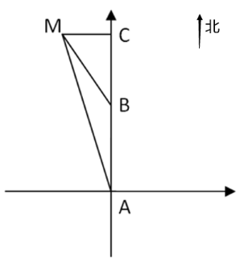

由题可得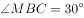，，根据三角形外角等于不相邻的两个内角之和，则，所以为等腰三角形，MB=AB=20千米。因C点在灯塔M的正东方，故为直角三角形，又因，所以千米。

故正确答案为A。

---

## 第 7 题　qid 5408603 · 数学运算

甲生产零件的效率比乙高50%，1小时内甲比乙多生产8个零件。现安排甲、乙共同生产1小时，从生产的零件中抽取3件。问至少有1件是甲生产的概率在以下哪个范围内？

- **A**. 小于0.80
- **B**. 0.80~0.90之间
- **C**. 0.90~0.95之间　✅
- **D**. 大于0.95

**答案**：C

**官方解析**

根据甲比乙的效率高50%且每小时比乙多生产8个零件，可得50%×乙=8，则乙每小时生产16个零件，甲每小时生产16+8=24个零件，两人1小时共生产16+24=40个零件。正面情况较多可以从反面考虑，“从生产的零件中抽取3件，至少有1件是甲生产的”反面为没有1件是甲生产，即3件都是乙生产，满足条件的情况数为种，总情况数为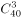种，根据概率，可得所求概率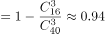，在0.90~0.95之间。

故正确答案为C。

---

## 第 8 题　qid 5408604 · 数学运算

甲、乙、丙3名消费者在某餐厅排队，各自拿取两位数字的等位号。已知3个等位号的个位数字和十位数字恰好由1、2、3、4、5、6六个不重复的数字组成，乙的等位号正好与3人等位号的平均数相同，且甲的等位号数字最小。问三人的等位号组合有多少种不同的可能性？

- **A**. 3
- **B**. 6
- **C**. 8　✅
- **D**. 12

**答案**：C

**官方解析**

方法一：由乙的等位号与3人等位号的平均数相同，可知：乙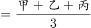，整理得：2乙=甲+丙，根据奇偶特性可知甲和丙的奇偶性相同，且甲＜乙＜丙，选项数字较小，考虑枚举法：

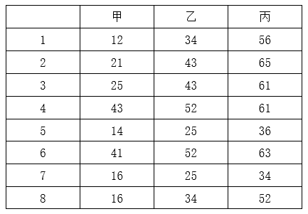

则三人的等位号组合有8种不同的可能性。

方法二：由题意可知，三个数字均为两位数，乙的等位号与3人等位号的平均数相同，且甲＜乙＜丙，则三个数的十位和个位，分别成等差数列，即：

①若十位是1、2、3，则个位是4、5、6或6、5、4；

②若十位是1、3、5，则个位是2、4、6或6、4、2；

③若十位是2、4、6，则个位是1、3、5或5、3、1；

④若十位是4、5、6，则个位是1、2、3或3、2、1。

则三人的等位号组合有8种不同的可能性。

故正确答案为C。

---

## 第 9 题　qid 5408606 · 数学运算

商场6月6日开始销售某种电器，从6月7日起，每天这种电器的销量都比前一天多1台。已知6月16日卖了22台这种电器，问其6月共卖了多少台这种电器？

- **A**. 555
- **B**. 600　✅
- **C**. 645
- **D**. 690

**答案**：B

**官方解析**

方法一：根据题意可知，6月每天销售的电器数量成等差数列，公差d=1，共销售30-6+1=25天，中位数为第13天的销售数量。由于“6月16日卖了22台”，可知，根据等差数列通项公式，则。根据等差数列求和公式：=中位数×项数，则6月共卖了24×25=600台。

方法二：根据题意可知，6月每天销售的电器数量成等差数列，且销售了30-6+1=25天，根据等差数列求和公式：=中位数×项数，则6月的总销量为，是25的整数倍，只有B项符合。

故正确答案为B。

---

## 第 10 题　qid 5408610 · 数学运算

甲、乙两名游泳运动员同时从下游A点出发，游向900米外的上游B点并立刻原路返回。甲游了200米时，乙游了120米。已知甲顺流游泳的速度是逆流的1.8倍，问两人迎面相遇的地点距离A点多少米？

- **A**. 270
- **B**. 390
- **C**. 510
- **D**. 630　✅

**答案**：D

**官方解析**

根据题意，当行驶时间相同时，行驶路程与行驶速度成正比，可知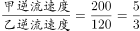，设甲逆流速度为5v，则乙逆流速度为3v，根据“甲顺流游泳的速度是逆流的1.8倍”，则甲顺流速度为5v×1.8=9v。

方法一：设从甲、乙出发到两人迎面相遇所用时间为t，两人相遇时游泳的路程和为两个全程=900×2=1800米，乙游泳路程为3vt，甲游泳路程为，根据路程和不变可列方程：1800=3vt+9vt-720，解得vt=210米，故两人迎面相遇的地点到A点的距离为乙游泳路程=3vt=3×210=630米。

方法二：根据题意，甲逆流游泳900米到达B点时，乙逆流游了米，乙从此时到两人迎面相遇还需继续游一段距离，故可推出两人迎面相遇的地点到A点的距离大于540米，只有D项满足。

故正确答案为D。

---
