# 2022年四川省公务员录用考试《行测》题（网友回忆版）

> 数量关系 · 10 题 · 四川 2022

## 第 1 题　qid 4817761 · 数学运算

工厂甲、乙、丙3条生产线共同完成一项任务，甲、丙先合作两天，完成了全部任务的，接着乙、丙合作两天完成剩下任务的45%，最后甲、乙合作两天恰好完成剩余任务。问甲完成的部分占全部任务的：

- **A**. 

- **B**. 

- **C**. 

　✅
- **D**. 

**答案**：C

**官方解析**

赋值全部任务为60，根据题意可列式：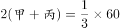，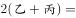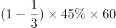，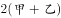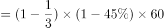。化简可得：甲+丙=10······①，乙+丙=9······②，甲+乙=11······③。①+②+③可得：2甲+2乙+2丙=30，即甲+乙+丙=15，结合②可得：甲=6。甲总共工作了2+2=4天，故甲完成的部分占全部任务的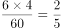。

故正确答案为C。

---

## 第 2 题　qid 4817768 · 数学运算

甲、乙两辆货车同时从A地出发，到B地后立即卸载货物，并返回A地装运货物，如此往返两个来回。已知，A、B两地相距30千米，甲、乙两辆货车的速度分别为100千米/小时和80千米/小时。如装运、卸载货物时间忽略不计，问在整个过程中甲、乙两辆货车最远相距多少千米?

- **A**. 18
- **B**. 20
- **C**. 24　✅
- **D**. 30

**答案**：C

**官方解析**

甲、乙两辆货车的最远距离应出现在速度较快的甲货车到达A地或B地时，两辆货车均往返两个来回，两辆货车间的距离如下表：

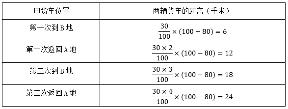

通过上表可知，甲、乙两辆货车的最远距离出现在甲货车第二次返回A地时，此时两辆货车间的距离为24千米。

故正确答案为C。

---

## 第 3 题　qid 4817771 · 数学运算

某共享汽车公司年初购入一批二手电动汽车，每台16200元。第一年每台电动汽车的维护费用为1100元，以后每年增加400元，每台电动汽车每年可产生收益9100元。问在第几年时，单台汽车扣除购置和维护成本后产生的利润将超过2万元?

- **A**. 5
- **B**. 6　✅
- **C**. 7
- **D**. 8

**答案**：B

**官方解析**

设第n年时，单台汽车扣除购置和维护成本后产生的利润将超过2万元，根据等差数列公式：，可得第n年时电动汽车维护费用=1100+（n-1）×400=400n+700，根据等差数列求和公式可得，第n年时电动汽车总维护费用为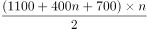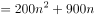。根据：收入-成本=利润，则有，计算较繁琐，考虑将选项由小到大进行代入排除：

代入A项：n=5，9100×5-（200×25+900×5）-16200=19800＜20000，排除；

代入B项：n=6，9100×6-（200×36+900×6）-16200=25800＞20000，符合题意。

则第6年时，单台汽车扣除购置和维护成本后产生的利润将超过2万元。 

故正确答案为B。

---

## 第 4 题　qid 4817781 · 数学运算

企业销售甲、乙、丙三种不同的机械，单价分别为33万元、17万元和13万元，某月三种设备共销售53台，甲设备的销量是丙设备的3倍，且乙设备的销售额比甲、丙设备的销售额之和高1万元，问当月，丙设备的销售额比乙设备少多少万元？

- **A**. 385
- **B**. 415
- **C**. 466
- **D**. 496　✅

**答案**：D

**官方解析**

设甲、乙、丙设备的销量分别为3x台、y台、x台。

方法一：根据题意，可列方程组：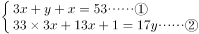，①×17+②，解得x=5，y=33。因此当月丙设备的销售额比乙设备少17y-13x=17×33-13×5=496万元。

方法二：根据“乙设备的销售额比甲、丙设备的销售额之和高1万元”整理可得：乙设备销售额-丙设备销售额=甲设备销售额+1=33×3x+1=（99x+1）万元，即（题干所求值-1）为99的整数倍，只有D项符合。

故正确答案为D。

---

## 第 5 题　qid 4817784 · 数学运算

石雕厂有48个石质圆柱要发往外地。这些圆柱的底面直径均为1.5米，其中30个石柱高0.8米，18个石柱高0.6米。该厂租用的运输车辆除去固定桩之后，可用的空间长3米，宽1.5米。为保证安全，圆柱只能底面朝下堆放，且堆叠高度不得超过2米。问一次性运完这些圆柱，至少需要租用几辆运输车辆？

- **A**. 9
- **B**. 10　✅
- **C**. 11
- **D**. 12

**答案**：B

**官方解析**

根据题意可知，两种石柱的底面直径均为1.5米，则在长3米，宽1.5米的空间中第一层只能并排放2个石柱。要想最后需要的运输车辆尽可能的少，则一辆车中堆叠的石柱的层数应尽可能的多，根据题干“堆叠高度不得超过2米”，则一辆车中最多只能堆叠3层，且保证尽可能多的车堆叠的高度尽可能的高。两种石柱的堆叠情况及需要的车辆如下表所示：

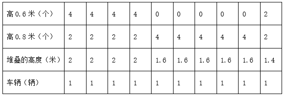

则至少需要租用10辆运输车辆。

故正确答案为B。

---

## 第 6 题　qid 4817751 · 数学运算

某网店同时针对A、B两种商品开展促销活动，A商品只按组销售，每组的价格保持10元不变，但每组商品由4件增加到5件；B商品的优惠活动则为买一送一。张某以55元的价格购买了原价总计80元的A、B商品各若干件，其中A商品的件数为B商品的2倍。问B商品原价为多少元/件？

- **A**. 1.5
- **B**. 2
- **C**. 2.5
- **D**. 3　✅

**答案**：D

**官方解析**

设B商品原价为x元/件，B商品购买了n件，则A商品购买了2n件。根据题意可列方程：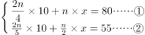，联立①②，解得x=3，n=10，即B商品原价为3元/件。

故正确答案为D。

---

## 第 7 题　qid 4817754 · 数学运算

小王打算从6月某日开始每天进行在线学习，每3天学习一次语文，每4天学习一次数学，每5天学习一次外语。已知小王8月13日学习语文，8月14日学习数学，8月15日学习外语。问他是从6月哪一天开始第一次学习的？

- **A**. 6月12日
- **B**. 6月13日
- **C**. 6月14日　✅
- **D**. 6月15日

**答案**：C

**官方解析**

“每3天学习一次语文，每4天学习一次数学，每5天学习一次外语”，说明小王同时学习三科的循环周期为3、4、5的最小公倍数，即60天。小王8月13日学习语文，8月14日学习数学，8月15日学习外语，可得出8月10日小王刚好三科都学习了。8月10日再往前推一个循环周期（60天）也是三科都学习的一天。
从8月10日往前推，8月已有9天，7月已有31天，还需往前推60-9-31=20天，可列式30-20+1=11，即6月11日应该三科都学习。
但没有对应选项，则按该时间往后推即可。按照“每3天学习一次语文，每4天学习一次数学，每5天学习一次外语”可以推出，小王6月14日学习语文，6月15日学习数学，6月16日学习外语，所以第一次学习是6月14日。
故正确答案为C。

---

## 第 8 题　qid 4817762 · 数学运算

在一块边长为8米的正方形草坪上架设了5个自动洒水器，洒水器的洒水半径为2米（如图所示）。问草坪上同时被两个洒水器洒到水的区域（灰色）面积比没有洒到水的区域（黑色）面积：

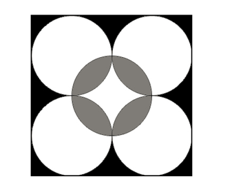

- **A**. 小不到5平方米　✅
- **B**. 小5平方米以上
- **C**. 大不到5平方米
- **D**. 大5平方米以上

**答案**：A

**官方解析**

设同时被两个洒水器洒到水的区域（灰色）面积为X平方米（以下称灰色区域）。根据题意，正方形草坪边长为8米，洒水器的洒水半径为2米，可得该正方形草坪面积为8×8=64平方米，每个洒水器洒水的面积为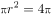平方米。分析图形交叉关系可知，没有洒到水的区域（黑色）面积=正方形草坪面积-（5个洒水器洒水区域总面积-灰色区域面积）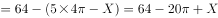平方米。则灰色区域面积减去黑色区域面积的差值为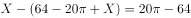平方米，即小不到5平方米。

故正确答案为A。

---

## 第 9 题　qid 4817766 · 数学运算

将A、B两个工程交给甲、乙两个工程队实施，已知A工程甲、乙合作需14小时完成，甲单独需18小时完成；B工程甲、乙合作需18小时完成，乙单独需30小时完成。问如两个工程队同时开始工作且在完成所有工程之前中途不休息，则完成时间最长和最短的实施方案，完成时间相差：

- **A**. 不到10小时
- **B**. 10~15小时之间
- **C**. 15~20小时之间
- **D**. 超过20小时　✅

**答案**：D

**官方解析**

赋值A工程的工程总量为14和18的最小公倍数126，则甲完成A工程的效率为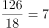，甲和乙完成A工程的效率和为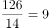，则乙完成A工程的效率为9-7=2；

赋值B工程的工程总量为18和30的最小公倍数90，则乙完成B工程的效率为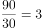，甲和乙完成B工程的效率和为，则甲完成B工程的效率为5-3=2。

则根据甲、乙两个工程队各自完成A、B工程的效率列表如下：

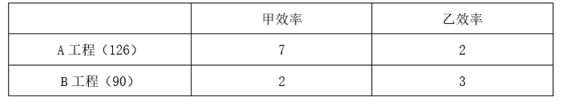

因此甲完成A工程的效率更高，乙完成B工程的效率更高。

若想要完成时间最短，优先让甲做A工程，乙做B工程。甲单独完成A工程需要18小时，此时B工程已被乙完成的工程量为18×3=54，B工程剩下90-54=36的工程量由甲、乙共同完成，还需要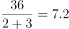小时，因此完成这两项工程最少需要18+7.2=25.2小时；

若想要完成时间最长，则考虑先让甲做B工程，乙做A工程。甲单独完成B工程需要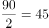小时，乙单独完成A工程需要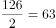小时，故甲单独完成B工程后去帮助乙，当甲完成B工程时，此时A工程已被乙完成的工程量为45×2=90，A工程剩下126-90=36的工程量由甲、乙共同完成，还需要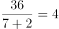小时，因此完成这两项工程最多需要45+4=49小时。

则完成时间最长和最短的实施方案，完成时间相差49-25.2=23.8小时，则完成时间相差超过20小时。

故正确答案为D。

---

## 第 10 题　qid 4817770 · 数学运算

某科考队由A、B研究所分别抽调5人，C、D研究所分别抽调7人组成，从每个研究所抽调的人员中，男性均比女性多1人。现将整个科考队分成勘探、化验两个小组，要求每个小组中均包含4个研究所的人且来自任意2个研究所的人数都不相同。问化验小组最少有几名男性成员？

- **A**. 1
- **B**. 2　✅
- **C**. 3
- **D**. 4

**答案**：B

**官方解析**

根据题意，各研究所人数情况如下图所示：

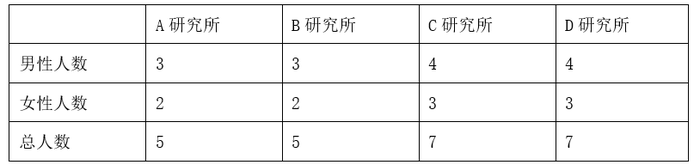

若要求每个小组中均包含4个研究所的人且来自任意2个研究所的人数都不相同，同时化验小组男性成员人数最少，则先考虑化验小组总人数最少的情况，即化验小组为1+2+3+4=10人。

经过列举，满足人数要求且化验小组男性成员最少的情况如下图所示：

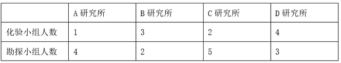

则化验小组来自A、B、C、D四个研究所的男性成员人数最少分别为0、1、0、1人，所以化验小组最少有男性成员人数为0+1+0+1=2人。

故正确答案为B。

---
