# 2022年国家公务员录用考试《行测》题（副省级网友回忆版）

> 数量关系 · 15 题 · 国考 2022

## 第 1 题　qid 4639352 · 数学运算

某企业职工筹款给甲村学龄儿童购买学习用具，如按100元/人的标准执行则资金剩余550元，如按120元/人的标准执行则还需筹集630元。现额外筹集2510元，且最终按80元/人的标准，正好能给甲、乙两村的学龄儿童购买学习用具。问乙村学龄儿童有多少人？

- **A**. 50
- **B**. 53　✅
- **C**. 56
- **D**. 59

**答案**：B

**官方解析**

设甲村学龄儿童为x人，根据题意可列方程：100x+550=120x-630，解得x=59，则原来筹款资金为100×59+550=6450元。现额外筹集2510元，则此时共有6450+2510=8960元。根据“80元/人的标准”，可得甲、乙两村的学龄儿童人数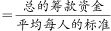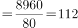人，则乙村学龄儿童有112-59=53人。

故正确答案为B。

---

## 第 2 题　qid 4639353 · 数学运算

甲、乙、丙、丁、戊5名职工参加党史知识测验，每人得分均不相同。甲和乙的平均分比丙多2分，丁和戊的平均分比丁多5分，甲、乙的平均分比丙、丁、戊的平均分多3分。问丙、丁、戊三人得分的排序为：

- **A**. 
丙&gt;丁&gt;戊

- **B**. 
丙&gt;戊&gt;丁

- **C**. 
丁&gt;丙&gt;戊

- **D**. 
戊&gt;丙&gt;丁
　✅

**答案**：D

**官方解析**

根据“丁和戊的平均分比丁多5分”，可知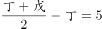，整理可得：戊=丁+10······①，可知戊＞丁。根据“甲和乙的平均分比丙多2分”，可知：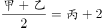······②；根据“甲、乙的平均分比丙、丁、戊的平均分多3分”，可知：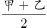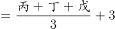，代入①可得：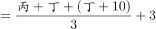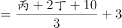······③，联立②③：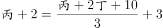，整理可得：丙=丁+6.5。则戊=丁+10＞丙=丁+6.5＞丁。

故正确答案为D。

---

## 第 3 题　qid 4637507 · 数学运算

企业列出500万元设备采购预算，如用于购买x台进口设备，最后剩余20万元。经董事会研究后，决定购买质量更高的同类国产设备，单价仅为进口设备的75%。当前预算可购买x+3台，最后剩余5万元。问国产设备的单价在以下哪个范围内？

- **A**. 不到30万元/台
- **B**. 30—40万元/台之间
- **C**. 40—50万元/台之间　✅
- **D**. 50万元/台以上

**答案**：C

**官方解析**

根据题意，若购买x台进口设备，最后剩余20万元，则每台进口设备的单价为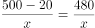万元。若购买国产设备，单价为进口设备的75%，则每台国产设备的单价为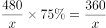。当前预算可购买国产设备x+3台，最后剩余5万元，可列式：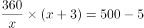，解得x=8。则共购买国产设备8+3=11台，花费495万元，其单价为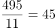万元，在C项范围内。

故正确答案为C。

---

## 第 4 题　qid 4639355 · 数学运算

甲和乙两个乡村图书室共有5000本藏书，其中甲图书室的藏书比乙图书室多3x本。现从甲图书室中取出150本书放入乙图书室后，甲图书室的藏书仍比乙图书室多2x本。问甲图书室原有图书多少本？

- **A**. 2500
- **B**. 2750
- **C**. 2950　✅
- **D**. 3500

**答案**：C

**官方解析**

方法一：设甲图书室原有藏书y本，则乙图书室藏书为（y-3x）本，由题意可列方程：y+y-3x=5000······①；甲图书室中取出150本书放入乙图书室，此时甲图书室有藏书（y-150）本，则乙图书室藏书为（y-3x+150）本，由题意可列方程：（y-150）-（y-3x+150）=2x······②。通过②式解得x=300，代入①式，解得y=2950，即甲图书室原有图书2950本。

方法二：结合盈亏思想分析：从甲图书室中取出150本书放入乙图书室后，甲乙两个图书室的藏书之差从3x本变为2x本，即150×2=3x-2x，解得x=300。则原来甲图书室的藏书比乙图书室多3×300=900本，即原来甲-乙=900······①，又知甲和乙两个图书室共有5000本藏书，即甲+乙=5000······②，联立①②，解得甲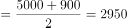，即甲图书室原有图书2950本。

故正确答案为C。

---

## 第 5 题　qid 4637227 · 数学运算

李某骑车从甲地出发前往乙地，出发时的速度为15千米/小时，此后均匀加速，骑行25%的路程后速度达到21千米/小时。剩余路段保持此速度骑行，总行程前半段比后半段多用时3分钟。问甲、乙两地之间的距离在以下哪个范围内？

- **A**. 不到23千米
- **B**. 在23~24千米之间
- **C**. 在24~25千米之间
- **D**. 超过25千米　✅

**答案**：D

**官方解析**

设总行程为4S千米，则总行程前半段为2S千米，后半段为2S千米。总行程前25%的路程为匀加速运动，初速度为15千米/小时，末速度为21千米/小时，代入公式：匀加速运动平均速度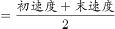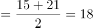千米/小时。根据“总行程前半段比后半段多用时3分钟”，可列方程：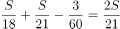，解得S=6.3千米，故甲、乙两地之间的距离4S=6.3×4=25.2千米，对应D项。

故正确答案为D。

---

## 第 6 题　qid 4637435 · 数学运算

高校某专业70多名毕业生中，有96%在毕业后去西部省区支援国家建设。其中去偏远中小学支教的毕业生占该专业毕业生总数的20%，比任职大学生村官的毕业生少2人，比在西部地区参军入伍的毕业生多1人，其余的毕业生选择去国有企业西部边远岗位工作。问去国有企业西部边远岗位工作的毕业生有多少人？

- **A**. 32
- **B**. 29
- **C**. 26　✅
- **D**. 23

**答案**：C

**官方解析**

根据题意可知，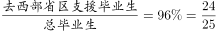，可知总毕业生人数为25的倍数，则总毕业生人数为75人，去西部省区支援国家建设的毕业生有75×96%=72人，去偏远中小学支教的毕业生有75×20%=15人，去任职大学生村官的毕业生有15+2=17人，在西部地区参军入伍的毕业生有15-1=14人，则去国有企业西部边远岗位工作的毕业生有72-15-17-14=26人。

故正确答案为C。

---

## 第 7 题　qid 4637509 · 数学运算

某地引进新的杂交水稻品种，今年每亩稻谷产量比上年增加了20%，且由于口感改善，每斤稻谷的售价从1.5元提升到1.65元。以此计算，今年每亩稻谷的销售收入比上年高660元。问今年的稻谷亩产是多少斤？

- **A**. 2200
- **B**. 1980
- **C**. 1650　✅
- **D**. 1375

**答案**：C

**官方解析**

根据题意，假设上年每亩稻谷产量为x斤，则今年每亩稻谷产量为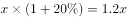斤。今年每亩稻谷的销售收入比上年高660元，即，解得x=1375，则今年的稻谷亩产为1.2×1375=1650斤。

故正确答案为C。

---

## 第 8 题　qid 4637231 · 数学运算

甲地在丙地正西17千米，乙地在丙地正北8千米。张从甲地、李从乙地同时出发，分别向正东和正南方向匀速行走。两人速度均为整数千米/小时，且1小时后两人的直线距离为13千米，又经过3小时后两人均经过了丙地且直线距离为5千米。已知李的速度是张的60%，则张经过丙地的时间比李：

- **A**. 早不到10分钟
- **B**. 早10分钟以上
- **C**. 晚不到10分钟
- **D**. 晚10分钟以上　✅

**答案**：D

**官方解析**

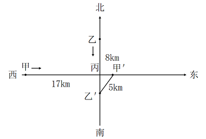

设张的速度为5m千米/小时，则李的速度为3m千米/小时。由题意可知，张、李两人1小时后直线距离为13千米，又经过3小时后直线距离为5千米，且此时均经过了丙地，即出发4小时后张、李两人分别到达图示、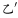处。则根据勾股定理可得：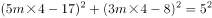，因两人速度均为整数千米/小时，则m=1时，符合题干所有要求。因此张到达丙地需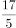小时，即3小时24分钟，李到达丙地需小时，即2小时40分钟，即张经过丙地的时间比李晚44分钟。

故正确答案为D。

---

## 第 9 题　qid 4637431 · 数学运算

某县通过发展旅游业来实现乡村振兴，引进了甲、乙、丙、丁、戊和己6名专家。其中甲、乙、丙是环境保护专家，丁、戊、己是旅游行业专家，甲、丁、戊熟悉社交媒体宣传。现要将6名专家平均分成2个小组，每个小组都要有环境保护专家、旅游行业专家和熟悉社交媒体宣传的人，问有多少种不同的分组方式？

- **A**. 12
- **B**. 24
- **C**. 4
- **D**. 8　✅

**答案**：D

**官方解析**

方法一：由题意可知，6名专家平均分成2个小组，因分组为平均分组，故对应总情况数为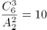种。考虑不满足题目要求的情况为：①小组3人不含有环境保护专家（丁戊己），②小组3人不含有旅游行业专家（甲乙丙），③小组不含有熟悉社交媒体宣传的人（乙丙己），由于①和②其实是同一种分组下的两组，故不满足题目要求的情况为2种。故满足要求的情况数为10-2=8种。

方法二：将熟悉社交媒体宣传的甲、丁、戊分成两部分：

①甲一组，丁、戊一组，要满足要求，剩下的乙、丙、己需选在乙、丙两人中选出一人与丁戊一组，只有（甲乙己、丙丁戊）和（甲丙己、乙丁戊）2种情况；

②丁一组，甲、戊一组，剩下的乙、丙、己选一个与甲、戊一组即可满足要求，有（丙丁己、甲乙戊）、（乙丁己、甲丙戊）、（乙丙丁、甲戊己）3种情况；

③戊一组，甲、丁一组，剩下的乙、丙、己选一个与甲、丁一组即可满足要求，有（丙戊己、甲乙丁）、（乙戊己、甲丙丁）、（乙丙戊、甲丁己）3种情况。

共2+3+3=8种情况满足要求。

故正确答案为D。

---

## 第 10 题　qid 4637230 · 数学运算

某水果种植特色镇创办水果加工厂，从去年年初开始通过电商平台销售桃汁、橙汁两种产品。从去年2月开始，每个月桃汁的销量都比上个月多5000盒，橙汁的销量都比上个月多2000盒。已知去年第一季度桃汁的总销量比橙汁少4.5万盒，则去年桃汁的销量比橙汁：

- **A**. 少不到5万盒　✅
- **B**. 少5万盒以上
- **C**. 多不到5万盒
- **D**. 多5万盒以上

**答案**：A

**官方解析**

根据题意，设去年1月桃汁销量为x万盒，去年1月橙汁销量为y万盒，根据等差数列通项公式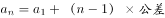，可将具体情况列表如下：

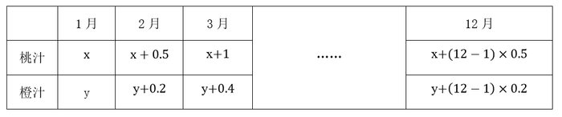

根据“去年第一季度桃汁的总销量比橙汁少4.5万盒”可知（y+y+0.2+y+0.4）-（x+x+0.5+x+1）=4.5，解得y-x=1.8万盒，根据等差数列求和公式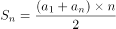，即桃汁去年总销量为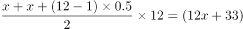万盒；橙汁去年总销量为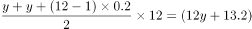万盒，故所求为12x+33-（12y+13.2）=12（x-y）+19.8=-1.8万盒，即少1.8万盒。

故正确答案为A。

---

## 第 11 题　qid 4639320 · 数学运算

救灾部门紧急运送两批大米分给受灾群众。已知甲村人数是丙村的2倍，如果两批大米都给甲村，每人正好能分24斤；如果第一批大米分给乙村，每人正好能分12斤，第二批大米分给甲、乙、丙三个村，每人正好能分4斤。为尽量保障受灾群众的基本需求，现决定另运送一批面粉分给甲村，并将两批大米都分给乙、丙两村。问乙、丙两村平均每人分到的大米重量在以下哪个范围内？

- **A**. 不到14斤
- **B**. 14～15斤之间　✅
- **C**. 15～16斤之间
- **D**. 16斤以上

**答案**：B

**官方解析**

设丙村有x人，乙村有y人，则甲村有2x人。根据两批大米的总重量不变，可列方程：24×2x=12y+4×（2x+y+x），解得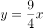，故两批大米都分给乙、丙两村，平均每人分到的大米重量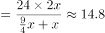斤，在B项范围内。

故正确答案为B。

---

## 第 12 题　qid 4637225 · 数学运算

为降低碳排放，企业对生产设备进行改造，改造后日产量下降了10%，但生产每件产品的能耗成本下降了50%，其他成本和出厂价不变的情况下每天的利润提高了10%。已知单件利润=出厂价-能耗成本-其他成本，且改造前产品的出厂价是单件利润的3倍，则改造前能耗成本为其他成本的：

- **A**. 
不到

- **B**. 
-之间
　✅
- **C**. 
-之间

- **D**. 
超过

**答案**：B

**官方解析**

设改造前能耗成本为x、其他成本为y、日产量为10、单件利润为100，则每天利润为1000、出厂价为300。根据每件产品的能耗成本下降了50%，可知改造后成本为0.5x；每天的利润提高了10%，可知改造后每天利润为1000×（1+10%）=1100；根据改造后日产量下降了10%，可知改造后日产量为9，则改造后单件利润为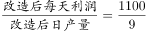。主体多可以考虑列表，表格如下图所示：

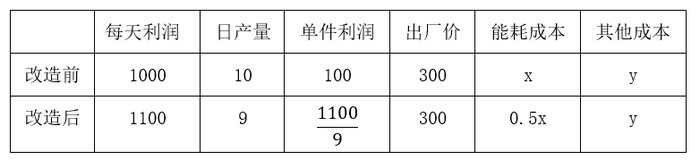

已知单件利润=出厂价-能耗成本-其他成本，根据改造前后可列方程组：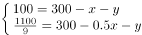，解得：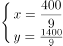，所求为：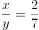，在-之间。

故正确答案为B。

---

## 第 13 题　qid 4637209 · 数学运算

一个圆柱体零件的高为1，其圆形底面上的内接正方形边长正好也为1。现将圆柱体零件切割4次，得到棱长为1的正方体，则切去部分的总表面积为：

- **A**. 
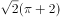

- **B**. 
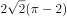

- **C**. 
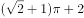
　✅
- **D**. 
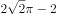

**答案**：C

**官方解析**

如下图所示，圆形底面上的内接正方形的对角线即为圆的直径，则该圆柱体的底面直径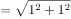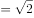，半径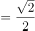。要想得到棱长为1的正方体，则需要分别沿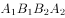、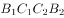、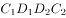、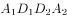切割4次，且切去的4个部分完全相同。切去部分的表面积包括圆柱体的侧面积、圆柱体的2个底面积扣除内接正方形的部分、正方体的4个侧面。故切去部分的总表面积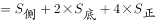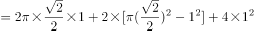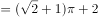。

故正确答案为C。

---

## 第 14 题　qid 4639327 · 数学运算

甲和乙两条效率相同的生产线从早上不同时间开始生产同一种产品，到中午12：00时分别正好生产了x件和y件。已知乙生产x件时，甲生产了54件；甲生产y件时，乙生产了1.5x件。如乙从9：00开始生产且12：00后两条生产线仍保持原有速度，问两条生产线生产的产品总量达到500件是在什么时候？

- **A**. 16：30之前
- **B**. 16：30～17：00之间
- **C**. 17：00～17：30之间
- **D**. 17：30之后　✅

**答案**：D

**官方解析**

根据甲和乙两条生产线效率相同，故在甲、乙均开始生产后，两条生产线生成产品数量的差值始终不变，则可列式：y-x=x-54=1.5x-y，解得x=72，y=90。由于乙从9：00开始生产，到12：00时乙生产了3小时，生产了90件，则甲、乙的效率均为件/小时。12：00时，甲、乙共生产72+90=162件，则两条生产线生产的产品总量达到500件还需小时，即时间为17：38时，两条生产线生产的产品总量达到500件。

故正确答案为D。

---

## 第 15 题　qid 4637228 · 数学运算

某种商品的定价为成本的1.5倍，如果在降价30元/件的基础上再打八折，则销售5件这种商品的利润比原价销售1件时多130元。问用以下哪种折扣销售时，1.5万元能买到的件数正好比原价销售时多4件？

- **A**. 先降价50元/件再打八折
- **B**. 先打九折再降价50元/件　✅
- **C**. 降价150元/件
- **D**. 打八五折

**答案**：B

**官方解析**

设该种商品每件成本为x元，则每件定价为1.5x元。根据题意可列方程：，解得x=500，即该种商品每件成本为500元，则每件定价为1.5×500=750元。按原价销售时，1.5万元可购买件，按选项折扣销售时，1.5万元需购买20+4=24件，此时每件售价应为元。代入选项：

A项：折扣售价元元，排除；

B项：折扣售价=750×0.9-50=625元，符合题意，当选。无需验证其他选项。

故正确答案为B。

---
