# 2022年国家公务员录用考试《行测》题（行政执法卷网友回忆版）

> 数量关系 · 10 题 · 国考 2022

## 第 1 题　qid 4637224 · 数学运算

某单位办事大厅有3个相同的办事窗口，2天最多可以办理600笔业务，每个窗口办理单笔业务的用时均相同。现对该办事大厅进行流程优化，增设2个与以前相同的办事窗口，且每个办事窗口办理每笔业务的用时缩短到以前的。问优化后的办事大厅办理6000笔业务最少需要多少天？

- **A**. 8　✅
- **B**. 10
- **C**. 12
- **D**. 15

**答案**：A

**官方解析**

根据“每个窗口办理单笔业务的用时均相同”，则1个窗口1天可办理业务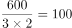笔，根据题意，增设2个窗口，且每个办事窗口办理每笔业务的用时缩短到以前的，同一项业务，办理时间和办理效率成反比，则每笔业务办理的效率是原来的，即优化后1个窗口1天可办理业务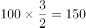笔。设优化后6000笔业务最少需要t天办理完成，则有6000=150×（3+2）×t，解得t=8，即最少需要8天。

故正确答案为A。

---

## 第 2 题　qid 4637226 · 数学运算

张和李2名社区工作者上门统计某小区内住户的新冠疫苗接种情况，两人各负责1栋住宅楼，每访问1户居民均需要5分钟。李因处理公文比张晚出发一段时间。已知14：00时两人共访问63户，15：00时张访问的户数是李的2倍。问李访问完50户居民是在什么时候？

- **A**. 16：30
- **B**. 16：45　✅
- **C**. 17：00
- **D**. 17：15

**答案**：B

**官方解析**

设14：00时，张访问了x户，李访问了63-x户，则15：00时，张访问了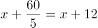户，李访问了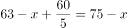户。根据“15：00时张访问的户数是李的2倍”，可得x+12=2（75-x），解得x=46。则14：00时李访问了63-46=17户，还需访问50-17=33户，需要时间为33×5=165分钟，14：00再过165分钟为16∶45。

故正确答案为B。

---

## 第 3 题　qid 4637227 · 数学运算

李某骑车从甲地出发前往乙地，出发时的速度为15千米/小时，此后均匀加速，骑行25%的路程后速度达到21千米/小时。剩余路段保持此速度骑行，总行程前半段比后半段多用时3分钟。问甲、乙两地之间的距离在以下哪个范围内？

- **A**. 不到23千米
- **B**. 在23~24千米之间
- **C**. 在24~25千米之间
- **D**. 超过25千米　✅

**答案**：D

**官方解析**

设总行程为4S千米，则总行程前半段为2S千米，后半段为2S千米。总行程前25%的路程为匀加速运动，初速度为15千米/小时，末速度为21千米/小时，代入公式：匀加速运动平均速度千米/小时。根据“总行程前半段比后半段多用时3分钟”，可列方程：，解得S=6.3千米，故甲、乙两地之间的距离4S=6.3×4=25.2千米，对应D项。

故正确答案为D。

---

## 第 4 题　qid 4637230 · 数学运算

某水果种植特色镇创办水果加工厂，从去年年初开始通过电商平台销售桃汁、橙汁两种产品。从去年2月开始，每个月桃汁的销量都比上个月多5000盒，橙汁的销量都比上个月多2000盒。已知去年第一季度桃汁的总销量比橙汁少4.5万盒，则去年桃汁的销量比橙汁：

- **A**. 少不到5万盒　✅
- **B**. 少5万盒以上
- **C**. 多不到5万盒
- **D**. 多5万盒以上

**答案**：A

**官方解析**

根据题意，设去年1月桃汁销量为x万盒，去年1月橙汁销量为y万盒，根据等差数列通项公式，可将具体情况列表如下：

根据“去年第一季度桃汁的总销量比橙汁少4.5万盒”可知（y+y+0.2+y+0.4）-（x+x+0.5+x+1）=4.5，解得y-x=1.8万盒，根据等差数列求和公式，即桃汁去年总销量为万盒；橙汁去年总销量为万盒，故所求为12x+33-（12y+13.2）=12（x-y）+19.8=-1.8万盒，即少1.8万盒。

故正确答案为A。

---

## 第 5 题　qid 4637209 · 数学运算

一个圆柱体零件的高为1，其圆形底面上的内接正方形边长正好也为1。现将圆柱体零件切割4次，得到棱长为1的正方体，则切去部分的总表面积为：

- **A**. 

- **B**. 

- **C**. 

　✅
- **D**. 

**答案**：C

**官方解析**

如下图所示，圆形底面上的内接正方形的对角线即为圆的直径，则该圆柱体的底面直径，半径。要想得到棱长为1的正方体，则需要分别沿、、、切割4次，且切去的4个部分完全相同。切去部分的表面积包括圆柱体的侧面积、圆柱体的2个底面积扣除内接正方形的部分、正方体的4个侧面。故切去部分的总表面积。

故正确答案为C。

---

## 第 6 题　qid 4637225 · 数学运算

为降低碳排放，企业对生产设备进行改造，改造后日产量下降了10%，但生产每件产品的能耗成本下降了50%，其他成本和出厂价不变的情况下每天的利润提高了10%。已知单件利润=出厂价-能耗成本-其他成本，且改造前产品的出厂价是单件利润的3倍，则改造前能耗成本为其他成本的：

- **A**. 
不到

- **B**. 
-之间
　✅
- **C**. 
-之间

- **D**. 
超过

**答案**：B

**官方解析**

设改造前能耗成本为x、其他成本为y、日产量为10、单件利润为100，则每天利润为1000、出厂价为300。根据每件产品的能耗成本下降了50%，可知改造后成本为0.5x；每天的利润提高了10%，可知改造后每天利润为1000×（1+10%）=1100；根据改造后日产量下降了10%，可知改造后日产量为9，则改造后单件利润为。主体多可以考虑列表，表格如下图所示：

已知单件利润=出厂价-能耗成本-其他成本，根据改造前后可列方程组：，解得：，所求为：，在-之间。

故正确答案为B。

---

## 第 7 题　qid 4637231 · 数学运算

甲地在丙地正西17千米，乙地在丙地正北8千米。张从甲地、李从乙地同时出发，分别向正东和正南方向匀速行走。两人速度均为整数千米/小时，且1小时后两人的直线距离为13千米，又经过3小时后两人均经过了丙地且直线距离为5千米。已知李的速度是张的60%，则张经过丙地的时间比李：

- **A**. 早不到10分钟
- **B**. 早10分钟以上
- **C**. 晚不到10分钟
- **D**. 晚10分钟以上　✅

**答案**：D

**官方解析**

设张的速度为5m千米/小时，则李的速度为3m千米/小时。由题意可知，张、李两人1小时后直线距离为13千米，又经过3小时后直线距离为5千米，且此时均经过了丙地，即出发4小时后张、李两人分别到达图示、处。则根据勾股定理可得：，因两人速度均为整数千米/小时，则m=1时，符合题干所有要求。因此张到达丙地需小时，即3小时24分钟，李到达丙地需小时，即2小时40分钟，即张经过丙地的时间比李晚44分钟。

故正确答案为D。

---

## 第 8 题　qid 4637223 · 数学运算

某企业将5台不同的笔记本电脑和5台不同的平板电脑捐赠给甲、乙两所小学，每所学校分配5台电脑。如在所有可能的分配方式中随机选取一种，两所学校分得的平板电脑数量均不超过3台的概率为：

- **A**. 
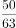
　✅
- **B**. 
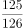

- **C**. 
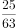

- **D**. 
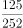

**答案**：A

**官方解析**

根据题意，甲、乙两所学校分配5台电脑的总情况数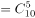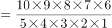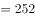种。满足两所学校分得的平板电脑数量均不超过3台的情况分类讨论如下：

①甲学校分得2台笔记本电脑、3台平板电脑，则乙学校分得3台笔记本电脑、2台平板电脑，情况数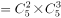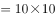种；

②甲学校分得3台笔记本电脑、2台平板电脑，则乙学校分得2台笔记本电脑、3台平板电脑，情况数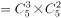种。

则所求概率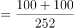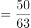。

故正确答案为A。

---

## 第 9 题　qid 4637228 · 数学运算

某种商品的定价为成本的1.5倍，如果在降价30元/件的基础上再打八折，则销售5件这种商品的利润比原价销售1件时多130元。问用以下哪种折扣销售时，1.5万元能买到的件数正好比原价销售时多4件？

- **A**. 先降价50元/件再打八折
- **B**. 先打九折再降价50元/件　✅
- **C**. 降价150元/件
- **D**. 打八五折

**答案**：B

**官方解析**

设该种商品每件成本为x元，则每件定价为1.5x元。根据题意可列方程：，解得x=500，即该种商品每件成本为500元，则每件定价为1.5×500=750元。按原价销售时，1.5万元可购买件，按选项折扣销售时，1.5万元需购买20+4=24件，此时每件售价应为元。代入选项：

A项：折扣售价元元，排除；

B项：折扣售价=750×0.9-50=625元，符合题意，当选。无需验证其他选项。

故正确答案为B。

---

## 第 10 题　qid 4637229 · 数学运算

甲、乙等16人参加乒乓球淘汰赛。每轮对所有未被淘汰选手进行抽签分组两两比赛，胜者进入下一轮。已知除甲以外，其余任意两人比赛时双方胜率均为50%。甲对乙的胜率为0%，对其他14人的胜率均为100%。则甲夺冠的概率为：

- **A**. 

- **B**. 

- **C**. 
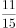
　✅
- **D**. 
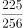

**答案**：C

**官方解析**

根据题意，甲若想夺冠，需进行四轮比赛且比赛中不能与乙同组比赛，正面讨论较为复杂，正难则反，考虑反面情况（甲乙同组比赛），分类讨论如下：

甲在第一轮与乙比赛：甲在第一轮碰到乙的概率为，则淘汰概率为；

甲在第二轮与乙比赛：甲、乙在第一轮均胜出的概率为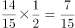，甲在第二轮碰到乙的概率为，则淘汰概率为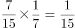；

甲在第三轮与乙比赛：甲、乙在第一轮均胜出的概率为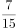，在第二轮均胜出的概率为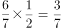；甲在第三轮碰到乙的概率为，则淘汰概率为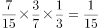；

甲在第四轮与乙比赛：甲、乙在第一轮均胜出的概率为，在第二轮均胜出的概率为，在第三轮均胜出的概率为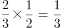；甲在第四轮碰到乙的概率为1，则甲在第四轮淘汰的概率为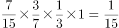。

则题目所求概率反面情况概率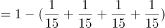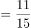。

故正确答案为C。

---
