# 2022年天津市公务员录用考试《行测》试题（网友回忆版）

> 数量关系 · 10 题 · 天津 2022

## 第 1 题　qid 5102673 · 数学运算

某商场1月尝试采购一款新产品进行销售，每月进货量固定为1000件，1月的销售量为800件。销售一段时间发现，从2月开始，每月的销售量均比上月高10%。问几月份会出现第1次库存清零？

- **A**. 4月
- **B**. 5月
- **C**. 6月　✅
- **D**. 7月

**答案**：C

**官方解析**

若想出现第1次库存清零，则需当月的累计销量＞累计进货量。根据题意可列表如下：

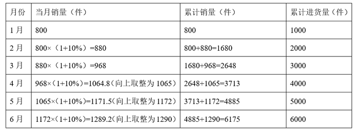

通过上表可知，第1次累计销量大于累计进货量的月份为6月，则6月份会出现第1次库存清零。

故正确答案为C。

---

## 第 2 题　qid 5102593 · 数学运算

一个袋子里红球、白球、蓝球的数量比例为3：8：4，再向袋子中放入14个红球和若干个蓝球后，红球、白球、蓝球的数量比例变为5：4：3。如果此时从袋子里取出10个红球、6个白球和2个蓝球后，袋子里剩余红球、白球、蓝球的数量比例为：

- **A**. 1：2：1
- **B**. 2：3：1
- **C**. 1：1：2
- **D**. 1：1：1　✅

**答案**：D

**官方解析**

设袋子里最初红球、白球、蓝球的数量分别为3x、8x、4x个，放入14个红球和若干个蓝球后，白球数量未变，根据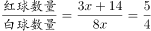，解得x=2，白球数量=8x=16个，此时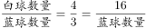，则蓝球数量=12个。最后从袋子里取出10个红球、6个白球和2个蓝球，此时袋子里剩余红球3x+14-10=3×2+4=10个，剩余白球16-6=10个，剩余蓝球12-2=10个，即袋子里剩余红球、白球、蓝球的数量比例=10：10：10=1：1：1。

故正确答案为D。

---

## 第 3 题　qid 5102587 · 数学运算

甲、乙二人合作计划30天完成一项工程，甲的工作效率是乙的2倍。两人合作10天后，甲的效率提升25%，乙的效率提升50%。又合作10天后，乙因其他任务撤出，甲单独完成剩余任务。问最终工作比预计时间：

- **A**. 早2天　✅
- **B**. 晚2天
- **C**. 早4天
- **D**. 晚4天

**答案**：A

**官方解析**

由于题干只给出工作效率的比例关系，故赋值乙的工作效率为1，则甲的工作效率为2，则工作总量=（1+2）×30=90。合作10天后，剩余工作总量=90-（1+2）×10=60，此时甲的工作效率为2×（1+25%）=2.5，乙的工作效率为1×（1+50%）=1.5。又合作10天后，剩余工作总量=60-（1.5+2.5）×10=20，甲单独完成剩余任务还需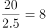天，总共需要10+10+8=28天，则最终工作比预计时间早30-28=2天。

故正确答案为A。

---

## 第 4 题　qid 5102594 · 数学运算

某健身房近期推出甲、乙、丙、丁4项课程，每项课程的一次消费分别为200元、300元、400元、500元，会员可根据充值卡内余额自行进行消费。会员小李充值卡内还剩2200元，打算在有效期内每项课程都至少消费1次，且将充值卡内余额恰好用完，问他消费这4项课程的组合有多少种不同的可能性？

- **A**. 3
- **B**. 4
- **C**. 5　✅
- **D**. 6

**答案**：C

**官方解析**

根据题干，若每项课程都先消费1次，将消费200+300+400+500=1400元，此时充值卡内剩余2200-1400=800元，题干要求将充值卡内余额恰好用完无剩余，故消费组合的总情况较少，对情况进行枚举可得：

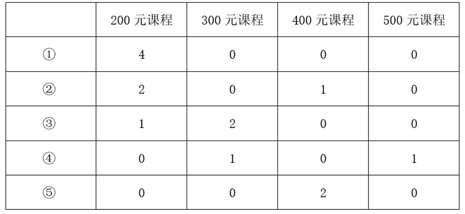

综上可知，小李消费这4项课程的组合共有5种不同的可能。

故正确答案为C。

---

## 第 5 题　qid 5102591 · 数学运算

某水果采摘园门票为每人x元，采摘水果20元/斤，采摘满3斤可免除一半门票费用，采摘满5斤可免除全部门票费用。已知采摘6斤的价格是采摘2斤价格的2倍。问采摘8斤的价格比采摘4斤多多少元？

- **A**. 70　✅
- **B**. 80
- **C**. 90
- **D**. 100

**答案**：A

**官方解析**

根据题意，采摘满5斤可免除全部门票费用，即采摘6斤花费6×20=120元，设门票为每人x元，则采摘2斤的价格=120÷2=2×20+x，解得x=20，即门票为每人20元。故采摘4斤花费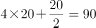元，则采摘8斤的价格-采摘4斤的价格=8×20-90=70元，即多70元。

故正确答案为A。

---

## 第 6 题　qid 5102630 · 数学运算

某部门共7人，其中有2人博士毕业，5人硕士毕业。某日，该部门随机分成3个小组参加3项不同的活动，3个小组人数各不相同。问其中2位博士毕业人员分在同一小组的概率在以下哪个范围内？

- **A**. 不到25%
- **B**. 在25%到35%之间　✅
- **C**. 在35%到45%之间
- **D**. 45%以上

**答案**：B

**官方解析**

根据题意可知，把7人分成人数不同的3个小组，3个小组的人数只能分别为1人，2人和4人。3个小组参加3项不同的活动，总的情况数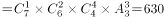种。2位博士毕业人员分在同一小组，分类讨论：①只有2位博士毕业人员组成一组有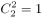种可能，其余两个小组有（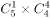）种可能，则此时有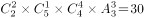种情况；②2位博士毕业人员和2位硕士毕业人员组成一组，有种可能，其余两个小组有（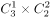）种可能，则此时有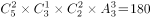种情况。因此，满足2位博士毕业人员分在同一小组的情况数＝30＋180＝210种。则所求概率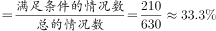，在B项范围内。

故正确答案为B。

---

## 第 7 题　qid 5102631 · 数学运算

某地组织大型公益演出，临时抽调一支一百多人的志愿服务队。其中，20至30岁（不含30岁）的人数占总人数的68%，30岁及以上的人数是不到20岁人数的7倍。已知30岁以下的人数比30岁及以上的人数多66人，问这支服务队共多少人？

- **A**. 90
- **B**. 120
- **C**. 150　✅
- **D**. 180

**答案**：C

**官方解析**

因“20至30岁（不含30岁）的人数占总人数的68%”，则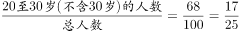，设总人数为25x，则20至30岁（不含30岁）的人数为17x，30岁及以上的人数和不到20岁的人数总计为25x-17x=8x，因“30岁及以上的人数是不到20岁人数的7倍”，则30岁及以上的人数为7x，不到20岁的人数为x。根据条件“30岁以下的人数比30岁及以上的人数多66人”，可列式：（17x+x）-7x=66，解得x=6人，则这支服务队共25x=25×6=150人。

故正确答案为C。

---

## 第 8 题　qid 5102687 · 数学运算

冬奥会男子短道速滑1500米比赛中，A、B两位运动员同时出发，已知本次比赛需要绕场地滑13.5圈，假设每位运动员滑完全程的速度是不变的，A运动员滑完全程需要2分15秒，B运动员滑一圈比A运动员少用时1秒，则A开始滑第几圈时，B运动员正好领先A运动员一整圈？

- **A**. 9
- **B**. 10　✅
- **C**. 11
- **D**. 12

**答案**：B

**官方解析**

由题可知，A运动员滑完全程13.5圈需要2分15秒（即135秒），则A运动员滑一圈需要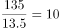秒，B运动员滑一圈比A运动员少用时1秒，故B运动员滑一圈需要10-1=9秒。根据“路程相同，速度与时间成反比”，则A、B两位运动员速度比为9：10。比赛中，A、B两位运动员同时出发，“时间相同，路程与速度成正比”，则A运动员刚滑完第9圈，开始滑第10圈时，B运动员滑完第10圈，此时B运动员正好领先A运动员一整圈。

故正确答案为B。

---

## 第 9 题　qid 5102688 · 数学运算

有一个20世纪八九十年代出生的人，在21世纪，恰好有一年，他年龄的平方数等于那一年的年份。这个人是哪年出生的？

- **A**. 1995
- **B**. 1990
- **C**. 1985
- **D**. 1980　✅

**答案**：D

**官方解析**

根据题意，在21世纪的某年，这个人年龄的平方数等于该年的年份，21世纪年份为平方数的只有年，即2025年这个人45岁，则此人出生于2025-45=1980年。 

故正确答案为D。

---

## 第 10 题　qid 5102685 · 数学运算

某班期末考试结束后统计，物理、化学均不及格的人数占全班的14%，物理及格的人数比化学及格的人数多10人，且化学及格的人数占全班人数的60%。已知全班人数不超过70人，问物理及格的人中化学也及格的有多少人？

- **A**. 25
- **B**. 26
- **C**. 27　✅
- **D**. 28

**答案**：C

**官方解析**

根据题意可得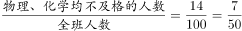，总人数为50的整数倍，又由于全班人数不超过70人，则全班人数为50人，物理、化学均不及格的人数为7人。化学及格的人数为50×60%=30人，物理及格的人数为30+10=40人。根据两集合容斥公式：，可得：40+30-物理、化学均及格的人数=50-7，则物理、化学均及格的人数为27人，即物理及格的人中化学也及格的有27人。

故正确答案为C。

---
