# 2022年山东省公务员录用考试《行测》试题（网友回忆版）

> 数量关系 · 10 题 · 山东 2022

## 第 1 题　qid 4662345 · 数学运算

将一个立方体的表面涂黑，用刀片平行于立方体各面，将其切割成若干个棱长为1的小立方体，如果只有一个面涂黑的小立方体的个数与没有一个面涂黑的小立方体的个数相等。那么原立方体的棱长为多少？

- **A**. 4
- **B**. 6
- **C**. 16
- **D**. 8　✅

**答案**：D

**官方解析**

设原立方体的棱长为n，结合下图，只有一个面涂黑的小立方体应为原大立方体每个面上除去棱上的部分（如图中蓝色的立方体）。因立方体有6个面，则只有一个面涂黑的小立方体个数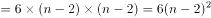；没有一个面涂黑的小立方体为大立方体除去6个面上立方体的部分（即从外表面看不到的部分），则没有一个面涂黑的小立方体个数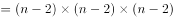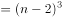。根据“只有一个面涂黑的小立方体的个数与没有一个面涂黑的小立方体的个数相等”可得： 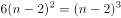，解得n=8。

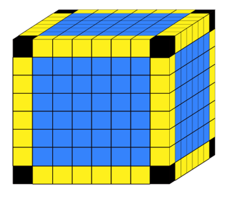

故正确答案为D。

---

## 第 2 题　qid 4662348 · 数学运算

某企业甲、乙两个分公司总计有党员96名。某次党史知识测验中，甲分公司党员平均分比乙分公司高1.2分，且比两分公司党员的平均分高0.5分，则甲分公司党员人数比乙分公司：

- **A**. 少不到10人
- **B**. 多不到10人
- **C**. 多10人以上　✅
- **D**. 少10人以上

**答案**：C

**官方解析**

方法一：根据题意，设甲分公司党员人数为x，则乙分公司党员人数为96-x；设乙分公司党员平均分为y，则甲分公司党员平均分为y+1.2，两分公司党员的平均分为（y+1.2）-0.5=y+0.7。根据：两分公司党员总分数=甲分公司党员分数+乙分公司党员分数，可得：x（y+1.2）+（96-x）y=96（y+0.7），化简得：1.2x=96×0.7，解得x=56。即甲分公司党员有56人，乙分公司党员有96-56=40人，甲分公司党员人数比乙分公司多56-40=16人，对应C项。

方法二：设乙分公司党员平均分为x，则甲分公司党员平均分为x+1.2，两分公司党员的平均分为（x+1.2）-0.5=x+0.7。根据线段法“距离与量成反比”，可得甲、乙两个分公司的党员人数之比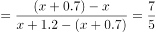，则甲分公司党员人数比乙分公司多：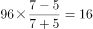人，对应C项。

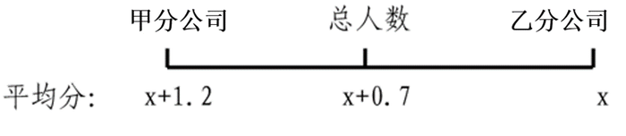

故正确答案为C。

---

## 第 3 题　qid 4662350 · 数学运算

某公司用大、小两种卡车运输货物。已知大卡车载重8吨，每辆每次运费1200元；小卡车载重3吨，每辆每次运费600元。已知该公司运输预算为1.5万元，问：最多能运输多少吨货物？

- **A**. 96
- **B**. 97
- **C**. 99　✅
- **D**. 101

**答案**：C

**官方解析**

根据题意可得，大卡车平均每运输1吨需运费1200÷8=150元，小卡车平均每运输1吨需运费600÷3=200元，大卡车平均每运输1吨所需运费低于小卡车。总预算为定值，要想运输的货物多，则尽量让大卡车多运输且费用无剩余。15000÷1200=12次······600元，剩余600元刚好够小卡车运输一次。总预算恰好可使得大卡车运输12次，小卡车运输1次，最多能运输12×8+1×3=99吨。
故正确答案为C。

---

## 第 4 题　qid 4662354 · 数学运算

某部门欲评选一名年度优秀工作者，候选人为甲、乙、丙。该部门全体职工参与投票，每人只能投一票，得票最多的人当选。经统计，有效票为89张，在已公布结果的58张票中，甲得34票，乙得9票，丙得15票。甲若想确保当选，则剩余的选票中至少需再得：

- **A**. 16票
- **B**. 11票
- **C**. 9票
- **D**. 7票　✅

**答案**：D

**官方解析**

方法一：根据题干，剩余选票有89-58=31张，题目问最少，可考虑从小到大代入验证：
D项：若剩余的31张选票中甲再得7票，甲共得34+7=41票。剩余31-7=24票，即使都给丙，15+24=39票，依然小于甲的得票数，甲当选。D项满足题干条件，其他选项无需验证。
方法二：甲要当选，则必须得票数最多。在剩余的89-58=31张选票中，设甲再得x票，则其余（31-x）票分给乙和丙。由于丙现有的得票数多于乙，最极端情况为其余票数都归丙，此时x取值最小。因此保证甲当选，则有34+x&gt;15+（31-x），解不等式得x&gt;6，即甲至少需要再得7票。
故正确答案为D。

---

## 第 5 题　qid 4662357 · 数学运算

某图书网店规定，一次性购买图书定价之和超过100元、500元、1000元，分别优惠总额的2%、5%、10%，优惠不叠加，且每笔订单客户需额外支付邮费6元。已知一次性购买10本某种教材的开销比分10次购买单本这种教材低174元。问：单次购买1本这种教材的开销是多少元？

- **A**. 123.6
- **B**. 153　✅
- **C**. 183.6
- **D**. 202

**答案**：B

**官方解析**

根据题目条件，结合选项代入：

A项：若单次购买的开销为123.6元，则一本教材的原价为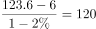元。一次性购买10本的开销为120×10×（1-10%）+6=1086元，分10次购买的开销为123.6×10=1236元，此时一次性购买10本比分10次购买低1236-1086=150元，不符合题干条件，排除；

B项：若单次购买的开销为153元，则一本教材的原价为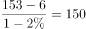元。一次性购买10本的开销为150×10×（1-10%）+6=1356元，分10次购买的开销为153×10=1530元，则一次性购买10本比分10次购买低1530-1356=174元，符合题干条件，当选。

故正确答案为B。

---

## 第 6 题　qid 4662457 · 数学运算

某种产品的生产需要甲、乙、丙三种液体原料，且每生产3件产品需要用5瓶甲，每生产4件产品需要用3瓶乙，每生产5件产品需要用7瓶丙。某工厂采购三种原料共x瓶用于生产这种产品，且所有原料正好用完。已知，问：采购了多少瓶丙原料？

- **A**. 420　✅
- **B**. 350
- **C**. 210
- **D**. 630

**答案**：A

**官方解析**

根据题意可知，每生产60件产品需要用甲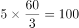瓶，需要用乙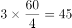瓶，需要用丙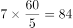瓶。故每生产60件产品共需要用三种原料100+45+84=229瓶，根据，而产品数量又要为整数，229的整数倍中只有229×5=1145满足条件，故采购了84×5=420瓶丙原料。

故正确答案为A。

---

## 第 7 题　qid 4662863 · 数学运算

甲、乙、丙三个工程队承担A、B两项工程。已知甲队的效率比乙队高20%，乙队的效率比丙队高25%。工程A的工作量是工程B的1.5倍。甲队在工程A施工，乙队在工程B施工，丙队先在工程A施工若干天后再转到工程B施工。若A、B两工程同时开工，且180天同时完成。问丙队在工程B施工多少天？

- **A**. 45　✅
- **B**. 75
- **C**. 105
- **D**. 135

**答案**：A

**官方解析**

根据“甲队的效率比乙队高20%，乙队的效率比丙队高25%”，可得甲、乙、丙的效率之比为6:5:4。赋值甲、乙、丙的效率分别为6、5、4，根据“A、B两工程同时开工，且180天同时完成”，可得工程A和工程B的工作总量=（6+5+4）×180=2700。根据“工程A的工作量是工程B的1.5倍”，可得工程B的工作量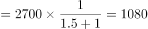。设丙队在工程B施工x天，根据工程B由乙队和丙队共同完成，可列方程：5×180+4x=1080，解得x=45，则丙在工程B施工45天。

故正确答案为A。

---

## 第 8 题　qid 4662430 · 数学运算

某网球俱乐部用一笔经费购买甲、乙、丙三种品牌的网球，其中甲品牌每盒25元，丙品牌每盒60元。已知现有经费全部用于购买甲品牌、乙品牌和丙品牌，分别可以购买（x+8）盒、x盒和（x-6）盒且无预算剩余。问：如乙品牌降价5元/盒，则需增加多少元经费才能购买40盒？

- **A**. 600元
- **B**. 660元
- **C**. 700元　✅
- **D**. 840元

**答案**：C

**官方解析**

根据题意可知，25×（x+8）=60×（x-6），解得x=16，则原来全部经费为25×（16+8）=600元，乙品牌网球的单价为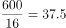元/盒，降价5元/盒后购买40盒乙品牌网球需要经费（37.5-5）×40=1300元，则需要增加经费1300-600=700元。

故正确答案为C。

---

## 第 9 题　qid 4662458 · 数学运算

已知10个外观完全一样的产品中有1个是次品。如果从中随机选择3个，选中次品的概率为x%；每次随即选择1个后放回，选择4次后至少有1次选中次品的概率为y%。问x-y的值z在以下哪个范围内？

- **A**. 
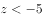

- **B**. 
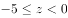
　✅
- **C**. 
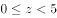

- **D**. 
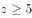

**答案**：B

**官方解析**

根据题意，分别计算x和y：

第一种情况：选中次品的情况为从9个正品中选2个，1个次品必选，则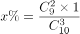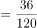，则x=30；

第二种情况：正面情况较多，考虑反面情况：4次均未选中次品即全都选中正品，概率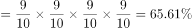，则y%=1-65.61%=34.39%，则y=34.39。

故z=x-y=30-34.39=-4.39，在-5到0之间。

故正确答案为B。

---

## 第 10 题　qid 4662460 · 数学运算

一种电子表在10点5分8秒时，显示的时间为10：05：08。问：10：00：00到10：30：00之间，电子表上显示时间的6个数字彼此都不相同的情形共有多少种？

- **A**. 45
- **B**. 90　✅
- **C**. 120
- **D**. 210

**答案**：B

**官方解析**

由题意可知，第1位是1，第2位是0，第3位应小于3且不能是0和1，那么第3位只能为2。再分情况考虑第4位可能的数字：
①第4位是3、4、5：表示时间的第5位应小于6，0-5有6个数字，前4个数字都属于0-5的区间，则第5位的取值有6-4=2种；0-9有10个数字，则第6位的取值有10-5=5种；共有3×2×5=30种情形；
②第4位是6、7、8、9：表示时间的第5位应小于6，0-5有6个数字，前3个数字都属于0-5的区间，则第5位的取值有6-3=3种；0-9有10个数字，则第6位的取值有10-5=5种；共有4×3×5=60种情形。
故电子表上显示时间的6个数字彼此都不相同的情形共有30+60=90种。
故正确答案为B。

---
