# 2022年山西省公务员录用考试《行测》题（网友回忆版）

> 数量关系 · 15 题 · 山西 2022

## 第 1 题　qid 5102155 · 数学运算

滑雪和滑冰是冬奥会的两大项赛事，其中高山滑雪、自由式滑雪、单板滑雪、跳台滑雪、越野滑雪和北欧两项是滑雪大项中的6个分项，短道速滑、速度滑冰和花样滑冰是滑冰大项中的3个分项。小林打算去现场观看比赛，共选择6个项目，并且每个大项不少于1个，若所有项目比赛时间均不交叉，则不同的观赛方式有：

- **A**. 83种　✅
- **B**. 84种
- **C**. 92种
- **D**. 102种

**答案**：A

**官方解析**

方法一：根据题意，要求每个大项不少于1个，即分为三类情况讨论如下：

第一类：滑冰大项中选择1个分项，滑雪大项中选择5个分项，情况数为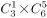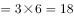种情况；

第二类：滑冰大项中选择2个分项，滑雪大项中选择4个分项，情况数为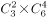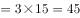种情况；

第三类：滑冰大项中选择3个分项，滑雪大项中选择3个分项，情况数为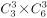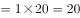种情况；

分类相加，即符合条件的总情况数为18+45+20=83种。

方法二：根据题意，要求每个大项不少于1个，正面情况数较多，故从反面考虑。反面为选择的6个项目均为滑雪分项（滑冰分项仅有3个，故不可能全为滑冰项目），则反面情况为从6个滑雪分项中选择6个项目，有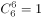种情况。总的情况数为从9个分项中选择6个项目，有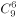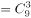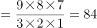种情况，故所求情况数=总情况数-反面情况数=84-1=83种。

故正确答案为A。

---

## 第 2 题　qid 5102124 · 数学运算

为了支持乡村教育，某市派出6名优秀教师前往该市农村的三所学校支教，一所1名，一所2名，一所3名，不同的选派方法共有：

- **A**. 60种　✅
- **B**. 120种
- **C**. 360种
- **D**. 720种

**答案**：A

**官方解析**

第一所学校需1名教师，选择情况数为种；第二所学校需2名教师，选择情况数为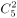种，此时剩余三名教师自动去往第三所学校，故总情况数为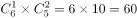种。

故正确答案为A。

备注：本题存在歧义，题干未明确指出三所学校所需教师名额是否固定。若名额不固定，另一种解法为：先选出一所学校，派出1名教师，情况数为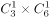种；再选出一所学校，派出2名教师，情况数为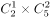种，此时剩余三名教师自动去往最后一所学校，故总情况数为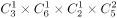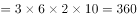种，对应C项。但现实生活中，支教名额应该是根据学校需求定好的，所以粉笔更倾向A项为正确答案。

---

## 第 3 题　qid 5102127 · 数学运算

某市举行庆典活动，将依次升空105架无人机，升空方式如下：每架无人机间距均相等，第一次升空n架，第二次升空n-1架，以此类推，最终在夜空中组成一个近似等边三角形背景的灯光秀，那么第10次升空的无人机数量是：

- **A**. 3架
- **B**. 5架　✅
- **C**. 8架
- **D**. 10架

**答案**：B

**官方解析**

根据题意可知，每次升空的无人机数量组成等差数列。又因为“组成一个近似等边三角形”，则第一次升空n架（）为底边，最后一次升空的无人机在三角形的顶点上，数量为1架（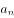），且公差d＝-1。根据等差数列求和公式：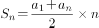，可得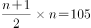，解得n＝14。再根据等差数列通项公式：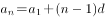，则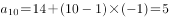，故第10次升空的无人机数量是5架。

故正确答案为B。

---

## 第 4 题　qid 5102130 · 数学运算

清朝乾隆皇帝曾出上联“客上天然居，居然天上客”，纪昀以“人过大佛寺，寺佛大过人”对出下联，这副对联既可以顺读也可以逆读，被称作回文联。数学中也有类似回文数，如212、37473等，则三位数中回文数是奇数的概率为：

- **A**. 

- **B**. 

- **C**. 

- **D**. 

　✅

**答案**：D

**官方解析**

根据题意三位数是回文数的情况，即百位数字和个位数字相同，且由于三位数百位数字不能为0，只能是1-9中的任意一个，十位数字可以是0-9中的任意一个，故总情况数有9×10=90种。回文数是奇数的情况，即个位数字可以是1、3、5、7、9中的一个，百位数字和个位数字相同，十位数字可以是0-9中的任意一个，故满足条件的情况有5×10=50种。则三位数中回文数是奇数的概率为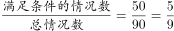。

故正确答案为D。

---

## 第 5 题　qid 5102161 · 数学运算

为了加强环境治理和生态修复，某市派出4位专家（甲、乙、丙、丁）前往某山区3个勘探点进行环境检测，要求每个勘探点至少安排一名专家。那么甲、乙两名专家去了不同勘探点的概率是：

- **A**. 

- **B**. 

- **C**. 

　✅
- **D**. 

**答案**：C

**官方解析**

4位专家分配到3个勘探点，要求每个勘探点至少安排一名专家，则有一个勘探点需要分配2位专家。从4位专家中选择两位，有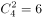种情况，将选择的两位专家当作一个整体，与另外两位专家分别分配到3个勘探点，共有种情况，则总情况数有6×6=36种。

甲、乙两名专家去了不同勘探点，从正向分析情况数较多，考虑反向计算，即甲、乙两名专家去了同一勘探点。将甲、乙两名专家当作一个整体，与另外两位专家分别分配到3个勘探点，共有种情况。即甲、乙两名专家去了同一勘探点共有6种情况。

则所求概率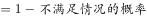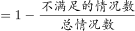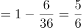。

故正确答案为C。

---

## 第 6 题　qid 5102162 · 数学运算

某方舱医院配有1000张床位，现已接收新冠确诊患者200名，并按床护比（护士数与床位数的比值）0.6：1配齐了护士人员。因疫情发展迅速，该医院又收治了700名患者，此时床护比下调为0.2：1，那么还需增加护士：

- **A**. 80名
- **B**. 60名　✅
- **C**. 40名
- **D**. 20名

**答案**：B

**官方解析**

根据最初床护比为0.6：1，可求出最初200名患者配备的护士人数为200×0.6=120名；又收治700名患者后，患者总数变为200+700=900名，按照下调后床护比为0.2：1计算，共需护士900×0.2=180名，所以需增加护士人数=180-120=60名。
故正确答案为B。

---

## 第 7 题　qid 5102140 · 数学运算

北京冬奥会期间，冬奥会吉祥物“冰墩墩”纪念品十分畅销。销售期间某商家发现，进价为每个40元的“冰墩墩”，当售价定为44元时，每天可售出300个，售价每上涨1元，每天销量减少10个。现商家决定提价销售，若要使销售利润达到最大，则售价应为：

- **A**. 51元
- **B**. 52元
- **C**. 54元
- **D**. 57元　✅

**答案**：D

**官方解析**

设“冰墩墩”纪念品售价共上涨x元，销售利润为y元。根据题意，可列方程：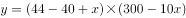，即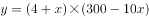，令y=0，解得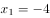，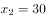，当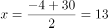时，总利润最大，此时售价为44+13=57元。

故正确答案为D。

---

## 第 8 题　qid 5102142 · 数学运算

某地采用传统销售模式，销售一批鸡蛋需要20天，销售一批桃子需要25天。为推动销售，当地开启县领导直播带货模式，直播带货期间，鸡蛋的销售效率提高为原来的2倍，桃子销售效率为原来的3倍；其余销售时间依然按照传统模式进行，结果两种产品同时销售完成。那么销售期间直播带货的天数为：

- **A**. 3
- **B**. 5　✅
- **C**. 8
- **D**. 10

**答案**：B

**官方解析**

除了销售时间相同，销售鸡蛋和销售桃子没有其它关系，所以二者是相互独立的，因此可赋值传统销售模式下的鸡蛋和桃子的销售效率均为1，则直播带货期间，鸡蛋销售效率为2，桃子销售效率为3。根据题意可得，该批鸡蛋总量为20×1=20，该批桃子总量为25×1=25。设销售期间直播带货的天数为x，则非直播带货的鸡蛋销售时间为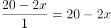，非直播带货的桃子销售时间为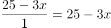。因为两种产品同时销售完成，其中的直播带货时间相同，那么非直播带货的时间也相同，即20-2x=25-3x，解得x=5，因此销售期间直播带货的天数为5。

故正确答案为B。

---

## 第 9 题　qid 5102131 · 数学运算

某单位四个党史宣讲小组各有若干组员，现增加2人并重新分配，使得四个小组人数相等。此时与原先相比，第一小组人数增加10人，第二小组人数减少1人，第三小组人数增加一倍，第四小组人数减半。则原先人数最多的小组与人数最少的小组之间相差：

- **A**. 15人
- **B**. 21人
- **C**. 24人　✅
- **D**. 32人

**答案**：C

**官方解析**

设重新分配后平均每组x人，则根据题意可知：

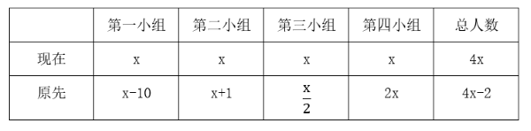

由上表可得，原先四个小组总人数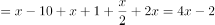 ，解得x=14。可得原先四个小组人数分别为：第一小组=x-10=4人，第二小组=x+1=15人，第三小组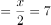人，第四小组=2x=28人。则原先人数最多的小组与人数最少的小组之间相差28-4=24人。

故正确答案为C。

---

## 第 10 题　qid 5102134 · 数学运算

某智能停车场泊车的泊车位置由电脑随机派位生成。现有两排车位，每排4个，有4辆不同的车需要泊车。泊车要求至少有一车与其它车不同排，且甲乙两车在同一排。则电脑可生成几种派位方式？

- **A**. 672　✅
- **B**. 480
- **C**. 384
- **D**. 288

**答案**：A

**官方解析**

根据题干“至少有一车与其它车不同排”，可分为以下两种情况：

①其中一排停3辆车，另一排停1辆车。

首先，从两排中选一排停放甲乙，有种情况；然后，从剩余2辆车中选1辆车与甲乙同排，有种情况；再把这3辆车停进这排的4个车位里，有种情况；最后，余下1辆车从另一排4个车位中选1个车位停放，有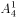种情况；分步用乘法，共有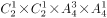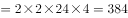种情况。

②两排均停2辆车。

首先，从两排中选一排停放甲乙，有种情况；然后，把甲乙停进这排的4个车位里，有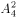种情况；最后，把剩余的两辆车停进另一排的4个车位里，有种情况；分步用乘法，共有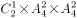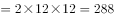种情况。

因此，电脑可生成的派位方式共有384+288=672种情况。

方法二：本题也可以考虑逆向思维求解。总情况为甲、乙在任意一排中的2个车位泊车，其余2辆车在剩余的6个车位中随机泊车，有种情况。反面情况为4辆车都在同一排泊车，有种情况。则题干所求=总情况数-反面情况数=720-48=672种，即电脑可生成672种派位方式。

故正确答案为A。

---

## 第 11 题　qid 5102135 · 数学运算

某城市规划馆有一个边长为40米的正三角形数字展厅，展厅中布置有5台投影设备，用于展示城市的过去、现在以及畅想城市的未来。每台投影设备的尺寸忽略不计，则任意两台设备之间的最小距离：

- **A**. 小于10米
- **B**. 不超过16米
- **C**. 不超过20米　✅
- **D**. 在23～28米之间

**答案**：C

**官方解析**

根据题意“在正三角形数字展厅内部布置5台投影设备”，假设其中3台投影设备放在正三角形数字展厅的三个顶点，即蓝色圆点处，如下图所示。此时若想使剩余2台设备的距离尽量大，连接正三角形各边上的中点，可得到小正三角形，从红色圆点处任选2个放置剩余2台投影设备即可得到最大间距，则任意两台设备之间的最小距离不超过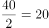米。

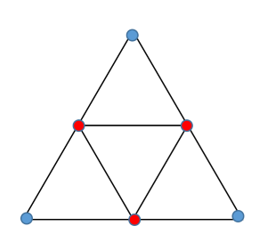

故正确答案为C。

---

## 第 12 题　qid 5102138 · 数学运算

用一个长为20厘米、宽为2厘米、高为1.5厘米的长方体木料，制作一串半径最大的木珠子，不考虑制作过程中的损耗，则这串珠子的数量最多为：

- **A**. 10个
- **B**. 13个
- **C**. 14个　✅
- **D**. 20个

**答案**：C

**官方解析**

木珠子是球形的，需要从长方体木料的内部进行切割，由于长方体的高为1.5厘米，则木珠子的最大直径为长方体的高1.5厘米，即半径最大。长方体的宽为2厘米，木珠子的直径为1.5厘米，制作过程中，要令数量最多，木珠子错落摆放即满足要求。摆放过程注意不要超出长方体木料的长度，用前两个珠子的摆放作为演示：

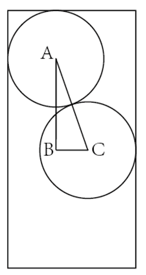

AC是两个木珠子球心的连线，长度即为木珠子的直径1.5厘米，AC为斜边做直角三角形ABC，AC即两个球心间的最短距离。BC的长度为长方体的宽-木珠子的半径-B点距长方体左边的边长，且AB垂直BC，可得出B点距长方体左边的边长即A点距长方体边长的距离0.75厘米，可求BC长=2-0.75-0.75=0.5厘米，在直角三角形ABC中，利用勾股定理可以求出AB长为厘米，即在AB所在直线上，相邻两个珠子间距（把珠子看成点）为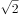厘米，且第一个和最后一个珠子的球心距长方体木料两端至少为0.75厘米。则制作的珠子数量=段数+1，段数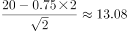，即分为13段，那么珠子数量最多=13+1=14个。

故正确答案为C。

---

## 第 13 题　qid 5102158 · 数学运算

商家门口摆放了一把正四棱锥形（底面为正方形，侧面为四个全等的等腰三角形）的遮阳伞，第一次伞撑开到图1所示的位置，伞柄与伞骨成角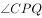为，继续撑开到如图2所示的位置，伞柄与伞骨成角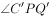变为，那么第二次伞撑开后形成的正方形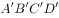是第一次撑开后正方形ABCD面积的：

- **A**. 
倍

- **B**. 
倍

- **C**. 
2倍

- **D**. 
3倍
　✅

**答案**：D

**官方解析**

连接CQ，如图1所示，因PQ与正四棱锥的底面垂直，故三角形CPQ为直角三角形，在直角三角形CPQ中，，故。同理，连接，如图2，在直角三角形中，，故，根据 ，，且，可得 ，故第二次伞撑开后形成的正方形是第一次撑开后正方形ABCD面积的3倍。

故正确答案为D。

---

## 第 14 题　qid 5102159 · 数学运算

三星堆一号祭祀坑出土一枚金杖（如下图所示），全长1.42米，直径2.3厘米，采用的是金皮包卷在圆柱形木头上，出土时，金皮重约500克，已知60克黄金的体积是3.1088立方厘米，则金皮的厚度大约是：（保留小数点后两位）

- **A**. 0.25mm　✅
- **B**. 0.51mm
- **C**. 0.87mm
- **D**. 1.02mm

**答案**：A

**官方解析**

根据题意，金皮展开后为长方体，展开图如下图所示。设金皮的厚度为x厘米，根据长方体体积公式：=长×宽×高，可得金皮的体积为：，根据体积与重量成正比，则可列式：，则，取3.14，解得厘米，即0.25mm。

故正确答案为A。

---

## 第 15 题　qid 5102160 · 数学运算

A、B两个乡镇分布于山谷两侧，山谷间有一条宽为2km的河道（如下图所示）。当地政府决定在两个乡镇间修建一条跨河公路促进旅游发展。由于架桥费用高昂，所以要求跨河公路中的桥梁路段长度最短。那么根据图中数据，从A镇前往B镇的最短距离为：

- **A**. 17km
- **B**. 15km　✅
- **C**. 19km
- **D**. 20km

**答案**：B

**官方解析**

根据题目要求桥长2km，最短距离=AB最短距离+桥长，如下图所示，将河流看成一条直线，两点之间线段最短，连接AB构成直角三角形ABC，km。

从A镇前往B镇的最短距离=13+2=15km。

故正确答案为B。

---
