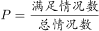
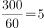
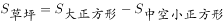
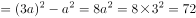
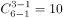
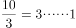
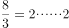
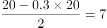
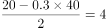
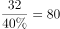

# 2022年广东省公务员录用考试《行测》题（乡镇卷）（网友回忆版）

> 数量关系 · 13 题 · 广东 2022

## 第 1 题　qid 4673215 · 数学运算

17，27，39，（    ）

- **A**. 51
- **B**. 53　✅
- **C**. 56
- **D**. 59

**答案**：B

**官方解析**

数列每项均在幂次数附近，优先考虑幂次数列。将原数列转化为：，，，（  ）。数列底数及修正项均为公差为1的等差数列，指数均为2，故所求项为。

故正确答案为B。

---

## 第 2 题　qid 2188879 · 数学运算

，，，，（    ）

- **A**. 

- **B**. 

- **C**. 

- **D**. 

　✅

**答案**：D

**官方解析**

数列均为分数，考虑分数数列。观察分子分母，增减规律不统一，考虑反约分。将原数列转化为：、、、。分子部分为1、2、3、4，则所求项的分子部分为5；分母部分为8、12、16、20，是公差为4的等差数列，则所求项分母部分为20+4=24，所求项为。

故正确答案为D。

---

## 第 3 题　qid 4673218 · 数学运算

123，465，987，（    ），456，897，231，645，789

- **A**. 312　✅
- **B**. 578
- **C**. 684
- **D**. 738

**答案**：A

**官方解析**

题干数列均为三位数，因此考虑机械划分。将每项的个位、十位和百位上的数字相加发现，和依次为：6，15，24，（    ），15，24，6，15，24。即新数列呈6，15，24的循环，考虑新数列括号内为6，观察选项，只有A项3+1+2=6符合规律。
故正确答案为A。

---

## 第 4 题　qid 4673231 · 数学运算

某单位计划从行政部的2名员工和人事部的3名员工中，随机选择2人去参加在职培训，则选出的2人都来自人事部的概率是（    ）。

- **A**. 10%
- **B**. 20%
- **C**. 30%　✅
- **D**. 40%

**答案**：C

**官方解析**

5名员工中随机选择2人去参加在职培训，所以总情况数为种。恰好选出的2人都来自人事部的情况数有种。故所求概率。

故正确答案为C。

---

## 第 5 题　qid 4673232 · 数学运算

老吴从家里出发乘车到银行办理业务，回城时步行，往返共用了45分钟。如果老吴往返都乘车，则只需花30分钟。那么，如果老吴往返时都选择步行，需要花（    ）分钟。

- **A**. 45
- **B**. 50
- **C**. 55
- **D**. 60　✅

**答案**：D

**官方解析**

根据题干“老吴往返都乘车，则只需花30分钟”，则老吴乘车从家到银行需要分钟。根据题干“老吴从家里出发乘车到银行办理业务，回城时步行，往返共用了45分钟”，则老吴步行单程需要45-15=30分钟。因此如果老吴往返时都选择步行则需要花30×2=60分钟

故正确答案为D。

---

## 第 6 题　qid 4673233 · 数学运算

小王将新买的时钟调准使用，60天后，时钟走慢了5分钟。那么，该时钟平均每天走慢（    ）秒。

- **A**. 5　✅
- **B**. 10
- **C**. 15
- **D**. 20

**答案**：A

**官方解析**

由题意可知，60天走慢了5分钟，即60天走慢了5×60＝300秒，故该时钟平均每天走慢秒。

故正确答案为A。

---

## 第 7 题　qid 4673228 · 数学运算

如图阴影部分是一块由8块相同的正方形草皮围成的草坪。已知草坪的外圈均铺有一圈小石子带，小石子带的总长度是48米，则该草坪的面积为（    ）平方米。

- **A**. 48
- **B**. 72　✅
- **C**. 81
- **D**. 96

**答案**：B

**官方解析**

设每块正方形草皮的边长为a米，则小石子带的总长度即为大正方形周长+内部中空的小正方形周长=3a×4+a×4=16a=48米，解得a=3米，则平方米。故正确答案为B。

---

## 第 8 题　qid 4673157 · 数学运算

小陈计划在一定时间内完成法律常识题库中的所有练习题。如果每天做50道题，那么最后2天每天要做85道题才能完成，如果每天做55道题，恰好可以提前1天完成，则该题库共有（    ）道题。

- **A**. 1215
- **B**. 1250
- **C**. 1320　✅
- **D**. 1375

**答案**：C

**官方解析**

设小陈计划x天完成题库中的所有练习题。根据题意可知：50×（x-2）+85×2=55×（x-1），解得：x=25天。则该题库共有55×（25-1）=1320道题。
故正确答案为C。

---

## 第 9 题　qid 4673165 · 数学运算

某单位计划从全部80名员工中挑选专项工作组成员，要求该组成员须同时有基层经历和计算机等级证书。已知，单位内有40人有基层经历，有46人有计算机等级证书，既没有基层经历又未获得计算机等级证书的有10人。那么能够进入工作组的员工有（    ）人。

- **A**. 16　✅
- **B**. 40
- **C**. 46
- **D**. 54

**答案**：A

**官方解析**

根据两集合容斥原理公式A+B-AB=总数-都不，可得：有基层经历+有计算机等级证书-两种都有=总人数-两种都没有，设同时有基层经历和计算机等级证书的有x人，则有40+46-x=80-10，解得x=16。

故正确答案为A。

---

## 第 10 题　qid 4673160 · 数学运算

甲、乙、丙3个单位订阅同一款报刊，已知3个单位共订了12份，其中，每个单位订阅数量不少于3份，但不超过5份，则这3个单位的报刊订阅数量可能有（    ）种组合。

- **A**. 2
- **B**. 6
- **C**. 7　✅
- **D**. 9

**答案**：C

**官方解析**

方法一：根据题意，3份每个单位订阅数量5份，共12份。这3个单位的报刊订阅数量可以为：（3，4，5），单位不同需考虑顺序，有种情况；或者（4，4，4），此时有1种情况。因此满足题意的情况数共6+1=7种。

方法二：根据题意，可利用插板法。“不少于3份”时，可先给每个单位分2份，还剩12-2×3=6份，每个单位至少再分1份，有种。但其中包含超出5份的情况（6，3，3），有种。因此满足题意的情况数共10-3=7种。

故正确答案为C。

---

## 第 11 题　qid 4673118 · 数学运算

有一个长方形花坛，长为10米，宽为8米。现要在花坛四周安装栅栏，要求4个顶点处各插一根木桩，除顶点处的木桩外，每边还要插若干木桩，且每两根木桩间的距离至少为3米，则最多可以插（    ）根木桩。

- **A**. 10　✅
- **B**. 12
- **C**. 14
- **D**. 16

**答案**：A

**官方解析**

环形植树，有多少间隔就能植多少棵树，要求插入木桩尽量多，则木桩间的距离尽量小，根据题意可确定两木桩之间的间隔为3米，用每条边的边长除以3看商，有余数的话，商是多少就可以分成多少个间隔，没有的话则需减1。长边米，则有3个间隔，宽边米，则有2个间隔，故该长方形花坛共有2×（3+2）=10个间隔，故可以插入10根木桩。

故正确答案为A。

---

## 第 12 题　qid 4673196 · 数学运算

某防疫工作机构有检验人员和其他工作人员共55人，将检验人员平均分成若干个小组开展工作。近期，该机构补充了20位工作人员，其中，检验人员增加了2组，每组人数不变，其他工作人员增加了30%，则该机构原有检验人员共（    ）组。

- **A**. 4
- **B**. 5　✅
- **C**. 6
- **D**. 7

**答案**：B

**官方解析**

假设原检验人员每组x人，其他工作人员共y人。根据“该机构补充了20位工作人员”则可列出：2x+0.3y=20。根据“其他工作人员增加了30%”，也就是，可推出原有的其他工作人员数量一定为10的整数倍，则其他工作人员可能有10人、20人、30人、40人或50人。由于2x和20均为偶数，故0.3y也必须为偶数，因此y只能取值20或40。若y=20，则检验人员原来有55-20=35人，每组有人，则该机构原有检验人员共35÷7=5组，符合题意。

故正确答案为B。

备注：若y=40，则检验人员原来有55-40=15人，每组有人，则该机构原有检验人员共15÷4=3.75组，不符合题意。在实际考试中，若已经验证出y=20符合题意，则不需验证y=40。

---

## 第 13 题　qid 4673197 · 数学运算

桶中装有一定量的液体，液体体积为桶容量的40%，现向桶中继续加入16升同一液体后，液体体积为原来的1.5倍，则该桶的容量为（    ）升。

- **A**. 20
- **B**. 40
- **C**. 60
- **D**. 80　✅

**答案**：D

**官方解析**

设桶中最初装有的液体量为x升，根据题意列等式：x+16=1.5x，解得：x=32升。由于液体体积为桶容量的40%，则该桶的容量为升。

故正确答案为D。

---
