# 2022年广东省公务员录用考试《行测》题（县级卷）（网友回忆版）

> 数量关系 · 11 题 · 广东 2022

## 第 1 题　qid 4673194 · 数学运算

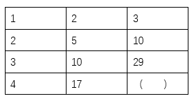

- **A**. 62
- **B**. 64
- **C**. 66　✅
- **D**. 68

**答案**：C

**官方解析**

题干为表格形式，判定为图形数阵。优先寻找每行相同的规律，可发现：1×2+1=3；2×5+0=10；3×10+（-1）=29，其中修正项1、0、-1是公差为-1的等差数列，故所求项应为4×17+（-2）=66。
故正确答案为C。

---

## 第 2 题　qid 4673156 · 数学运算

小李开车从甲市到乙市，需要走一段高速公路和一段国道。已知在高速公路上汽车油耗为0.05升/公里，在国道上油耗比在高速公路上多0.03升/公里。小李在高速公路上行驶了200公里，是在国道上行驶路程的4倍，则从甲市到乙市，小李汽车的油耗为（    ）升。

- **A**. 15
- **B**. 14　✅
- **C**. 12
- **D**. 10

**答案**：B

**官方解析**

根据题意，在国道上行驶的路程为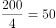公里，在国道上油耗为0.05+0.03=0.08升/公里。则从甲市到乙市，小李汽车的油耗为200×0.05+50×0.08=14升。

故正确答案为B。

---

## 第 3 题　qid 4673157 · 数学运算

小陈计划在一定时间内完成法律常识题库中的所有练习题。如果每天做50道题，那么最后2天每天要做85道题才能完成，如果每天做55道题，恰好可以提前1天完成，则该题库共有（    ）道题。

- **A**. 1215
- **B**. 1250
- **C**. 1320　✅
- **D**. 1375

**答案**：C

**官方解析**

设小陈计划x天完成题库中的所有练习题。根据题意可知：50×（x-2）+85×2=55×（x-1），解得：x=25天。则该题库共有55×（25-1）=1320道题。
故正确答案为C。

---

## 第 4 题　qid 4673165 · 数学运算

某单位计划从全部80名员工中挑选专项工作组成员，要求该组成员须同时有基层经历和计算机等级证书。已知，单位内有40人有基层经历，有46人有计算机等级证书，既没有基层经历又未获得计算机等级证书的有10人。那么能够进入工作组的员工有（    ）人。

- **A**. 16　✅
- **B**. 40
- **C**. 46
- **D**. 54

**答案**：A

**官方解析**

根据两集合容斥原理公式A+B-AB=总数-都不，可得：有基层经历+有计算机等级证书-两种都有=总人数-两种都没有，设同时有基层经历和计算机等级证书的有x人，则有40+46-x=80-10，解得x=16。

故正确答案为A。

---

## 第 5 题　qid 4673160 · 数学运算

甲、乙、丙3个单位订阅同一款报刊，已知3个单位共订了12份，其中，每个单位订阅数量不少于3份，但不超过5份，则这3个单位的报刊订阅数量可能有（    ）种组合。

- **A**. 2
- **B**. 6
- **C**. 7　✅
- **D**. 9

**答案**：C

**官方解析**

方法一：根据题意，3份每个单位订阅数量5份，共12份。这3个单位的报刊订阅数量可以为：（3，4，5），单位不同需考虑顺序，有种情况；或者（4，4，4），此时有1种情况。因此满足题意的情况数共6+1=7种。

方法二：根据题意，可利用插板法。“不少于3份”时，可先给每个单位分2份，还剩12-2×3=6份，每个单位至少再分1份，有种。但其中包含超出5份的情况（6，3，3），有种。因此满足题意的情况数共10-3=7种。

故正确答案为C。

---

## 第 6 题　qid 4673151 · 数学运算

某街道对辖内6个社区的垃圾分类情况进行考核评估，结果显示，有2个社区的垃圾分类考核不通过。如果从6个社区中随机抽取3个进行现场检查，则抽取的社区中，既有考核通过的又有考核不通过的社区的概率为（    ）。

- **A**. 

- **B**. 

- **C**. 

- **D**. 

　✅

**答案**：D

**官方解析**

根据题意，从6个社区中随机抽取3个社区的总情况数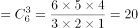种。

方法一：满足抽取的社区中既有考核通过的又有考核不通过的情况分类讨论如下：

①2个考核通过的、1个考核不通过的，情况数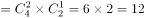种；

②1个考核通过的、2个考核不通过的，情况数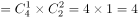种。

则所求概率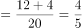。

方法二：考虑反面求解，因考核不通过的社区只有2个，则反面情况仅有1种情况，即抽取社区中只有考核通过的，情况数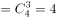种。则所求概率=1-反面情况概率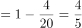。

故正确答案为D。

---

## 第 7 题　qid 4673118 · 数学运算

有一个长方形花坛，长为10米，宽为8米。现要在花坛四周安装栅栏，要求4个顶点处各插一根木桩，除顶点处的木桩外，每边还要插若干木桩，且每两根木桩间的距离至少为3米，则最多可以插（    ）根木桩。

- **A**. 10　✅
- **B**. 12
- **C**. 14
- **D**. 16

**答案**：A

**官方解析**

环形植树，有多少间隔就能植多少棵树，要求插入木桩尽量多，则木桩间的距离尽量小，根据题意可确定两木桩之间的间隔为3米，用每条边的边长除以3看商，有余数的话，商是多少就可以分成多少个间隔，没有的话则需减1。长边米，则有3个间隔，宽边米，则有2个间隔，故该长方形花坛共有2×（3+2）=10个间隔，故可以插入10根木桩。

故正确答案为A。

---

## 第 8 题　qid 4673120 · 数学运算

甲、乙两人计划分装会议材料，9点多先后开始工作，且两人每分钟完成分装的份数相同。9点38分时，甲完成的份数是乙的4倍，9点53分时，甲完成的份数是乙的1.5倍。那么，甲比乙早（    ）分钟开始工作。

- **A**. 4
- **B**. 6
- **C**. 8
- **D**. 9　✅

**答案**：D

**官方解析**

方法一：赋值甲、乙两人每分钟分装材料份数为1。设甲开始工作的时间为9点x分，乙开始工作的时间为9点y分。根据题意，可列方程组：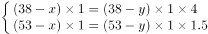，解得：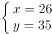，即甲开始工作的时间是9点26分，乙开始工作的时间是9点35分，甲比乙早9分钟开始工作。

方法二：赋值甲、乙两人每分钟分装材料份数为1。设甲开始工作的时间为9点x分，乙开始工作的时间为9点y分。根据题意，可列方程组：，化简为：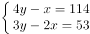，利用奇偶性可判断出x为偶数，y为奇数，则y-x应为奇数，仅有D项满足。

故正确答案为D。

---

## 第 9 题　qid 4673122 · 数学运算

为鼓励员工阅读，某单位与购书中心合作，员工购书时，享受原价的7折优惠，且打折后每本书还可叠加使用单位提供的5元补贴券。员工小陈买了5本书，且每本书折后价均超过5元，扣除补贴后自己只花了48.5元，则这些书的原价一共为（    ）元。

- **A**. 75
- **B**. 85
- **C**. 95
- **D**. 105　✅

**答案**：D

**官方解析**

设这些书的原价为x元，购书时可享受原价的7折优惠，折后价为70%x元。因每本书的折后价均超过5元，在折后价的基础上还可以叠加使用5元补贴券，则小陈实际花费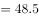，解得x=105。

故正确答案为D。

---

## 第 10 题　qid 4673125 · 数学运算

楼道上方有一盏灯，小刘径直走向这盏灯。一开始, 他发现自己影子的长度为3.2米，前进1米后，发现影子缩短为1.6米。已知小刘身高为1.6米，则这盏灯的高度约为（    ）米。

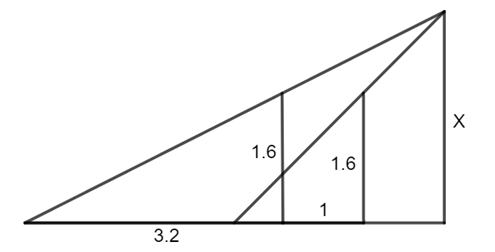

- **A**. 2.6　✅
- **B**. 2.8
- **C**. 3.2
- **D**. 3.4

**答案**：A

**官方解析**

根据题意，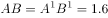米，DB=3.2米，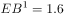米，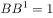米，如图所示：

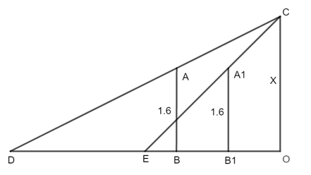

根据，即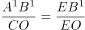，代入数据可得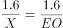，解得EO=X米。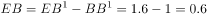米，DE=DB-EB=3.2-0.6=2.6米，DO=DE+EO=2.6+X米。根据，即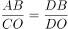，代入数据可得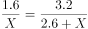，解得X=2.6米。

故正确答案为A。

---

## 第 11 题　qid 4673136 · 数学运算

如图，仓库有一堆管材，每一层的数量都比上一层多1根。搬运工人将管材逐根搬离，搬了99根后发现，管材堆少了3层，且剩余每层的管材数量都减少了3根。如果这堆管材刚好还剩10层，则剩下的管材共有（    ）根。

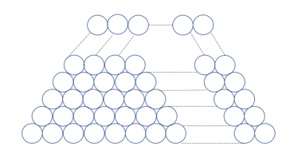

- **A**. 245
- **B**. 265　✅
- **C**. 305
- **D**. 325

**答案**：B

**官方解析**

方法一：根据题意：剩余每层钢管数量都减少3根，则剩余10层共减少30根。因为共搬运99根，所以少了的3层原有钢管数量为99-30=69根。由于每一层的数量都比上一层多1根，可知每层管材数量为等差数列，根据等差数列求和公式中项×项数，计算可得中项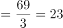根，可知最上面3层数量分别为22，23，24根，则剩余10层最上层原为25根。由于剩余每层的管材数量都减少了3根，可知剩余10层最上层为25-3=22根。根据求和公式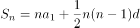，则剩下的管材共有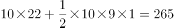根。

方法二：根据题意，搬了99根后管材堆少了3层，可知原有层数为10+3=13层，根据等差数列求和公式中项×项数，可知原有钢材总数为13的倍数。代入A项：245+99=344根，非13倍数，排除。代入B项：265+99=364根，为13倍数，满足题意，当选。同理代入C、D两项均不符合要求，排除。

故正确答案为B。

---
