# 2022年江苏省公务员录用考试《行测》题（A类）（网友回忆版）

> 数量关系 · 20 题 · 江苏 2022

## 第 1 题　qid 4651476 · 数学运算

7，23，-1，35，-19，（    ）

- **A**. 62　✅
- **B**. 67
- **C**. 72
- **D**. 77

**答案**：A

**官方解析**

数列无明显特征，优先考虑多级数列。后一项-前一项得到新数列：16，-24，36，-54，（    ），观察发现新数列正、负交替，且相邻两项存在明显的倍数关系，新数列后一项前一项均为-1.5，则新数列下一项为（-54）×（-1.5）=81。故所求项=（-19）+81=62。

故正确答案为A。

---

## 第 2 题　qid 4651478 · 数学运算

2.5，2.4，8.9，56.13，560.22，（    ）

- **A**. 5600.36
- **B**. 6140.35
- **C**. 6720.36
- **D**. 7280.35　✅

**答案**：D

**官方解析**

数列各项均为小数，优先考虑机械划分。将原数列整数部分与小数部分分别找规律。整数部分组成的新数列为：2，2，8，56，560，（    ），观察该数列存在明显倍数关系，后一项前一项后得到：1，4，7，10，（    ），是公差为3的等差数列，则等差数列的下一项为10+3=13，故所求项的整数部分为560×13=7280；小数部分组成的新数列为：5，4，9，13，22，（    ），观察可知：5+4=9，4+9=13，9+13=22，即第一项+第二项=第三项，故所求项的小数部分为13+22=35。综上，原数列所求项为7280.35。

故正确答案为D。

---

## 第 3 题　qid 4651481 · 数学运算

-1，2，6，21，43，（    ）

- **A**. 61
- **B**. 75
- **C**. 82　✅
- **D**. 98

**答案**：C

**官方解析**

数列无明显特征，考虑多级数列。作差无规律，考虑作和。数列相邻两项相加得到新数列：1，8，27，64，依次可整理为：，，，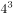，新数列各项均为立方数，且底数为公差为1的等差数列，则下一项为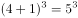，故所求项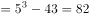。

故正确答案为C。

---

## 第 4 题　qid 4651490 · 数学运算

，，10，，，（    ）

- **A**. 

- **B**. 

- **C**. 

　✅
- **D**. 

**答案**：C

**官方解析**

观察数列，有整数和根号，优先考虑机械划分。原数列可转化为：，，，，，（    ）。整数部分为：1，3，5，7，9，是公差为2的等差数列，故所求项的整数部分为9+2=11；根号部分为：2，3，4，5，6，是公差为1的等差数列，故所求项的根号部分为6+1=7，则所求项为。

故正确答案为C。

---

## 第 5 题　qid 4651501 · 数学运算

1，3，，，，（    ）

- **A**. 

- **B**. 

　✅
- **C**. 

- **D**. 
5

**答案**：B

**官方解析**

数列大部分为分数，考虑分数数列。对数列进行反约分可得：、、、、。分子部分为：1、3、7、15、31，后一项-前一项可得：2、4、8、16，是公比为2的等比数列，则所求项的分子部分为16×2+31=63。分母部分为：1、1、2、6、24，观察发现存在明显倍数关系，后一项前一项可得：1、2、3、4，是公差为1的等差数列，则所求项的分母部分为（4+1）×24=120。故所求项。

故正确答案为B。

---

## 第 6 题　qid 4651449 · 数学运算

日常生活中，每家每户都会排放“碳”。家用水、电、气的碳排放量（单位：千克）分别等于用水吨数乘以0.9、用电度数乘以0.8、用气立方米数乘以0.2。若某户平均每月用水10吨，用电380度，用气35立方米，则该户一年所用水、电、气产生的碳排放量是：

- **A**. 320千克
- **B**. 640千克
- **C**. 1920千克
- **D**. 3840千克　✅

**答案**：D

**官方解析**

根据题意可知，该户平均每月所用水、电、气产生的碳排放量为：10×0.9+380×0.8+35×0.2=320千克，一年有12个月，则一年所用水、电、气产生的碳排放量为：320×12=3840千克。
故正确答案为D。

---

## 第 7 题　qid 4651453 · 数学运算

某公益组织登记在册的男、女志愿者人数之比为2：3，男性志愿者中20%为教师，女性志愿者中25%为教师。现从该公益组织登记在册的志愿者中随机选出1人，恰好为教师，则该志愿者为男性的概率是：

- **A**. 

- **B**. 

- **C**. 

- **D**. 

　✅

**答案**：D

**官方解析**

题目给比例求比例，考虑赋值法。根据男、女志愿者人数之比为2：3，为方便计算，赋值男性志愿者40人，女性志愿者60人；则男性志愿者中教师有40×20%=8人，女性志愿者中教师有60×25%=15人，共有教师8+15=23人。因此从志愿者中随机选出1名教师恰好为男性的概率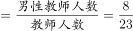。

故正确答案为D。

---

## 第 8 题　qid 4651510 · 数学运算

下列图形中，阴影部分面积为2的是：

- **A**. 

- **B**. 

　✅
- **C**. 

- **D**. 

**答案**：B

**官方解析**

方法一：根据微积分原理，如果f(x)是区间[a，b]上的连续函数，并且，则。

A项：直线x=-1，x=1，以及曲线和x轴围成的图形的面积可表示，x在[-1，1]上的积分，被积函数为，所以所求面积，不符合题意；

B项：直线，，以及曲线和x轴围成的图形的面积可表示，x在[，]上的积分，被积函数为，所以所求面积，符合题意；

C项：直线x=0，x=4，以及曲线和x轴围成的图形的面积可表示，x在[0，4]上的积分，被积函数为，所以所求面积，不符合题意；

D项：直线x=0，x=2，以及曲线和x轴围成的图形的面积可表示，x在[0，2]上的积分，被积函数为，所以所求面积，不符合题意。

方法二：A项：

如图长方形的面积为2，多余的阴影部分面积明显超过长方形中多算的空白面积，即所求函数阴影面积不为2，不符合题意；

C项：

如图长方形的面积为4×2=8，所求函数阴影面积明显超过长方形面积的一半，即超过2，不符合题意；

D项：

如图长方形的面积为4×2=8，所求函数阴影面积明显超过长方形面积的，即超过2，不符合题意。

故正确答案为B。

---

## 第 9 题　qid 4651514 · 数学运算

某机构对全运会收视情况进行调查，在1000名受访者中，观看过乒乓球比赛的占87%，观看过跳水比赛的占75%，观看过田径比赛的占69%。这1000名受访者中，乒乓球、跳水和田径比赛都观看过的至少有：

- **A**. 310人　✅
- **B**. 440人
- **C**. 620人
- **D**. 690人

**答案**：A

**官方解析**

根据“都······至少”判定本题为多集合反向构造问题。
第一步反向：乒乓球比赛、跳水比赛、田径比赛没有看过的分别为：1000-1000×87%=130人、1000-1000×75%=250人、1000-1000×69%=310人。
第二步作和：乒乓球比赛、跳水比赛、田径比赛没有看过的最多为130+250+310=690人。
第三步作差：乒乓球、跳水和田径比赛都观看过的至少有1000-690=310人。
故正确答案为A。

---

## 第 10 题　qid 4651469 · 数学运算

某政府机关将甲、乙两个部门合并。合并前，甲、乙两部门的男女人数之比分别为4：1和3：2，男女党员人数之比分别为9：2和9：4，乙部门女党员人数占本部门人数的比重是甲部门的两倍。合并后，若男女人数之比为7：3，则男女党员人数之比为：

- **A**. 18：5
- **B**. 27：8
- **C**. 3：1　✅
- **D**. 27：10

**答案**：C

**官方解析**

根据题意，设甲部门的男女人数分别为4x、x，乙部门的男女人数分别为3y、2y。因合并后，男女人数之比为7：3，可列等式：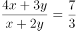，解得：x=y，说明合并前，甲部门总人数为4x+x=5x，乙部门总人数为3y+2y=5y，即甲、乙两部门总人数相等。

因“乙部门女党员人数占本部门人数的比重是甲部门的两倍”，且甲、乙两部门总人数又相等，可知乙部门女党员人数是甲部门女党员人数的两倍。根据“甲、乙两部门的男女党员人数之比分别为9：2和9：4”，设甲部门女党员人数为2a，则乙部门女党员人数为4a，甲部门男党员人数为9a，乙部门男党员人数为9a，故所求男女党员人数之比为（9a+9a）：（2a+4a）=18a：6a=3：1。

故正确答案为C。

---

## 第 11 题　qid 4651473 · 数学运算

已知A、B两地相距9公里，甲、乙两人匀速从A地前往B地。甲每小时走6公里，每走半小时休息15分钟；乙比甲早15分钟出发，中间不休息。若他们在途中（不含起点和终点）相遇了2次，则乙从A地到B地所用的时间至少为：

- **A**. 75分钟
- **B**. 120分钟
- **C**. 135分钟　✅
- **D**. 150分钟

**答案**：C

**官方解析**

根据题意，因为乙比甲先出发15分钟，所以第一次相遇是甲追上乙。要使得乙从A地到B地所用的时间尽可能少，则乙的速度应尽可能大，即甲第一次追上乙花费的时间应尽可能多。因此当甲行驶30分钟后才追上乙时，乙的速度最大，此时甲、乙路程相等。可得方程：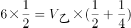，解得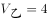公里/小时，则乙从A地到B地所用的时间至少为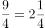小时=135分钟。

备注：下图为甲、乙两人全程的路程与时间的函数图像，第一次相遇在45分钟，此时甲追上乙，然后甲休息，乙继续走。第二次相遇在90分钟，此时甲第二次追上乙，然后甲休息，乙继续走。第三次相遇在135分钟，此时两人同时到达B点，满足题干所说途中（不含起点和终点）相遇了2次。

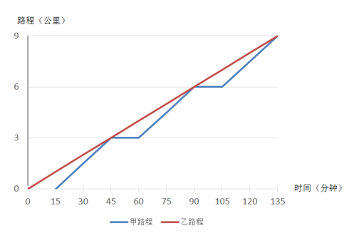

故正确答案为C。

---

## 第 12 题　qid 4651459 · 数学运算

如图所示，小王买了一块直三棱柱形状的蛋糕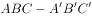，其中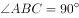，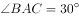。为与两位室友分享，他切出一小块和原蛋糕形状相同的蛋糕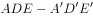，其体积与原蛋糕的体积之比为1：3。若，则线段AE与EB的长度之比为：

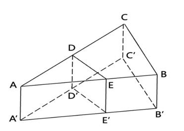

- **A**. 
2：1
　✅
- **B**. 
3：2

- **C**. 
：1

- **D**. 
2：

**答案**：A

**官方解析**

根据题意，直三棱柱与直三棱柱的体积之比为1：3，根据三棱柱体积=底面积×高，高度相同（以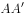为高），故底面积之比为1：3，即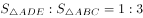。该立体图形的俯视图如下图所示：

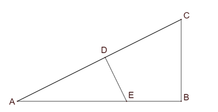

在直角中，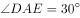，即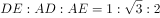，同理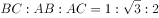，设DE为x，则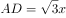，AE=2x。由于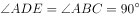且有公共角，故，因面积之比为相似比的平方，故相似比为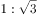，即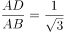，则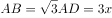，EB=3x-2x=x，所求长度之比为：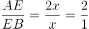。

故正确答案为A。

---

## 第 13 题　qid 4651461 · 数学运算

某学者认为，人类的体力、情绪、智力自出生日起分别以22天、28天、33天为周期开始往复循环变化，前半个周期是“高潮期”，后半个周期是“低潮期”。根据该学者的观点，我们过公历生日时，体力、情绪和智力同时处于“高潮期”的最小年龄是：

- **A**. 4周岁
- **B**. 3周岁
- **C**. 2周岁　✅
- **D**. 1周岁

**答案**：C

**官方解析**

根据题意利用代入排除法，问最小年龄，从小到大进行代入。代入D项若最小年龄为1周岁，即365天，体力处于个周期⋯⋯13天，22天前半个周期11天是“高潮期”，13天不满足题意，排除D项；代入C项若最小年龄为2周岁，即365×2=730天，体力处于个周期⋯⋯4天，情绪处于个周期······2天，智力处于个周期······4天，均处于以22天、28天、33天为周期的前半个周期“高潮期”，满足题意。

备注：即使在2周岁时经历了闰年366天，所有余数均加一，仍然均处于前半个周期“高潮期”。

故正确答案为C。

---

## 第 14 题　qid 4651451 · 数学运算

某企业年终评选了30名优秀员工，分三个等级，分别按每人10万元、5万元、1万元给与奖励。若共发放奖金89万元，则获得1万元奖金的员工有：

- **A**. 14人
- **B**. 19人　✅
- **C**. 20人
- **D**. 21人

**答案**：B

**官方解析**

设三个等级奖励的人数分别为：10万元x人，5万元y人，1万元z人。根据“评选了30名优秀员工”可得，x+y+z=30······①；根据“共发放奖金89万元”可得，10x+5y+z=89······②。令①×5-②可消去y，得4z-5x=61。由于x，z0，且x，z均为整数。根据奇偶特性判定4z为偶数，则5x必为奇数，故5x尾数为5，由此推出4z尾数必须为6，排除C、D两项。代入A项，若z=14，解得x=-1，不符合题意，排除。

故正确答案为B。

---

## 第 15 题　qid 4651454 · 数学运算

某市民中心广场钟楼上东、西、南、北四面各有一个挂钟，则每日早8点至晚8点，任意相邻两个钟的时针互相垂直的次数是：

- **A**. 2　✅
- **B**. 3
- **C**. 4
- **D**. 5

**答案**：A

**官方解析**

如下图，设相邻两个挂钟所在平面为A、B，则A、B两个平面相互垂直。根据几何结论：若一条线段与一个平面垂直，则该线段垂直于平面上所有线段。因此需要平面B内挂钟的时针在水平方向，此时与相邻的平面A垂直即与平面A内挂钟的时针垂直。如下图所示：只有在早上9点（实线所示）、下午3点（虚线所示）这两次，平面B内挂钟的时针与平面A垂直，即A、B两个面上挂钟时针相互垂直。

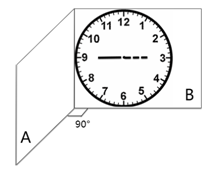

故正确答案为A。

---

## 第 16 题　qid 4651456 · 数学运算

师徒二人用15天合作生产1000个零件，前5天师傅的效率是徒弟的2倍，中间5天师傅休息，徒弟每天比原来多生产5个零件，最后5天两人又一起工作，师傅的效率不变，徒弟的效率比中间5天提高了50%，徒弟这15天生产的零件个数是：

- **A**. 450
- **B**. 500　✅
- **C**. 550
- **D**. 600

**答案**：B

**官方解析**

设徒弟前5天每天的效率为x个，则师傅前5天每天的效率为2x个，中间5天徒弟每天的效率为（x+5）个，最后5天徒弟每天的效率为1.5×（5+x）个，根据师徒二人用15天合作生产1000个零件，可列式为（2x+x）×5+（x+5）×5+[1.5×（5+x）+2x]×5=1000，解得x=25，则徒弟15天生产的零件个数为5×25+5×（5+25）+5×1.5×（5+25）=500个。
故正确答案为B。

---

## 第 17 题　qid 4651458 · 数学运算

某餐饮公司甲、乙两种外卖每份的售价分别为30元和50元，若该公司某天售出这两种外卖共500份，销售收入为21400元，则售出的两种外卖数量相差：

- **A**. 140份　✅
- **B**. 160份
- **C**. 180份
- **D**. 200份

**答案**：A

**官方解析**

假设甲外卖和乙外卖当天分别卖出x份和y份。根据题干条件可知，这两种外卖共售出500份，可列式为x+y=500······①；这两种外卖的销售收入为21400元，可列式为30x+50y=21400······②。联立方程组，解得x=180，y=320，故售出的两种外卖数量相差320-180=140份。
故正确答案为A。

---

## 第 18 题　qid 4651460 · 数学运算

某企业举行职业技能大赛，3个下属分公司均选2名员工参赛。若同一分公司的员工比赛时出场顺序不能相邻，则参赛的6名员工不同的出场顺序共有：

- **A**. 80种
- **B**. 120种
- **C**. 160种
- **D**. 240种　✅

**答案**：D

**官方解析**

位置1，从6名员工中选1名员工，有种排法； 

位置2，从另外两个公司的4名员工中选1名员工，有种排法；

后续情况较复杂，考虑枚举法，设三个公司分别为A、B、C，6名员工分别为，，，，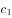，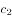，假设位置1安排出场，位置2安排出场，将出场顺序情况梳理如下：

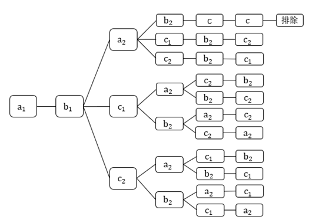

此时后续符合条件的情况有10种，因此总情况为6×4×10=240种不同的出场顺序。

故正确答案为D。

---

## 第 19 题　qid 4651463 · 数学运算

有5支足球队进行单循环比赛，每场比赛胜者得3分，负者不得分，平局双方各得1分。比赛结束后，若5支球队的总得分为25分，冠军得12分，则亚军得：

- **A**. 5分　✅
- **B**. 6分
- **C**. 7分
- **D**. 8分

**答案**：A

**官方解析**

根据题意可得，5支足球队进行单循环比赛，总场次有场。设10场比赛中分出胜负的有x场，平局有y场。根据每场胜负共得3+0=3分，每场平局共得1+1=2分，总得分为25分，可列方程组：x+y=10……①；3x+2y=25……②。联立①②，解得x=5，y=5。由于每支球队均要进行4场比赛，冠军总得分为12分，可知冠军4场全胜，则亚军必有1胜（5-4=1）、1负(输于冠军)，剩余2场为平局，故总得分为3+0+1+1=5分。

故正确答案为A。

---

## 第 20 题　qid 4651482 · 数学运算

如图所示，为测量珠穆朗玛峰上某点C的海拔高度，测量队选择了两个海拔高度相差100米的珠峰测量点A和B，测得为，从A观测B、C的仰角分别为和，从B观测C的仰角也为30°，则C点的海拔高度比A点高：

- **A**. 
米

- **B**. 
150米

- **C**. 
米

- **D**. 
200米
　✅

**答案**：D

**官方解析**

如图所示，A和B两个海拔高度相差100米（即BE=100米），从A观测B的仰角为，因是的直角三角形，则三边关系为，所以AB=100×2=200米。从B观测C的仰角也为，根据题意，设CO=X米，则CD=（X-100）米，因是的直角三角形，则三边关系为，所以BC=2（X-100）=（2X-200）米。又因为从A观测C的仰角为，是的直角三角形，则三边关系为，所以米。在中，为，根据勾股定理可知，，即，解得X=200，则C点的海拔高度比A点高200米。

故正确答案为D。

---
