# 2022年江苏省公务员录用考试《行测》题（B类）（网友回忆版）

> 数量关系 · 20 题 · 江苏 2022

## 第 1 题　qid 4651476 · 数学运算

7，23，-1，35，-19，（    ）

- **A**. 62　✅
- **B**. 67
- **C**. 72
- **D**. 77

**答案**：A

**官方解析**

数列无明显特征，优先考虑多级数列。后一项-前一项得到新数列：16，-24，36，-54，（    ），观察发现新数列正、负交替，且相邻两项存在明显的倍数关系，新数列后一项前一项均为-1.5，则新数列下一项为（-54）×（-1.5）=81。故所求项=（-19）+81=62。

故正确答案为A。

---

## 第 2 题　qid 4651663 · 数学运算

，，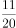，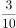，，（    ）

- **A**. 
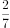

- **B**. 

　✅
- **C**. 
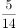

- **D**. 

**答案**：B

**官方解析**

观察数列特征，均为分数，考虑分数数列。观察分子、分母无明显规律，考虑反约分，原数列可转化为：，，，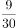，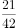。观察发现，分母：6，12，20，30，42，作差后得：6，8，10，12，是公差为2的等差数列，则下一项是14，即所求项的分母为：42+14=56；分子：5，1，11，9，21，无明显规律，考虑分子分母结合看，观察发现，6-5=1，12-1=11，20-11=9，30-9=21，即后一项分子=前一项分母-前一项分子，则所求项的分子为：42-21=21，则所求项应为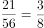，对应B项。

故正确答案为B。

---

## 第 3 题　qid 4651478 · 数学运算

2.5，2.4，8.9，56.13，560.22，（    ）

- **A**. 5600.36
- **B**. 6140.35
- **C**. 6720.36
- **D**. 7280.35　✅

**答案**：D

**官方解析**

数列各项均为小数，优先考虑机械划分。将原数列整数部分与小数部分分别找规律。整数部分组成的新数列为：2，2，8，56，560，（    ），观察该数列存在明显倍数关系，后一项前一项后得到：1，4，7，10，（    ），是公差为3的等差数列，则等差数列的下一项为10+3=13，故所求项的整数部分为560×13=7280；小数部分组成的新数列为：5，4，9，13，22，（    ），观察可知：5+4=9，4+9=13，9+13=22，即第一项+第二项=第三项，故所求项的小数部分为13+22=35。综上，原数列所求项为7280.35。

故正确答案为D。

---

## 第 4 题　qid 4651490 · 数学运算

，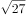，10，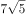，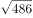，（    ）

- **A**. 
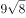

- **B**. 
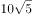

- **C**. 
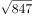
　✅
- **D**. 
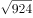

**答案**：C

**官方解析**

观察数列，有整数和根号，优先考虑机械划分。原数列可转化为：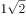，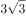，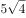，，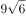，（    ）。整数部分为：1，3，5，7，9，是公差为2的等差数列，故所求项的整数部分为9+2=11；根号部分为：2，3，4，5，6，是公差为1的等差数列，故所求项的根号部分为6+1=7，则所求项为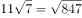。

故正确答案为C。

---

## 第 5 题　qid 4651501 · 数学运算

1，3，，，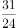，（    ）

- **A**. 

- **B**. 
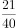
　✅
- **C**. 
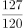

- **D**. 
5

**答案**：B

**官方解析**

数列大部分为分数，考虑分数数列。对数列进行反约分可得：、、、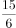、。分子部分为：1、3、7、15、31，后一项-前一项可得：2、4、8、16，是公比为2的等比数列，则所求项的分子部分为16×2+31=63。分母部分为：1、1、2、6、24，观察发现存在明显倍数关系，后一项前一项可得：1、2、3、4，是公差为1的等差数列，则所求项的分母部分为（4+1）×24=120。故所求项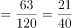。

故正确答案为B。

---

## 第 6 题　qid 4651665 · 数学运算

小王和小李进行七局四胜的乒乓球比赛，两人水平相当，每局胜对方的概率都是。若前三局过后小王获胜的概率是，则她前三局的胜负情况是：

- **A**. 胜3局
- **B**. 胜2局、负1局　✅
- **C**. 负3局
- **D**. 胜1局、负2局

**答案**：B

**官方解析**

由题意可知，三局之后小王获胜的概率大于，可知她前三局胜多负少，排除C、D两项。剩余两项，剩二代一：

A项：小王前三局胜三局，之后只需要再胜一局即可获胜，分类情况如下：①第四局获胜，概率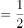；②第四局败，第五局胜，概率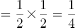；③第四、五局都败、第六局胜，概率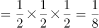；④第四、五、六局都败，第七局胜，概率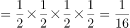。故小王获胜概率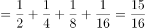，错误，排除；

B项：小王前三局，胜两局，之后还需胜两局即可获胜，分类情况如下：①第四、五局连胜两局，概率；②第四、五局中胜一局败一局，第六局胜，概率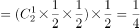；③第四、五、六局中胜一局败两局，第七局胜，概率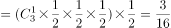。故小王获胜概率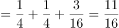，正确。

故正确答案为B。

备注：①考场上排除C、D、A三项后，无需验证B项，直接选即可。

②A项概率也可反面求解：获胜概率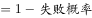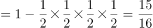。

---

## 第 7 题　qid 4651667 · 数学运算

甲、乙两人对100个家庭进行电话调查。若甲、乙完成对1个家庭的调查需要的时间分别是12分钟和20分钟，则他们完成这次电话调查需要的时间至少是：

- **A**. 12小时28分钟
- **B**. 12小时32分钟
- **C**. 12小时36分钟　✅
- **D**. 12小时40分钟

**答案**：C

**官方解析**

方法一：甲、乙完成对1个家庭的调查需要的时间分别是12分钟和20分钟，因此每小时（60分钟）甲调查5个家庭，乙调查3个家庭，合计调查5+3=8个家庭。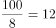小时······4个家庭，剩余4个家庭由甲调查3个，乙调查1个，用时是最少的，需要36分钟。因此两人合计用时最少为12小时36分钟，对应C项。

方法二：由于选项都是12小时多，且问“至少”，故可利用代入排除法。12小时调查数量为：甲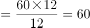个家庭，乙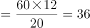个家庭，合计60+36=96个家庭，还剩4个家庭未调查。问题问“至少”，从最小的开始代入。

A项：28分钟，甲可调查2个家庭，乙可调查1个家庭，合计2+1=3个，不足4个，排除；

B项：32分钟，甲可调查2个家庭，乙可调查1个家庭，合计2+1=3个，不足4个，排除；

C项：36分钟，甲可调查3个家庭，乙可调查1个家庭，合计3+1=4个，当选。

故正确答案为C。

---

## 第 8 题　qid 4651510 · 数学运算

下列图形中，阴影部分面积为2的是：

- **A**. 
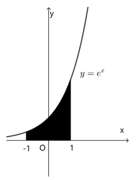

- **B**. 
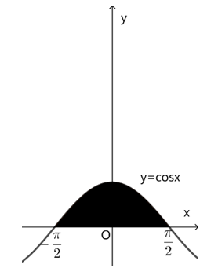
　✅
- **C**. 
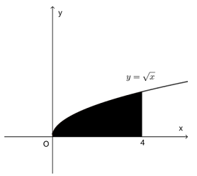

- **D**. 
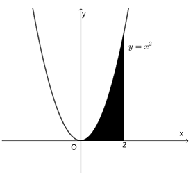

**答案**：B

**官方解析**

方法一：根据微积分原理，如果f(x)是区间[a，b]上的连续函数，并且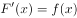，则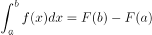。

A项：直线x=-1，x=1，以及曲线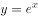和x轴围成的图形的面积可表示，x在[-1，1]上的积分，被积函数为，所以所求面积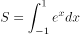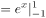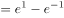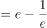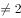，不符合题意；

B项：直线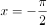，，以及曲线和x轴围成的图形的面积可表示，x在[，]上的积分，被积函数为，所以所求面积，符合题意；

C项：直线x=0，x=4，以及曲线和x轴围成的图形的面积可表示，x在[0，4]上的积分，被积函数为，所以所求面积，不符合题意；

D项：直线x=0，x=2，以及曲线和x轴围成的图形的面积可表示，x在[0，2]上的积分，被积函数为，所以所求面积，不符合题意。

方法二：A项：

如图长方形的面积为2，多余的阴影部分面积明显超过长方形中多算的空白面积，即所求函数阴影面积不为2，不符合题意；

C项：

如图长方形的面积为4×2=8，所求函数阴影面积明显超过长方形面积的一半，即超过2，不符合题意；

D项：

如图长方形的面积为4×2=8，所求函数阴影面积明显超过长方形面积的，即超过2，不符合题意。

故正确答案为B。

---

## 第 9 题　qid 4651668 · 数学运算

某疫苗接种点市民正在有序排队等候接种。假设之后每小时新增前来接种疫苗的市民人数相同，且每个接种台的效率相同，经测算：若开8个接种台，6小时后不再有人排队；若开12个接种台，3小时后不再有人排队。如果每小时新增的市民人数比假设的多25%，那么为保证2小时后不再有人排队，需开接种台的数量至少为：

- **A**. 14个
- **B**. 15个
- **C**. 16个
- **D**. 17个　✅

**答案**：D

**官方解析**

设原来排队市民总数为Y人，假设每小时新增的市民人数为X人，接种台数量为N个，由牛吃草公式Y=（N-X）×T有：Y=（8-X）×6=（12-X）×3，解得：X=4，Y=24；根据“每小时新增的市民人数比假设的多25%”可得，现在每小时新增的市民人数为：4×（1+25%）=5。同样代入牛吃草公式有：24=（N-5）×2，解得：N=17。
故正确答案为D。

---

## 第 10 题　qid 4651679 · 数学运算

某人以每小时10公里的速度从甲地骑车前往乙地，中午12:30到达。若以每小时15公里的速度行驶，上午11:00到达，则他出发的时间是：

- **A**. 上午7:15
- **B**. 上午7:30
- **C**. 上午7:45
- **D**. 上午8:00　✅

**答案**：D

**官方解析**

方法一：设速度为10公里/小时时所用时间为t小时，则速度为15公里/小时时所用时间为（t-1.5）小时。根据S=V×T，可得：10t=15（t-1.5），解得t=4.5。故出发时间为12:30前推4.5小时，即上午8:00。
方法二：甲地到乙地的路程一定，则速度与时间成反比。速度之比为10：15=2：3，对应时间之比为3：2。相差的1份对应1.5小时。当速度为10公里/小时，所用时间为3×1.5=4.5小时，中午12:30到达，对应出发时间为上午8:00。
故正确答案为D。

---

## 第 11 题　qid 4651680 · 数学运算

某单位拟开展3场文化交流活动，安排给3个部门进行策划。若每个部门最多承担2场活动的策划，每场活动只安排给1个部门，则不同的安排方法共有：

- **A**. 16种
- **B**. 24种　✅
- **C**. 32种
- **D**. 48种

**答案**：B

**官方解析**

因为每个部门最多承担2场活动的策划，不同的分类方式为：

情况1：三个部门各承担1场活动，共种安排方法；

情况2：从三个部门选出1个部门承担2场活动，有种，从三场活动中选取两个活动，有种，最后一场活动由剩余的两个部门其中1个进行承担，有种。共种安排方法。

则共有6+18=24种安排方法。

故正确答案为B。

---

## 第 12 题　qid 4651682 · 数学运算

某金融机构向9家“专精特新”企业共发放了4500万元贷款，若这9家企业获得的贷款额从少到多排列，恰好为一个等差数列，且排第3的企业获得420万元贷款，排第8的企业获得的贷款额为：

- **A**. 620万元　✅
- **B**. 660万元
- **C**. 720万元
- **D**. 760万元

**答案**：A

**官方解析**

由题干可知：9家企业共发放4500万元且贷款额从少到多排列，恰好为一个等差数列。根据等差数列求和公式：，可知排名第5的企业（中位数）获得=4500÷9=500万元。又已知排名第3的企业获得420万元，则根据等差数列的通项公式：可知，等差数列的公差为：万元，排名第8的企业获得万元。

故正确答案为A。

---

## 第 13 题　qid 4651463 · 数学运算

有5支足球队进行单循环比赛，每场比赛胜者得3分，负者不得分，平局双方各得1分。比赛结束后，若5支球队的总得分为25分，冠军得12分，则亚军得：

- **A**. 5分　✅
- **B**. 6分
- **C**. 7分
- **D**. 8分

**答案**：A

**官方解析**

根据题意可得，5支足球队进行单循环比赛，总场次有场。设10场比赛中分出胜负的有x场，平局有y场。根据每场胜负共得3+0=3分，每场平局共得1+1=2分，总得分为25分，可列方程组：x+y=10……①；3x+2y=25……②。联立①②，解得x=5，y=5。由于每支球队均要进行4场比赛，冠军总得分为12分，可知冠军4场全胜，则亚军必有1胜（5-4=1）、1负(输于冠军)，剩余2场为平局，故总得分为3+0+1+1=5分。

故正确答案为A。

---

## 第 14 题　qid 4651514 · 数学运算

某机构对全运会收视情况进行调查，在1000名受访者中，观看过乒乓球比赛的占87%，观看过跳水比赛的占75%，观看过田径比赛的占69%。这1000名受访者中，乒乓球、跳水和田径比赛都观看过的至少有：

- **A**. 310人　✅
- **B**. 440人
- **C**. 620人
- **D**. 690人

**答案**：A

**官方解析**

根据“都······至少”判定本题为多集合反向构造问题。
第一步反向：乒乓球比赛、跳水比赛、田径比赛没有看过的分别为：1000-1000×87%=130人、1000-1000×75%=250人、1000-1000×69%=310人。
第二步作和：乒乓球比赛、跳水比赛、田径比赛没有看过的最多为130+250+310=690人。
第三步作差：乒乓球、跳水和田径比赛都观看过的至少有1000-690=310人。
故正确答案为A。

---

## 第 15 题　qid 4651689 · 数学运算

如图所示，考古队在B和C两处发现重要遗址，根据对周边环境考察，确定以A和D为顶点划出一个正方形挖掘区域。已知AB、CD都与BC垂直，AB=7米，BC=7米，CD=42米，则这个正方形挖掘区域的边长为：

- **A**. 49米
- **B**. 45米
- **C**. 40米
- **D**. 35米　✅

**答案**：D

**官方解析**

B、C两处为重要遗址，因此以A和D为顶点划出的正方形挖掘区域，需要包含B、C两点，才能对遗址进行挖掘。同时由题意可知，AD的长度大于42+7=49米，若AD为正方形的一条边，则所给选项均不满足，故AD只能为正方形的对角线。如下图所示，设正方形挖掘区域的边长AE和DE为x米，过点A作DC的垂线，与DC的延长线相交于点F，则DF=FC+CD=AB+CD=7+42=49米，AF=BC=7米。根据勾股定理，在三角形ADF和三角形ADE中，，即，解得x=35，即这个正方形挖掘区域的边长为35米。

故正确答案为D。

---

## 第 16 题　qid 4651674 · 数学运算

甲、乙、丙三个物流公司合作完成两个仓库K和L的货物搬运任务。已知两个仓库的工作量相同，他们先在K工作2小时，完成了K工作量的75%；然后乙、丙先去L工作，甲留在K继续工作，并用3小时完成了K的剩余工作量后再去L工作，直至任务全部完成。甲在L工作的总时间为：

- **A**. 20分钟　✅
- **B**. 30分钟
- **C**. 40分钟
- **D**. 50分钟

**答案**：A

**官方解析**

甲用3小时完成K工作总量的1-75%=25%，赋值甲的工作效率为1，则K的工作总量为，L的工作总量也为12。甲、乙、丙合作2小时完成K的工作量为12×75%=9，则甲、乙、丙的工作效率之和为，乙、丙的工作效率之和为4.5-1=3.5。乙、丙在L工作3小时完成的工作量为3.5×3=10.5，L剩余的工作量为12-10.5=1.5。因此甲在L工作的总时间为小时，即20分钟。

故正确答案为A。

---

## 第 17 题　qid 4651677 · 数学运算

正方体中，E、F分别为棱和的中点，则平面截该正方体所得截面的形状是：

- **A**. 三角形
- **B**. 四边形　✅
- **C**. 五边形
- **D**. 六边形

**答案**：B

**官方解析**

如图所示，设正方体的中心点为O，E、F分别分别为、的中点，为正方体的体对角线，连接、EB、BF、、、EF，易得此六条线段在同一平面上，则故平面截该正方体所得截面即为四边形。

故正确答案为B。

---

## 第 18 题　qid 4651458 · 数学运算

某餐饮公司甲、乙两种外卖每份的售价分别为30元和50元，若该公司某天售出这两种外卖共500份，销售收入为21400元，则售出的两种外卖数量相差：

- **A**. 140份　✅
- **B**. 160份
- **C**. 180份
- **D**. 200份

**答案**：A

**官方解析**

假设甲外卖和乙外卖当天分别卖出x份和y份。根据题干条件可知，这两种外卖共售出500份，可列式为x+y=500······①；这两种外卖的销售收入为21400元，可列式为30x+50y=21400······②。联立方程组，解得x=180，y=320，故售出的两种外卖数量相差320-180=140份。
故正确答案为A。

---

## 第 19 题　qid 4651461 · 数学运算

某学者认为，人类的体力、情绪、智力自出生日起分别以22天、28天、33天为周期开始往复循环变化，前半个周期是“高潮期”，后半个周期是“低潮期”。根据该学者的观点，我们过公历生日时，体力、情绪和智力同时处于“高潮期”的最小年龄是：

- **A**. 4周岁
- **B**. 3周岁
- **C**. 2周岁　✅
- **D**. 1周岁

**答案**：C

**官方解析**

根据题意利用代入排除法，问最小年龄，从小到大进行代入。代入D项若最小年龄为1周岁，即365天，体力处于个周期⋯⋯13天，22天前半个周期11天是“高潮期”，13天不满足题意，排除D项；代入C项若最小年龄为2周岁，即365×2=730天，体力处于个周期⋯⋯4天，情绪处于个周期······2天，智力处于个周期······4天，均处于以22天、28天、33天为周期的前半个周期“高潮期”，满足题意。

备注：即使在2周岁时经历了闰年366天，所有余数均加一，仍然均处于前半个周期“高潮期”。

故正确答案为C。

---

## 第 20 题　qid 4651482 · 数学运算

如图所示，为测量珠穆朗玛峰上某点C的海拔高度，测量队选择了两个海拔高度相差100米的珠峰测量点A和B，测得为，从A观测B、C的仰角分别为和，从B观测C的仰角也为30°，则C点的海拔高度比A点高：

- **A**. 
米

- **B**. 
150米

- **C**. 
米

- **D**. 
200米
　✅

**答案**：D

**官方解析**

如图所示，A和B两个海拔高度相差100米（即BE=100米），从A观测B的仰角为，因是的直角三角形，则三边关系为，所以AB=100×2=200米。从B观测C的仰角也为，根据题意，设CO=X米，则CD=（X-100）米，因是的直角三角形，则三边关系为，所以BC=2（X-100）=（2X-200）米。又因为从A观测C的仰角为，是的直角三角形，则三边关系为，所以米。在中，为，根据勾股定理可知，，即，解得X=200，则C点的海拔高度比A点高200米。

故正确答案为D。

---
