# 2022年江苏省公务员录用考试《行测》题（C类）（网友回忆版）

> 数量关系 · 19 题 · 江苏 2022

## 第 1 题　qid 4651478 · 数学运算

2.5，2.4，8.9，56.13，560.22，（    ）

- **A**. 5600.36
- **B**. 6140.35
- **C**. 6720.36
- **D**. 7280.35　✅

**答案**：D

**官方解析**

数列各项均为小数，优先考虑机械划分。将原数列整数部分与小数部分分别找规律。整数部分组成的新数列为：2，2，8，56，560，（    ），观察该数列存在明显倍数关系，后一项前一项后得到：1，4，7，10，（    ），是公差为3的等差数列，则等差数列的下一项为10+3=13，故所求项的整数部分为560×13=7280；小数部分组成的新数列为：5，4，9，13，22，（    ），观察可知：5+4=9，4+9=13，9+13=22，即第一项+第二项=第三项，故所求项的小数部分为13+22=35。综上，原数列所求项为7280.35。

故正确答案为D。

---

## 第 2 题　qid 4651476 · 数学运算

7，23，-1，35，-19，（    ）

- **A**. 62　✅
- **B**. 67
- **C**. 72
- **D**. 77

**答案**：A

**官方解析**

数列无明显特征，优先考虑多级数列。后一项-前一项得到新数列：16，-24，36，-54，（    ），观察发现新数列正、负交替，且相邻两项存在明显的倍数关系，新数列后一项前一项均为-1.5，则新数列下一项为（-54）×（-1.5）=81。故所求项=（-19）+81=62。

故正确答案为A。

---

## 第 3 题　qid 4651763 · 数学运算

1，，，，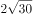，（    ）

- **A**. 
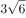

- **B**. 

- **C**. 
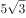

- **D**. 
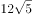
　✅

**答案**：D

**官方解析**

数列及选项出现多个带根号的数字，转化为根号内找规律。，，，，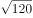，根号内形成数列：1，2，6，24，120，有明显的倍数关系，后项除前项可得新数列：2，3，4，5，是公差为1的等差数列，新数列下一项为6，则所求项为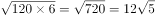。

故正确答案为D。

---

## 第 4 题　qid 4651663 · 数学运算

，，，，，（    ）

- **A**. 

- **B**. 

　✅
- **C**. 

- **D**. 

**答案**：B

**官方解析**

观察数列特征，均为分数，考虑分数数列。观察分子、分母无明显规律，考虑反约分，原数列可转化为：，，，，。观察发现，分母：6，12，20，30，42，作差后得：6，8，10，12，是公差为2的等差数列，则下一项是14，即所求项的分母为：42+14=56；分子：5，1，11，9，21，无明显规律，考虑分子分母结合看，观察发现，6-5=1，12-1=11，20-11=9，30-9=21，即后一项分子=前一项分母-前一项分子，则所求项的分子为：42-21=21，则所求项应为，对应B项。

故正确答案为B。

---

## 第 5 题　qid 4651751 · 数学运算

“双减”政策实施后，某小学下午5：30放学，小李5：00下班去接孩子回家，当不堵车时，5：30之前到校；当堵车时，5：30之前到校的概率为0.6。若5：00—5：30堵车的概率为0.3，则小李5：30之前到校的概率是：

- **A**. 0.78
- **B**. 0.80
- **C**. 0.88　✅
- **D**. 0.91

**答案**：C

**官方解析**

方法一：正面考虑。小李出发后可能有两种情况：堵车或不堵车，已知堵车的概率为0.3，则不堵车的概率为1-0.3=0.7。分情况讨论如下：
情况一：若出发后堵车，则能在5：30之前到校概率为：0.3×0.6=0.18；
情况二：若出发后不堵车，则能在5：30之前到校概率为：0.7×1=0.7。
分类用加法，则小李5：30之前到校概率为0.18+0.7=0.88。
方法二：反面考虑。小李没能在5：30之前到校的情况只有一种可能，就是出发后堵车。根据题意，此时没在5：30之前到校概率为：0.3×（1-0.6）=0.12；故小李5：30之前到校概率为1-0.12=0.88。
故正确答案为C。

---

## 第 6 题　qid 4651689 · 数学运算

如图所示，考古队在B和C两处发现重要遗址，根据对周边环境考察，确定以A和D为顶点划出一个正方形挖掘区域。已知AB、CD都与BC垂直，AB=7米，BC=7米，CD=42米，则这个正方形挖掘区域的边长为：

- **A**. 49米
- **B**. 45米
- **C**. 40米
- **D**. 35米　✅

**答案**：D

**官方解析**

B、C两处为重要遗址，因此以A和D为顶点划出的正方形挖掘区域，需要包含B、C两点，才能对遗址进行挖掘。同时由题意可知，AD的长度大于42+7=49米，若AD为正方形的一条边，则所给选项均不满足，故AD只能为正方形的对角线。如下图所示，设正方形挖掘区域的边长AE和DE为x米，过点A作DC的垂线，与DC的延长线相交于点F，则DF=FC+CD=AB+CD=7+42=49米，AF=BC=7米。根据勾股定理，在三角形ADF和三角形ADE中，，即，解得x=35，即这个正方形挖掘区域的边长为35米。

故正确答案为D。

---

## 第 7 题　qid 4651752 · 数学运算

如图所示，某主题公园将一块正方形的地面按七巧板图案设计，其中平行四边形1个、正方形1个、等腰直角三角形5个，并用油漆将七块区域刷成不同的颜色。若每种颜色的油漆单价相同，平行四边形区域的油漆费用为200元，则整块地面的油漆费用为：

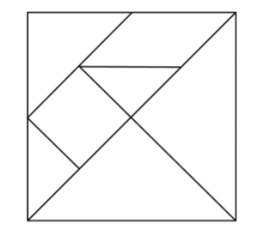

- **A**. 1200元
- **B**. 1600元　✅
- **C**. 2000元
- **D**. 2400元

**答案**：B

**官方解析**

如下图，根据题意，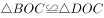且为等腰直角三角形，则CO为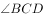的平分线，即正方形对角线。延长CO至点A，易得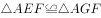且为等腰直角三角形，则EG∥BD。由于EFOH为正方形，则EF=OF=AF，可得F点为AO中点，即EG为中位线。根据三角形中位线结论，OB=2×FG，则OJ=BJ。连接GJ易得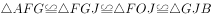。则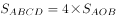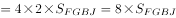。由于油漆费用=油漆单价×刷漆面积，且每种颜色的油漆单价相同，则所求费用=8×200=1600元。

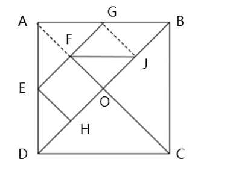 

故正确答案为B。

---

## 第 8 题　qid 4651758 · 数学运算

出版社安排甲、乙、丙三人校对一本书，甲完成总任务的后，剩下的分配给乙和丙。若乙的工作效率是丙的，且两人完成工作所用时间相同，则乙的工作量是总任务的：

- **A**. 

　✅
- **B**. 
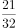

- **C**. 

- **D**. 

**答案**：A

**官方解析**

方法一：根据“乙的工作效率是丙的”，赋值乙的效率为3，丙的效率为4，设两人完成工作所用时间均为t，由“甲完成总任务的后，剩下的分配给乙和丙”，则乙、丙两人一共完成的工作量为：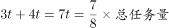，即总任务量=8t，则乙的工作量是总任务量的 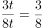。

方法二：根据“乙的工作效率是丙的，且两人完成工作所用时间相同”，可知乙、丙两人工作效率比为3：4，工作时间相同，则工作效率与工作量成正比，即乙、丙两人工作量之比为3：4，假设总任务量为8份，甲做，即1份，乙、丙两人共做7份，乙的工作量为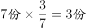，所以乙的工作量是总任务的。

故正确答案为A。

---

## 第 9 题　qid 4651677 · 数学运算

正方体中，E、F分别为棱和的中点，则平面截该正方体所得截面的形状是：

- **A**. 三角形
- **B**. 四边形　✅
- **C**. 五边形
- **D**. 六边形

**答案**：B

**官方解析**

如图所示，设正方体的中心点为O，E、F分别分别为、的中点，为正方体的体对角线，连接、EB、BF、、、EF，易得此六条线段在同一平面上，则故平面截该正方体所得截面即为四边形。

故正确答案为B。

---

## 第 10 题　qid 4651762 · 数学运算

某种杀虫剂每桶5公斤，浓度为40%，使用时需将浓度稀释到5%，每亩地喷洒60公斤。若某农户家中有4亩地，则至少需要该杀虫剂：

- **A**. 3桶
- **B**. 4桶
- **C**. 5桶
- **D**. 6桶　✅

**答案**：D

**官方解析**

设需要n桶杀虫剂，根据稀释前后溶质质量相等，可得5n×40%=60×4×5%，解得n=6。
故正确答案为D。

---

## 第 11 题　qid 4651469 · 数学运算

某政府机关将甲、乙两个部门合并。合并前，甲、乙两部门的男女人数之比分别为4：1和3：2，男女党员人数之比分别为9：2和9：4，乙部门女党员人数占本部门人数的比重是甲部门的两倍。合并后，若男女人数之比为7：3，则男女党员人数之比为：

- **A**. 18：5
- **B**. 27：8
- **C**. 3：1　✅
- **D**. 27：10

**答案**：C

**官方解析**

根据题意，设甲部门的男女人数分别为4x、x，乙部门的男女人数分别为3y、2y。因合并后，男女人数之比为7：3，可列等式：，解得：x=y，说明合并前，甲部门总人数为4x+x=5x，乙部门总人数为3y+2y=5y，即甲、乙两部门总人数相等。

因“乙部门女党员人数占本部门人数的比重是甲部门的两倍”，且甲、乙两部门总人数又相等，可知乙部门女党员人数是甲部门女党员人数的两倍。根据“甲、乙两部门的男女党员人数之比分别为9：2和9：4”，设甲部门女党员人数为2a，则乙部门女党员人数为4a，甲部门男党员人数为9a，乙部门男党员人数为9a，故所求男女党员人数之比为（9a+9a）：（2a+4a）=18a：6a=3：1。

故正确答案为C。

---

## 第 12 题　qid 4651473 · 数学运算

已知A、B两地相距9公里，甲、乙两人匀速从A地前往B地。甲每小时走6公里，每走半小时休息15分钟；乙比甲早15分钟出发，中间不休息。若他们在途中（不含起点和终点）相遇了2次，则乙从A地到B地所用的时间至少为：

- **A**. 75分钟
- **B**. 120分钟
- **C**. 135分钟　✅
- **D**. 150分钟

**答案**：C

**官方解析**

根据题意，因为乙比甲先出发15分钟，所以第一次相遇是甲追上乙。要使得乙从A地到B地所用的时间尽可能少，则乙的速度应尽可能大，即甲第一次追上乙花费的时间应尽可能多。因此当甲行驶30分钟后才追上乙时，乙的速度最大，此时甲、乙路程相等。可得方程：，解得公里/小时，则乙从A地到B地所用的时间至少为小时=135分钟。

备注：下图为甲、乙两人全程的路程与时间的函数图像，第一次相遇在45分钟，此时甲追上乙，然后甲休息，乙继续走。第二次相遇在90分钟，此时甲第二次追上乙，然后甲休息，乙继续走。第三次相遇在135分钟，此时两人同时到达B点，满足题干所说途中（不含起点和终点）相遇了2次。

故正确答案为C。

---

## 第 13 题　qid 4651461 · 数学运算

某学者认为，人类的体力、情绪、智力自出生日起分别以22天、28天、33天为周期开始往复循环变化，前半个周期是“高潮期”，后半个周期是“低潮期”。根据该学者的观点，我们过公历生日时，体力、情绪和智力同时处于“高潮期”的最小年龄是：

- **A**. 4周岁
- **B**. 3周岁
- **C**. 2周岁　✅
- **D**. 1周岁

**答案**：C

**官方解析**

根据题意利用代入排除法，问最小年龄，从小到大进行代入。代入D项若最小年龄为1周岁，即365天，体力处于个周期⋯⋯13天，22天前半个周期11天是“高潮期”，13天不满足题意，排除D项；代入C项若最小年龄为2周岁，即365×2=730天，体力处于个周期⋯⋯4天，情绪处于个周期······2天，智力处于个周期······4天，均处于以22天、28天、33天为周期的前半个周期“高潮期”，满足题意。

备注：即使在2周岁时经历了闰年366天，所有余数均加一，仍然均处于前半个周期“高潮期”。

故正确答案为C。

---

## 第 14 题　qid 4651668 · 数学运算

某疫苗接种点市民正在有序排队等候接种。假设之后每小时新增前来接种疫苗的市民人数相同，且每个接种台的效率相同，经测算：若开8个接种台，6小时后不再有人排队；若开12个接种台，3小时后不再有人排队。如果每小时新增的市民人数比假设的多25%，那么为保证2小时后不再有人排队，需开接种台的数量至少为：

- **A**. 14个
- **B**. 15个
- **C**. 16个
- **D**. 17个　✅

**答案**：D

**官方解析**

设原来排队市民总数为Y人，假设每小时新增的市民人数为X人，接种台数量为N个，由牛吃草公式Y=（N-X）×T有：Y=（8-X）×6=（12-X）×3，解得：X=4，Y=24；根据“每小时新增的市民人数比假设的多25%”可得，现在每小时新增的市民人数为：4×（1+25%）=5。同样代入牛吃草公式有：24=（N-5）×2，解得：N=17。
故正确答案为D。

---

## 第 15 题　qid 4651454 · 数学运算

某市民中心广场钟楼上东、西、南、北四面各有一个挂钟，则每日早8点至晚8点，任意相邻两个钟的时针互相垂直的次数是：

- **A**. 2　✅
- **B**. 3
- **C**. 4
- **D**. 5

**答案**：A

**官方解析**

如下图，设相邻两个挂钟所在平面为A、B，则A、B两个平面相互垂直。根据几何结论：若一条线段与一个平面垂直，则该线段垂直于平面上所有线段。因此需要平面B内挂钟的时针在水平方向，此时与相邻的平面A垂直即与平面A内挂钟的时针垂直。如下图所示：只有在早上9点（实线所示）、下午3点（虚线所示）这两次，平面B内挂钟的时针与平面A垂直，即A、B两个面上挂钟时针相互垂直。

故正确答案为A。

---

## 第 16 题　qid 4651460 · 数学运算

某企业举行职业技能大赛，3个下属分公司均选2名员工参赛。若同一分公司的员工比赛时出场顺序不能相邻，则参赛的6名员工不同的出场顺序共有：

- **A**. 80种
- **B**. 120种
- **C**. 160种
- **D**. 240种　✅

**答案**：D

**官方解析**

位置1，从6名员工中选1名员工，有种排法； 

位置2，从另外两个公司的4名员工中选1名员工，有种排法；

后续情况较复杂，考虑枚举法，设三个公司分别为A、B、C，6名员工分别为，，，，，，假设位置1安排出场，位置2安排出场，将出场顺序情况梳理如下：

此时后续符合条件的情况有10种，因此总情况为6×4×10=240种不同的出场顺序。

故正确答案为D。

---

## 第 17 题　qid 4651667 · 数学运算

甲、乙两人对100个家庭进行电话调查。若甲、乙完成对1个家庭的调查需要的时间分别是12分钟和20分钟，则他们完成这次电话调查需要的时间至少是：

- **A**. 12小时28分钟
- **B**. 12小时32分钟
- **C**. 12小时36分钟　✅
- **D**. 12小时40分钟

**答案**：C

**官方解析**

方法一：甲、乙完成对1个家庭的调查需要的时间分别是12分钟和20分钟，因此每小时（60分钟）甲调查5个家庭，乙调查3个家庭，合计调查5+3=8个家庭。小时······4个家庭，剩余4个家庭由甲调查3个，乙调查1个，用时是最少的，需要36分钟。因此两人合计用时最少为12小时36分钟，对应C项。

方法二：由于选项都是12小时多，且问“至少”，故可利用代入排除法。12小时调查数量为：甲个家庭，乙个家庭，合计60+36=96个家庭，还剩4个家庭未调查。问题问“至少”，从最小的开始代入。

A项：28分钟，甲可调查2个家庭，乙可调查1个家庭，合计2+1=3个，不足4个，排除；

B项：32分钟，甲可调查2个家庭，乙可调查1个家庭，合计2+1=3个，不足4个，排除；

C项：36分钟，甲可调查3个家庭，乙可调查1个家庭，合计3+1=4个，当选。

故正确答案为C。

---

## 第 18 题　qid 4651682 · 数学运算

某金融机构向9家“专精特新”企业共发放了4500万元贷款，若这9家企业获得的贷款额从少到多排列，恰好为一个等差数列，且排第3的企业获得420万元贷款，排第8的企业获得的贷款额为：

- **A**. 620万元　✅
- **B**. 660万元
- **C**. 720万元
- **D**. 760万元

**答案**：A

**官方解析**

由题干可知：9家企业共发放4500万元且贷款额从少到多排列，恰好为一个等差数列。根据等差数列求和公式：，可知排名第5的企业（中位数）获得=4500÷9=500万元。又已知排名第3的企业获得420万元，则根据等差数列的通项公式：可知，等差数列的公差为：万元，排名第8的企业获得万元。

故正确答案为A。

---

## 第 19 题　qid 4651459 · 数学运算

如图所示，小王买了一块直三棱柱形状的蛋糕，其中，。为与两位室友分享，他切出一小块和原蛋糕形状相同的蛋糕，其体积与原蛋糕的体积之比为1：3。若，则线段AE与EB的长度之比为：

- **A**. 
2：1
　✅
- **B**. 
3：2

- **C**. 
：1

- **D**. 
2：

**答案**：A

**官方解析**

根据题意，直三棱柱与直三棱柱的体积之比为1：3，根据三棱柱体积=底面积×高，高度相同（以为高），故底面积之比为1：3，即。该立体图形的俯视图如下图所示：

在直角中，，即，同理，设DE为x，则，AE=2x。由于且有公共角，故，因面积之比为相似比的平方，故相似比为，即，则，EB=3x-2x=x，所求长度之比为：。

故正确答案为A。

---
