# 2022年河北省公务员录用考试《行测》题（网友回忆版）

> 数量关系 · 15 题 · 河北 2022

## 第 1 题　qid 5102124 · 数学运算

为了支持乡村教育，某市派出6名优秀教师前往该市农村的三所学校支教，一所1名，一所2名，一所3名，不同的选派方法共有：

- **A**. 60种　✅
- **B**. 120种
- **C**. 360种
- **D**. 720种

**答案**：A

**官方解析**

第一所学校需1名教师，选择情况数为种；第二所学校需2名教师，选择情况数为种，此时剩余三名教师自动去往第三所学校，故总情况数为种。

故正确答案为A。

备注：本题存在歧义，题干未明确指出三所学校所需教师名额是否固定。若名额不固定，另一种解法为：先选出一所学校，派出1名教师，情况数为种；再选出一所学校，派出2名教师，情况数为种，此时剩余三名教师自动去往最后一所学校，故总情况数为种，对应C项。但现实生活中，支教名额应该是根据学校需求定好的，所以粉笔更倾向A项为正确答案。

---

## 第 2 题　qid 5102127 · 数学运算

某市举行庆典活动，将依次升空105架无人机，升空方式如下：每架无人机间距均相等，第一次升空n架，第二次升空n-1架，以此类推，最终在夜空中组成一个近似等边三角形背景的灯光秀，那么第10次升空的无人机数量是：

- **A**. 3架
- **B**. 5架　✅
- **C**. 8架
- **D**. 10架

**答案**：B

**官方解析**

根据题意可知，每次升空的无人机数量组成等差数列。又因为“组成一个近似等边三角形”，则第一次升空n架（）为底边，最后一次升空的无人机在三角形的顶点上，数量为1架（），且公差d＝-1。根据等差数列求和公式：，可得，解得n＝14。再根据等差数列通项公式：，则，故第10次升空的无人机数量是5架。

故正确答案为B。

---

## 第 3 题　qid 5102142 · 数学运算

某地采用传统销售模式，销售一批鸡蛋需要20天，销售一批桃子需要25天。为推动销售，当地开启县领导直播带货模式，直播带货期间，鸡蛋的销售效率提高为原来的2倍，桃子销售效率为原来的3倍；其余销售时间依然按照传统模式进行，结果两种产品同时销售完成。那么销售期间直播带货的天数为：

- **A**. 3
- **B**. 5　✅
- **C**. 8
- **D**. 10

**答案**：B

**官方解析**

除了销售时间相同，销售鸡蛋和销售桃子没有其它关系，所以二者是相互独立的，因此可赋值传统销售模式下的鸡蛋和桃子的销售效率均为1，则直播带货期间，鸡蛋销售效率为2，桃子销售效率为3。根据题意可得，该批鸡蛋总量为20×1=20，该批桃子总量为25×1=25。设销售期间直播带货的天数为x，则非直播带货的鸡蛋销售时间为，非直播带货的桃子销售时间为。因为两种产品同时销售完成，其中的直播带货时间相同，那么非直播带货的时间也相同，即20-2x=25-3x，解得x=5，因此销售期间直播带货的天数为5。

故正确答案为B。

---

## 第 4 题　qid 5102140 · 数学运算

北京冬奥会期间，冬奥会吉祥物“冰墩墩”纪念品十分畅销。销售期间某商家发现，进价为每个40元的“冰墩墩”，当售价定为44元时，每天可售出300个，售价每上涨1元，每天销量减少10个。现商家决定提价销售，若要使销售利润达到最大，则售价应为：

- **A**. 51元
- **B**. 52元
- **C**. 54元
- **D**. 57元　✅

**答案**：D

**官方解析**

设“冰墩墩”纪念品售价共上涨x元，销售利润为y元。根据题意，可列方程：，即，令y=0，解得，，当时，总利润最大，此时售价为44+13=57元。

故正确答案为D。

---

## 第 5 题　qid 5113391 · 数学运算

两个信号灯分别以30秒和36秒的固定间隔闪亮一次，若他们10点第一次同时闪亮，则第七次同时闪亮的时间为（    ）。

- **A**. 10：15
- **B**. 10：16
- **C**. 10：18　✅
- **D**. 10：21

**答案**：C

**官方解析**

根据题意可得，两个信号灯同时闪亮的周期为180秒（30秒与36秒的最小公倍数），即两个信号灯以3分钟的固定间隔同时闪亮一次。从第一次同时闪亮到第七次同时闪亮之间，共间隔6个周期×3分钟=18分钟。若他们10点第一次同时闪亮，则第七次同时闪亮的时间为10：18。
故正确答案为C。

---

## 第 6 题　qid 5102321 · 数学运算

某助农志愿小分队采摘到甲、乙、丙三筐枸杞共144斤。第一次从甲筐中取出与乙筐一样重的枸杞放入乙筐，第二次再从现有乙筐中取出与丙筐一样重的枸杞放入丙筐，第三次从现有丙筐中取出与现有甲筐一样重的枸杞放入甲筐，此时三筐枸杞一样重。那么原来甲筐中有枸杞：

- **A**. 36斤
- **B**. 48斤
- **C**. 56斤
- **D**. 66斤　✅

**答案**：D

**官方解析**

方法一：甲、乙、丙三筐共144斤，最终三筐枸杞一样重，每筐144÷3=48斤，根据题意反推如下表：

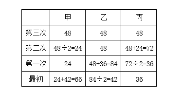

方法二：设最初甲、乙、丙分别有x斤、y斤、z斤枸杞，变化如下表：

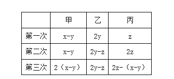

可列方程组：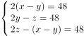，解得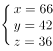。

故正确答案为D。

---

## 第 7 题　qid 5102162 · 数学运算

某方舱医院配有1000张床位，现已接收新冠确诊患者200名，并按床护比（护士数与床位数的比值）0.6：1配齐了护士人员。因疫情发展迅速，该医院又收治了700名患者，此时床护比下调为0.2：1，那么还需增加护士：

- **A**. 80名
- **B**. 60名　✅
- **C**. 40名
- **D**. 20名

**答案**：B

**官方解析**

根据最初床护比为0.6：1，可求出最初200名患者配备的护士人数为200×0.6=120名；又收治700名患者后，患者总数变为200+700=900名，按照下调后床护比为0.2：1计算，共需护士900×0.2=180名，所以需增加护士人数=180-120=60名。
故正确答案为B。

---

## 第 8 题　qid 5113383 · 数学运算

已知甲乙丙三数之和为90，甲数除以乙数与丙数除以甲数的结果，都是商4余1。则乙数为（    ）。

- **A**. 2
- **B**. 3
- **C**. 4　✅
- **D**. 5

**答案**：C

**官方解析**

设乙数为x，则甲数为4x+1，丙数为4×（4x+1）+1=16x+5。根据“甲乙丙三数之和为90”，可列式x+（4x+1）+（16x+5）=90，解得x=4，即乙数为4。
故正确答案为C。

---

## 第 9 题　qid 5102130 · 数学运算

清朝乾隆皇帝曾出上联“客上天然居，居然天上客”，纪昀以“人过大佛寺，寺佛大过人”对出下联，这副对联既可以顺读也可以逆读，被称作回文联。数学中也有类似回文数，如212、37473等，则三位数中回文数是奇数的概率为：

- **A**. 

- **B**. 

- **C**. 

- **D**. 

　✅

**答案**：D

**官方解析**

根据题意三位数是回文数的情况，即百位数字和个位数字相同，且由于三位数百位数字不能为0，只能是1-9中的任意一个，十位数字可以是0-9中的任意一个，故总情况数有9×10=90种。回文数是奇数的情况，即个位数字可以是1、3、5、7、9中的一个，百位数字和个位数字相同，十位数字可以是0-9中的任意一个，故满足条件的情况有5×10=50种。则三位数中回文数是奇数的概率为。

故正确答案为D。

---

## 第 10 题　qid 5113403 · 数学运算

甲乙两人顺时针方向沿圆形跑道跑步。甲跑完一圈要10min，乙跑完一圈要12min，如果他们分别从圆形跑道直径两端同时出发，甲第一次追上乙需要（    ）分钟。

- **A**. 30　✅
- **B**. 60
- **C**. 15
- **D**. 45

**答案**：A

**官方解析**

赋值圆形跑道长度为60，则甲每分钟的速度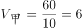，乙每分钟的速度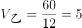。甲、乙分别从圆形跑道直径两端同时出发，即出发时两人相距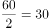，根据追及公式：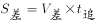，可得：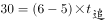，解得：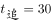，即甲第一次追上乙需要30分钟。

故正确答案为A。

---

## 第 11 题　qid 5102311 · 数学运算

某商场为庆祝开业三周年，制作了一个长方形大蛋糕，并切成四块，如图所示。假设这个蛋糕可供350人享用，左下角那块蛋糕平均可供50人享用，右上角那块蛋糕平均可供70人，则中间最大块蛋糕平均可供多少人享用？

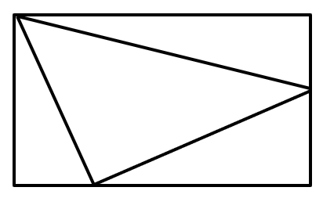

- **A**. 150
- **B**. 155　✅
- **C**. 175
- **D**. 180

**答案**：B

**官方解析**

假设平均每人享用蛋糕，则蛋糕面积为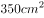，赋值蛋糕的长为35cm，宽为10cm。如下图所示：

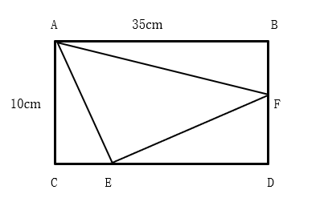

根据“左下角那块蛋糕平均可供50人享用，右上角那块蛋糕平均可供70人”可知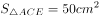，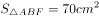，根据三角形面积公式：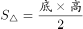，可得：CE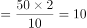cm，BF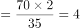cm，则ED=35-10=25cm，DF=10-4=6cm，则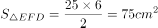，故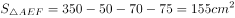，平均可供155人享用，即中间最大块蛋糕平均可供155人享用。

故正确答案为B。

---

## 第 12 题　qid 5102135 · 数学运算

某城市规划馆有一个边长为40米的正三角形数字展厅，展厅中布置有5台投影设备，用于展示城市的过去、现在以及畅想城市的未来。每台投影设备的尺寸忽略不计，则任意两台设备之间的最小距离：

- **A**. 小于10米
- **B**. 不超过16米
- **C**. 不超过20米　✅
- **D**. 在23～28米之间

**答案**：C

**官方解析**

根据题意“在正三角形数字展厅内部布置5台投影设备”，假设其中3台投影设备放在正三角形数字展厅的三个顶点，即蓝色圆点处，如下图所示。此时若想使剩余2台设备的距离尽量大，连接正三角形各边上的中点，可得到小正三角形，从红色圆点处任选2个放置剩余2台投影设备即可得到最大间距，则任意两台设备之间的最小距离不超过米。

故正确答案为C。

---

## 第 13 题　qid 5102160 · 数学运算

A、B两个乡镇分布于山谷两侧，山谷间有一条宽为2km的河道（如下图所示）。当地政府决定在两个乡镇间修建一条跨河公路促进旅游发展。由于架桥费用高昂，所以要求跨河公路中的桥梁路段长度最短。那么根据图中数据，从A镇前往B镇的最短距离为：

- **A**. 17km
- **B**. 15km　✅
- **C**. 19km
- **D**. 20km

**答案**：B

**官方解析**

根据题目要求桥长2km，最短距离=AB最短距离+桥长，如下图所示，将河流看成一条直线，两点之间线段最短，连接AB构成直角三角形ABC，km。

从A镇前往B镇的最短距离=13+2=15km。

故正确答案为B。

---

## 第 14 题　qid 5113404 · 数学运算

有200人参加招聘会，其中法学70人，经济学60人，工业设计50人，统计学20人，至少有（    ）人找到工作才能保证一定有50人的专业相同。

- **A**. 167
- **B**. 168　✅
- **C**. 170
- **D**. 175

**答案**：B

**官方解析**

题目问“至少······才能保证······”，为最值问题中的最不利构造题型。最不利的情况为每个专业最多只有49人找到工作，则最不利情况数为49（法学）+49（经济学）+49（工业设计）+20（统计学）=167人，在此基础上再任意多一人找到工作就可以满足有50人的专业相同的要求，即至少要有167+1=168人找到工作。
故正确答案为B。

---

## 第 15 题　qid 5102138 · 数学运算

用一个长为20厘米、宽为2厘米、高为1.5厘米的长方体木料，制作一串半径最大的木珠子，不考虑制作过程中的损耗，则这串珠子的数量最多为：

- **A**. 10个
- **B**. 13个
- **C**. 14个　✅
- **D**. 20个

**答案**：C

**官方解析**

木珠子是球形的，需要从长方体木料的内部进行切割，由于长方体的高为1.5厘米，则木珠子的最大直径为长方体的高1.5厘米，即半径最大。长方体的宽为2厘米，木珠子的直径为1.5厘米，制作过程中，要令数量最多，木珠子错落摆放即满足要求。摆放过程注意不要超出长方体木料的长度，用前两个珠子的摆放作为演示：

AC是两个木珠子球心的连线，长度即为木珠子的直径1.5厘米，AC为斜边做直角三角形ABC，AC即两个球心间的最短距离。BC的长度为长方体的宽-木珠子的半径-B点距长方体左边的边长，且AB垂直BC，可得出B点距长方体左边的边长即A点距长方体边长的距离0.75厘米，可求BC长=2-0.75-0.75=0.5厘米，在直角三角形ABC中，利用勾股定理可以求出AB长为厘米，即在AB所在直线上，相邻两个珠子间距（把珠子看成点）为厘米，且第一个和最后一个珠子的球心距长方体木料两端至少为0.75厘米。则制作的珠子数量=段数+1，段数，即分为13段，那么珠子数量最多=13+1=14个。

故正确答案为C。

---
