# 2022年深圳市考公务员录用考试《行测》试题（网友回忆版）

> 数量关系 · 12 题 · 深圳市考 2022

## 第 1 题　qid 4651848 · 数学运算

-8，10，-7，12，-5，（    ）

- **A**. 18
- **B**. 16　✅
- **C**. 14
- **D**. 11

**答案**：B

**官方解析**

数列无明显倍数关系，且作差无规律，考虑作和。观察发现，相邻两项之和构成的新数列为：2，3，5，7，（    ），即质数数列。故新数列下一项为11，则原数列所求项为11-（-5）=16。
故正确答案为B。

---

## 第 2 题　qid 4651828 · 数学运算

，，，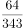，（    ）

- **A**. 
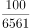

- **B**. 
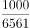
　✅
- **C**. 
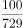

- **D**. 
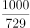

**答案**：B

**官方解析**

数列均为分数，考虑分数数列。原数列可以转化为：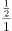，，，，（    ）。分母可以转化为：，，，，（    ），即分母是底数为连续奇数、指数为连续整数的幂次数列，则所求项的分母为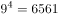；分子可以转化为：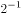，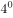，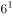，，（    ），即分子是底数为连续偶数、指数为连续整数的幂次数列，则所求项的分子为。故所求项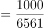。

故正确答案为B。

---

## 第 3 题　qid 4651832 · 数学运算

某学校有三队冬奥会志愿者，每队30人，已知第一队的男生数和第二队的女生数相同，第三队的男生数占全部男生数的，则女生共有（    ）名。

- **A**. 30
- **B**. 40　✅
- **C**. 45
- **D**. 50

**答案**：B

**官方解析**

由题意可知，共有三队志愿者，每队30人，则共有30×3=90名志愿者，设第一队的男生数为x人，第三队的男生数为y人，则具体情况如下表所示：

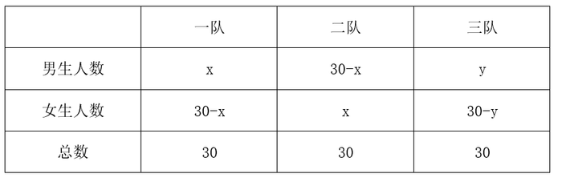

根据“第三队的男生数占全部男生数的”，可得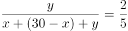，解得y=20，则女生总人数为（30-x）+x+（30-y）=60-y=40人。

故正确答案为B。

---

## 第 4 题　qid 4651837 · 数学运算

一批传统手工匠人需在预定时间内完成一笔糖人订单，他们捏糖人的速度都相同，有两种工期安排方案供其选择。方案一：若干名匠人先开工，经过三分之一的预定时间，将人数加倍，在预定时间刚好完成；方案二：10名匠人同时开工，在预定时间也刚好完成，则方案一前期应安排（    ）名匠人。

- **A**. 6　✅
- **B**. 7
- **C**. 8
- **D**. 9

**答案**：A

**官方解析**

根据题意，设方案一前期应安排x名匠人，则人数加倍后为2x名匠人。若总时间为3t，则先开工时间为t，人数加倍后时间为2t。因为手工匠人捏糖人速度相同，设每个人效率均为1，根据工作总量相同可得：x∙t+2x×2t=10×3t，解得x=6，则方案一前期应安排6名匠人。
故正确答案为A。

---

## 第 5 题　qid 4651840 · 数学运算

某商城停车场实行按时长阶梯式收费，收费规则如下：不超出某一基础时长的，按5元/小时收费。超出该基础时长的，超出的部分每小时收费增加3元；停车时长达基础时长3倍以上时，则超出基础时长3倍的部分，每小时收费再增加3元。若甲某次停车离场时超出基础时长11小时，共交费116元，则基础时长为（    ）小时。（该基础时长为整数，停车时长不满1小时的按1小时计）

- **A**. 6
- **B**. 5　✅
- **C**. 4
- **D**. 3

**答案**：B

**官方解析**

设基础时长为x小时。若停车时长没有超过基础时长3倍，则根据题意可列方程：5x+11×（5+3）=116，解得x=5.6，为非整数，故停车时长超过基础时长的3倍。由题意可列方程：5x+2x×（5+3）+（11-2x）×（5+3+3）=116，解得x=5。
故正确答案为B。

---

## 第 6 题　qid 4651907 · 数学运算

实验室有甲、乙、丙3瓶盐酸溶液，浓度分别为10%、40%、60%，实验员将3瓶溶液全部倒入一瓶中，得到浓度为52%的盐酸溶液。已知乙溶液重量为甲溶液的1.5倍，则丙溶液重量为甲溶液的（    ）倍。

- **A**. 4.5
- **B**. 5.5
- **C**. 6.5
- **D**. 7.5　✅

**答案**：D

**官方解析**

赋值甲溶液的重量为20，则乙溶液的重量为30。设丙溶液的重量为a。根据公式：浓度，则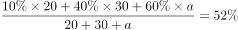，解得a=150，丙溶液重量为甲溶液的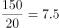倍。

故正确答案为D。

---

## 第 7 题　qid 4651873 · 数学运算

小王从图书馆借了一本书，书共204页，阅读时，他发现书的前半部分有连续的4个页码被墨水污染，将其余200个页码加总，其和刚好可以被85整除，则被污染的4个页码中最小的数是：

- **A**. 100
- **B**. 95
- **C**. 75
- **D**. 41　✅

**答案**：D

**官方解析**

方法一：由题意得，书的页码数构成公差为1的等差数列，根据等差数列求和公式：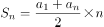，可得该书共有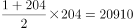页。正面求解复杂，问最小考虑从小到大代入排除。

代入D项，若被污染的4个页码中最小的数是41，则其余200个页码加和=20910-（41+42+43+44）=20740页，20740÷85=244，能够被85整除，可知D项满足题干所有条件，无需继续验证其它选项。

方法二：由题意得，其余200个页码加和=总页码数-被污染的页码数之和=85的倍数，85是5的整数倍；又因总页码数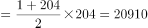，20910是5的整数倍，根据倍数特性，可知被污染的页码数之和一定为5的整数倍。正面求解复杂，问最小考虑从小到大代入排除。

代入D项：被污染的页码数之和=41+42+43+44=170，为5的倍数，满足；

代入C项：被污染的页码数之和=75+76+77+78=306，非5的倍数，排除；

代入B项：被污染的页码数之和=95+96+97+98=386，非5的倍数，排除；

代入A项：被污染的页码数之和=100+101+102+103=406，非5的倍数，排除。

综上可知只有D项满足条件。

故正确答案为D。

---

## 第 8 题　qid 4651874 · 数学运算

某公司举行爱心捐赠活动，经初步统计，平均每人捐款92.35元，复核时发现，因笔误将某人捐款100元误写成10元，实际平均每人捐款96.85元，则该公司共有（    ）人捐款。

- **A**. 18
- **B**. 20　✅
- **C**. 25
- **D**. 30

**答案**：B

**官方解析**

设该公司共有x人捐款，根据题意可列方程：92.35x+（100-10）=96.85x，解得x=20，即该公司共有20人捐款。
故正确答案为B。

---

## 第 9 题　qid 4651875 · 数学运算

小花猫和大黄狗从一周长为210米的环形花园的同一起点同时出发，沿着花园同向奔跑，已知小花猫和大黄狗的初始速度分别为20米/分，160米/分，每当大黄狗追上小花猫一次，大黄狗就减速，小花猫则提速。那么，当小花猫和大黄狗速度刚好相等时，他们共跑了（    ）米。

- **A**. 1250　✅
- **B**. 940
- **C**. 750
- **D**. 1310

**答案**：A

**官方解析**

根据在环形道路上同时同地同向出发，大黄狗每追上小花猫一次则多跑一圈，则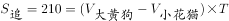，大黄狗每次追上小花猫时的速度变化、所用时间、共跑的路程如下表：

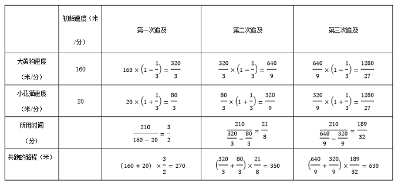

根据上表可知大黄狗在第三次追上小花猫时速度变为相等，此时他们共跑了270+350+630=1250米。

故正确答案为A。

---

## 第 10 题　qid 4651876 · 数学运算

某公司共有60人参加行业考试，考试共设5道必答题，满分为100分，每题答对得20分，答错不扣分，总分60分即为及格。经统计，第1至5题分别有52人、56人、48人、42人、30人答对，则该公司至少有（    ）人及格。

- **A**. 30
- **B**. 36　✅
- **C**. 38
- **D**. 40

**答案**：B

**官方解析**

要及格的人数少，则不及格的人数应尽可能多。根据题意，总分低于60分为不及格，即答错60÷20=3题及以上不及格。第1题答错60-52=8人，第2题答错60-56=4人，第3题答错60-48=12人，第4题答错60-42=18人，第5题答错60-30=30人。要让不及格人数尽可能多，则每个不及格的人的错题数尽可能少，即错3道。根据选项推测不及格的人数在20-30人之间，所以每个不及格的人一定都错了第5题，则不及格的人在前四个题中还需错2个。在1-4题中，总的答错题数为8+4+12+18=42道，最多有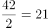人，即不及格的人最多为21人，所以该公司至少有60-21=39人及格。本题无正确答案。

备注：根据选项分析，本题的考查思路可能是：要让不及格人数尽可能多，则每个不及格的人的错题数尽可能少，即错3道，总的答错题数为8+4+12+18+30=72道，不及格人数最多为72÷3=24人，所以该公司至少有60-24=36人及格。

---

## 第 11 题　qid 4651878 · 数学运算

小新18岁生日时，收到父母赠送的一只精美手表作为成年礼。手表每一分钟的刻度线上都装饰水晶。晚上7点29分53秒时，手表时针与分针的夹角内共有（    ）颗水晶。

- **A**. 7
- **B**. 8　✅
- **C**. 9
- **D**. 10

**答案**：B

**官方解析**

由题意得，每个刻度线上都有一个装饰水晶，则水晶颗数即为时针与分针夹角内刻度线的个数。如图所示，7点29分53秒时，再过7秒恰好7点30分，可知分针此时所在位置为29分与30分之间。时针此时所在位置约为7-8点正中间，按分针刻度计算，为37分与38分之间。故时针与分针夹角内的刻度线包括30分-37分，共8个，即水晶颗数为8颗。

故正确答案为B。

---

## 第 12 题　qid 4651882 · 数学运算

假定一对初生雌雄旅鼠一个月后能够成年，再过一个月便能再生下一对雌雄旅鼠，并且继续以此速度生育，若不考虑其他因素，2021年1月末将一对初生雌雄旅鼠放在屋内，到2021年7月末屋内共有（    ）对雌雄旅鼠？

- **A**. 8
- **B**. 13　✅
- **C**. 21
- **D**. 36

**答案**：B

**官方解析**

根据题意，每一对雌雄旅鼠均在第一个月出生，在第二个月待生育，从第三个月开始每个月生育一对雌雄旅鼠，则2021年1月末至7月末的雌雄旅鼠对数如下表：

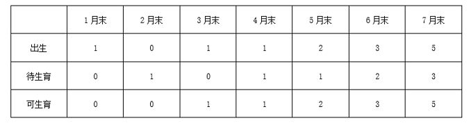

2021年7月末屋内共有5+3+5=13对雌雄旅鼠。

故正确答案为B。

---
