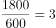
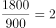
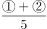
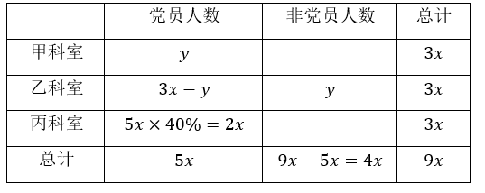
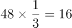
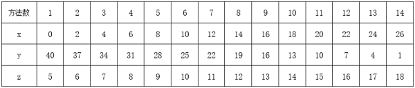
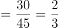
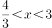

# 2022年湖北省选调生招录考试综合知识和行政职业能力测验试卷（网友回忆版）

> 数量关系 · 9 题 · 湖北 2022

## 第 1 题　qid 4808267 · 数学运算

某城市燃气收费标准如下，一档：每户年度用气0~360立方米（含360立方米），收费2.5元/立方米；二档：每户年度用气360~600立方米（含600立方米），收费3元/立方米；三档：每户年度用气600立方米以上，收费3.5元/立方米。已知某用户今年燃气费平均每立方米3元，那么今年该用户二、三档燃气费平均每立方米多少元？

- **A**. 3.1
- **B**. 3.2
- **C**. 3.3　✅
- **D**. 3.4

**答案**：C

**官方解析**

一档用气收费低于3元，二档用气收费等于3元，则一二档用气的平均燃气费应低于3元。而该用户今年燃气费平均每立方米等于3元，说明该用户今年年度用气一定达到了三档。设该用户今年三档用气x立方米，根据题意可得：2.5×360+3×（600-360）+3.5x=3×（600+x），解得x=360，则今年该用户二、三档燃气费平均为元/立方米。

故正确答案为C。

---

## 第 2 题　qid 4808253 · 数学运算

小王购买某燃油车A，四年行驶6万公里，平均每公里燃油费为0.54元，4年税费和保养费用花费2.3万元，最后以车价的50%卖出。小李以同样的价格购买一款纯电动车B，同样四年行驶6万公里，平均每公里电费为0.14元，4年税费和保养费用花费0.5万元，最后以车价的20%卖出。刚好两人的实际使用费用（实际使用费用=车价+燃油费或电费+税费和保养费－卖出车价）相同。请问小王四年的实际使用费用为多少万元？

- **A**. 10.14
- **B**. 11
- **C**. 12.54　✅
- **D**. 14

**答案**：C

**官方解析**

设小王、小李购买时的车价均为10x万元。结合题中所给关系：实际使用费用=车价+燃油费或电费+税费和保养费-卖出车价，则小王的实际使用费用为10x+6×0.54+2.3-50%×10x=5x+5.54万元，小李的实际使用费用为10x+6×0.14+0.5-20%×10x=8x+1.34万元。两人的实际使用费用相同，则有：5x+5.54=8x+1.34，解得x=1.4，则小王四年的实际使用费用为5×1.4+5.54=12.54万元。
故正确答案为C。

---

## 第 3 题　qid 4808262 · 数学运算

将一满容器浓度为24%的溶液放置太阳下暴晒一段时间，经过一段时间蒸发水分后溶液浓度变为36%且无沉淀。然后再用浓度为12%的溶液将容器加满。请问容器内溶液浓度变为多少？

- **A**. 24%
- **B**. 28%　✅
- **C**. 30%
- **D**. 32%

**答案**：B

**官方解析**

蒸发时水分减少，溶质不变，将容器中原有溶质量赋值为72g。根据公式：溶液，可得容器装满时溶液量为g，蒸发一段时间后溶液量为g，即水的蒸发量为300-200=100g，则将容器加满需再加入100g溶液。根据公式：浓度，此时容器内溶液浓度变为。

故正确答案为B。

---

## 第 4 题　qid 4808287 · 数学运算

某工厂一机器需要同类零件分别安装在A和B处。已知零件安装在A处可工作600小时报废，安装在B处可工作900小时报废。两零件分别安装在A、B两处工作一段时间后，交换零件位置继续工作。这时零件恰好同时报废，忽略安装和更换零件的时间，请问这两个零件使机器工作了多少小时？

- **A**. 640
- **B**. 720　✅
- **C**. 800
- **D**. 840

**答案**：B

**官方解析**

将总量赋值为1800，则零件在A处的损耗效率为，零件在B处的损耗效率为。

方法一：设两个零件先分别在A、B两处工作x小时，交换零件位置继续工作y小时。两个零件恰好同时报废，则有：3x+2y=1800······①，2x+3y=1800······②，可得：x+y=720，即这两个零件使机器工作了720小时。

方法二：两个零件同时安装，同时报废，即在同一段时间内，两个零件分别在A、B两处损耗殆尽，则这段时间为小时，即这两个零件使机器工作了720小时。

故正确答案为B。

---

## 第 5 题　qid 4808295 · 数学运算

某单位有三个人数相等的科室甲、乙、丙，已知甲科室的党员人数等于乙科室的非党员人数，丙科室的党员人数占全单位党员的40%。那么该单位党员人数比非党员人数：

- **A**. 少20%
- **B**. 少25%
- **C**. 多20%
- **D**. 多25%　✅

**答案**：D

**官方解析**

方法一：根据题意，设全单位党员人数为5x，甲科室党员人数为y，则各科室党员人数与非党员人数见下表。

因此，该单位党员人数比非党员人数多。

方法二：由“甲科室的党员人数等于乙科室的非党员人数”，则甲、乙两科室的党员总人数即为每个科室的人数。将全单位党员人数赋值为100。则甲、乙科室的党员人数为100×（1-40%）=60，即每个科室的人数为60，全单位总人数为60×3=180，非党员人数为180-100=80。因此，该单位党员人数比非党员人数多。

故正确答案为D。

---

## 第 6 题　qid 4808275 · 数学运算

设一边长为3的正三角形S1，将S1的每条边三等分，在中间的线段上向形外作正三角形，去掉中间的线段后所得到的图形记为S2；同理将S2的每条边三等分，并重复上述过程所得到的图形记作S3。那么S3与S1的周长之比为多少？

- **A**. 64：27
- **B**. 16：9　✅
- **C**. 4：3
- **D**. 2：1

**答案**：B

**官方解析**

观察下图可知：S1的周长为3×3=9；S2是将S1的每条边先三等分，再由中间线段做等边三角形，即变为4段，共有3×4=12条边，边长均为1，周长为12×1=12；S3也是将S2的每条边变为4段，共有12×4=48条边，边长均为，周长为。则S3与S1的周长之比为16：9。

故正确答案为B。

---

## 第 7 题　qid 4808290 · 数学运算

小贝计划到银行兑换面值5元、10元、20元人民币若干。已知小贝恰好用5张面值100元人民币兑换上述面值人民币45张，那么请问有多少种兑换方法？

- **A**. 14　✅
- **B**. 15
- **C**. 16
- **D**. 18

**答案**：A

**官方解析**

设小贝兑换面值5元人民币x张，兑换面值10元人民币y张，兑换面值20元人民币z张。根据题意可列方程：x+y+z=45······①；5x+10y+20z=5×100······②。②式可化简为x+2y+4z=100······③，③-①×2可得2z-x=10，x、y、z均为自然数，则分情况讨论列表如下：

则共有14种兑换方法。

故正确答案为A。

备注：本题不严谨，题干为“兑换面值5元、10元、20元人民币若干”，即5元、10元、20元均应兑换，按照表中所列应为13种，但无正确答案，故加上第一种情况（0，40，5），共有14种兑换方法。

---

## 第 8 题　qid 4808282 · 数学运算

某单位组织员工参加业务培训，小王和小李所在部门员工10人在同一排就坐，一排正好10个座位，假设座位是随机安排的。问小王和小李之间相隔人数小于等于3人的概率为多少？

- **A**. 

- **B**. 

- **C**. 

- **D**. 

　✅

**答案**：D

**官方解析**

根据题意可得，总情况数为小王与小李从10个座位中选择2个，共有种情况。满足条件情况数为小王与小李之间相隔人数小于等于3的情况，分情况讨论为：

①小王与小李相邻：10个座位中可选择座位的情况分别为：（1，2）、（2，3）、（3，4）、（4，5）、（5，6）、（6，7）、（7，8）、（8，9）、（9，10），则情况数共9种；

②小王与小李相隔1人：10个座位中可选择座位的情况分别为：（1，3）、（2，4）、（3，5）、（4，6）、（5，7）、（6，8）、（7，9）、（8，10），则情况数共8种；

同理可得：

③小王与小李相隔2人，10个座位中可选择座位的情况数共7种；

④小王与小李相隔3人，10个座位中可选择座位的情况数共6种。

由此可知，所求概率。

故正确答案为D。

---

## 第 9 题　qid 4808307 · 数学运算

为庆祝北京奥运会，小静和小北分别收集了若干个冬奥会吉祥物冰墩墩的联名款玩偶。若小静给小北三个冰墩墩，则小北的冰墩墩是小静的n倍，若小北给小静n个冰墩墩，则小静的冰墩墩是小北的3倍，假设n为大于3的整数，请问小北和小静共有多少个冰墩墩？

- **A**. 15
- **B**. 16　✅
- **C**. 24
- **D**. 30

**答案**：B

**官方解析**

设小静有（x＋3）个冰墩墩，则小北有（nx-3）个冰墩墩。根据题意可列方程为：3（nx-3-n）＝x＋3＋n，整理。由题意可知n为大于3的整数，则，解得，故x＝2，。所以小静有2＋3＝5个冰墩墩，小北有7×2-3＝11个冰墩墩，小北和小静共有5＋11＝16个冰墩墩。

故正确答案为B。

---
