# 2022年贵州省公务员录用考试《行测》题（网友回忆版）

> 数量关系 · 11 题 · 贵州 2022

## 第 1 题　qid 5102386 · 数学运算

甲、乙两家大型医疗公司的负责人各带一名助手参加展会订购医疗器械。最终订单显示：每人各自订购了不同种类医疗器械，且其订购的每种医疗器械台数恰巧等于他所订医疗器械的种类数。每人订购的医疗器械种类数都未超过15类，并且两位负责人所订购的医疗器械台数不同，但都比自己的助手多购45台。问甲、乙两公司一共订购了多少台医疗器械？

- **A**. 150
- **B**. 170　✅
- **C**. 210
- **D**. 240

**答案**：B

**官方解析**

方法一：设甲负责人、甲助手、乙负责人、乙助手分别订购a、b、c、d种器械，四人每种器械分别订购a、b、c、d台，四人分订购总数分别为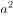、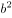、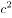、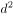台。由题意可知，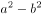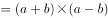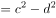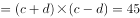，因a、b、c、d各不相同且均是不超过15的整数，根据倍数特性，45=1×45=3×15=5×9，若a+b=45，此时a或b必有一个大于15，不符合题干条件。则a+b=15······①，a-b=3······②，联立①②，解得a=9，b=6，同理c+d=9······③，c-d=5······④，联立③④，解得c=7，d=2。故甲、乙两公司一共订购了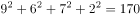台医疗器械。

方法二：设甲负责人、甲助手、乙负责人、乙助手分别订购a、b、c、d种器械，四人每种器械分别订购a、b、c、d台，四人分订购总数分别为、、、台。由题意可知，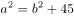，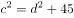，则甲、乙两个公司订购总台数为：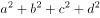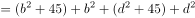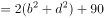，代入选项依次验证：

A项：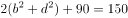，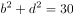，1~15中不存在两个整数的平方相加等于30，排除；

B项：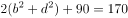，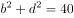，1~15中只有b=6，d=2符合，进而解得a=9，c=7，符合题干条件，其余选项无需验证，此时甲、乙两公司一共订购了台医疗器械。

故正确答案为B。

---

## 第 2 题　qid 5101848 · 数学运算

兔子和乌龟举行一场跑步比赛，终点位于起点正北方500米处。兔子和乌龟同时出发，均保持匀速奔跑，且兔子的速度是乌龟的5倍。兔子先向正东方跑了一会后发现自己跑错了方向，马上直奔终点，速度不变，结果兔子和乌龟同时到达终点。那么兔子发现跑错方向时已经跑了多少米？

- **A**. 600
- **B**. 1200　✅
- **C**. 2400
- **D**. 3000

**答案**：B

**官方解析**

设兔子发现跑错方向时已经跑了x米。由题意可知，兔子和乌龟所用时间相同，根据时间相同，路程与速度成正比，可知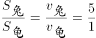，兔子整个比赛跑了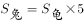=500×5=2500米，即掉头后所跑路程为（2500-x）米。整个比赛过程路线如图所示：

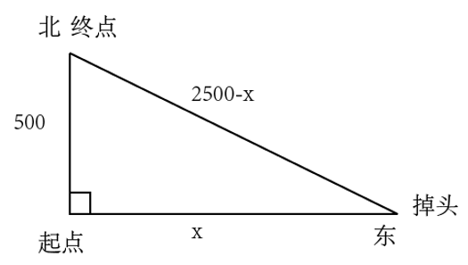

根据勾股定理可列式：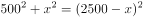，解得x=1200，故兔子发现跑错方向时已经跑了1200米。

故正确答案为B。

---

## 第 3 题　qid 5102041 · 数学运算

甲、乙、丙三个工程队接到A、B两个工程的施工任务，若由甲单独完成B工程需要30天；若甲乙两队合作施工，则完成A工程需要30天，完成B工程需要20天；乙丙合作完成A工程则需要24天。现在三个工程队合作完成A、B两个工程，多少天可以完工？（不足1天按1天计算）

- **A**. 24
- **B**. 25
- **C**. 26
- **D**. 27　✅

**答案**：D

**官方解析**

赋值B工程总量为30、20的最小公倍数60，则甲的效率为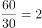，甲乙的效率和为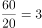，可知乙的效率为3-2=1。由“若甲乙两队合作施工，则完成A工程需要30天”，可知A工程总量为30×3=90，由“乙丙合作完成A工程则需要24天”，可得乙丙的效率和为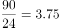，则丙的效率为3.75-1=2.75。故所求时间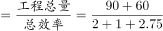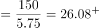，需27天。

故正确答案为D。

---

## 第 4 题　qid 5102093 · 数学运算

7名防疫人员负责甲、乙两个社区的居民排查工作，已知每人走访一户居民的用时为固定值，若5人负责甲社区、2人负责乙社区，则完成乙社区排查的时间比甲社区要晚5天；若3人负责甲社区、4人负责乙社区，则乙社区完成排查后，只需6人共同工作4天就能完成甲社区的排查。那么如果要在6天内完成两个社区的排查工作，至少需要额外增加多少人？

- **A**. 5
- **B**. 6　✅
- **C**. 7
- **D**. 8

**答案**：B

**官方解析**

由题意可知，每名防疫人员每天走访的居民户数均相同，为方便计算，赋值每名防疫人员每天走访的居民户数为1。设甲社区有x户居民，乙社区有y户居民，根据题意可列方程：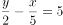······①，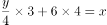······②，联立①②解得：x=45，y=28。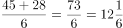，则要想在6天内完成两个社区的排查工作至少需要13人，至少需要额外增加13-7=6人。

故正确答案为B。

---

## 第 5 题　qid 5101834 · 数学运算

2020年时，李某的年龄是自己工龄的4倍，且正好是张某年龄的。到2024年时，张某的年龄正好是自己工龄的2倍。已知张某参加工作时李某10岁，那么李某参加工作时的年龄是多少？

- **A**. 18岁
- **B**. 21岁
- **C**. 24岁　✅
- **D**. 27岁

**答案**：C

**官方解析**

设2020年时李某的工龄为x年，则李某的年龄为4x岁，张某的年龄为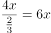岁，则2024年张某的年龄为（6x+4）岁。根据“到2024年时，张某的年龄正好是自己工龄的2倍”，则2024年张某的工龄为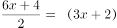岁，张某参加工作时的年龄为6x+4-（3x+2）=（3x+2）岁，根据“年龄差不变”可得，张某参加工作时，两人的年龄差为3x+2-10=3x-8，2020年，两人年龄差为6x-4x=2x，即3x-8=2x，解得x=8。即李某参加工作时的年龄为4x-x=3x=24岁。

故正确答案为C。

---

## 第 6 题　qid 5102117 · 数学运算

小张、小王、小刘、小李和小陈5人随机分配给A、B、C、D四个任务组，要求每组至少分配1人，小张不分配在A组，小李必须分配在C组，且D组只分配1人。那么小张和小王分配在一组的概率为：

- **A**. 不到5%
- **B**. 5%~10%之间　✅
- **C**. 10%~15%之间
- **D**. 超过15%

**答案**：B

**官方解析**

对总的情况数进行分类讨论：

情况一：A组分配2人：因小张不分配在A组，且小李必须分配在C组，则先从其余3人中选2人分配在A组，有种情况；再将剩余2人分配到B组和D组，有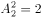种情况，故共有3×2=6种情况。

情况二：A组分配1人：因小张不分配在A组，且小李必须分配在C组，则先从其余3人中选1人分配在A组，有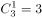种情况；再考虑包括小张在内的3人分配到B组、C组和D组的情况，因D组只分配1人，故需从3人中选出1人分配到D组，共有种情况；剩余2人可以都分到B组，有1种情况，也可以一个人分配到B组一个人分配到C组，有种情况，故共有3×3×（1+2）=27种情况。

故总的情况数为6+27=33种。

根据题意，满足条件的情况即小张和小王只能同时分配在B组，因小李必须分配在C组，则再将小刘和小陈分配到A组和D组，有种情况。故满足条件的情况数为1×1×2=2种。

根据公式：概率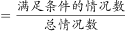，故小张和小王分配在一组的概率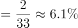，在B项范围内。

故正确答案为B。

---

## 第 7 题　qid 5102028 · 数学运算

某单位有甲、乙、丙三个存放着电脑的库房，已知甲库房比乙库房多4台电脑，乙库房比丙库房多2台，丙库房和甲库房共22台。现在要将三个库房的所有电脑发放给单位不同部门，要求每个部门获得的电脑数量均不相同，那么最多可以发放给几个部门？

- **A**. 6
- **B**. 7　✅
- **C**. 8
- **D**. 9

**答案**：B

**官方解析**

根据题意可列式：甲=乙+4······①，丙=乙-2······②，丙+甲=22······③，联立①②③式，解得乙=10台，则甲+乙+丙=10+22=32台。要将这32台电脑发放给尽可能多的部门，且每个部门获得的电脑数量均不相同，则每个部门获得的电脑数量应从最小值1开始算起，1+2+3+4+5+6+7=28台，还剩32-28=4台，这4台不能再单独发放给1个部门，否则会有重复，故最多可以发放给7个部门。
故正确答案为B。

---

## 第 8 题　qid 5102071 · 数学运算

ABCD四个学校分布在矩形的四个顶点上，小李早上骑自行车从A校出发去D校学习，半个小时后到达D校，学习3个小时后立即由D校去C校，小李离开A校4个小时后妈妈驾车沿ABC的路线去C校接小李，已知小李骑车速度为15千米/小时，妈妈驾车速度为50千米/小时，最终二人同时到达C校。若妈妈11点出发，那么到达C校的时间在以下哪个范围内？

- **A**. 11：25之前
- **B**. 11：25～11：30之间　✅
- **C**. 11：30～11：35之间
- **D**. 11：35之后

**答案**：B

**官方解析**

设妈妈驾车到C校用时为x分钟，因小李离开A校4小时后妈妈出发，且小李在D校学习3小时，最终二人同时到达C校，则小李到C校时的总骑行时间=（4-3）小时+x分钟=（60+x）分钟。又因为ABCD四个学校分布在矩形的四个顶点上，小李从ADC与妈妈从ABC的路程相同，此时速度和时间成反比。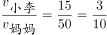 ，则 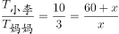，解得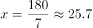分钟。若妈妈11点出发，那么到达C校的时间为11点25.7分，在B项范围内。

故正确答案为B。

---

## 第 9 题　qid 5102398 · 数学运算

一件工作由甲、乙、丙三人完成，若甲、乙合作先干10小时，丙再单干1小时可以完成。已知乙单干用的时间比甲多4小时，丙单干用的时间是甲的还多2小时，问甲单干需多少小时？

- **A**. 20　✅
- **B**. 25
- **C**. 30
- **D**. 35

**答案**：A

**官方解析**

方法一：设甲单干需x小时，则乙单干需（x+4）小时，丙单干需（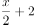）小时。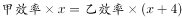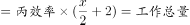，则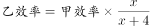······①，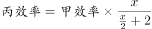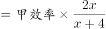······②。又因“若甲、乙合作先干10小时，丙再单干1小时可以完成”，则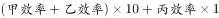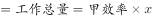······③，将①②代入③，可化简为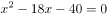，解得x=20或-2。工作时间为正数，则甲单干需20小时。

方法二：结合选项，考虑代入排除法。代入A项，则甲单干需20小时，乙单干需20+4=24小时，丙单干需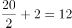小时。赋值工作总量为20、24、12的最小公倍数120，则甲的效率为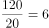，乙的效率为，丙的效率为。又因“若甲、乙合作先干10小时，丙再单干1小时可以完成”，则（6+5）×10+10×1=120，恰好完成工作总量，满足题意。

故正确答案为A。

---

## 第 10 题　qid 5102095 · 数学运算

一个高为10厘米，底面半径为5厘米的圆锥体塑料零件置于水中，底面朝上且与水面平行，其浮出水面部分的高为2厘米。那么当该零件底面朝下且与水面平行置于水中时，浮出水面部分的高在以下哪个范围内？（零件始终不接触水底）

- **A**. 不到6厘米
- **B**. 6～7厘米之间
- **C**. 7～8厘米之间　✅
- **D**. 超过8厘米

**答案**：C

**官方解析**

圆锥体塑料零件的体积V立方厘米。当圆锥体塑料零件底面朝上且与水面平行时，根据立体几何“相似比的立方=体积比”，则水下部分的零件体积为立方厘米。当该零件底面朝下且与水面平行置于水中时，根据圆锥体塑料零件所受浮力不变，即排开水的体积是不变的，则水下部分的零件体积不变，故浮出水面部分圆锥体的体积为立方厘米。设浮出水面部分圆锥体的高为x厘米，根据立体几何“相似比的立方=体积比”，则有，解得。已知，，故浮出水面部分的高在7～8厘米之间。

故正确答案为C。

---

## 第 11 题　qid 5102059 · 数学运算

某学习软件要求用户使用字母和数字组合的8位密码。赵某使用D、E、F、W4个大写字母（不重复使用）和4个不同非零数字的组合作为自己的密码，要求数字放在后四位，且4个数字的乘积须是320的倍数。那么这样的密码有多少种不同的可能？

- **A**. 不到1000种
- **B**. 1000～3000种之间　✅
- **C**. 3000～8000种之间
- **D**. 超过8000种

**答案**：B

**官方解析**

4个不同的非零数字的乘积为320的倍数，而，则这4个不同的非零数字只有两种可能，即（2、4、5、8）和（4、5、6、8）。4个大写字母放在前四位，有种可能，4个数字放在后四位，有种可能，则这样的密码有24×48=1152种可能，在B项范围内。

故正确答案为B。

---
