# 2022年重庆市选调优秀大学生到基层工作考试《行测》题

> 数量关系 · 10 题 · 选调 2022

## 第 1 题　qid 4924238 · 数学运算

A、B两地分别与某个半径150米的圆形池塘边缘相距100米、且AB的连线经过池塘的圆心，张某从A地出发以1米/秒的速度匀速行走。全程除转向1次外均保持直线行进。问他从A地到B地的最短用时在以下哪个范围内？

- **A**. 不到9分30秒
- **B**. 9分30秒~10分之间
- **C**. 10分~10分30秒之间　✅
- **D**. 10分30秒以上

**答案**：C

**官方解析**

如下图所示，张某需从A地绕过池塘（圆O），通过外部路径到达B地。过A点作圆的切线AD、过B点作圆的切线BE，延长AD、BE交于C点，此时（AC＋BC）为外部最短路径。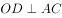，，A、B、C三点连线构成等腰三角形。AO＝100+150=250米，OD为半径150米，根据勾股定理可知，在直角中，米。因与均为直角三角形且为公共角，则，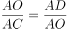，则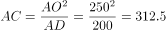米，全程最短为AC+BC=312.5×2=625米，用时为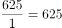秒＝10分25秒，在C项范围内。

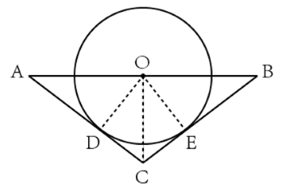

故正确答案为C。

---

## 第 2 题　qid 4924215 · 数学运算

甲和乙两种商品的年货礼盒售价分别为400元/盒和500元/盒，每个礼盒中包含5千克甲商品或3千克乙商品，甲和乙的成本分别为50元/千克和90元/千克。某日商场销售两种礼盒共56盒，总销售额为24600元。问当日甲礼盒的销售利润比乙礼盒：

- **A**. 高不到500元　✅
- **B**. 高500元以上
- **C**. 低不到500元
- **D**. 低500元以上

**答案**：A

**官方解析**

根据题意可列表如下：

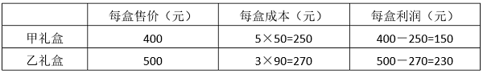

假设当日售出甲礼盒a个，乙礼盒b个。因“销售两种礼盒共56盒，总销售额为24600元”，则a＋b=56······①，400a＋500b=24600······②，联立解得a=34，b=22。则当日甲礼盒的销售利润为34×150=5100元，乙礼盒的销售利润为22×230=5060元，甲礼盒的销售利润比乙礼盒高5100-5060＝40元，在A项范围内。

故正确答案为A。

---

## 第 3 题　qid 4924219 · 数学运算

街道现有一笔预算用于为防疫志愿者购买防护服，如每人购买3套则剩余1720元；如每人购买5套则还需额外的680元预算。最终街道为每人购买4套防护服，剩余资金为每人购买13元/包的消毒湿巾2包，问街道防疫志愿者有多少人？

- **A**. 16
- **B**. 20　✅
- **C**. 24
- **D**. 26

**答案**：B

**官方解析**

设街道防疫志愿者有x人，购买每套防护服需y元。由题意可知：预算金额=3xy+1720=5xy-680，整理可得xy=1200，则预算金额为5320元；又因为“最终街道为每人购买4套防护服，剩余资金为每人购买13元/包的消毒湿巾2包”，则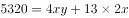，解得x=20。

故正确答案为B。

---

## 第 4 题　qid 4924247 · 数学运算

一个项目由甲、乙、丙三家企业共同参与，其中甲和乙出的人力分别占项目总人力的75%和25%，乙和丙出的资金分别占项目总投资的40%和60%。如果将人力和出资金额按一定比例分配利润，则甲分配的利润是乙的1.5倍。问丙分配的利润为项目总利润的：

- **A**. 

- **B**. 
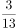
　✅
- **C**. 
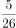

- **D**. 

**答案**：B

**官方解析**

根据题意，设该项目总人力为4X，则甲出的人力为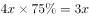，乙出的人力为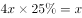；该项目总投资为5Y，则乙出的资金为5Y×40%=2Y，丙出的资金为5Y×60%=3Y。因“将人力和出资金额按一定比例分配利润”，则每家企业付出的人力和出资金额与分配的利润成正比。根据“甲分配的利润是乙的 1.5倍”，可得3X=1.5（X+2Y），解得X=2Y。丙分配的利润占项目总利润的比例为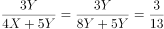。

故正确答案为B。

---

## 第 5 题　qid 4924233 · 数学运算

甲、乙两个工厂共同完成某项生产任务，如同时开工，需要25天完成。但实际上甲工厂开工1天后停工5天升级生产设备，升级后的效率比开始时提升了50%，结果提前1天完成。问开工时甲工厂的效率是乙工厂的：

- **A**. 
2倍

- **B**. 
3倍

- **C**. 

- **D**. 

　✅

**答案**：D

**官方解析**

设甲工厂升级前每天的效率为x，乙工厂每天的效率为1，则升级后甲工厂每天的效率为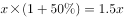。在实际工作过程中，甲工厂升级前工作了1天，升级后工作了25-1-1-5=18天，乙工厂工作了25-1=24天。根据工作总量不变，可得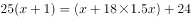，解得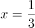，则开工时甲工厂的效率是乙工厂的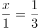。

故正确答案为D。

---

## 第 6 题　qid 4924252 · 数学运算

现有12个外观相同的包装盒，其中4个包装盒内各有3个苹果，4个包装盒内各有4个苹果，4个包装盒内各有5个苹果，现从中随机选出3个包装盒，问其中的苹果正好可以平均分给5人的概率在以下哪个范围内？

- **A**. 不到10%
- **B**. 10%-15%之间　✅
- **C**. 15%-20%之间
- **D**. 超过20%

**答案**：B

**官方解析**

总情况为在12个包装盒中选出3个，情况数为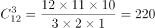种。满足条件的情况为包装盒中的苹果正好可以平均分给5人，即苹果总数应为5的整数倍，可能为10、15。当苹果总数为10个时，应选择2个有3个苹果的包装盒、1个有4个苹果的包装盒，情况数为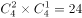种；当苹果总数为15个时，应选择3个有5个苹果的包装盒，情况数为种，则共有24+4=28种满足条件的情况数，所求概率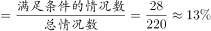，在B项范围内。

故正确答案为B。

---

## 第 7 题　qid 4924259 · 数学运算

企业将新招聘的张、王、刘、李、陈、何、榜和延8名应届生分配到甲、乙、丙三个分公司。要求每个分公司最多分配3人，张、王二人必须分配到同一个分公司，刘、李、陈三人必须分配到三个不同的分公司，何分配到的分公司不能是人数最多的，问有多少种不同的分配方式?

- **A**. 36　✅
- **B**. 72
- **C**. 144
- **D**. 432

**答案**：A

**官方解析**

根据题干，刘、李、陈三人必须分配到三个不同的分公司，情况数为。因8名应届生分配到三个分公司且每个分公司最多分配3人，则除刘、李、陈三人外，三个分公司分得的人员组合情况为（1，2，2）。又因何分配到的分公司不能是人数最多的，且张、王二人必须分配到同一个分公司，则榜、延二人分配到同一个分公司，即组合情况为（何，张+王，榜+延），分配到三个分公司，情况数为。则不同的分配方式有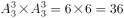种。

故正确答案为A。

---

## 第 8 题　qid 4924242 · 数学运算

一块长方形田地ABCD如下图所示，已知AB：BC=6：5，AE：EB=1：2，AI：ID=3：2，G和F则是另两边中点，现要在图中灰色部分种植作物A，问作物A的种植面积占该田地总面积的：

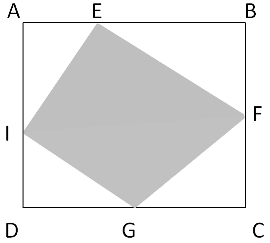

- **A**. 不到45%
- **B**. 45%-50%之间
- **C**. 50%-55%之间　✅
- **D**. 55%以上

**答案**：C

**官方解析**

赋值AB=CD=12，BC=AD=10，因AE：EB=1：2，则AE=4，EB=8；AI：ID=3：2，则AI=6，ID=4；F和G分别是BC和CD中点，则BF=CF=5，CG=GD=6。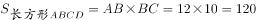，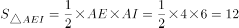，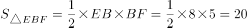，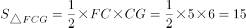，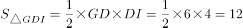。作物A的种植面积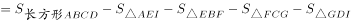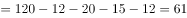，占该田地总面积的比重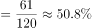，在C项范围内。

故正确答案为C。

---

## 第 9 题　qid 4924245 · 数学运算

某种产品的生产成本中，80%为原材料成本和人工成本，其余为其他成本。已知如人工成本上涨20%，原材料成本下降12%，总成本保持不变。问如其他成本上涨20%，人工成本上涨10%，原材料成本至少要下降多少才能保证成本不变？

- **A**. 10%
- **B**. 12%
- **C**. 12.5%
- **D**. 14%　✅

**答案**：D

**官方解析**

假设生产1件该产品的人工成本为x，原材料成本为y。若人工成本上涨20%，原材料成本下降12%，总成本保持不变，即20%x=12%y，解得x：y=3：5。赋值x=3，y=5，则1件该产品的生产成本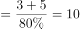，其他成本=10-3-5=2。若其他成本上涨20%，人工成本上涨10%，在保证生产成本不变的情况下，此时原材料成本=10-2×（1+20%）-3×（1+10%）=10-2.4-3.3=4.3，下降了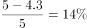。

故正确答案为D。

---

## 第 10 题　qid 4924264 · 数学运算

某单位招标信息化建设项目，预算为400万元。甲、乙、丙、丁4家投标企业的平均报价为预算金额的95%，已知只有甲企业的报价超过预算金额，任意2家企业的报价相差均不少于10万元且不多于100万元。问甲企业的报价最高可能为多少万元？

- **A**. 440
- **B**. 442.5
- **C**. 445
- **D**. 447.5　✅

**答案**：D

**官方解析**

根据题意，4家企业报价之和为4×400×95%=1520万元。要想甲企业的报价尽可能高，则其他企业的报价应尽可能低。假设甲企业的报价为x万元，因任意2家企业的报价相差均不少于10万元且不多于100万元，则另外三家企业最低的报价依次为x-80、x-90、x-100万元。x+（x-80）+（x-90）+（x-100）=1520，解得x=447.5，即甲企业的报价最高可能为447.5万元。
故正确答案为D。

---
