# 2022年青海省公务员录用考试《行测》题（网友回忆版）

> 数量关系 · 10 题 · 青海 2022

## 第 1 题　qid 4817956 · 数学运算

2021年7月1日是中国共产党建党100周年的纪念日，这一天是星期四，那么建党110周年纪念日是：

- **A**. 星期一
- **B**. 星期二　✅
- **C**. 星期三
- **D**. 星期四

**答案**：B

**官方解析**

由题干可知，建党110周年纪念日为2031年7月1日，从2021年7月1日到2031年7月1日经过10年，其中有2024年、2028年两个闰年，则一共经过了365×8+366×2=3652天。因为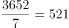周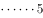天，即过了521周往后推5天。由于2021年7月1日为星期四，则往后推5天为星期二。

故正确答案为B。

---

## 第 2 题　qid 4817960 · 数学运算

某市对下辖9个文艺表演团体去年新创节目的数量进行统计分析，发现9个团体新创节目的数量恰好成等差数列，其中前5个团体的新创节目总数是60，前7个团体的新创节目总数是70。那么这9个文艺表演团体去年新创节目的总数是：

- **A**. 72　✅
- **B**. 76
- **C**. 78
- **D**. 80

**答案**：A

**官方解析**

方法一：根据等差数列求和公式：，可得前5个团体的新创节目的中位数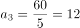，前7个团体的新创节目的中位数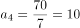，该等差数列的公差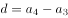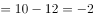。因此这9个文艺表演团体去年新创节目的总数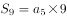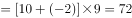。

方法二：根据题意可知，9个团体新创节目的数量恰好成等差数列。根据等差数列求和公式：，则，即9个文艺表演团体去年新创节目的总数为9的倍数，只有A项符合。

故正确答案为A。

---

## 第 3 题　qid 4817965 · 数学运算

某市举办世界遗产大会，开幕式会场需要从6组志愿者中选出4组分别从事防疫协助、嘉宾引导、英语翻译、物资发放四项不同的工作，其中甲、乙组不能从事英语翻译工作，丙组只能从事防疫协助工作，则派选方案有：

- **A**. 36种
- **B**. 72种
- **C**. 108种　✅
- **D**. 144种

**答案**：C

**官方解析**

假设这6组为甲、乙、丙、丁、戊、己，根据题意，可分类讨论：

①选出的4组中有丙：丙只能从事防疫协助工作，英语翻译工作从丁、戊、己中选一组，有种情况，嘉宾引导和物资发放从剩余4组中选2组去做，有种情况，则有3×12=36种情况；

②选出的4组中无丙：英语翻译工作从丁、戊、己中选一组，有种情况，防疫协助、嘉宾引导、物资发放从剩余4组中选3组去做，有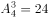种情况，则有3×24=72种情况。

分类用加法，则共有36+72=108种派选方案。

故正确答案为C。

---

## 第 4 题　qid 4817967 · 数学运算

为了解决环卫、市政、绿化等户外作业人员吃饭难、休息难的问题。某城市设置了若干个城管驿站。如果每个城管驿站服务80人，那么有1080名户外作业人员无法得到服务；如果每个城管驿站服务100人，那么就有四个驿站空置。若要满足全部需求，则每个城管驿站至少要服务多少人？

- **A**. 93
- **B**. 94
- **C**. 95　✅
- **D**. 96

**答案**：C

**官方解析**

设该城市共有n个城管驿站，根据题意可列方程：80n+1080=100×（n-4），解得n=74，则户外作业人员有100×（74-4）=7000名。要想满足每个城管驿站服务的人尽量少，则所有户外作业人员尽量均分，设每个城管驿站至少要服务x人，则74x=7000，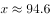，则每个城管驿站至少要服务95人。

故正确答案为C。

---

## 第 5 题　qid 4817964 · 数学运算

小张、小林与小王加入合作社种植水蜜桃和李子，收获的水果由合作社统一销售。今年小张收获了4000斤桃子与2000斤李子，小林收获了3000斤桃子与3000斤李子。合作社给小张结算了17200元，给小林结算了15300元。能干的小王收获了10000斤桃子，8000斤李子，他将从合作社中获得多少收入？

- **A**. 50000元
- **B**. 47800元　✅
- **C**. 32500元
- **D**. 31600元

**答案**：B

**官方解析**

设合作社销售桃子每斤x元，李子每斤y元。根据题意可列方程组：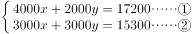。

方法一：解得：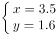，则小王获得的收入为10000x+8000y=10000×3.5+8000×1.6=47800元。

方法二：观察发现，①+2×②=10000x+8000y=小王获得的收入，即小王获得的收入为17200+2×15300=47800元。

故正确答案为B。

---

## 第 6 题　qid 4817966 · 数学运算

张师傅从事自行车、电动车、摩托车三种类型的车辆维修工作，每辆维修工时费分别为3元、6元和9元。若张师傅某时段维修工时费共收入15元，那么该时段张师傅维修车辆类型及相应数量的情况有：

- **A**. 4种
- **B**. 5种　✅
- **C**. 6种
- **D**. 7种

**答案**：B

**官方解析**

该时段张师傅维修车辆类型及相应数量的情况数较少，考虑枚举法。根据题意，具体情况如下：

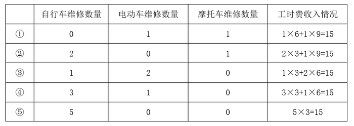

综上可知，该时段张师傅维修车辆类型及相应数量的情况有5种。

故正确答案为B。

---

## 第 7 题　qid 4817971 · 数学运算

某单位拟于下周周一至周六期间举办“人人学党史，人人讲党史”和“我为群众办实事”实践活动，每个活动均需连续开展两天，那么这两个活动的时间完全不重叠的概率为：

- **A**. 40%
- **B**. 48%　✅
- **C**. 52%
- **D**. 60%

**答案**：B

**官方解析**

每个活动均需连续开展两天，则每个活动可选择的举办时间有（周一、周二）、（周二、周三）、（周三、周四）、（周四、周五）、（周五、周六），共5种情况，两个活动的举办时间共有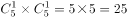种情况。若想两个活动时间完全不重叠，可有以下3种情况：

①其中一个活动选择（周一、周二），另一个活动可选择（周三、周四）、（周四、周五）或（周五、周六），情况数为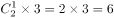种；

②其中一个活动选择（周二、周三），另一个活动可选择（周四、周五）或（周五、周六），情况数为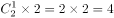种；

③其中一个活动选择（周三、周四），另一个活动可选择（周五、周六），情况数为种。

满足条件的情况数为6+4+2=12种，则所求概率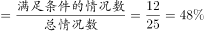。

故正确答案为B。

---

## 第 8 题　qid 4817986 · 数学运算

某调研小组共有5人，需分配到3个不同的厂区进行调研工作，那么每个厂区至少分到一人的概率为：

- **A**. 
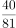

- **B**. 
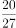

- **C**. 
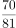

- **D**. 
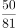
　✅

**答案**：D

**官方解析**

总情况数为5人分到3个不同的厂区调研工作，则每个人有3种选择，共有种方式。符合条件情况数为5人分到3个不同的厂区，每个厂区至少1人，则3个厂区的人数分别为1、2、2或者1、1、3。当3个厂区的人数为1、2、2时，则有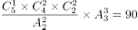种；当3个厂区的人数为1、1、3时，则有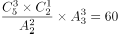种，共有90+60=150种方式。所求概率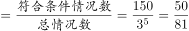。

故正确答案为D。

---

## 第 9 题　qid 4817939 · 数学运算

某图书馆为增加室内采光，在墙上新增一扇窗户（如下图所示）上半部分是个半圆，下半部分是个矩形。窗框用铝合金材料制作，材料总长度为27米（图中黑色线部分均为铝合金材料，铝合金宽度忽略不计，取3）。那么该窗户的最大面积为：

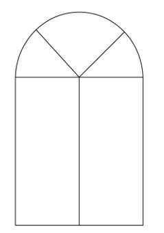

- **A**. 12平方米
- **B**. 15.75平方米
- **C**. 16.25平方米
- **D**. 18平方米　✅

**答案**：D

**官方解析**

如图所示，设窗户上半部分半圆半径为r米，下半部分矩形高度为a米。由题意得，材料总长度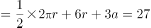米，将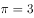代入，即3r+6r+3a=27，整理可得a=9-3r。窗户面积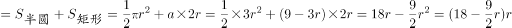平方米。根据两点式，令窗户面积为0，即分别令r=0和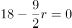，解得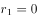，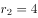。则当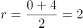时，窗户面积取得最大值。因此，该窗户的最大面积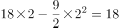平方米。

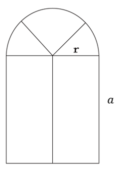

故正确答案为D。

---

## 第 10 题　qid 4817946 · 数学运算

某疫苗共需接种2剂次方可达到最佳效果。A市的接种人数占比统计如下图所示，其中，区域“0”表示尚未接种，区域“1”表示只接种1剂次，区域“2”表示已接种2剂次。假设ABC是四分之一圆面，D、E是中点，BDFE是正方形，则该市某疫苗只接种1剂次的人数占比：

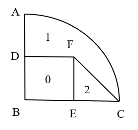

- **A**. 超过40%但不到50%
- **B**. 刚好50%
- **C**. 超过50%但不到60%　✅
- **D**. 超过60%

**答案**：C

**官方解析**

赋值圆的半径为2，则BD=BE=EF=EC=1，扇形ABC的面积为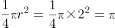，正方形BDFE的面积为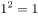，三角形EFC的面积为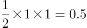，因此只接种1剂次所占面积=扇形ABC的面积-正方形BDFE的面积-三角形EFC的面积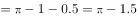，所以只接种1剂次的人数占比为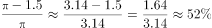，即超过50%但不到60%。

故正确答案为C。

---
