# 2023年上海市公务员录用考试《行测》题（A类）（网友回忆版）

> 数量关系 · 25 题 · 上海 2023

## 材料 1

        独角兽公司是投资界术语，一般指成立不超过10年，估值超过10亿美元，少部分估值超过100亿美元的企业，其不仅是优质和市场潜力无限的绩优股，而且商业模式很难被复制。

### 第 1 题　qid 5423830 · 数学运算

2021年我国独角兽企业数量比2018年增长了约        。

- **A**. 200%
- **B**. 150%
- **C**. 100%
- **D**. 50%　✅

**答案**：D

**官方解析**

根据题干“2021年······比2018年增长了约······”，结合选项为百分数，可判定本题为一般增长率问题。定位表格材料可得：2018年我国独角兽企业各类估值的企业数量分别为145、32、13、13家，2021年各类估值的企业数量分别为221、48、17、15家。根据公式：增长率，则所求增长率，与D项最接近。

故正确答案为D。

---

### 第 2 题　qid 5423833 · 数学运算

2021年在我国独角兽企业中随机抽一家，该企业恰好属于估值在100亿美元及以上的可能性大约为        。

- **A**. 5%　✅
- **B**. 6%
- **C**. 8%
- **D**. 16%

**答案**：A

**官方解析**

根据题干“2021年在······中······的可能性大约为”，结合选项为百分数，可判定本题为现期比重问题。定位表格材料可得：2021年我国独角兽企业数量分布为10-30亿美元（含10）221家、30-50亿美元（含30）48家、50-100亿美元（含50）17家、100亿美元以上（含100）15家。2021年我国独角兽企业共有221+48+17+15=301家，根据公式：比重，则所求为。

故正确答案为A。

---

### 第 3 题　qid 5423836 · 数学运算

2018年如果想调查我国独角兽企业的经营状况，至少要抽取        家公司才能保证至少有一家公司估值不低于50亿美元。

- **A**. 27
- **B**. 59
- **C**. 178　✅
- **D**. 191

**答案**：C

**官方解析**

定位表格材料可得：2018年我国独角兽企业估值10-30亿美元（含10）的企业数量有145家、30-50亿美元（含30）的企业数量有32家。考虑最不利情况为抽取了145+32=177家公司，其企业估值均在50亿美元以下，在此基础上再抽取1家公司，即可保证至少有一家公司估值不低于50亿美元，因此至少要抽取177+1=178家公司。
故正确答案为C。

---

### 第 4 题　qid 5423838 · 数学运算

2021年，我国估值在100亿美元及以上的独角兽企业15家合计估值为7280亿美元，占据全部独角兽企业估值的54.03%。若2021年我国独角兽企业市场总估值较2018年增长了32.21%，则2018年我国独角兽企业市场总估值约为        亿美元。

- **A**. 22750
- **B**. 13474
- **C**. 12630
- **D**. 10191　✅

**答案**：D

**官方解析**

根据题干“2021年······则2018年······亿美元”，结合题干给出100亿美元及以上的独角兽企业15家合计估值以及该估值占全部独角兽企业估值的比重和2021年我国独角兽企业市场总估值较2018年的增长率，可判定本题为基期计算问题。由题干可知，2021年我国估值在100亿美元及以上的独角兽企业15家合计估值为7280亿美元，占据全部独角兽企业估值的54.03%。根据公式：整体，则2021年我国全部独角兽企业估值为亿美元。又由题干可知，2021年我国独角兽企业市场总估值较2018年增长了32.21%。根据公式：基期量，则2018年我国独角兽企业市场总估值亿美元，与D项最接近。

故正确答案为D。

---

## 材料 2

### 第 5 题　qid 5423811 · 数学运算

2020年，江浙沪地区年人均教育文化娱乐支出在年人均消费支出中的占比约为        。

- **A**. 5%
- **B**. 7%
- **C**. 9%　✅
- **D**. 15%

**答案**：C

**官方解析**

根据题干“2020年······在······中的占比约为”，可判定本题为现期比重问题。定位图1可得：2020年江浙沪地区年人均教育文化娱乐支出和年人均消费支出分别为3380元和37303元。根据公式：比重，则2020年，江浙沪地区年人均教育文化娱乐支出在年人均消费支出中的占比。

故正确答案为C。

---

### 第 6 题　qid 5423816 · 数学运算

以下年份中，江浙沪地区年人均消费支出年增长额最多的是        。

- **A**. 2015年
- **B**. 2017年
- **C**. 2018年　✅
- **D**. 2019年

**答案**：C

**官方解析**

根据题干“······年增长额最多的是”，可判定本题为增长量比较问题。定位图1可得：2014-2019年江浙沪地区年人均消费支出分别为28633、30191、32119、33985、36692、39036元。根据公式：增长量=现期量-基期量，可得2015年人均消费支出年增长额=30191-28633=元；2017年年增长额=33985-32119=元；2018年年增长额=36692-33985=元；2019年年增长额=39036-36692=元。比较可知，2018年江浙沪地区年人均消费支出年增长额最多。

故正确答案为C。

---

### 第 7 题　qid 5423837 · 数学运算

若以上海、苏州、南京和温州这四个城市的教育文化娱乐市场为总体，假定各城市2021年人均教育文化娱乐支出都为3380元，那么下图中        最可能展示了这四个城市2021年教育文化娱乐市场规模的占比情况。

- **A**. 
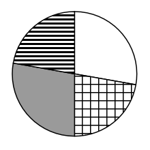

- **B**. 
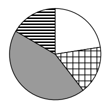
　✅
- **C**. 
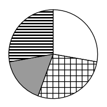

- **D**. 
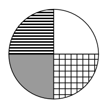

**答案**：B

**官方解析**

根据题干“······四个城市2021年教育文化娱乐市场规模的占比情况”，可判定本题为现期比重问题。定位图2可得：2021年上海、苏州、南京和温州常住人口数分别为2489.43万、1279.8万、942.3万、964.5万。由于教育文化娱乐市场规模=人均教育文化娱乐支出×常住人口数，且2021年这四个城市的人均教育文化娱乐支出相同（均为3380元），则上海、苏州、南京和温州这四个城市的教育文化娱乐市场规模的占比就是它们的常住人口数的占比。根据公式：比重，上海的占比最大，其占比为，接近饼图的一半，只有B项符合。

故正确答案为B。

注：本题与公考常考的默认顺序不同，若按照“从 12 点钟方向，依次顺时针排列”这一默认顺序来排列，本题无正确答案。

---

## 材料 3

        2022年2月，“东数西算”工程正式全面启动。云计算在“东数西算”产业链中游占据重要位置。2020年上半年和2021年上半年，中国整体云服务市场规模分别为1171亿元和1620亿元，其三个细分领域市场IaaS（基础设施即服务）、PaaS（平台即服务）和SaaS（软件即服务）的规模如下表1。

        在中国整体云服务市场中，2020年上半年和2021年上半年，公有云市场规模分别为830亿元和1235亿元。在公有云市场份额方面，阿里云、华为云、腾讯云位列2021年上半年中国IaaS公有云市场和中国IaaS+PaaS公有云市场前三名，具体占比如下表2。

### 第 8 题　qid 5423857 · 数学运算

在IaaS+PaaS公有云市场中，前三大运营商2021年上半年市场占比总和位于            区间。

- **A**. [60%，61%）
- **B**. [61%，62%）
- **C**. [62%，63%）
- **D**. [63%，64%）　✅

**答案**：D

**官方解析**

定位表2可得：2021年上半年，阿里云、华为云、腾讯云前三大运营商在IaaS+PaaS公有云市场中的占比分别为37.4%、13.5%、12.4%。则所求占比总和=37.4%+13.5%+12.4%=63.3%，在D项范围内。
故正确答案为D。

---

### 第 9 题　qid 5423864 · 数学运算

在2021年上半年PaaS公有云市场中，相对于腾讯云的市场份额，阿里云的市场份额                    。

- **A**. 更小
- **B**. 持平
- **C**. 更大
- **D**. 资料不足，无法判断　✅

**答案**：D

**官方解析**

根据题干“在2021年上半年PaaS公有云市场中······腾讯云······阿里云的市场份额”，而市场份额又称市场占有率（即比重），可判定本题为现期比重问题。定位统计表2可得：在2021年上半年，IaaS公有云市场中，阿里云、腾讯云的市场份额分别为38.7%、12.4%；IaaS+PaaS公有云市场中，阿里云、腾讯云的市场份额分别为37.4%、12.4%。

方法一：根据公式：部分=整体×比重，可得2021年上半年，阿里云PaaS公有云市场规模=IaaS+PaaS公有云市场规模×37.4%-IaaS公有云市场规模×38.7%，由于材料并未给出2021年上半年IaaS+PaaS公有云市场规模、IaaS公有云市场规模，因此无法推出阿里云PaaS公有云市场规模；同理，腾讯云的对应市场规模亦无法推出，故无法判断腾讯云和阿里云市场份额的大小关系。

方法二：由于IaaS+PaaS公有云市场规模=IaaS公有云市场规模＋PaaS公有云市场规模，则运营商的IaaS+PaaS公有云市场份额（比重）为混合比重，根据混合比重口诀“混合居中但不正中”，可得PaaS公有云市场中，阿里云占比&lt;37.4%，腾讯云占比=12.4%。但材料并未给出2021年上半年IaaS+PaaS、IaaS公有云市场规模的相关数据，因此无法进一步判断阿里云占比与腾讯云占比（12.4%）的大小关系。

故正确答案为D。

备注：材料中表2的运营商的公有云市场份额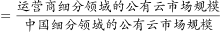，此比重的部分和整体都是“公有云市场规模”的相关数据，根据实际统计规则和文字材料第二段“在公有云市场份额方面，阿里云、华为云、腾讯云位列······具体占比如下表2”，都可以证实。

但有某观点认为“阿里云IaaS公有云市场份额（38.7%）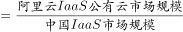，阿里云IaaS+PaaS公有云市场份额（37.4%）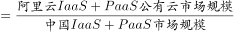，从而计算阿里云PaaS公有云市场规模=1620×（59.4%+17.7%）×37.4%-1620×59.4%×38.7%；腾讯云PaaS公有云市场规模=1620×（59.4%+17.7%）×12.4%-1620×59.4%×12.4%，进而判断阿里云市场份额&gt;腾讯云市场份额，选C。”小粉笔认为这种理解是偏颇的，故小粉笔倾向于本题正确答案为D。

---

### 第 10 题　qid 5423868 · 数学运算

2021年上半年，前三大运营商在IaaS+PaaS公有云市场中的份额差最大值为        。

- **A**. 1.1%
- **B**. 23.9%
- **C**. 25.0%　✅
- **D**. 26.5%

**答案**：C

**官方解析**

定位表2可得，2021年上半年，前三大运营商在IaaS+PaaS公有云市场中的份额最大为阿里云37.4%，最小为腾讯云12.4%，故份额差最大值为37.4%-12.4%=25.0%。
故正确答案为C。

---

### 第 11 题　qid 5423873 · 数学运算

根据资料，下列说法错误的是                    。

- **A**. 2021年上半年，我国整体云服务市场同比增长率超过30%
- **B**. 2021年上半年，阿里云在IaaS和IaaS+PaaS两个公有云市场都占据龙头地位
- **C**. 2021年上半年，公有云市场规模约占我国整体云服务市场规模的76.2%
- **D**. 2021年上半年，非公有云市场规模同比增量高于50亿元　✅

**答案**：D

**官方解析**

A项：定位文字材料第一段，2020年上半年和2021年上半年，中国整体云服务市场规模分别为1171亿元和1620亿元。根据公式：增长率，可得2021年上半年，我国整体云服务市场同比增长率，正确；

B项：定位表2，可知2021年上半年，阿里云在IaaS和IaaS+PaaS两个公有云市场份额分别为38.7%和37.4%，均排名第一，故阿里云都占据龙头地位，正确；

C项：定位文字材料第一段，2021年上半年，中国整体云服务市场规模为1620亿元；定位文字材料第二段，2021年上半年，公有云市场规模为1235亿元。根据公式：比重，可得2021年上半年，公有云市场规模占我国整体云服务市场规模的比重为，正确；

D项：定位文字材料第一段，2020年上半年和2021年上半年，中国整体云服务市场规模分别为1171亿元和1620亿元；定位文字材料第二段，2020年上半年和2021年上半年，公有云市场规模分别为830亿元和1235亿元。根据非公有云市场规模=中国整体云服务市场规模-公有云市场规模，可得：2021年上半年，非公有云市场规模为1620-1235=385亿元；2020年上半年，非公有云市场规模为1171-830=341亿元。根据公式：增长量=现期量-基期量，可得2021年上半年，非公有云市场规模同比增量为385-341=44亿元&lt;50亿元，错误。

本题为选非题，故正确答案为D。

---

### 第 12 题　qid 5423718 · 数学运算

根据数表中的规律，“？”处应填<u>        </u>。

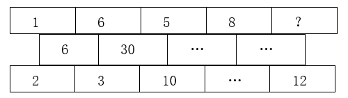

- **A**. 5
- **B**. 6　✅
- **C**. 7
- **D**. 8

**答案**：B

**官方解析**

题干出现图形，判定为图形数阵。观察图形，可发现：1×6=6=2×3，6×5=30=3×10，即规律为：第一行相邻两数的乘积=第二行的数=第三行相邻两数的乘积。根据规律可知：5×8=第二行的第三项=10×第三行的第四项，则第二行的第三项为40，第三行的第四项为。同理：8×？=第二行的第四项=4×12，则第二行的第四项为48，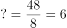。

故正确答案为B。

---

### 第 13 题　qid 5423746 · 数学运算

数列：1，，2，，，3，，，，4，（    ）

- **A**. 

- **B**. 

- **C**. 

- **D**. 

　✅

**答案**：D

**官方解析**

数列大部分为分数，考虑分数数列。原数列可转化为：，，，，，，，，，，（    ）。观察发现，分母数值与以其为分母的分数个数相同，则将数列分组为：{，}，{，，}，{，，，}，{，（    ），······}，每组的分子均为连续自然数，故所求项为。

故正确答案为D。

---

### 第 14 题　qid 5423755 · 数学运算

数列：12，42，48，69，831，（    ）

- **A**. 945
- **B**. 1659
- **C**. 2023
- **D**. 2661　✅

**答案**：D

**官方解析**

观察发现：12×2=24，其倒序数（即数字从后往前看形成的数）为42；42×2=84，其倒序数为48；48×2=96，其倒序数为69；69×2=138，其倒序数为831，故规律为：第一项×2=第二项的倒序数。因此，所求项应为831×2=1662的倒序数，即2661。
故正确答案为D。

---

### 第 15 题　qid 5423757 · 数学运算

数列：（3，5），（5，7），（11，13），（17，19），（29，31），（    ）

- **A**. （41，43）　✅
- **B**. （57，59）
- **C**. （61，65）
- **D**. （71，73）

**答案**：A

**官方解析**

数列各项均两两分组，考虑多重数列。观察发现，题干各项均为质数，且每个括号内均是差值为2的两个连续质数。根据连续质数列2、3、5、7、11、13、17、19、（23）、29、31、（37）、41、43······可知（29，31）之后的两个差值为2的连续质数为（41，43）。
故正确答案为A。

---

### 第 16 题　qid 5423694 · 数学运算

根据下列数字关系，“?”中的数字不可能是<u>        </u>。

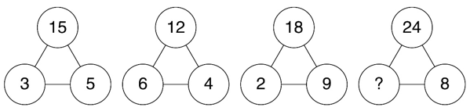

- **A**. 3
- **B**. 6
- **C**. 9　✅
- **D**. 12

**答案**：C

**官方解析**

观察题干发现，各数阵之间无法形成统一的递推规律，考虑数字特性。分析可得，3与5均为15的约数，6与4均为12的约数，2与9均为18的约数，即在每个数阵中，下面两个数字均为上面数字的约数。按此规律，选项中只有C项9不是24的约数，C项当选。
故正确答案为C。

---

### 第 17 题　qid 5423727 · 数学运算

小李父子俩佩戴智能手表跑步锻炼，同时从小区门口出发，绕小区一圈后又同时到达小区门口，手表给出如下锻炼“时间—配速”图线。根据图线分析，在<u>        </u>，小李的跑动距离与父亲相同。

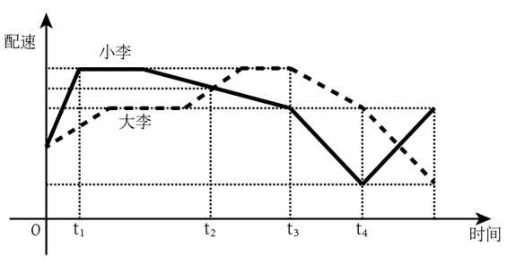

- **A**. 
时刻

- **B**. 
时刻

- **C**. 
时刻

- **D**. 
时刻
　✅

**答案**：D

**官方解析**

假设小李父子在时刻到达小区门口。分析图线可知，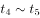时刻小李父子均为匀变速运动，且小李的初速度与父亲的末速度相同，小李的末速度与父亲的初速度相同。根据匀变速运动距离公式：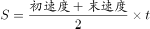，可知时刻小李父子的跑动距离相等。又因为小李父子同时到达小区门口，则在时刻小李的跑动距离与父亲相同。

故正确答案为D。

注：在时间—配速图线中，可用图线与坐标轴所围成图形的面积表示移动距离。

---

### 第 18 题　qid 5423752 · 数学运算

某班有48位同学，教室里有6排，每排8个座位。若在每个周一早上班里同学按照如下要求换座位：①第一排同学换到最后一排，其他每排同学向前换一排；②最左边一列的同学换到最右边一列，其他每列同学向左换一列。那么坐在第一排最左边的同学经过        后首次回到第一排最左边。

- **A**. 12周
- **B**. 24周　✅
- **C**. 36周
- **D**. 48周

**答案**：B

**官方解析**

根据题意可得：第一排的同学6周循环一次重回第一排；最左边一列的同学8周循环一次重回最左边一列。若要满足题意，需同时符合两种周期循环，6和8的最小公倍数为24，故坐在第一排最左边的同学经过24周后首次回到第一排最左边。
故正确答案为B。

---

### 第 19 题　qid 5423775 · 数学运算

某超市设有10个人工收银台。周末10个收银台全开，顾客结账平均排队20分钟。为提高效率，超市撤了4个人工收银台，并改造为6个自助收银台。若自助收银的效率是人工收银效率的90%。改造后，周末当人工收银台和自助收银台全开，预计顾客结账平均排队耗时约为        。

- **A**. 12分钟
- **B**. 14分钟
- **C**. 16分钟
- **D**. 18分钟　✅

**答案**：D

**官方解析**

根据题意，假设每个人工收银台的效率为1，则每个自助收银台的效率为1×90%=0.9。改造前后结账效率之比为（10×1）：（6×1+6×0.9）=50：57，则改造前后顾客结账平均排队时间之比为57：50。已知改造前顾客结账平均排队20分钟，则改造后预计顾客结账平均排队耗时为分钟，约为18分钟。

故正确答案为D。

---

### 第 20 题　qid 5423788 · 数学运算

在一个坡面角约为的山坡上有一个泉眼，从泉眼开挖一条正对山脚向下到山脚的灌溉水渠。已知泉眼距地面的垂直高度约为100米，开挖水渠每米的土方量约为0.3立方米，则开挖整条水渠的土方量约为<u>            </u>。（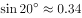，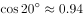，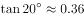）

- **A**. 10立方米
- **B**. 32立方米
- **C**. 88立方米　✅
- **D**. 980立方米

**答案**：C

**官方解析**

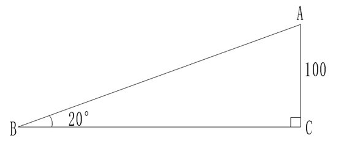

根据题意，如上图所示，，已知泉眼距地面的垂直高度约为100米，即，且AC=100米。因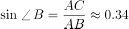，则从泉眼开挖一条正对山脚向下到山脚的灌溉水渠米，故开挖整条水渠的土方量约为立方米。

故正确答案为C。

---

### 第 21 题　qid 5423795 · 数学运算

足球比赛在每个半场结束时都有一段时间的伤停补时，这是由当值主裁判决定的。某场比赛的主裁判确定伤停补时的规则为：每次处理受伤增加30秒，每次换人增加20秒，其他情况每次增加10秒。在下半场即将结束时，主裁判确定伤停补时的时长为4分30秒。若已知下半场比赛时间内，处理受伤、换人和其他情况都存在且共计有10次，那么下半场两队总共换了    人。

- **A**. 1　✅
- **B**. 2
- **C**. 3
- **D**. 4

**答案**：A

**官方解析**

设下半场两队共处理受伤a次、换人b次、其他情况c次。根据题意可列方程组：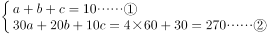，

②-①×10可得2a+b=17。根据奇偶特性，b为奇数，排除B、D两项；代入A项，解得a=8，c=1，满足题意，当选；代入C项，解得a=7，c=0，不满足题意，排除。

故正确答案为A。

---

### 第 22 题　qid 5423797 · 数学运算

某公司生产A、B两种产品，其中B是A的升级产品。经过调研，预判2022年市场对A产品的需求比2021年下降30%（A产品的价格不变）。因此公司决定增加对B产品营销，使B产品在2022年的销售收入比2021年增长70%，这样恰好使公司2022年的总销售收入比2021年增长10%。则2021年B产品的销售额占总销售额的比例是    。

- **A**. 40%　✅
- **B**. 50%
- **C**. 60%
- **D**. 70%

**答案**：A

**官方解析**

方法一：设2021年A产品的销售收入为x，B产品的销售收入为y。根据“2022年市场对A产品的需求比2021年下降30%（A产品的价格不变）”及“B产品在2022年的销售收入比2021年增长70%”，可知2022年A产品的销售收入为（1-30%）x=0.7x，B产品的销售收入为（1+70%）y=1.7y，则有：，解得，所求。

方法二：根据题意可知，A产品的价格不变，2022年市场对A产品的需求比2021年下降30%，故2022年A产品的销售收入比2021年下降30%，2022年B产品的销售收入比2021年增长70%，2022年的总销售收入比2021年增长10%。由于“A产品的销售收入+B产品的销售收入=总销售收入”，根据线段法：距离与量成反比，可知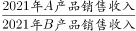，所求。

故正确答案为A。

---

### 第 23 题　qid 5423799 · 数学运算

某公园有一个圆形的湖，在湖的直径EB处有一座观光桥，横穿整个湖。园区在平行于观光桥的MN处建造了一片雕塑群，用以介绍中国古代礼仪与民俗，其长度等于湖的半径。某游客在湖边与观光桥上边走边欣赏湖中的雕塑群，走过了A、B、C、D四处位置。如图所示，A为该湖的圆心，N、D、C在一条线上，且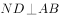。那么在这四处位置，游客的观察视角大于的有<u>    </u>处。（观察视角，即游客在该点处观看景物的视野张角，例如在D点处，其观察视角为）

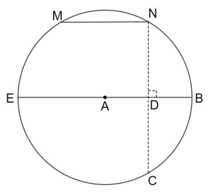

- **A**. 1
- **B**. 2　✅
- **C**. 3
- **D**. 4

**答案**：B

**官方解析**

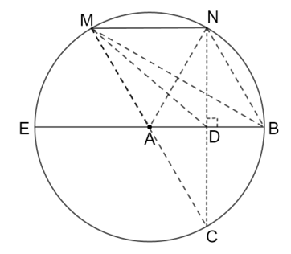

如图，连接AM、AN、BM、BN、CM、DM，则游客在A、B、C、D四处位置的观察视角分析如下：

A点，由于MN长度等于湖的半径，则MN=AM=AN，是等边三角形，故；

B点，、分别为弧MN的圆周角、圆心角。根据圆周角定理“同弧所对的圆周角等于它所对的圆心角的一半”，则；

C点，也为弧MN的圆周角，则；

D点，由于、，则，；在直角中，AN＞ND，由于MN=AN，则MN＞ND，，故。

综上，在A、B、C、D这四处位置，游客的观察视角大于的有A点和D点，共2处。

故正确答案为B。

---

### 第 24 题　qid 5423692 · 数学运算

地球绕太阳公转的周期为365天5小时48分46秒。为了弥补历法规定造成的一年365天与地球公转周期的时间差，每4年设立一个闰年，闰年共有366天，并每百年减去一个闰年。若地球绕太阳公转的周期为365天8小时，而历法规定每一年仍是365天，那么为了补足地球公转周期的时间差，需要每（    ）设置一个闰年。

- **A**. 1年
- **B**. 2年
- **C**. 3年　✅
- **D**. 4年

**答案**：C

**官方解析**

根据题干“地球绕太阳公转的周期为365天8小时，而历法规定每一年仍是365天”，说明每个地球绕太阳公转的周期比历法规定的每一年多8小时，由于，即3个地球绕太阳公转的周期比历法规定的每一年多1天，需要每3年设置一个闰年。

故正确答案为C。

---

### 第 25 题　qid 5423703 · 数学运算

老李5月份在鱼塘放养了5000尾鱼苗，年底前为了估测鱼苗的存活情况，老李随机捞取了100尾鱼苗做上记号后放回鱼塘。若干天后老李又先后10次随机捞取100尾，捞取后放回，并分别统计其中标有记号的鱼苗，依次得：1、19、6、5、7、6、11、2、7、6，则此时鱼苗的存活数量最接近    。

- **A**. 900尾
- **B**. 1400尾　✅
- **C**. 2700尾
- **D**. 4200尾

**答案**：B

**官方解析**

老李先后10次捞取的标有记号的鱼苗的平均数量为尾。设此时鱼苗的存活数量为x尾，则，解得，与B项最接近。

故正确答案为B。

实际上本题应该用带标记的鱼的实际存活总量（是未知数，不一定为100）来计算，但是照此计算则没有确切数值范围，亦无答案可选，可能是因为题目有漏洞或者回忆题目有误。

---
