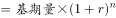
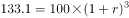
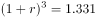
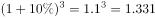
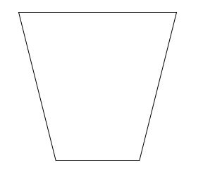
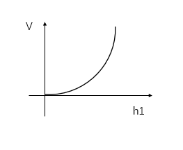
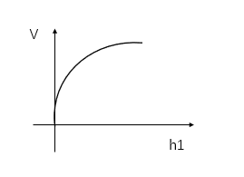
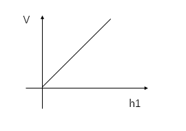
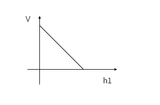

# 2023年内蒙古公务员录用考试《行测》题（网友回忆版）

> 数量关系 · 10 题 · 内蒙古 2023

## 第 1 题　qid 5509934 · 数学运算

某公路隧道长1500米，一辆公共汽车匀速从隧道通过，测得公共汽车从开始进入隧道到车身完全驶出隧道用时151秒，整辆公共汽车完全在隧道里的时间为149秒，则公共汽车的车身长度和行驶速度分别为：

- **A**. 8米；5米/秒
- **B**. 10米；10米/秒　✅
- **C**. 10米；15米/秒
- **D**. 12米；20米/秒

**答案**：B

**官方解析**

设公共汽车的长度为L，速度为v，根据火车过桥公式，完全通过桥时： ；完全在桥上时： 。代入数据得：1500+L=v×151······①， 1500-L=v×149······②，①+②可得v=10米/秒，将其代入①可得L=10米。

故正确答案为B。

---

## 第 2 题　qid 5509875 · 数学运算

19个不同的正整数从小到大排序，总和为191，则最大的数只能取：

- **A**. 18
- **B**. 19
- **C**. 20　✅
- **D**. 21

**答案**：C

**官方解析**

根据等差数列求和公式，最小的19个不同正整数（1-19）总和，要想19个不同正整数总和为191，只需求和时将1-19中最大的数19换为成20即可。

故正确答案为C。

---

## 第 3 题　qid 5510112 · 数学运算

某企业有职工240人，其中50岁以上共有60人。该企业规定50岁以上的职工可以申请退休。为保持总体规模不变，拟按职工总数10%的比例引进高级技术工人，则50岁以上职工申请退休的比例为：

- **A**. 45%
- **B**. 40%　✅
- **C**. 30%
- **D**. 25%

**答案**：B

**官方解析**

“为保持总体规模不变，拟按职工总数10%的比例引进高级技术工人”，可得退休人数=引进人数=240×10%=24人。则50岁以上职工申请退休的比例。

故正确答案为B。

---

## 第 4 题　qid 5509933 · 数学运算

抛掷两颗质地均匀的骰子，记录向上的面出现的数字，那么这两个数字之和等于8的概率是：

- **A**. 

　✅
- **B**. 

- **C**. 

- **D**. 

**答案**：A

**官方解析**

总情况数：抛掷质地均匀的骰子，朝上的数字有1-6共6种情况，所以抛掷两颗质地均匀的骰子，两个数字的排列顺序共6×6=36种情况。

满足要求的情况数：抛掷两颗质地均匀的骰子，两个数字之和等于8，有（2，6）（3，5）（4，4）（5，3）（6，2）共5种情况。则所求概率。

故正确答案为A。 

---

## 第 5 题　qid 5510107 · 数学运算

某口罩生产车间一月份生产口罩100万包，以后每个月都比前一个月按相同增长率增长，四月份生产口罩133.1万包，这个增长率是：

- **A**. 10%　✅
- **B**. 8%
- **C**. 6%
- **D**. 5%

**答案**：A

**官方解析**

设每月比前一个月的增长率为r，根据公式：现期量，可列式：，化简为。代入A项：，满足条件且为唯一解。

故正确答案为A。

---

## 第 6 题　qid 5509905 · 数学运算

某学校组织学生分组参观红色教育基地，租赁了若干辆客车。其中，一辆大型客车可容纳5个小组，一辆中型客车可容纳3个小组，大型客车比中型客车多容纳16个小组，那么至少租赁了大型客车和中型客车各多少辆？

- **A**. 3；5
- **B**. 5；3　✅
- **C**. 4；3
- **D**. 5；6

**答案**：B

**官方解析**

设租赁大型客车x辆，中型客车y辆，根据“大型客车比中型客车多容纳16个小组”，可得5x-3y=16。
方法一：把选项代入条件中验证：
A项：若x=3，y=5，则5x-3y=0，不满足条件，排除；
B项：若x=5，y=3，则5x-3y=16，满足所有条件，当选；
C项：若x=4，y=3，则5x-3y=11，不满足条件，排除；
D项：若x=5，y=6，则5x-3y=7，不满足条件，排除。
方法二：x、y均为整数，故5x尾数只能为0或5，分情况讨论：
当5x尾数为0时，解得3y=5x-16的尾数为4，y最小为8，此时x=8，无对应选项；
当5x尾数为5时，解得3y=5x-16的尾数为9，y最小为3，此时x=5，对应B项。
故正确答案为B。

---

## 第 7 题　qid 5510074 · 数学运算

冬奥会短道速滑比赛，有3个国家4名运动员参加比赛，其中2名中国运动员，已知中国运动员始终处于领滑位置，则运动员的排序共有：

- **A**. 12种　✅
- **B**. 16种
- **C**. 18种
- **D**. 20种

**答案**：A

**官方解析**

根据题意，从2名中国运动员中抽出1名使其处于领滑位置，情况数为，剩余的3名运动员全排列，情况数为，则运动员的排序共有2×6=12种。

故正确答案为A。

---

## 第 8 题　qid 5509909 · 数学运算

712934856是一个包含1至9每个数字恰好一次的九位数，它具有以下特征：数字1至6在其中是从小到大排列的，但是数字1至7不是从小到大排列的。则符合这种特征的九位数共有多少个？

- **A**. 12
- **B**. 336
- **C**. 432　✅
- **D**. 504

**答案**：C

**官方解析**

第一步：根据“数字1至6在其中是从小到大排列的”，可知1至6这6个数字的排列顺序为1种；
第二步：将数字7插入第一步六个数字产生的7个空里，由“数字1至7不是从小到大排列的”可得数字7不能放在数字6之后，因此只有6个空可以用，有6种情况；
第三步：将数字8插入第二步七个数字产生的8个空里，有8种情况；
第四步：将数字9插入第三步八个数字产生的9个空里，有9种情况；
分步用乘法，因此总情况数=1×6×8×9=432。
故正确答案为C。

---

## 第 9 题　qid 5509910 · 数学运算

美术培训班有3名学员，他们的年龄满足以下条件：他们的年龄都是正整数；2号学员的年龄是1号学员年龄的一半；3号学员比2号学员大7岁；3名学员的年龄之和是不超过70的素数，且该素数的各位数字之和为13，那么这3位学员的年龄分别是多少岁？

- **A**. 12；6；13
- **B**. 20；10；17
- **C**. 24；12；19
- **D**. 30；15；22　✅

**答案**：D

**官方解析**

本题为年龄问题，且选项给出三人具体年龄，优先考虑代入排除法。根据“3名学员的年龄之和是不超过70的素数，且该素数的各位数字之和为13”逐一代入选项。
A项，年龄之和为12+6+13=31岁，年龄和各位数字加和为3+1=4≠13，排除；
B项，年龄之和为20+10+17=47岁，年龄和各位数字加和为4+7=11≠13，排除；
C项，年龄之和为24+12+19=55岁，不是素数，排除；
D项，年龄之和为30+15+22=67岁，小于70岁且为素数，年龄和各位数字加和为6+7=13，当选。
故正确答案为D。

---

## 第 10 题　qid 5510131 · 数学运算

向截面为如下形状的高为H的水杯内等速注水，直到注满为止，则杯中水量v与水深h的函数图像是下图中哪一个？（四个选项中坐标系横轴表示水深h，纵轴表示水量v）

- **A**. 

　✅
- **B**. 

- **C**. 

- **D**. 

**答案**：A

**官方解析**

观察水杯可知，水杯上面较宽，下面较窄。由于等速注水，所以随水量v增加，截面积与高成反比，水杯截面越大，水深h变化越慢。观察选项，A项函数图h随v的变化为先快后慢；B项函数图h随v的变化为先慢后快；C项函数图为h随v的增加而增加；D项函数图为h随v的增加而减少。故只有A项符合题意。
故正确答案为A。

---
